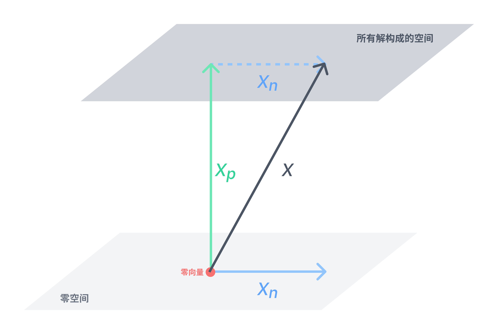

# L8-求解 Ax=b 简化行阶梯形式
参考：
* Unit I: Ax = b and the Four Subspaces - [Solving Ax = b: Row Reduced Form R](https://ocw.mit.edu/courses/mathematics/18-06sc-linear-algebra-fall-2011/ax-b-and-the-four-subspaces/solving-ax-b-row-reduced-form-r/) | [pdf](./attachments/MIT18_06SCF11_Ses1.8sum.pdf)
* 课本章节：Section *3.3* through *3.4* in the 4^th^ or 5^th^ edition

---

这一节主要内容是 $Ax=b$ 的求解步骤：

1. 判断方程组的**可解性** solvability
对于方程组 $A_{m \times n}x=b$

| 秩 | 系数矩阵的简化行阶梯形式 | 解数量 | 解形式 |
| :---: | :---: | :---: | :---: |
|列满秩 $r=n<m$ | $R=\begin{bmatrix} I \\ 0 \end{bmatrix}$ | 1 个或 0 个 | $x=x_{p}$ |
| 行满秩 $r=m<n$ | $R=\begin{bmatrix} I & F \end{bmatrix}$ | 无限 | $x=x_{p}+x_{n}$ |
| 方阵满秩 $r=m=n$ | $R=I$ | 有且只有 1 个 | $x=x_{p}$ |
| 不满秩 $r<m$、$r<n$ | $R=\begin{bmatrix} I & F \\ 0 & 0 \end{bmatrix}$ | 0 个或无限（由 $b$ 决定） | $x=x_{p}+x_{n}$ |

2. 求出**特解 particular solutions $x_{p}$**：课程中所取的特解是在所有**自由变量**设为 $0$ 的情况下，再求出主变量
3. 求出**零空间 $N(A)$**，作为**基础解系 special solutions $x_{n}$**
4. 这样就可以得到方程组（当有解时）所有解的形式 $x={\color{Green}x_{p}}+{\color{Blue}x_{n}}$

## 消元
已知方程组 $Ax=b$ 如下

<!-- #region-->
$$
\begin{aligned}
\left\{\begin{matrix}
  x_{1} + 2x_{2} + 2x_{3} + 2x_{4} = b_{1} \\
  2x_{1} + 4x_{2} + 6x_{3} + 8x_{4} = b_{2} \\
  3x_{1} + 6x_{2} + 8x_{3} + 10x_{4} = b_{3}
\end{matrix}\right.
\end{aligned}
$$
<!-- #endregion -->

写成矩阵的形式

<!-- #region-->
$$
\begin{aligned}
Ax =
\begin{bmatrix}
  1 & 2 & 2 & 2 \\
  2 & 4 & 6 & 8 \\
  3 & 6 &8 & 10
\end{bmatrix}
\begin{bmatrix}
  x_{1}\\
  x_{2}\\
  x_{3}\\
  x_{4}
\end{bmatrix}
& =
\begin{bmatrix}
  b_{1}\\
  b_{2}\\
  b_{3}\\
  b_{4}
\end{bmatrix}
& = b
\end{aligned}
$$
<!-- #endregion -->

:bulb: 观察可知 row3 = row1 + row2，即系数矩阵第三行与第一、二行线性相关，因此当方程组有解时，右侧应该满足 $b_{3}=b_{1}+b_{2}$

使用消元法求解方程组 $Ax=b$ 需要构建增广矩阵

<!-- #region-->
$$
\begin{aligned}
\begin{bmatrix}
  AB
\end{bmatrix}
& =
\begin{bmatrix}
  1 & 2 & 2 & 2 & b_{1} \\
  2 & 4 & 6 & 8 & b_{2} \\
  3 & 6 & 8 & 10 & b_{3}
\end{bmatrix}
\xrightarrow{E}
\begin{bmatrix}
{\color{Red}1 } & 2 & 2 & 2 & b_{1} \\
0 & 0 & 2 & 4 & b_{2}-2b_{1} \\
0 & 0 & 2 & 4 & b_{3}-3b_{1}
\end{bmatrix}
\xrightarrow{E}
\begin{bmatrix}
{\color{Red}1 } & 2 & 2 & 2 & b_{1} \\
0 & 0 & {\color{Red}2 } & 4 & b_{2}-2b_{1} \\
0 & 0 & 0 & 0 & b_{3}-b_{2}-b_{1}
\end{bmatrix}
\end{aligned}
$$
<!-- #endregion -->

当方程组有解时（三个等式都满足），由最后一行得到 $0=b_{3}-b_{2}-b_{1}$ 成立，即 $b_{3}=b_{1}+b_{2}$

若取

<!-- #region-->
$$
\begin{aligned}
\begin{bmatrix}
  b_{1} \\
  b_{2} \\
  b_{3}
\end{bmatrix}
& =
\begin{bmatrix}
  1 \\
  5 \\
  6
\end{bmatrix}
\end{aligned}
$$
<!-- #endregion -->

则增广矩阵为

<!-- #region-->
$$
\begin{aligned}
\begin{bmatrix}
  AB
\end{bmatrix}
\xrightarrow{E}
\begin{bmatrix}
 {\color{Red}1 } & 2 & 2 & 2 & 1 \\
  0 & 0 & {\color{Red}2 } & 4 & 3 \\
  0 & 0 & 0 & 0 & 0
\end{bmatrix}
\end{aligned}
$$
<!-- #endregion -->

:bulb: 其中第一列、第三列是主列 pivot column

## 可解性
使用消元法求解方程组 $A_{m \times n}x=b$ ，其可解性 solvability 可以从方程组右侧的 $b$ 向量考虑：

* 列角度：将 $b$ 看作是系数矩阵 $A$ 基于 $x$ 的线性组合的角度考虑，当方程组有解时 $b$ 必须在系数矩阵 $A$ 所构成的列空间 $C(A)$ 中

* 行角度：若系数矩阵 $A$ 在消元过程中存在某行各元素均为零，则相应地在增广矩阵中该行的 $b$ 的组合也要是零

为了便于讨论方程组的**可解性**，引入[**秩 r**](./cheatsheet.md#秩) （在阶梯形式的矩阵中，矩阵的**主元数量**）的概念

<!-- #region-->
$$
\begin{aligned}
\left\{\begin{matrix}
  r \le m \\
  r \le n
\end{matrix}\right.
\end{aligned}
$$
<!-- #endregion -->

满秩 full rank 指各行或各列上都有主元，有两种情况：

* 当 $r=n$ 时，列满秩
* 当 $r=m$ 时，行满秩

当秩满足不同条件时，方程组有不同的解。
### 列满秩
**当列满秩 $r=n<m$ 时**，每一列都有一个主元，则自由变量的自由度为 $0$，即**零空间的维度是零**（几何形式是一个点）

例如对于方程组 $Ax=b$

<!-- #region-->
$$
\begin{aligned}
\begin{bmatrix}
  1 & 3 \\
  2 & 1 \\
  6 & 1 \\
  5 & 1
\end{bmatrix}
\begin{bmatrix}
  x_{1} \\
  x_{2}
\end{bmatrix}
&=
\begin{bmatrix}
  b_{1} \\
  b_{2} \\
  b_{3} \\
  b_{4}
\end{bmatrix}
\end{aligned}
$$
<!-- #endregion -->

消元法求解方程组（为了演示简便，增广矩阵省略 $b$ 部分）

<!-- #region-->
$$
\begin{aligned}
A=
\begin{bmatrix}
  1 & 3 \\
  2 & 1 \\
  6 & 1 \\
  5 & 1
\end{bmatrix}
\xrightarrow{E}
\begin{bmatrix}
  1 & 3 \\
  0 & -5 \\
  0 & -17 \\
  0 & -14
\end{bmatrix}
\xrightarrow{E}
\begin{bmatrix}
  1 & 3 \\
  0 & -5 \\
  0 & 0 \\
  0 & 0
\end{bmatrix}
\xrightarrow{E}
\begin{bmatrix}
  1 & 0 \\
  0 & 1 \\
  0 & 0 \\
  0 & 0
\end{bmatrix}
&=R
\end{aligned}
$$
<!-- #endregion -->

通过系数矩阵的简化行阶梯形式可知，该方程组是否有解（唯一解），**取决于变换后的增广矩阵第三、第四行是否成立**，这与 $b$ 相关。

**此时方程组 $Ax=b$ ==有 0 或 1 个解==**，如果存在唯一解 unique solution，其形式是 $x=x_{p}$

### 行满秩
**当行满秩 $r=m<n$ 时**，每一行都有一个主元，则自由变量的自由度为 $n-r=n-m$

例如方程组 $Ax=b$

<!-- #region-->
$$
\begin{aligned}
\begin{bmatrix}
  1 & 2 & 6 & 5 \\
  3 & 1 & 1 & 1
\end{bmatrix}
\begin{bmatrix}
  x_{1} \\
  x_{2} \\
  x_{3} \\
  x_{4}
\end{bmatrix}
&=
\begin{bmatrix}
  b_{1} \\
  b_{2}
\end{bmatrix}
\end{aligned}
$$
<!-- #endregion -->

消元法求解方程组（为了演示简便，增广矩阵省略 b 部分），在系数矩阵的简化行阶梯形式中 $f_{n}$ 表示自由变量

<!-- #region-->
$$
\begin{aligned}
A =
\begin{bmatrix}
  1 & 2 & 6 & 5 \\
  3 & 1 & 1 & 1
\end{bmatrix}
\xrightarrow{E}
\begin{bmatrix}
  1 & 0 & f_{1} & f_{2} \\
  0 & 1 & f_{3} & f_{4}
\end{bmatrix}
&=R
\end{aligned}
$$
<!-- #endregion -->

根据[《L7-求解 Ax=0 主变量和特解》](./L7-求解Ax=0主变量和特解.md)可知方程组 $Ax=0$ 的零空间是 $N=\begin{bmatrix}-F \\ I\end{bmatrix}$，（通过确定自由变量的值后）可以方便地得到 $Ax=0$ 所有解的形式是 $x_{n}$

**此时方程组 $Ax=b$ ==必有解，且是无限个==**，其形式是 $x=x_{p}+x_{n}$。

其中 $x_{p}$ 是方程组 $Ax=b$ 的一个特解；$x_{n}$ 表示方程组 $Ax=0$ 的解所构成零空间 $N(A)$，它作为基础解系，只需要再结合方程组 $Ax=b$ 其中任意一个特解 $x_{p}$（可以将该特解的作用看作是一个平移向量，将方程组 $Ax=0$ 的解所构成零空间 $N(A)$ 平移到方程组 $Ax=b$ 的解构成的向量空间）

:bulb: 由于行满秩，在简化行阶梯形式中系数矩阵**不存在**一行全为 $0$ 的情况，而由于自由变量是可变动的，因此对于方程组 $Ax=b$ **无论 $b$ 取任意值都有解**

### 方阵满秩
**当方程组的系数矩阵是一个方阵时，且列满秩（同时也就行满秩），即 $r=n=m$**

例如方程组 $Ax=b$

<!-- #region-->
$$
\begin{aligned}
\begin{bmatrix}
  1 & 2 \\
  3 & 1
\end{bmatrix}
\begin{bmatrix}
  x_{1} \\
  x_{2}
\end{bmatrix}
& =
\begin{bmatrix}
  b_{1} \\
  b_{2}
\end{bmatrix}
\end{aligned}
$$
<!-- #endregion -->

消元法求解方程组（为了演示简便，增广矩阵省略 b 部分）

<!-- #region-->
$$
\begin{aligned}
A =
\begin{bmatrix}
  1 & 2 \\
  3 & 1
\end{bmatrix}
\xrightarrow{E}
\begin{bmatrix}
  1 & 0 \\
  0 & 1
\end{bmatrix}
&=R
\end{aligned}
$$
<!-- #endregion -->

**此时方程组 $Ax=b$ ==有且只有 1 个解==**，其形式是 $x=x_{p}$

### 不满秩
当不满秩 $r<m$、$r<n$ 时，（类似于行满秩和列满秩的混合情况）**此时方程组 $Ax=b$ ==有 0 个或无数个解==，可解性由 $b$ 决定**，当有无数个解时，其形式是 $x=x_{p}+x_{n}$

## 求解方程组
在[消元](#消元)求解方程组 $Ax=b$ 部分得到了阶梯形式

<!-- #region-->
$$
\begin{aligned}
\begin{bmatrix}
  AB
\end{bmatrix}
\xrightarrow{E}
\begin{bmatrix}
 {\color{Red}1 } & 2 & 2 & 2 & 1 \\
  0 & 0 & {\color{Red}2 } & 4 & 3 \\
  0 & 0 & 0 & 0 & 0
\end{bmatrix}
\end{aligned}
$$
<!-- #endregion -->

根据[可解性](#可解性)不满秩情况下，增广矩阵的最后一行的 $b$ 部分使得等式成立，因此该方程组有**无数个解**

* 求出**特解 $x_{p}$**

令所有自由变量为 $0$

<!-- #region-->
$$
\begin{aligned}
\left\{\begin{matrix}
  x_{2} = 0 \\
  x_{4} = 0
\end{matrix}\right.
\end{aligned}
$$
<!-- #endregion -->

回代入增广矩阵可得

<!-- #region-->
$$
\begin{aligned}
\left\{\begin{matrix}
  x_{1}+2x_{3}=1 \\
  2x_{3}=3
\end{matrix}\right.
\end{aligned}
$$
<!-- #endregion -->

可得其中一个特解 $x_{p}$

<!-- #region-->
$$
\begin{aligned}
\left\{\begin{matrix}
  x_{1} = -2 \\
  x_{2} = 0 \\
  x_{3} = \frac{3}{2} \\
  x_{4} = 0
\end{matrix}\right.
\end{aligned}
$$
<!-- #endregion -->

* 以方程组 $Ax=0$ 的零空间 $N(A)$ 作为**基础解系**

求出系数矩阵的简化行阶梯形式
<!-- #region-->
$$
\begin{aligned}
  A
\xrightarrow{E}
\begin{bmatrix}
 {\color{Red}1 } & 2 & 2 & 2 \\
  0 & 0 & {\color{Red}2 } & 4 \\
  0 & 0 & 0 & 0
\end{bmatrix}
\xrightarrow{E}
\begin{bmatrix}
 {\color{Red}1 } & 2 & 0 & -2 \\
  0 & 0 & {\color{Red}1 } & 2 \\
  0 & 0 & 0 & 0
\end{bmatrix}
& = R
\end{aligned}
$$
<!-- #endregion -->

根据

<!-- #region-->
$$
\begin{aligned}
Rx =
\begin{bmatrix}
  I & F \\
  0 & 0 \\
\end{bmatrix}
\begin{bmatrix}
  x_{pivot} \\
  x_{free} \\
\end{bmatrix}
& = 0
\Rightarrow
N=
\begin{bmatrix}
  -F \\
  I
\end{bmatrix}
\end{aligned}
$$
<!-- #endregion -->

先将简化行阶梯形式 $R$ 进行改写

<!-- #region-->
$$
\begin{aligned}
R^{'}=
\begin{bmatrix}
 {\color{Red}1 } & 0 & 2 & -2 \\
  0 & {\color{Red}1 } & 0 & 2 \\
  0 & 0 & 0 & 0
\end{bmatrix}
\end{aligned}
$$
<!-- #endregion -->

即

<!-- #region-->
$$
\begin{aligned}
R^{'}x=
\begin{bmatrix}
 {\color{Red}1 } & 0 & 2 & -2 \\
  0 & {\color{Red}1 } & 0 & 2 \\
  0 & 0 & 0 & 0
\end{bmatrix}
\begin{bmatrix}
  x_{1} \\
  x_{3} \\
  x_{2} \\
  x_{4}
\end{bmatrix}
& = 0
\end{aligned}
$$
<!-- #endregion -->

可得

<!-- #region-->
$$
\begin{aligned}
N =
\begin{bmatrix}
  -F \\
  I
\end{bmatrix}
& =
\begin{bmatrix}
  -2 & 2 \\
  0 & -2 \\
  1 & 0 \\
  0 & 1
\end{bmatrix}
\end{aligned}
$$
<!-- #endregion -->

因此其中两个特解是（相应地需要调换位置以对应原向量中 $x_{2}$ 和 $x_{3}$ 的顺序）

<!-- #region-->
$$
\begin{aligned}
x_{p1} =
\begin{bmatrix}
  -2 \\
  {\color{Green}1 }  \\
  {\color{Green}0 } \\
  0
\end{bmatrix}
,
x_{p2} =
\begin{bmatrix}
  -2 \\
  {\color{Green}0 }  \\
  {\color{Green}-2 } \\
  0
\end{bmatrix}
\end{aligned}
$$
<!-- #endregion -->

因此方程组 $Ax=0$ 的零空间是

<!-- #region-->
$$
\begin{aligned}
N(A) =
\alpha
\begin{bmatrix}
  -2 \\
  {\color{Green}1 }  \\
  {\color{Green}0 } \\
  0
\end{bmatrix}
& +
\beta
\begin{bmatrix}
  -2 \\
  {\color{Green}0 }  \\
  {\color{Green}-2 } \\
  0
\end{bmatrix}
\end{aligned}
$$
<!-- #endregion -->

:bulb: 方程组 $Ax=0$ 的零空间维度为 2，需要两个特解张成

将方程组 $Ax=b$ 一个特定的解 $x_{p}$ 和方程组 $Ax=0$ 的所有解 $x_{n}$ 结合得到

<!-- #region-->
$$
\begin{aligned}
A(x_{p}+x_{n}) = b
\end{aligned}
$$
<!-- #endregion -->

所以方程组 $Ax=b$， 其中 $\begin{aligned} b = \begin{bmatrix} 1 \\ 5 \\ 6 \end{bmatrix}\end{aligned}$，任意解的形式是

<!-- #region-->
$$
\begin{aligned}
x
& = x_{particular} + x_{null} \\
& =
\begin{bmatrix}
  -2 \\
  0 \\
  \frac{3}{2} \\
  0
\end{bmatrix} +
c_{1}
\begin{bmatrix}
  -2 \\
  1 \\
  0 \\
  0
\end{bmatrix} +
c_{2}
\begin{bmatrix}
  -2 \\
  0 \\
  -2 \\
  0
\end{bmatrix}
\end{aligned}
$$
<!-- #endregion -->