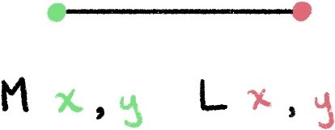
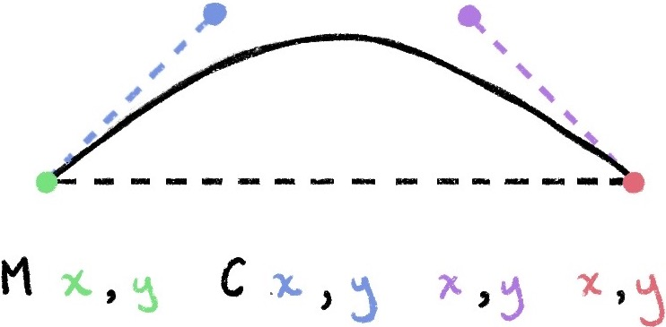

# SVG
参考：

* [SVG](https://developer.mozilla.org/zh-CN/docs/Web/SVG) | MDN
* [SVG元素参考](https://developer.mozilla.org/zh-CN/docs/Web/SVG/Element) | MDN
* [SVG 接口](https://developer.mozilla.org/zh-CN/docs/Web/API/Document_Object_Model#SVG_接口) | MDN
* [SVG Animations with GreenSock](https://designcode.io/svg-intro)
* [Draw a flower petal on the screen](https://observablehq.com/@sxywu/1-draw-a-flower-petal-on-the-screen)

**可缩放矢量图形 Scalable Vector Graphics，SVG** 是一个由万维网联盟 W3C 自 1999 年开始开发的基于文本的开放标准，是**一种基于 [XML](https://developer.mozilla.org/en-US/docs/Web/XML) 的标记语言，用于描述二维的矢量图形**，它能渲染三种类型的图形对象：**矢量图形、位图、文本**，并和 CSS、DOM、JavaScript 等其他网络标准无缝衔接。

:bulb: 所有的现代浏览器都支持SVG，但支持的版本可能不同，在 [Can I use](https://caniuse.com/#feat=svg) 上有一份比较详细的支持 SVG 的浏览器列表。很多图形处理软件提供可视化交互界面操作 `.svg` 格式的文件，如 [Inkscape](http://www.inkscape.org/) 和 [Adobe Illustrator](https://www.adobe.com/cn/products/illustrator.html)。

一个简单的 SVG 文档由 **`<svg>` 根元素**和**基本的形状元素**构成，在前端开发中一些简单的图形也可以手动编写 `<svg>` 标记来实现。

```html
<svg width="300" height="200" xmlns="http://www.w3.org/2000/svg">
  <!-- more tags here -->
</svg>
```

:bulb: SVG 基于 XML 的标记语言，因此区分大小写，而且 **SVG 里的属性值必须用引号引起来**，就算是数值也必须这样做

:bulb: 每一个 SVG 元素都应该声明[命名空间 `xmlns`](https://developer.mozilla.org/zh-CN/docs/Web/SVG/Namespaces_Crash_Course)，以解决不同 XML 方言（SVG 是 XML 一种「方言」）混合使用产生的问题。以上示例 `xmlns` 属性意味着这个 `<svg>` 标签和它的子节点都属于 `http://www.w3.org/2000/svg` 这个 SVG 命名空间。命名空间仅仅只是一些字符串，因为 URIs 的唯一性从而被广泛使用，但它的本意并不是要「链接」到某个地址。


## 坐标定位

SVG 绘制图形时需要使用坐标系统/网格系统：

* 以页面的**左上角为 `(0,0)` 坐标点**，坐标以像素为单位
* **x 轴正方向是向右**
* **y 轴正方向是向下**。


## viewport 和 viewBox

* viewport 视口是一个表示**当前可见**的计算机图形区域的概念。在 Web 浏览器术语中通常与**浏览器窗口相同**，但不包括浏览器的 UI（如菜单栏等），视口外的内容在被滚动进来前都是不可见的。在 SVG 概念中，它相当于 `<svg>` 元素的大小

* viewBox 是 `<svg>` 标签的一个属性，包含**四个参数（以空格或逗号分隔） `<svg viewBox="min-x min-y width height">` 指定一个容器（宽和高）以显示图形元素**，相当于规定了在 `<svg>` 元素中哪些部分是可视的，即设置了一个缩放和平移的初始状态

  * `min-x` 和 `min-y` 指定了容器的**左上角的坐标**，即定义了父元素的坐标系统（设置了平移的初始状态）
  * `width` 和 `height` 指定**容器的宽和高**（设置了缩放的初始状态）

  设定不同的`viewBox` 属性值可以实现类似于**缩放**或**平移**的效果。修改容器的 `min-x` 和 `min-y` 可以实现整体「移动」容器内元素的效果；修改容器 `width` 和 `height` 可以实现整体「缩放」容器内元素的效果。

  :bulb: 在 `<svg>` 标签内的元素的坐标和宽度如果使用数值（而不带单位）时，就会以 `viewBox` 属性设定的值作为**相对定位**和**相对单位**。

```html
<svg width="200" height="200" viewBox="0 0 100 100">
```

这里定义的画布尺寸是 `200*200px`。但是 `viewBox` 属性定义了画布上可以显示的区域：从 (0,0) 点开始，`100*100` 的区域。这个区域会放到 `200*200` 的画布上显示，于是就形成了[**放大两倍**的效果](https://developer.mozilla.org/zh-CN/docs/Web/SVG/Tutorial/Positions)。

```html
<!-- svg 元素大小相同 -->
<svg style="width: 200px; height:200px; border:5px blue solid" viewBox="0 0 30 30" xmlns="http://www.w3.org/2000/svg">
  <!-- 较大的 viewBox，这样在容器内的圆的半径长度 4 是以 30 为基准进行解析，在该容器中图像就显得小 -->
  <circle cx="50%" cy="50%" r="4" fill="orange"/>
</svg>

<svg style="width: 200px; height:200px; border:5px blue solid" viewBox="0 0 10 10" xmlns="http://www.w3.org/2000/svg">
    <!-- 较小的 viewBox，这样在容器内的圆的半径长度 4 是以 10 为基准进行解析，在该容器中图像就显得大 -->
  <circle cx="50%" cy="50%" r="4" fill="orange"/>
</svg>
```

<iframe height="300" style="width: 100%;" scrolling="no" title="different viewBox" src="https://codepen.io/benbinbin/embed/MWvpLPp?default-tab=result" frameborder="no" loading="lazy" allowtransparency="true" allowfullscreen="true">
  See the Pen <a href="https://codepen.io/benbinbin/pen/MWvpLPp">
  different viewBox</a> by Benbinbin (<a href="https://codepen.io/benbinbin">@benbinbin</a>)
  on <a href="https://codepen.io">CodePen</a>.
</iframe>


:bulb: viewBox 和 viewport 可能不一致，但有时候希望通过强制缩放，让 viewBox 铺满 viewport，可以使用属性 `preserveAspectRatio` 将图形拉伸占据整个视口，该属性设置拉伸过程中的[长宽比例](https://developer.mozilla.org/zh-CN/docs/Web/SVG/Attribute/preserveAspectRatio)，以保持图形不变形


## 常用基本形状

SVG 与 HTML 类似，一个简单的 SVG 文档由 `<svg>` 根元素和**基本的形状元素**构成，如用于定义圆形的 `<circle>` 元素、用于定义矩形的 `<rect>` 元素、用于定义简单或复杂曲线的 `<path>` 元素。

常用的 SVG 元素

|       标签       |       属性       | 可选属性             |
| :--------------: | :------------------------: | :------------------------------------------: |
|  `<rect>`   | `width`, `height` | `x`, `y`                                |
| `<circle>` |           `r`            | `cx`, `cy`                             |
|  `<path>`   |           `d`            |                                             |
|  `<text>`   |                            | 	`x`, `y`, `text-anchor`, `dy` |

:bulb: SVG 文件全局有效的规则是**「后来居上」**，越后面的元素越可见。

:bulb: SVG 元素中的 `<g>` 标签用以组合多个元素，类似于 `<div>` 功能，便于对一系列元素应用样式设置。

对于图形元素一般常用属性：

* `fill` 填充的颜色（对于动画元素，该属性是定义动画结束时的状态，可以是 `remove`（默认值）或 `freeze`）
* `fill-opacity` 设置填充颜色的透明度
* `stroke` 设置图形元素的外轮廓的颜色，默认值是 `none` 不显示外轮廓，可以设置为颜色，也可以引用[渐变](https://developer.mozilla.org/en-US/docs/Web/SVG/Attribute/stroke#example)
* `stroke-opacity` 设置外轮廓的颜色的透明度
* `stroke-width` 设置外轮廓的宽度
* `stroke-dasharray` 设置[描边的点划线的图案规则](https://developer.mozilla.org/en-US/docs/Web/SVG/Attribute/stroke-dasharray)，可以是有一个或两个（用逗号分隔）或多个数字指定短划线和缺口的长度（奇数和偶数的组合可以构成不一样的规律）
* `stroke-linecap` 对于闭合的的路径，设置描边两端的形状，可以设置为无线帽 `butt`（默认值）、圆角`round`、直角 `square` 或 `inherit`
* `stroke-linejoin` 设置路径的转角处的处理方式，可以设置为 `arcs` 、 `bevel` 、`miter` 、 `miter-clip` 或 `round`
* `paint-order` 设置图形的填充 `fill`、描边 `stroke` 和标记 `markers` 的[绘制顺序](https://developer.mozilla.org/en-US/docs/Web/SVG/Attribute/paint-order)，默认顺序是 `fill stroke markers`，如果属性值省略其他参数，先按照列出的参数绘制，最后再按照省略参数原有的顺序绘制
* `pointer-events` 定义元素是否或何时[可响应鼠标事件](https://developer.mozilla.org/zh-CN/docs/Web/SVG/Attribute/pointer-events)
* `tabindex` 控制元素是否可聚焦（通过 Tab 键切换选中），并定义元素的相对顺序，以便进行顺序聚焦导航
* `visibility` 控制一个图形元素的可见性，设置为 `hidden` 或 `collapse` 当前的图形元素将不可见，但可能依然能够响应 `pointer-events` 事件。对于文字元素 `<tspan>`、`<tref>` 设置为 `hidden`，则文本变得不可见**但是依然占用文本布局计算的空间**

### 矩形和圆角矩形

```html
<svg width="200" height="250" version="1.1" xmlns="http://www.w3.org/2000/svg">
  <!-- 矩形 -->
  <rect x="10" y="10" width="30" height="30" stroke="black" fill="transparent" stroke-width="5"/>
  <!-- 圆角矩形 -->
  <rect x="60" y="10" rx="10" ry="10" width="30" height="30" stroke="black" fill="transparent" stroke-width="5"/>
</svg>
```

<iframe height="300" style="width: 100%;" scrolling="no" title="Untitled" src="https://codepen.io/benbinbin/embed/XWaMOOz?default-tab=result" frameborder="no" loading="lazy" allowtransparency="true" allowfullscreen="true">
  See the Pen <a href="https://codepen.io/benbinbin/pen/XWaMOOz">
  Untitled</a> by Benbinbin (<a href="https://codepen.io/benbinbin">@benbinbin</a>)
  on <a href="https://codepen.io">CodePen</a>.
</iframe>


使用元素 `<rect/>` 绘制一个矩形，可以通过 6 个基本属性控制其位置和形状：

* `x` 矩形左上角在画布中的 x 位置
* `y` 矩形左上角在画布中的 y 位置
* `width` 矩形的宽度
* `height` 矩形的高度
* `rx` 矩形的圆角 x 方向的半径，默认为 `0`
* `ry` 矩形的圆角 y 方向的半径，默认为 `0`

### 圆形和椭圆

```html
<svg width="200" height="250" version="1.1" xmlns="http://www.w3.org/2000/svg">
  <!-- 圆形 -->
  <circle cx="25" cy="25" r="20" stroke="red" fill="transparent" stroke-width="5"/>
  <!-- 椭圆形 -->
  <ellipse cx="75" cy="25" rx="20" ry="5" stroke="red" fill="transparent" stroke-width="5"/>
</svg>
```

<iframe height="300" style="width: 100%;" scrolling="no" title="Untitled" src="https://codepen.io/benbinbin/embed/rNzyRyv?default-tab=result" frameborder="no" loading="lazy" allowtransparency="true" allowfullscreen="true">
  See the Pen <a href="https://codepen.io/benbinbin/pen/rNzyRyv">
  Untitled</a> by Benbinbin (<a href="https://codepen.io/benbinbin">@benbinbin</a>)
  on <a href="https://codepen.io">CodePen</a>.
</iframe>

使用元素 `<circle/>` 绘制一个圆形。通过 3 个属性来设置圆形：

* `r` 圆形的半径
* `cx` 圆心在画布中的 x 位置
* `cy` 圆心在画布中的 y 位置

使用元素 `<ellipse/>` 绘制一个椭圆，它是圆形更通用的形式，与圆形元素相比增加了 `rx` 和 `ry` 属性，以设置椭圆的 x 半径 和 y 半径（即长轴半径和短轴半径）：

* `cx` 椭圆心在画布中的 x 位置
* `cy` 椭圆心在画布中的 y 位置
* `rx` 椭圆的 x 半径
* `ry` 椭圆的 y 半径

:bulb: 元素 `<ellipse/>` 不能设置方向，例如要画一个45度角倾斜的椭圆，可以利用 [`transform` 属性](https://developer.mozilla.org/en-US/docs/Web/SVG/Attribute/transform)实现旋转。

### 线条和折线

```html
<svg width="200" height="250" version="1.1" xmlns="http://www.w3.org/2000/svg">
  <!-- 直线 -->
  <line x1="10" x2="90" y1="10" y2="45" stroke="orange" fill="transparent" stroke-width="5"/>
  <!-- 折线 -->
  <polyline points="10,25 20,25 30,55 50,45 60, 65 70,75 80,65 90,80"
      stroke="blue" fill="transparent" stroke-width="5"/>
</svg>
```

<iframe height="300" style="width: 100%;" scrolling="no" title="Untitled" src="https://codepen.io/benbinbin/embed/gOxmEXr?default-tab=result" frameborder="no" loading="lazy" allowtransparency="true" allowfullscreen="true">
  See the Pen <a href="https://codepen.io/benbinbin/pen/gOxmEXr">
  Untitled</a> by Benbinbin (<a href="https://codepen.io/benbinbin">@benbinbin</a>)
  on <a href="https://codepen.io">CodePen</a>.
</iframe>

使用元素 `<line/>` 绘制一条直线。通过指定起点和终点的位置即可：

* `x1` 起点的 x 位置
* `y1` 起点的 y 位置
* `x2` 终点的 x 位置
* `y2` 终点的 y 位置

使用元素 `<polyline/>` 绘制折线。由于折线是通过许多点构成的，因此需要设置**多对点及数列** `points` 设置点集数列。每对点必须包含 2 个数字，分别表示 x 坐标和 y 坐标，数字间用空格分隔；每对点用逗号隔开。

### 多边形

```html
<svg width="200" height="250" version="1.1" xmlns="http://www.w3.org/2000/svg">
  <!-- 多边形 -->
  <polygon points="50,10 55,30 70,30 60,40 65,55 50,45 35,55 40,40 30,30 45,30"
      stroke="green" fill="transparent" stroke-width="5"/>
</svg>
```

<iframe height="300" style="width: 100%;" scrolling="no" title="polygon" src="https://codepen.io/benbinbin/embed/jOLBJvY?default-tab=result" frameborder="no" loading="lazy" allowtransparency="true" allowfullscreen="true">
  See the Pen <a href="https://codepen.io/benbinbin/pen/jOLBJvY">
  polygon</a> by Benbinbin (<a href="https://codepen.io/benbinbin">@benbinbin</a>)
  on <a href="https://codepen.io">CodePen</a>.
</iframe>

使用元素 `<polygon/>` 绘制多边形。多边形可以当作由多条折线构成的**闭合图形**，也是由点集数列组成 `points` 设置点集数列。其中路径在最后一个点会自动绘制一条直线回到第一个点。

其中属性 `fill-rule` 定义多边形[内部区域的算法](https://developer.mozilla.org/en-US/docs/Web/SVG/Attribute/fill-rule)，不同的算法填充方式不同，可以设置为 `nonzero`（默认值）或 `evenodd`

:bulb: 使用 `<polyline>` 构建一个「开放」的多边形

## 路径

[元素 `<path>` 绘制线条、曲线、弧形等图形](https://developer.mozilla.org/zh-CN/docs/Web/SVG/Tutorial/Paths)，是 SVG 形状中最强大的一个，可以通过路径 path 绘制出复杂的图形。

**其关键参数是 `d`：用来设置一个「命令+参数」的集合描述/定义 *define* 如何绘制路径。** 其中每一个命令都用一个关键字母表示，如 `M` 命令取自 Move to 表示将点移动到相应的坐标，字母后面是一对点数据 `x, y`，表示 x 和 y 轴坐标参数。

* `M x,y`  M 表示 **Move To** 移动，其作用就像是把绘画笔从画纸处提起，然后移动到指定的点 (x, y) 该过程不会画出线（不会生成路径，一般作为开始命令，设置路径的起点）
* `L x,y` L 表示 **Line To** 画直线，其作用是从当前位置点画一条直线到指定的点 (x, y)

* `C x,y x,y x,y` C 表示 **Curve To**  画（三次）贝塞尔曲线 Cubic Bézier Curve

:bulb: 每一个命令都有两种表示方式：

* 用**大写字母**，表示采用绝对定位，操作的定位是基于整个容器的坐标
* 用**小写字母**，表示采用相对定位，操作是基于上一个点的定位，例如 `M 10 7` 从上一个点开始，向上移动 `10px`，向左移动 `7px`

:bulb: 对于表示相对定位的参数，一般使用 `d` 作为前缀

### 直线



* `M` 命令 `M x,y` 取自 Move to 表示移动画笔，它需要两个参数指定移动的目标坐标，但并不会在当前点与目标点之间画线。类似地 `m dx dy` 表示在相对坐标下的移动。
* `L` 命令 `L x,y` 取自 Line to 表示在当前位置和目标位置之间画一条线段，它需要两个参数指定目标坐标。类似地 `l dx dy` 表示在相对坐标下的移动。
* `H` 命令 `H x` 取自 Horizontal 表示绘制一条水平线至水平位置 x。类似地 `h dx` 表示在相对坐标下的移动
* `V` 命令 `V y` 取自 Vertical 表示绘制一条垂直线至垂直位置 y。类似地 `v dy` 表示在相对坐标下的移动

```html
<svg width="100px" height="100px" version="1.1" xmlns="http://www.w3.org/2000/svg">
  <!-- 画笔起点在 (10, 10) 处，然后绘制一个矩形 -->
  <path stroke="green" fill="transparent" stroke-width="5" d="M10,10 H 90 V 90 H 10 L10,10"/>
</svg>
```

<iframe height="300" style="width: 100%;" scrolling="no" title="Untitled" src="https://codepen.io/benbinbin/embed/ZEJeZxg?default-tab=result" frameborder="no" loading="lazy" allowtransparency="true" allowfullscreen="true">
  See the Pen <a href="https://codepen.io/benbinbin/pen/ZEJeZxg">
  Untitled</a> by Benbinbin (<a href="https://codepen.io/benbinbin">@benbinbin</a>)
  on <a href="https://codepen.io">CodePen</a>.
</iframe>

:bulb: 我们可以通过命令 `Z` 或 `z`（该命令不区分大小写） 来简化 `<path>` 命令，**该命令会从当前点画一条直线到路径的起点，实现闭合路径的作用**。尽管我们不总是需要闭合路径，但是它还是经常被放到路径的最后。

```html
<svg width="100px" height="100px" version="1.1" xmlns="http://www.w3.org/2000/svg">
  <!-- 最后使用 Z 闭合命令简化 path 元素 -->
  <path d="M10,10 H 90 V 90 H 10 Z" fill="transparent" stroke="black"/>
</svg>
```

<iframe height="300" style="width: 100%;" scrolling="no" title="Untitled" src="https://codepen.io/benbinbin/embed/JjyWVZK?default-tab=result" frameborder="no" loading="lazy" allowtransparency="true" allowfullscreen="true">
  See the Pen <a href="https://codepen.io/benbinbin/pen/JjyWVZK">
  Untitled</a> by Benbinbin (<a href="https://codepen.io/benbinbin">@benbinbin</a>)
  on <a href="https://codepen.io">CodePen</a>.
</iframe>

:bulb: 使用相对坐标的形式，其参数不是明确的的坐标，而是相对于前一个点需要移动的距离。

```html
<svg width="100px" height="100px" version="1.1" xmlns="http://www.w3.org/2000/svg">
  <!-- 使用相对坐标绘制一个 80 * 80 的正方形 -->
  <!-- 画笔移动到(10,10)点，由此开始，向右移动 80 像素构成一条水平线，然后向下移动 80 像素，然后向左移动 80 像素，然后再回到起点 -->
    <path d="M10,10 h 80 v 80 h -80 Z" fill="transparent" stroke="black"/>
</svg>
```

### 曲线
绘制平滑曲线的命令有三个，其中两个用来绘制贝塞尔曲线，另外一个用来绘制弧形或者说是圆的一部分。

#### 贝塞尔曲线
贝塞尔曲线 Bézier curve 有三种，线性贝塞尔曲线 Linear Bézier curves、二次贝塞尔曲线 Quadratic Bézier curve、三次贝塞尔曲线 Cubic Bézier curve，第一种只是生成直线，第二、第三种才能生成曲线。



* 三次贝塞尔曲线 Cubic Bézier curve：使用 `C` 命令 ` C x1,y1 x2,y2 x,y` 绘制，其中三组坐标参数中前两者表示**两个控制点**（`(x1,y1)` 是起点的控制点，`(x2,y2)` 是终点的控制点），最后一个坐标 `(x,y)` 表示的是曲线的终点。类似地可以使用 `c dx1,dy1 dx2,dy2 dx,dy` 以相对坐标绘制曲线。

```html
<svg width="60px" height="30px" version="1.1" xmlns="http://www.w3.org/2000/svg">
  <path d="M10,10 C20,20 40,20 50,10" stroke="black" fill="transparent"/>
</svg>
```

<iframe height="300" style="width: 100%;" scrolling="no" title="Untitled" src="https://codepen.io/benbinbin/embed/MWvpRXM?default-tab=result" frameborder="no" loading="lazy" allowtransparency="true" allowfullscreen="true">
  See the Pen <a href="https://codepen.io/benbinbin/pen/MWvpRXM">
  Untitled</a> by Benbinbin (<a href="https://codepen.io/benbinbin">@benbinbin</a>)
  on <a href="https://codepen.io">CodePen</a>.
</iframe>

:bulb: 可以使用简写命令 `S` 创建第一个控制点与前面斜率相同的（即新曲线的起点是它的第一个控制点与之前曲线的第二个控制点的对称中心）贝塞尔曲线 ` S x2,y2 x,y`（只定义第二个控制点和终点）

[如果 `S` 命令单独使用](https://www.jianshu.com/p/c819ae16d29b)，前面没有 `C` 命令或者另一个 `S` 命令，那么它的两个控制点就会被假设为同一个点。

```html
<svg width="190px" height="160px" version="1.1" xmlns="http://www.w3.org/2000/svg">
  <path d="M10 80 C 40 10, 65 10, 95 80 S 150 150, 180 80" stroke="black" fill="transparent"/>
</svg>
```

<iframe height="300" style="width: 100%;" scrolling="no" title="Untitled" src="https://codepen.io/benbinbin/embed/rNzybZa?default-tab=result" frameborder="no" loading="lazy" allowtransparency="true" allowfullscreen="true">
  See the Pen <a href="https://codepen.io/benbinbin/pen/rNzybZa">
  Untitled</a> by Benbinbin (<a href="https://codepen.io/benbinbin">@benbinbin</a>)
  on <a href="https://codepen.io">CodePen</a>.
</iframe>

* 二次贝塞尔曲线 Quadratic Bézier curve：使用 `Q` 命令 `Q x1,y1 x,y` 绘制。它只有两组参数点，因为**只需要一个控制点**，用来确定起点和终点的曲线斜率。

```html
<svg width="190px" height="160px" version="1.1" xmlns="http://www.w3.org/2000/svg">
  <path d="M10,80 Q95,10 180,80" stroke="black" fill="transparent"/>
</svg>
```

<iframe height="300" style="width: 100%;" scrolling="no" title="quadratic-curve " src="https://codepen.io/benbinbin/embed/JjyWQPB?default-tab=result" frameborder="no" loading="lazy" allowtransparency="true" allowfullscreen="true">
  See the Pen <a href="https://codepen.io/benbinbin/pen/JjyWQPB">
  quadratic-curve </a> by Benbinbin (<a href="https://codepen.io/benbinbin">@benbinbin</a>)
  on <a href="https://codepen.io">CodePen</a>.
</iframe>

:bulb: 可以使用简写命令 `T` 只定义新曲线的终点（然后结合前一个控制点自动推断出新的控制点）延长二次贝塞尔曲线 `T x, y`（只定义终点）

[如果 `T` 命令单独使用](https://www.jianshu.com/p/c819ae16d29b)（即前面没有 `Q` 命令或 `T` 命令），那么新控制点就会被认为和新的终点是同一个点，所以画出来的将是一条直线。

```html
<svg width="190px" height="160px" version="1.1" xmlns="http://www.w3.org/2000/svg">
  <path d="M10,80 Q52.5,10 95,80 T180,80" stroke="black" fill="transparent"/>
</svg>
```

<iframe height="300" style="width: 100%;" scrolling="no" title="Untitled" src="https://codepen.io/benbinbin/embed/WNEpqOp?default-tab=result" frameborder="no" loading="lazy" allowtransparency="true" allowfullscreen="true">
  See the Pen <a href="https://codepen.io/benbinbin/pen/WNEpqOp">
  Untitled</a> by Benbinbin (<a href="https://codepen.io/benbinbin">@benbinbin</a>)
  on <a href="https://codepen.io">CodePen</a>.
</iframe>


#### 弧形

弧形 Arc curve：使用 `A` 命令绘制弧形。基本上，弧形可以视为圆形或椭圆形的一部分。

`A rx ry x-axis-rotation large-arc-flag sweep-flag x y`

* `rx` 和 `ry`  x 轴半径 和 y 轴半径
* `x-axis-rotation` 弧形的旋转情况
* `large-arc-flag` 角度大小
* `sweep-flag` 弧线方向
* `large-arc-flag` 弧线是大于还是小于 180 度，`0` 表示小角度弧，`1` 表示大角度弧
* `sweep-flag` 表示弧线的方向，`0` 表示从起点到终点沿逆时针画弧，`1` 表示从起点到终点沿顺时针画弧
* `x` 和 `y` 弧线的终点坐标

```html
<svg width="320px" height="320px" version="1.1" xmlns="http://www.w3.org/2000/svg">
  <path d="M20 315
           A 30 50 0 0 1 162.55 162.45"
        stroke="black" fill="green" stroke-width="2" fill-opacity="0.5"/>
</svg>
```

<iframe height="300" style="width: 100%;" scrolling="no" title="Untitled" src="https://codepen.io/benbinbin/embed/dyzvBZx?default-tab=result" frameborder="no" loading="lazy" allowtransparency="true" allowfullscreen="true">
  See the Pen <a href="https://codepen.io/benbinbin/pen/dyzvBZx">
  Untitled</a> by Benbinbin (<a href="https://codepen.io/benbinbin">@benbinbin</a>)
  on <a href="https://codepen.io">CodePen</a>.
</iframe>


## 文本

```html
<svg xmlns="http://www.w3.org/2000/svg"
     width="500px" height="100px" viewBox="0 0 200 150">
  <text x="50" y="50" font-size="55">Hello, out there</text>
</svg>
```

<iframe height="300" style="width: 100%;" scrolling="no" title="Untitled" src="https://codepen.io/benbinbin/embed/VwzpJGY?default-tab=result" frameborder="no" loading="lazy" allowtransparency="true" allowfullscreen="true">
  See the Pen <a href="https://codepen.io/benbinbin/pen/VwzpJGY">
  Untitled</a> by Benbinbin (<a href="https://codepen.io/benbinbin">@benbinbin</a>)
  on <a href="https://codepen.io">CodePen</a>.
</iframe>

使用元素 `<text>` 定义了**一个由文字组成的矢量图形**，可以将**渐变、图案、剪切路径、遮罩或者滤镜**应用到文字图形上，可以通过不同属性设置文本的定位、大小、对其方式等。

* `x` 和 `y` 文字在容器中的位置
* `text-anchor` 文本与所给点的对齐方式:
  * 开头 `start`：文本字符串的开始位置对齐给定的点
  * 中间 `middle`：文本字符串的中间位置对齐给定的点
  * 末尾对齐 `end`：文本字符串的末尾对齐给定的点
* `font-size` 字体大小，和一般的 CSS 属性一样
* `word-spacing` 设置两个单词的间隔大小
* `alignment-baseline` 字体相对于它的父元素[对齐方式](https://developer.mozilla.org/en-US/docs/Web/SVG/Attribute/alignment-baseline#example)
* `baseline-shift` 用以设置基线，让文字作为上标 `sub` 或下标 `super`（但推荐通过 CSS 的[属性 `vertical-align`](https://developer.mozilla.org/en-US/docs/Web/CSS/vertical-align) 来设置）
* `dx` 和 `dy` 设置文字在水平或垂直的方向上的偏移量
* `rotate` 设置**每个字体**的旋转角度
* `textlength` 设置文本长度，文字会相应地进行缩放，[属性 `lengthAdjust`](https://developer.mozilla.org/en-US/docs/Web/SVG/Attribute/lengthAdjust) 设置文字缩放的方式
* `text-decoration` 它是 CSS [属性 `text-decoration-line`](https://developer.mozilla.org/en-US/docs/Web/CSS/text-decoration-line) 和[属性 `text-decoration-style`](https://developer.mozilla.org/en-US/docs/Web/CSS/text-decoration-style) 两个属性的简写，因此它的属性值可以是后两者的属性值的组合，还可以是[属性 `text-decoration-color`](https://developer.mozilla.org/en-US/docs/Web/CSS/text-decoration-color) 的属性值

:warning: 如果文字直接出现在 SVG 文档中，却没有用元素 `<text>` 进行包裹，则不会渲染显示。

:bulb: 可以使用元素 `<textPath>` 让文本沿着**指定的路径**放置

```html
<svg width="200" height="200" viewBox="0 0 100 100" xmlns="http://www.w3.org/2000/svg">

  <!-- to hide the path, it is usually wrapped in a <defs> element -->
  <!-- <defs> -->
  <path id="MyPath" fill="none" stroke="red"
        d="M10,90 Q90,90 90,45 Q90,10 50,10 Q10,10 10,40 Q10,70 45,70 Q70,70 75,50" />
  <!-- </defs> -->

  <text>
    <textPath href="#MyPath">
      Quick brown fox jumps over the lazy dog.
    </textPath>
  </text>

</svg>
```

<iframe height="300" style="width: 100%;" scrolling="no" title="Untitled" src="https://codepen.io/benbinbin/embed/jOLwXZz?default-tab=result" frameborder="no" loading="lazy" allowtransparency="true" allowfullscreen="true">
  See the Pen <a href="https://codepen.io/benbinbin/pen/jOLwXZz">
  Untitled</a> by Benbinbin (<a href="https://codepen.io/benbinbin">@benbinbin</a>)
  on <a href="https://codepen.io">CodePen</a>.
</iframe>

常用属性：

* `href` 指定路径
* `method` 文字沿路径呈现的方法，可以设置为 `align` 或 `stretch`
* `path` 直接在元素中设置路径图形
* `side` 在路径哪一侧放置文字，可以设置为 `left`（默认）或 `right`
* `spacing` 文字之间的间隔方式，可以设置为 `auto` 或 `exact`
* `startOffset` 文字距离路径开头多远开始排布，允许使用负值或超出路径总长度的值
* `textLength` 文本的长度

:bulb: 元素 `<tspan>` 是一个文本容器，可以为一段文本中某些部分加上不同的样式，可以调整文本和字体的属性，以及文本的位置、绝对或相对坐标值（可设置的属性与元素 `<text>` 类似）。类似于 HTML 的 `<span>` 元素。

该元素可作为元素 `<text>` 或 `<tspan>` 的子元素

```html
<svg width="500" height="200" viewBox="0 0 150 40" xmlns="http://www.w3.org/2000/svg">
  <style>
    text  { font: italic 12px serif; }
    tspan { font: bold 10px sans-serif; fill: red; }
  </style>

  <text x="0" y="30" class="small">
    You are
    <tspan>not</tspan>
    a banana!
  </text>
</svg>
```

<iframe height="300" style="width: 100%;" scrolling="no" title="Untitled" src="https://codepen.io/benbinbin/embed/eYERxGm?default-tab=result" frameborder="no" loading="lazy" allowtransparency="true" allowfullscreen="true">
  See the Pen <a href="https://codepen.io/benbinbin/pen/eYERxGm">
  Untitled</a> by Benbinbin (<a href="https://codepen.io/benbinbin">@benbinbin</a>)
  on <a href="https://codepen.io">CodePen</a>.
</iframe>

## 工具

* SVG 文件编辑器： [Inkscape](http://www.inkscape.org/)、[Adobe Illustrator](https://www.adobe.com/cn/products/illustrator.html)、[Affinity Designer](https://affinity.serif.com/en-gb/designer/)、[Figma](https://www.figma.com/)
  * 一般使用钢笔工具绘制矢量图
  * 应该将**图层进行合理的分组和命名**，这样导出的 `.svg` 文件中会带有 `<g>` 标签和相应的 `id` 属性（导出文件时如果提供了保留信息，需要勾选保留 `id` 信息） ，便于后续进行动画制作。

* SVG 优化工具：
  * [SVGOMG](https://jakearchibald.github.io/svgomg/) 一个优化 SVG 文件的在线 GUI，可以选择保留 `<svg>` 标签中哪些信息。

    推荐设置：

    - [x] Prittify markup 使得代码更便于阅读

    - [ ] Remove xmlns 取消勾选，以保留 `<svg>` 元素的命名空间

    - [ ] Clean IDs 取消勾选，以保留元素的预设 `id`

    - [ ] Remove viewBox 取消勾选，以保留 viewBox 在设定区域中制作动画

  * [SVGO](https://github.com/svg/svgo) 一个 node.js 包，提供 CLI 命令行优化 SVG 文件。


## 常用元素与属性

参考：

* [SVG](https://developer.mozilla.org/zh-CN/docs/Web/SVG)
* [SVG元素参考](https://developer.mozilla.org/zh-CN/docs/Web/SVG/Element)

:bulb: SVG 元素的部分属性可以用 CSS 设置，SVG 规范将属性区分成 [properties](https://www.w3.org/TR/SVG/propidx.html) 和 [attributes](https://www.w3.org/TR/SVG/attindex.html)，前者是可以用 CSS 设置的，后者不能。

### `<a>`

作为一个容器，为其包含的内容创建一个超链接。可以包含文本，也可以包含任何形状

```html
<svg viewBox="0 0 100 100" xmlns="http://www.w3.org/2000/svg">
  <!-- A link around a shape -->
  <a href="/docs/Web/SVG/Element/circle">
    <circle cx="50" cy="40" r="35"/>
  </a>

  <!-- A link around a text -->
  <a href="/docs/Web/SVG/Element/text">
    <text x="50" y="90" text-anchor="middle">
      &lt;circle&gt;
    </text>
  </a>
</svg>
```

:bulb: 由于 SVG 的 `<a>` 元素并没有默认样式，推荐设置一个与普通 `<a>` 元素一样的样式，以提供一样的用户体验

这里 CSS 使用了[命名空间](https://developer.mozilla.org/zh-CN/docs/Web/CSS/@namespace) `@namespace svg url(http://www.w3.org/2000/svg)` 这样其下方声明的样式都只应用在这个命名空间的元素中，即只会作用于 `<svg>` 中的元素，避免影响其他同名的 HTML 普通元素。由于声明的规则中定义了命名空间前缀，所以在之后声明样式需要加上前缀 `svg|`

```css
/* As SVG does not provide a default visual style for links,
   it's considered best practice to add some */

@namespace svg url(http://www.w3.org/2000/svg);
/* Necessary to select only SVG <a> elements, and not also HTML’s.
   See warning below */

svg|a:link, svg|a:visited {
  cursor: pointer;
}

svg|a text,
text svg|a {
  fill: blue; /* Even for text, SVG uses fill over color */
  text-decoration: underline;
}

svg|a:hover, svg|a:active {
  outline: dotted 1px blue;
}
```

<iframe height="300" style="width: 100%;" scrolling="no" title="hyperlink" src="https://codepen.io/benbinbin/embed/XWaRPoW?default-tab=result" frameborder="no" loading="lazy" allowtransparency="true" allowfullscreen="true">
  See the Pen <a href="https://codepen.io/benbinbin/pen/XWaRPoW">
  hyperlink</a> by Benbinbin (<a href="https://codepen.io/benbinbin">@benbinbin</a>)
  on <a href="https://codepen.io">CodePen</a>.
</iframe>

常用属性：

* `href` 设置链接
* `target` 链接打开方式
  * `_self`
  * `_parent`
  * `_top`
  * `_blank`

### 动画

SVG 可以使用 [SMIL（Synchronized Multimedia Integration Language）](https://developer.mozilla.org/en-US/docs/Web/SVG/SVG_animation_with_SMIL)实现动画

:bulb: 但是推荐使用 CSS 或 JS 操作 DOM 来实现动画。

* [`<animate>` 在其他元素内部](https://developer.mozilla.org/en-US/docs/Web/SVG/Element/animate)，设置目标元素的属性如何动态变化
* [`<animateMotion>` 在其他元素内部](https://developer.mozilla.org/en-US/docs/Web/SVG/Element/animateMotion)，定义目标元素沿着路径运动
* [`<animateTransform>` 在其他元素内部](https://developer.mozilla.org/en-US/docs/Web/SVG/Element/animateTransform)，控制目标元素平移、缩放、旋转或倾斜

### `<clipPath>`

**路径剪裁遮罩**用于限制图形可显示区域，就像用剪刀沿着该路径对图形进行裁剪，这样在路径内部的图形部分是可见的，在路径外部的图形部分则是不可见的。

可用属性：

* `clipPathUnits` 设定剪裁遮罩的坐标体系，设置为 `userSpaceOnUse`（默认）表示使用 SVG 文档的坐标系统，设置为 `objectBoundingBox` 表示使用目标对象的边界作为坐标系统

该元素用于定义一个裁剪路径，以供其他元素的 `clip-path` 属性引用。

```html
<svg style="width: 200px; height:200px">
  <defs>
    <clipPath id="myClip">
      <rect x="0" y="0" width="200" height="100" />
    </clipPath>
  </defs>
  <circle cx="100" cy="100" r="100" clip-path="url(#myClip)" fill="blue" />
</svg>
```

<iframe height="300" style="width: 100%;" scrolling="no" title="Untitled" src="https://codepen.io/benbinbin/embed/vYJmVRa?default-tab=result" frameborder="no" loading="lazy" allowtransparency="true" allowfullscreen="true">
  See the Pen <a href="https://codepen.io/benbinbin/pen/vYJmVRa">
  Untitled</a> by Benbinbin (<a href="https://codepen.io/benbinbin">@benbinbin</a>)
  on <a href="https://codepen.io">CodePen</a>.
</iframe>
:bulb:  使用路径剪裁遮罩类似于为元素设置一个自定义的可视区域，但是不影响被剪切的元素的大小，它的盒子模型大小和没有被剪切时相同。但是**鼠标事件**只能在可视区域内被触发。

### `<defs>`

在元素 `<defs>` 内**定义**一些图形以便之后使用，而不在当前渲染出来。之后通过元素 `<use>` 复用这些元素。

:bulb: 在 `<defs>` 元素内「提前」声明定义图形，有利于文档的整体可访问性和维护性。

```html
<svg style="width: 200px; height:200px" viewBox="0 0 10 10" xmlns="http://www.w3.org/2000/svg"
     xmlns:xlink="http://www.w3.org/1999/xlink">
  <!-- Some graphical objects to use -->
  <defs>
    <circle id="myCircle" cx="0" cy="0" r="5" />

    <linearGradient id="myGradient" gradientTransform="rotate(90)">
      <stop offset="20%" stop-color="gold" />
      <stop offset="90%" stop-color="red" />
    </linearGradient>
  </defs>

  <!-- using my graphical objects -->
  <use x="5" y="5" xlink:href="#myCircle" fill="url('#myGradient')" />
</svg>
```

<iframe height="300" style="width: 100%;" scrolling="no" title="Untitled" src="https://codepen.io/benbinbin/embed/XWaRyxB?default-tab=result" frameborder="no" loading="lazy" allowtransparency="true" allowfullscreen="true">
  See the Pen <a href="https://codepen.io/benbinbin/pen/XWaRyxB">
  Untitled</a> by Benbinbin (<a href="https://codepen.io/benbinbin">@benbinbin</a>)
  on <a href="https://codepen.io">CodePen</a>.
</iframe>

### `<use>`

通过元素 `<use>` 从 SVG 文档中提取节点进行**复制**（支持复杂具有复杂层级嵌套的节点），以复用代码显示相同的形状。

复制继承的大部分图形属性都不能被覆写，除了 `x`、`y`、`width`、`height`、`href` 属性可以覆写修改

:bulb: 由于复制生成的 shadow DOM 并不显式，使用 CSS 为它们设置样式可能不会成功，除非在定义图形元素时声明了 [CSS inheritance](https://developer.mozilla.org/en-US/docs/Web/CSS/inheritance) 继承父类样式。

:warning: `<use>` 元素通过**链接引用**的方式来复用节点，它也受到**同源策略**约束，无法引用跨域的资源

```html
<svg style="width: 200px; height:200px" viewBox="0 0 30 10" xmlns="http://www.w3.org/2000/svg">
  <circle id="myCircle" cx="5" cy="5" r="4" stroke="blue"/>
  <use href="#myCircle" x="10" fill="blue"/>
  <use href="#myCircle" x="20" fill="white" stroke="red"/>
  <!-- stroke="red" will be ignored here, as stroke was already set on myCircle. Most attributes (except for x, y, width, height and (xlink:)href) do not override those set in the ancestor. That's why the circles have different x positions, but the same stroke value. -->
</svg>
```

<iframe height="300" style="width: 100%;" scrolling="no" title="Untitled" src="https://codepen.io/benbinbin/embed/bGrWQyW?default-tab=result" frameborder="no" loading="lazy" allowtransparency="true" allowfullscreen="true">
  See the Pen <a href="https://codepen.io/benbinbin/pen/bGrWQyW">
  Untitled</a> by Benbinbin (<a href="https://codepen.io/benbinbin">@benbinbin</a>)
  on <a href="https://codepen.io">CodePen</a>.
</iframe>

常用属性：

* `href` 复用资源（一般是节点的 id 值，锚链接）的 URL
* `xlink:href`（已过期）作用和 `href` 属性一样
* `x` 和 `y` 复用图形的定位
* `width` 和 `heigth` 覆写图形尺寸，该属性只会在复用 `<svg>` 元素才起作用，覆写 `viewbox` 参数

### 滤镜

通过元素 `<filter>` 定义一个滤镜效果，它一般定义在元素 `<defs>` 中，而在其自身标签中是一系列基本滤镜变换操作，它们是[依次建立在另一个操作结果之上](https://developer.mozilla.org/zh-CN/docs/Web/SVG/Tutorial/Filter_effects)的（比如可以在添加模糊后又添加明亮效果），一般通过属性 `in` 和 `result` 指定输入（图形或上一个滤镜变换结果）和输出（缓存滤镜变换结果）。

该元素本身不会被渲染，只有在应用在其他 SVG 图形的 `filter` 属性时，或被 CSS 的 `filter` 样式属性应用到 SVG 或 HTML 元素时，才起作用。

```html
<svg width="230" height="120" xmlns="http://www.w3.org/2000/svg">
  <filter id="blurMe">
    <!-- 高斯模糊效果 -->
    <feGaussianBlur stdDeviation="5"/>
  </filter>

  <circle cx="60" cy="60" r="50" fill="green"/>
  <!-- 应用滤镜 blurMe -->
  <circle cx="170" cy="60" r="50" fill="green" filter="url(#blurMe)"/>
</svg>
```

<iframe height="300" style="width: 100%;" scrolling="no" title="filter" src="https://codepen.io/benbinbin/embed/bGrRRXg?default-tab=result" frameborder="no" loading="lazy" allowtransparency="true" allowfullscreen="true">
  See the Pen <a href="https://codepen.io/benbinbin/pen/bGrRRXg">
  filter</a> by Benbinbin (<a href="https://codepen.io/benbinbin">@benbinbin</a>)
  on <a href="https://codepen.io">CodePen</a>.
</iframe>

滤镜变换基本元素：

* 元素`<feBlend>` 把两个对象组合在一起，混合模式通过属性 `mode` 设置
* `<feColorMatrix>` 基于转换矩阵对颜色进行变换
* [元素 `<feComponentTransfer>`](https://developer.mozilla.org/en-US/docs/Web/SVG/Element/feComponentTransfer) 对每个像素执行颜色分量的数据重映射，进行像亮度、对比度、色彩平衡或阈值的操作。该元素内一般设置 `<feFuncR>`、`<feFuncG>`、`<feFuncB>`、`<feFuncA>` 等元素，定义各种通道的变换函数
* `<feComposite>` 执行两个输入图像的智能像素组合
* `<feConvolveMatrix>` 应用了一个矩阵卷积滤镜效果，一个卷积在输入图像中把像素与邻近像素组合起来制作出结果图像。通过卷积可以实现各种成像操作，包括模糊、边缘检测、锐化、压花和斜角。
* [元素 `<feDiffuseLighting>`](https://developer.mozilla.org/en-US/docs/Web/SVG/Element/feDiffuseLighting) 使用 alpha 通道作为凹凸贴图照亮图像，在该元素内一般使用元素 `<feDistantLight>`、`<fePointLight>` 或 `<feSpotLight>` 定义光源
* `<feSpecularLighting>` 另一种照亮图像的滤镜
* `<feDropShadow>` 创建一个投影效果
* `<feFlood>` 填充滤镜的子区域，通过属性 `flood-color` 和 `flood-opacity` 设置填充的颜色和颜色的透明度
* `<feGaussianBlur>` 对输入图像进行高斯模糊，属性 `stdDeviation` 设置钟形曲线
* `<feImage>` 将输入的矢量图形栅格化，输出一个位图（由像素组成）
* [元素 `<feMerge>`](https://developer.mozilla.org/en-US/docs/Web/SVG/Element/feMerge) 允许同时应用滤镜效果，而不是按顺序应用滤镜效果，其子元素 `<feMergeNode>` 同时访问获取各种滤镜的输出缓存结果
* `<feMorphology>` 侵蚀或扩张输入的图像
* `<feOffset>` 对输入的图形进行偏移，在属性 `dx` 和 `dy` 指定偏移量
* [元素 `<feTile>`](https://developer.mozilla.org/en-US/docs/Web/SVG/Element/feTile) 同输入的图形平铺填充目标区域，类似于元素 `<pattern>` 的作用
* `<feTurbulence>` 利用 Perlin 噪声函数创建了一个图像，它实现了人造纹理的合成

### `<foreignObject>`

该元素允许**包含来自不同的 XML 命名空间的元素**，在浏览器的上下文中，很可能是其他 HTML 元素。

```html
<svg viewBox="0 0 200 200" xmlns="http://www.w3.org/2000/svg">
  <polygon points="5,5 195,10 185,185 10,195" />

  <!-- Common use case: embed HTML text into SVG -->
  <foreignObject x="20" y="20" width="160" height="160">
    <!--
      In the context of SVG embeded into HTML, the XHTML namespace could
      be avoided, but it is mandatory in the context of an SVG document
    -->
    <div xmlns="http://www.w3.org/1999/xhtml">
      Lorem ipsum dolor sit amet, consectetur adipiscing elit.
      Sed mollis mollis mi ut ultricies. Nullam magna ipsum,
      porta vel dui convallis, rutrum imperdiet eros. Aliquam
      erat volutpat.
    </div>
  </foreignObject>
</svg>
```

<iframe height="300" style="width: 100%;" scrolling="no" title="Untitled" src="https://codepen.io/benbinbin/embed/rNzwzMQ?default-tab=result" frameborder="no" loading="lazy" allowtransparency="true" allowfullscreen="true">
  See the Pen <a href="https://codepen.io/benbinbin/pen/rNzwzMQ">
  Untitled</a> by Benbinbin (<a href="https://codepen.io/benbinbin">@benbinbin</a>)
  on <a href="https://codepen.io">CodePen</a>.
</iframe>

常用属性：

* `x` 和 `y` 元素的定位坐标
* `wudth` 和 `height` 元素的尺寸

### `<image>`

该元素用以将图像元素（位图或矢量图）插入到 SVG 文档中，已知支持的图片格式是 JPEG、PNG、SVG

:bulb: 该元素和 HTML 的普通元素 `` 一样解析渲染为图片，如果插入的是 SVG 图像元素将无法进行交互，可以，可以用元素 `<use>` 访问外部的 URL 引入动态 SVG 元素；如果希望引入的 SVG 中执行脚本，可以使用元素 `<object>`（内嵌在元素 `<foreignObject>` 中）

常用属性：

* `x` 和 `y` 元素的定位坐标
* `width` 和 `height` 元素的尺寸
* `href` 或 `xlink:href` 需要加载的图像资源
* `preserveAspectRatio` 控制图像的缩放方式
* `crosssorigin` 设置跨域方式
* `image-rendering` 向浏览器提供了一个[提示](https://developer.mozilla.org/zh-CN/docs/Web/SVG/Attribute/image-rendering)，即在进行图片栅格化处理时，如何在速度和质量之间的取得平衡。

### 渐变

元素 `<lineGradient>`定义线性渐变样式，元素 `<radialGradient>` 定义径向渐变样式。

该元素内部一般设置子元素 `<stop>` 以指定渐变的颜色坡度，其中属性 `offset` 定义渐变颜色坡度在渐变矢量上的位置，属性 `stop-color` 定义渐变颜色，属性 `stop-opacity` 定义渐变颜色的透明度

图形元素通过填充属性 `fill` 或描边属性 `stroke` 来引用这些渐变样式

```html
<svg width="200" height="200" style="border: 1px blue solid" viewBox="0 0 15 15" xmlns="http://www.w3.org/2000/svg"
     xmlns:xlink="http://www.w3.org/1999/xlink">
  <defs>
    <linearGradient id="myLinearGradient" gradientTransform="rotate(90)">
      <stop offset="5%"  stop-color="gold" />
      <stop offset="95%" stop-color="red" />
    </linearGradient>
    <radialGradient id="myRadialGradient">
      <stop offset="10%" stop-color="gold" />
      <stop offset="95%" stop-color="red" />
    </radialGradient>
  </defs>

  <!-- using my linear gradient -->
  <circle cx="5" cy="5" r="2" fill="url('#myLinearGradient')" />

  <!-- using my radial gradient -->
  <circle cx="10" cy="5" r="2" fill="url('#myRadialGradient')" />
</svg>
```

<iframe height="300" style="width: 100%;" scrolling="no" title="Untitled" src="https://codepen.io/benbinbin/embed/qBXjPVm?default-tab=result" frameborder="no" loading="lazy" allowtransparency="true" allowfullscreen="true">
  See the Pen <a href="https://codepen.io/benbinbin/pen/qBXjPVm">
  Untitled</a> by Benbinbin (<a href="https://codepen.io/benbinbin">@benbinbin</a>)
  on <a href="https://codepen.io">CodePen</a>.
</iframe>

常用属性：

* `gradientUnits` 设置渐变单位
* `gradientTransform` 设置变换
* `spredMethod` 渐变开始或结束边界的模式，可以设置为 `pad`（默认）、`reflect`、`repeat`
* `href` 用以引用另一组渐变，作为模板
* `xlink:href` 已过期
* `x1`、`y1` 和 `x2`、`y2` 分别是渐变开始和结束的定位坐标
* `spreadMethod` 定义[在渐变的边缘之外的填充方式](https://developer.mozilla.org/en-US/docs/Web/SVG/Attribute/spreadMethod)，设置为 `pad`（默认值）表示以渐变的最终颜色填充渐变边缘以外的区域；设置为 `reflect` 表示在其边缘之外**反向重复**渐变的规则；设置为 `repeat` 表示以原始渐变顺序在边缘之外重复。

对于径向渐变还有其他额外的属性：

* `fr` 定义径向渐变开始时所在的圆半径
* `fx` 和 `fy` 定义径向渐变的圆心坐标
* `r` 定义镜像渐变结束时所在的圆半径

### `<marker>`

该元素用以定义一个图形（具体的标记图形在该元素内部定义），用于在 `<path>`、`<line>`、`<polyline>` 或 `<polygon>` 等元素上绘制**标记**。

通过在目标线段上设置属性 `marker-start`、`marker-mid` 或 `marker-end` 在线段的不同位置点上加上标记

```html
<svg width="200" height="200" viewBox="0 0 100 100" xmlns="http://www.w3.org/2000/svg">
  <defs>
    <!-- arrowhead marker definition -->
    <marker id="arrow" viewBox="0 0 10 10" refX="5" refY="5"
        markerWidth="6" markerHeight="6"
        orient="auto-start-reverse">
      <path d="M 0 0 L 10 5 L 0 10 z" />
    </marker>

    <!-- simple dot marker definition -->
    <marker id="dot" viewBox="0 0 10 10" refX="5" refY="5"
        markerWidth="5" markerHeight="5">
      <circle cx="5" cy="5" r="5" fill="red" />
    </marker>
  </defs>

  <!-- Coordinate axes with a arrowhead in both direction -->
  <polyline points="10,10 10,90 90,90" fill="none" stroke="black"
   marker-start="url(#arrow)" marker-end="url(#arrow)"  />

  <!-- Data line with polymarkers -->
  <polyline points="15,80 29,50 43,60 57,30 71,40 85,15" fill="none" stroke="blue"
   marker-start="url(#dot)" marker-mid="url(#dot)"  marker-end="url(#dot)" />
</svg>
```

<iframe height="300" style="width: 100%;" scrolling="no" title="Untitled" src="https://codepen.io/benbinbin/embed/ZEJyadx?default-tab=result" frameborder="no" loading="lazy" allowtransparency="true" allowfullscreen="true">
  See the Pen <a href="https://codepen.io/benbinbin/pen/ZEJyadx">
  Untitled</a> by Benbinbin (<a href="https://codepen.io/benbinbin">@benbinbin</a>)
  on <a href="https://codepen.io">CodePen</a>.
</iframe>

常用属性：

* `markerHeight` 和 `markerWidth` 定义标记的 viewport 尺寸
* `markerUnits` 定义标记的坐标系统的单位
* `orient` 定义标记相对于目标线段的方向，可以设置为 `auot`（默认）或 `auto-start-reverse`（反向）或 `<angle>` 任意角度
* `refX` 和 `refY` 定义标记的坐标系统中的参考点（原点）

### `<mask>`

[该元素](https://developer.mozilla.org/en-US/docs/Web/SVG/Element/mask)定义一个透明蒙版遮罩层，在元素内部定义一些图形元素，与目标图形组合，形成背景。

图形元素通过属性 `mask` 来使用

### `<pattern>`

[该元素](https://developer.mozilla.org/en-US/docs/Web/SVG/Element/pattern)定义一个模式图标（具体的模式图形在该元素内部定义），用以沿 x 或 y 轴填充目标元素。

目标图形元素通过属性 `fill` 或 `stroke` 引用该模式图标。

属性 `patternContentUnits` 或 `patternUnits` 设置[填充平铺图标所遵循的坐标体系](https://developer.mozilla.org/en-US/docs/Web/SVG/Attribute/patternContentUnits)，设置为 `userSpaceOnUse`（默认值）表示按照 SVG 文档的坐标系统，设置为 `objectBoundingBox ` 表示采用基于模式图标元素的边界框的坐标体系

属性 `patternTransform` 为模式图标设置一系列变换方式

### `<script>`

一个 SVG 脚本元素，类似于 HTML 中的 `<script>` 元素，但有一些不同：

* 使用 `href` 来指定引用的脚本文件（而不是 `src`）
* 不支持 ECMAScript modules

```html
<svg width="200" height="200" viewBox="0 0 10 10" xmlns="http://www.w3.org/2000/svg">
  <script>
  // <![CDATA[
  window.addEventListener('DOMContentLoaded', () => {
    function getColor () {
      const R = Math.round(Math.random() * 255).toString(16).padStart(2,'0')
      const G = Math.round(Math.random() * 255).toString(16).padStart(2,'0')
      const B = Math.round(Math.random() * 255).toString(16).padStart(2,'0')
      return `#${R}${G}${B}`
    }

    document.querySelector('circle').addEventListener('click', (e) => {
      e.target.style.fill = getColor()
    })
  })
  // ]]>
  </script>

  <circle cx="5" cy="5" r="4" />
</svg>
```

<iframe height="300" style="width: 100%;" scrolling="no" title="Untitled" src="https://codepen.io/benbinbin/embed/ExvXpOR?default-tab=result" frameborder="no" loading="lazy" allowtransparency="true" allowfullscreen="true">
  See the Pen <a href="https://codepen.io/benbinbin/pen/ExvXpOR">
  Untitled</a> by Benbinbin (<a href="https://codepen.io/benbinbin">@benbinbin</a>)
  on <a href="https://codepen.io">CodePen</a>.
</iframe>

### `<set>`

用于简单地实现设定目标元素的一个属性值，并为该值赋予一个持续时间。属性 `attributeName` 用以指定哪一个属性值要改变。

:bulb: 更复杂的设定可以借助 JS 实现

```html
<svg width="200" height="200" viewBox="0 0 50 50" xmlns="http://www.w3.org/2000/svg">
  <circle cx="25" cy="25" r="20" fill="blue">
    <!-- 在点击时触发属性 r 修改，修改为 25，持续 500ms 后恢复原值 -->
    <set attributeName="r" to="25" begin="click" dur="500ms" />
  </circle>
</svg>
```

<iframe height="300" style="width: 100%;" scrolling="no" title="Untitled" src="https://codepen.io/benbinbin/embed/vYJZzKO?default-tab=result" frameborder="no" loading="lazy" allowtransparency="true" allowfullscreen="true">
  See the Pen <a href="https://codepen.io/benbinbin/pen/vYJZzKO">
  Untitled</a> by Benbinbin (<a href="https://codepen.io/benbinbin">@benbinbin</a>)
  on <a href="https://codepen.io">CodePen</a>.
</iframe>

### `<style>`

该元素和 HTML 相应的 `<style>` 一样，其作用是将样式表直接嵌入到 SVG 文档中。

```html
<svg width="200" height="200" viewBox="0 0 10 10" xmlns="http://www.w3.org/2000/svg">
  <style>
    circle {
      fill: gold;
      stroke: maroon;
      stroke-width: 2px;
    }
  </style>

  <circle cx="5" cy="5" r="4" />
</svg>
```

<iframe height="300" style="width: 100%;" scrolling="no" title="Untitled" src="https://codepen.io/benbinbin/embed/zYdzmxY?default-tab=result" frameborder="no" loading="lazy" allowtransparency="true" allowfullscreen="true">
  See the Pen <a href="https://codepen.io/benbinbin/pen/zYdzmxY">
  Untitled</a> by Benbinbin (<a href="https://codepen.io/benbinbin">@benbinbin</a>)
  on <a href="https://codepen.io">CodePen</a>.
</iframe>

### `<svg>`

该元素是 SVG 文档的最外层根元素，作为一个容器创建一个新的独立的视口和坐标系统。

:bulb: 但是它也可以内嵌在其他 SVG 文档中，当该元素不是 SVG 文档最外层的元素时，命名空间 `xmlns` 属性并不是必须的。该元素作为内嵌元素时，还有属性 `x` 和 `y` 以设置该元素的定位坐标

```html
<svg width="300" height="300" viewBox="0 0 300 100" xmlns="http://www.w3.org/2000/svg" stroke="red" fill="grey">
  <circle cx="50" cy="50" r="40" />
  <circle cx="150" cy="50" r="4" />

  <svg viewBox="0 0 10 10" x="200" width="100">
    <circle cx="5" cy="5" r="4" />
  </svg>
</svg>
```

<iframe height="300" style="width: 100%;" scrolling="no" title="svg" src="https://codepen.io/benbinbin/embed/zYdzmZv?default-tab=result" frameborder="no" loading="lazy" allowtransparency="true" allowfullscreen="true">
  See the Pen <a href="https://codepen.io/benbinbin/pen/zYdzmZv">
  svg</a> by Benbinbin (<a href="https://codepen.io/benbinbin">@benbinbin</a>)
  on <a href="https://codepen.io">CodePen</a>.
</iframe>

### `<switch>`

该元素对它的直接子元素上的属性 `requiredFeatures`（已过期） 和 `systemLanguage` 按照顺序进行评估，然后处理和**呈现**第一个评估为`true`的子元素，其余的兄弟元素就不会处理渲染。

 :bulb: 直接子元素的属性 `display` 和 `visibility` 对 `<switch>` 元素 true/false 测试处理并不影响。

```html
<svg viewBox="0 -20 100 50">
   <switch>
      <text systemLanguage="ar">مرحبا</text>
      <text systemLanguage="de,nl">Hallo!</text>
      <text systemLanguage="zh-Hans">你好!</text>
      <text systemLanguage="en-us">Howdy!</text>
      <text systemLanguage="en-gb">Wotcha!</text>
      <text systemLanguage="en-au">G'day!</text>
      <text systemLanguage="en">Hello!</text>
      <text systemLanguage="es">Hola!</text>
      <text systemLanguage="fr">Bonjour!</text>
      <text systemLanguage="ja">こんにちは</text>
      <text systemLanguage="ru">Привет!</text>
      <text>☺</text>
   </switch>
</svg>
```

<iframe height="300" style="width: 100%;" scrolling="no" title="Untitled" src="https://codepen.io/benbinbin/embed/QWMgZVX?default-tab=result" frameborder="no" loading="lazy" allowtransparency="true" allowfullscreen="true">
  See the Pen <a href="https://codepen.io/benbinbin/pen/QWMgZVX">
  Untitled</a> by Benbinbin (<a href="https://codepen.io/benbinbin">@benbinbin</a>)
  on <a href="https://codepen.io">CodePen</a>.
</iframe>

### `<symbol>`

定义一个图形模板对象，然后通过元素 `<use>` 将模板实例化渲染显示出来，以实现多次复用，常用于为 SVG 文档添加结构和语义。

```html
<svg width="200" height="200" viewBox="0 0 80 20" xmlns="http://www.w3.org/2000/svg">
  <!-- Our symbol in its own coordinate system -->
  <symbol id="myDot" width="10" height="10" viewBox="0 0 2 2">
    <circle cx="1" cy="1" r="1" />
  </symbol>

   <!-- A grid to materialize our symbol positioning -->
  <path d="M0,10 h80 M10,0 v20 M25,0 v20 M40,0 v20 M55,0 v20 M70,0 v20" fill="none" stroke="pink" />

  <!-- All instances of our symbol -->
  <use href="#myDot" x="5"  y="5" style="opacity:1.0" />
  <use href="#myDot" x="20" y="5" style="opacity:0.8" />
</svg>
```

<iframe height="300" style="width: 100%;" scrolling="no" title="Untitled" src="https://codepen.io/benbinbin/embed/VwzWqYo?default-tab=result" frameborder="no" loading="lazy" allowtransparency="true" allowfullscreen="true">
  See the Pen <a href="https://codepen.io/benbinbin/pen/VwzWqYo">
  Untitled</a> by Benbinbin (<a href="https://codepen.io/benbinbin">@benbinbin</a>)
  on <a href="https://codepen.io">CodePen</a>.
</iframe>

### `<view>`

为一个 SVG 文档设置视图（类似于将一个整体的 SVG 图形划分一个一个视窗），然后在使用 `` 元素引用查看 SVG 图形时，可以指定从哪一个视图开始查看显示，就像设定一个缩放级别或默认偏移，具体的实例可以参考[这里](https://developer.mozilla.org/en-US/docs/Web/SVG/Element/view#example)。

### 可访问性

以下的元素可以提高 SVG 文档的可访问性

#### `<desc>`

在其他元素内部，为目标元素提供替代性文字描述，但是这些文本内容并不渲染在页面上

```html
<svg viewBox="0 0 10 10" xmlns="http://www.w3.org/2000/svg">
  <circle cx="5" cy="5" r="4">
    <desc>
      I'm a circle and that description is here to
      demonstrate how I can be described, but is it
      really necessary to describe a simple circle
      like me?
    </desc>
  </circle>
</svg>
```

#### `<title>`

SVG 每个元素都可以提供一个子元素 `<title>` 以描述性该元素，该元素不会渲染在页面上。但会对可访问性有帮助，例如当鼠标悬浮在相应的元素上时，会通过一个 tooltip 显示这些替代性文字。

:bulb: 推荐使用属性 [aria-labelledby](https://developer.mozilla.org/en-US/docs/Web/Accessibility/ARIA/ARIA_Techniques/Using_the_aria-labelledby_attribute) 而不是 `<title>` 元素来添加描述性文字

```html
<svg width="200" height="200" viewBox="0 0 20 10" xmlns="http://www.w3.org/2000/svg">
  <circle cx="5" cy="5" r="4">
    <title>I'm a circle</title>
  </circle>

  <rect x="11" y="1" width="8" height="8">
    <title>I'm a square</title>
  </rect>
</svg>
```

<iframe height="300" style="width: 100%;" scrolling="no" title="Untitled" src="https://codepen.io/benbinbin/embed/LYjLqRb?default-tab=result" frameborder="no" loading="lazy" allowtransparency="true" allowfullscreen="true">
  See the Pen <a href="https://codepen.io/benbinbin/pen/LYjLqRb">
  Untitled</a> by Benbinbin (<a href="https://codepen.io/benbinbin">@benbinbin</a>)
  on <a href="https://codepen.io">CodePen</a>.
</iframe>

## 资源

有许多网站提供矢量插画，可以下载 SVG 文档

* [Dribbble](https://dribbble.com/) 大量的插画作品可供参考
* [Undraw](https://undraw.co/) 免费
* [Shape](https://shape.so/) 收费