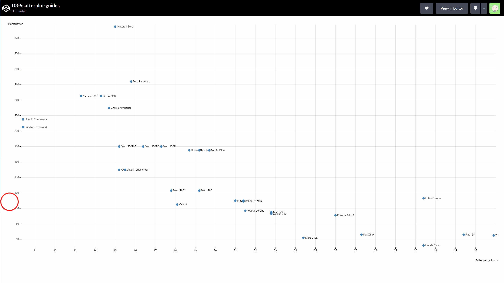

# 散点图

:bulb: 本文的代码需要依赖 D3 环境，版本为 [v7.3.0](https://github.com/d3/d3/releases/tag/v7.3.0)

## 静态图
:mag: 所参考的 Observable Notebook：[Scatterplot](https://observablehq.com/@d3/scatterplot?collection=@d3/charts)

:snowman: 官方样例中图表的搭建流程概述：
* 数据导入与转换
* 构建比例尺和坐标轴（对象）
* 创建容器并设置宽高和 `viewBox` 属性
* 绘制横纵坐标轴
* 绘制数据点的标注信息
* 绘制数据点

:gear: 代码具体演示效果可以查看 Observable 的这个 [notebook](https://observablehq.com/@benbinbin/scatterplot?collection=@benbinbin/chart-line-by-line)

```js
// 在 D3.js 中绘制散点图的方法参考自 https://observablehq.com/@d3/scatterplot

// Copyright 2021 Observable, Inc.
// Released under the ISC license.
// https://observablehq.com/@d3/scatterplot

// 这是一个用于绘制静态散点图的封装好的函数，大部分的参数都有默认值，可以直接传入原始数据来使用，最后函数返回的是一个 svg 节点
function Scatterplot(data, {
  x = ([x]) => x, // 从原始数据 data 中读取出各数据点的标注信息的函数，该函数的入参是各个数据点 d（如果原始数据点结构是 [x, y] 可以使用这里的默认值 ([x]) => x 即通过解构获取 x 值）
  y = ([, y]) => y,
  r = 3, // 数据点的大小半径
  title, // 从原始数据 data 中读取出各数据点的标注信息的函数，该函数的入参是各个数据点 d
  // 以下有一些关于图形的宽高、边距尺寸相关的参数
  marginTop = 20, // top margin, in pixels
  marginRight = 30, // right margin, in pixels
  marginBottom = 30, // bottom margin, in pixels
  marginLeft = 40, // left margin, in pixels
  inset = r * 2, // inset the default range, in pixels
  insetTop = inset, // inset the default y-range
  insetRight = inset, // inset the default x-range
  insetBottom = inset, // inset the default y-range
  insetLeft = inset, // inset the default x-range
  width = 640, // svg 的宽度
  height = 400,
  xType = d3.scaleLinear, // 横坐标轴所使用的比例尺类型
  xDomain, // 横坐标轴的定义域范围 [xmin, xmax] （以下）默认从原始数据中计算得出
  xRange = [marginLeft + insetLeft, width - marginRight - insetRight], // 横坐标轴的值域（可视化属性，这里是长度）范围 [left, right] 从左至右，和我们日常使用一致
  yType = d3.scaleLinear,
  yDomain, // [ymin, ymax]
  yRange = [height - marginBottom - insetBottom, marginTop + insetTop], // 纵坐标轴的值域（可视化属性，这里是长度）范围 [bottom, top] 由于 svg 的坐标体系中向下和向右是正方向，和我们日常使用的不一致，所以这里的值域范围需要采用从下往上与定义域进行映射
  xLabel, // 为横坐标轴添加额外信息名称（一般是刻度值的单位等信息）
  yLabel,
  xFormat, // 格式化数字的说明符 specifier 用于格式化横坐标轴的刻度值
  yFormat,
  fill = "none", // 数据点的填充颜色
  stroke = "currentColor", // 数据点的描边颜色
  strokeWidth = 1.5, // 数据点的描边宽度
  halo = "#fff", // 数据点的标注信息的文字描边颜色
  haloWidth = 3 // 数据点的标注信息的文字描边宽度
} = {}) {

  /**
   *
   * 对原始数据 data 进行转换
   *
   */
  // 主要使用 d3-array 模块的 API：d3.map()
  // 具体可以参考 https://github.com/d3/d3-array#map

  // 从原始数据 data（一般是一个数组，也可以是其他类型，只要是可迭代对象即可）中读取出用于绘制散点图的横坐标所需的数据
  // 参数 x 是映射函数 mapper，它会被可迭代对象 data 的每一个元素依次调用，而映射函数会返回一个值，作为各个元素的相应「替代」值，和 JavaScript 的数组原生方法 arr.map() 类似。
  // 参数 x 的默认值是 ([x]) => x
  // 这里假设原始数据是一个嵌套数组，例如 [[1,2], [11, 3], ...] 其元素是一个二维数组 [a, b] 其中第一个值就是用作散点图的横坐标，所以默认的 mapper 函数 ([x]) => x 就是通过解构读取第一个值
  const X = d3.map(data, x);
  // 从原始数据 data 中读取出用于绘制散点图的纵坐标所需的数据
  const Y = d3.map(data, y);
  // 从原始数据 data 中读取出各数据点的标注信息
  const T = title == null ? null : d3.map(data, title);

  // 这里还做了一步数据清洗
  // 使用 JavaScript 数组的原生方法 arr.filter() 筛掉横坐标或纵坐标值任意一个为空的数据点
  // 返回一个数组，其元素是一系列数字，对应于原数据集的元素的索引位置
  const I = d3.range(X.length).filter(i => !isNaN(X[i]) && !isNaN(Y[i]));

  /**
   *
   * 计算数据集的范围，作为坐标轴的定义域
   *
   */
  // 主要使用 d3-array 模块的 API：d3.extent()
  // 具体可以参考 https://github.com/d3/d3-array#extent
  // 参数 X 和 Y 是一个可迭代对象，该方法获取可迭代对象的范围，返回一个由最小值和最大值构成的数组 [min, max]
  if (xDomain === undefined) xDomain = d3.extent(X);
  if (yDomain === undefined) yDomain = d3.extent(Y);

  /**
   *
   * 构建比例尺和坐标轴
   *
   */
  // 主要使用 d3-scale 和 d3-axis 模块的 API

  // xType 和 yType 是横轴和纵轴所对应的数据映射为可视元素的属性时所使用的比例尺，默认值都是 d3.scaleLinear
  // 它是线性比例尺 linear scale（连续型比例尺 Continuous Scales 的一种），值域中的值 y 与定义域中的值 x 是通过表达式 y=mx+b 联系起来的，这种映射方式可以在视觉元素的变量中保留数据的原始差异比例
  // 具体可以参考 https://github.com/d3/d3-scale#linear-scales
  // 使用方法 d3.scaleLinear(domain, range) 构建一个线性比例尺，其中参数 xDomain 是定义域，一般是原始数据的范围；而 xRange 是值域，一般是可视元素的某个属性的范围，例如页面的宽度
  const xScale = xType(xDomain, xRange); // 横轴所使用的比例尺
  const yScale = yType(yDomain, yRange); // 纵轴所使用的比例尺

  // 基于比例尺绘制坐标轴
  // 具体可以参考 https://github.com/d3/d3-axis

  // 使用方法 d3.axisBottom(scale) 生成一个朝下的坐标轴（对象），即其刻度在水平轴线的下方
  // 而 d3.axisLeft(scale) 就生成一个朝左的坐标轴，即其刻度在竖直轴线的左方

  // 调用坐标轴对象方法 axis.ticks() 设置坐标轴刻度的间隔（一般是设置刻度的数量 count），以及刻度值的格式
  // 其中刻度值的格式使用了 d3-format 模块，该模块提供了很多处理数字格式的 API
  // xFormat 和 yFormat 就是用于格式化数字的说明符 specifier
  // 具体可以参考 https://github.com/d3/d3-format#locale_format
  const xAxis = d3.axisBottom(xScale).ticks(width / 80, xFormat);
  const yAxis = d3.axisLeft(yScale).ticks(height / 50, yFormat);
  // 构建出来的坐标轴对象 xAxis 和 yAxis 也是一个方法，它接受一个 SVG 元素 context，一般是一个 <g> 元素，如 xAxis(context) 和 yAxis(context) 将坐标轴在其内部渲染出来。构建出来的坐标轴是有一系列 SVG 元素构成
  // * 轴线由 <path> 路径元素构成，它带有类名 domain
  // * 刻度是和刻度值分别由元素 <line> 和 <text> 构成。每一刻度和相应的刻度值都包裹在一个 <g> 元素中，它带有类名 tick
  // 💡 但是一般使用 selection.call(axis) 的方式来调用坐标轴对象（方法），其中 selection 是指选择集，一般是一个 <g> 元素；axis 是坐标轴对象。关于 selection.call() 方法具体可以参考 https://github.com/d3/d3-selection#selection_call
  // 💡 在构建坐标轴时，推荐为容器的四周设置一个 margin 区域（即封装方法的参数 marginTop、marginRight、marginBottom、marginLeft），以便放置坐标轴等注释信息，而中间的「安全区域」才放置主要的可视化图表内容

  /**
   *
   * 创建容器
   *
   */
  // 主要使用 d3-selection 模块的 API
  // 具体可以参考 https://github.com/d3/d3-selection

  // 使用方法 d3.create("svg") 创建一个 svg 元素，并返回一个选择集 selection
  // 使用选择集的方法 selection.attr() 为选择集中的所有元素（即 <svg> 元素）设置宽高和 viewBox 属性
  // 💡 这里使用的是链式调用的方法，因为选择集的方法返回的也是该选择集
  const svg = d3.create("svg")
    .attr("width", width) // 这里的宽度是「写死」的，默认为 640px，但是在 Observable 中，当页面调整大小时 svg 宽度也会随之变换，这是因为 Observable 的 cell 之间可以构成响应式的依赖实现同步变化，具体工作原理可以查看这里 https://observablehq.com/@observablehq/how-observable-runs 如果在项目中也想在页面调整大小时图表也随着变化，代码需要做相应的调整
    .attr("height", height)
    .attr("viewBox", [0, 0, width, height]) // viewBox 一般设置为与 svg 元素等宽高
    .attr("style", "max-width: 100%; height: auto; height: intrinsic;");

  /**
   *
   * 绘制坐标轴
   *
   */
  // 主要使用 d3-selection 模块的 API

  // 绘制横坐标轴
  // 使用 svg.append("g") 在选择集 svg 的元素中（这个选择集只有 <svg> 元素），创建一个子元素 <g> 以其作为一个容器（包含坐标轴的轴线和坐标刻度以及坐标值），然后返回包含该元素的选择集（即此时的选择集已经改变了）
  // 然后通过一系列的链式调用，主要是使用方法 selection.attr() 为选择集的元素（当前选择集包含的元素是 <g> 元素）设置属性
  svg.append("g")
    .attr("transform", `translate(0, ${height - marginBottom})`) // 将横坐标轴容器定位到底部
    .call(xAxis) // 调用坐标轴（对象）方法，将坐标轴在相应容器内部渲染出来。以下的代码是对坐标轴进行一些定制化的调整
    .call(g => g.select(".domain").remove()) // 删掉上一步所生成的坐标轴的轴线（它含有 domain 类名）
    .call(g => g.selectAll(".tick line").clone() // 这里复制了一份刻度线，用以绘制散点图中纵向的网格参考线
      .attr("y2", marginTop + marginBottom - height) // 调整复制后的刻度线的终点位置（往上移动）
      .attr("stroke-opacity", 0.1)) // 调小网格线的透明度
    .call(g => g.append("text") // 为坐标轴添加额外信息名称（一般是刻度值的单位等信息）
      .attr("x", width)
      .attr("y", marginBottom - 4) // 添加的额外文字定位到坐标轴的顶部
      .attr("fill", "currentColor")
      .attr("text-anchor", "end") // 设置文本的对齐方式
      .text(xLabel)); // 这是封装函数传入的参数

  // 绘制纵坐标轴
  svg.append("g")
    .attr("transform", `translate(${marginLeft}, 0)`) // 这里将纵坐标容器稍微往左移动一点，让坐标轴绘制在预先留出的 margin 区域中
    .call(yAxis)
    .call(g => g.select(".domain").remove())
    .call(g => g.selectAll(".tick line").clone()
      .attr("x2", width - marginLeft - marginRight)
      .attr("stroke-opacity", 0.1))
    .call(g => g.append("text")
      .attr("x", -marginLeft)
      .attr("y", 10)
      .attr("fill", "currentColor")
      .attr("text-anchor", "start")
      .text(yLabel));

  /**
   *
   * 绘制数据点和相应的标注信息
   *
   */
  // 如果有为数据点设置标注信息，即变量 T 不为 null 时，绘制出标注信息
  // 在 svg 中添加一个容器 <g> 元素
  if (T) svg.append("g")
    .attr("font-family", "sans-serif")
    .attr("font-size", 10)
    .attr("stroke-linejoin", "round")
    .attr("stroke-linecap", "round") // 设置字体的相关样式
    .selectAll("text") // 将数据集 I（包含一系列索引值）和一系列「虚拟」的占位 <text> 元素进行绑定
    .data(I)
    .join("text") // 将这些 <text> 生成到 <g> 容器中
    .attr("dx", 7) // 为文字在横纵轴方向上设置一点小偏移，避免阻挡数据点
    .attr("dy", "0.35em")
    .attr("x", i => xScale(X[i])) // 设置各个 <text> 元素的属性 x 和 y 将其移动到相应的数据点的位置。第二个参数是一个函数，则每一个 <text> 元素都会依次调用，并传入其绑定的数据 i，通过 X[i] 就可以读取到相应的数据点的横坐标值
    .attr("y", i => yScale(Y[i]))
    .text(i => T[i]) // 设置标注内容
    .call(text => text.clone(true)) // 这里将各文本拷贝一份，用以实现文字描边的效果，可以有效地凸显文字内容，且避免其他元素对文字遮挡
    .attr("fill", "none") // 没有填充色
    .attr("stroke", halo) // 只是设置描边的颜色和宽度
    .attr("stroke-width", haloWidth);

  // 绘制出数据点
  // 在 svg 中添加一个容器 <g> 元素
  svg.append("g")
    .attr("fill", fill) // 设置数据点的一些样式属性，包括填充的颜色、描边样式、描边宽度
    .attr("stroke", stroke)
    .attr("stroke-width", strokeWidth)
    .selectAll("circle") // 将数据集 I（包含一系列索引值）和一系列「虚拟」的占位 <circle> 元素进行绑定
    .data(I)
    .join("circle") // 将这些 <circle> 生成到 <g> 容器中
    .attr("cx", i => xScale(X[i])) // 设置各个 <circle> 元素的属性 cx 和 cy 将其移动到相应的位置。第二个参数是一个函数，则每一个 <circle> 元素都会依次调用，并传入其绑定的数据 i，通过 X[i] 就可以读取到相应的数据点的横坐标值
    .attr("cy", i => yScale(Y[i]))
    .attr("r", r); // 设置圆的半径大小

  return svg.node(); // 最后返回 svg 元素，在 Observable 可以直接将其绘制到页面上，如果是在自己的项目中，则需要将 svg 元素 append 到页面上
}
```

以上解读的代码是绘制静态散点图的较通用的代码，下一步是结合 [notebook](https://observablehq.com/@d3/scatterplot?collection=@d3/charts) 里的演示数据改写代码，虽然会降低了代码的通用性，但可以将代码进行简化，然后在 [Codepen](https://codepen.io/benbinbin/pen/zYPjmQN) 里复现，这个散点图是宽高固定为 `width = 640, height = 400` 然后基于它进行改进，为图表添加响应页面大小变化的功能。

:gear: 代码具体演示效果可以查看这个 [Codepen](https://codepen.io/benbinbin/pen/zYPjmQN)

## 响应性
还实现图表随着页面大小的改变实现响应式缩放。

实现图表的随页面大小响应式变化功能有两种方案：

### 方案一
只设置 svg 元素的宽高，即整体缩放图表来实现（主要使用 CSS 的 transform scale 属性实现），但是可能造成图表元素过大或过小的问题

:gear: 代码具体演示效果可以查看这个 [Codepen](https://codepen.io/benbinbin/pen/jOavYWb)


从演示可知该方案是对整个 SVG 进行缩放，在页面较小时图表的可视性可能较差

其核心代码如下

```js
/**
*
* 监听页面调整大小的操作，并相应地调整散点图的大小
*
*/
// 监听页面（容器）的大小变化
const container = document.getElementById("container");

let width = container.clientWidth;
let height = container.clientHeight;

let timer = null;

function debounce(delay = 500) {
  if (timer) {
    // （如果倒计时的时间未到，而再次触发 debounce 函数）阻止计时器执行回调函数
    clearTimeout(timer);
  }

  // 重新设置计时器，倒计时重新计算
  timer = setTimeout(function () {
    // 经过延迟后，执行核心代码
    // 获取当前容器的的宽高值
    const w = container.clientWidth;
    const h = container.clientHeight;

    // 当页面的宽度或高度改变时
    if (w !== width || h !== height) {
      width = w;
      height = h;
      // 重新设置 svg 画布参数
      svg.attr("width", w)
      .attr("height", h)
        .attr("viewBox", [0, 0, w, h])
    }

    // 执行完核心代码后，清空计时器 timer
    timer = null;
  }, delay);
}

function resized() {
  // 实际使用防抖函数时，可以设置延迟时间
  // 这里设置为延迟 1000 毫秒
  debounce(500);
}

// 监听页面调整大小时分发的 resize 事件
function setListener() {
  window.addEventListener("resize", resized);
  return function removeListener() {
    window.removeEventListener("resize", resized);
  };
}

// 当需要时调用方法注销监听器（例如移除图表时）
const removeListener = setListener();
```

### 方案二

基于页面的尺寸再对图表进行重绘来实现，但是可能很耗费性能，特别是在页面缩放较频繁或数据量较大时。

:bulb: 可以对图表的不同部分采用不同的重绘方案，以改善该方案的性能损耗。例如对于坐标轴等构成较为简单且变化较少的「固定」的元素可以完全重绘；而对于数据点等数量变化较大的元素，一般是在重绘时改变其属性，以移动这些元素到正确的新位置，而不是完全重绘它们。此外还可以为变化的元素添加**过渡**动效，这样可以让图表的重绘显得更「顺滑」。


:gear: 代码具体演示效果可以查看这个 [Codepen](https://codepen.io/benbinbin/pen/NWwLXvG)

从演示可知该方案会对图表的元素进行重绘，即使页面较小时，依然保持坐标轴和数据点等元素的可视性。

其完整代码如下

```html
<!-- 📄 网页文件 -->
<body>
  <div id="container"></div>
  <script src="./app.js"></script>
</body>
```

```js
// 📄 脚本文件
/**
*
* 一些关于图表尺寸的参数（固定值）
*
*/
// 图表边距相关参数
const marginTop = 20, // top margin, in pixels
  marginRight = 30, // right margin, in pixels
  marginBottom = 30, // bottom margin, in pixels
  marginLeft = 40 // left margin, in pixels

// 图表元素相关参数
const r = 3, // 数据点的大小半径
  inset = r * 2, // inset the default range, in pixels
  insetTop = inset, // inset the default y-range
  insetRight = inset, // inset the default x-range
  insetBottom = inset, // inset the default y-range
  insetLeft = inset // inset the default x-range

/**
  *
  * 创建容器
  *
  */
// 主要使用 d3-selection 模块的 API
// 具体可以参考 https://github.com/d3/d3-selection

// 在容器 <div id="container"> 元素内创建一个 SVG 元素，并返回一个包含新建元素（即 <svg> 元素）的选择集
const svg = d3.select('#container')
  .append('svg')

/**
*
* 将构建散点图的核心代码封装为一个函数
*
*/
// 在 D3.js 中绘制散点图的方法参考自 https://observablehq.com/@d3/scatterplot
// Copyright 2021 Observable, Inc.
// Released under the ISC license.
// https://observablehq.com/@d3/scatterplot

function scatterPlot(data, svg,
  {
    // 以下有一些关于图形的宽高和坐标轴相关的参数
    width = 640, // svg 的宽度
    height = 400,
    xRange = [marginLeft + insetLeft, width - marginRight - insetRight], // 横坐标轴的值域（可视化属性，这里是长度）范围 [left, right] 从左至右，和我们日常使用一致
    yRange = [height - marginBottom - insetBottom, marginTop + insetTop], // 纵坐标轴的值域（可视化属性，这里是长度）范围 [bottom, top] 由于 svg 的坐标体系中向下和向右是正方向，和我们日常使用的不一致，所以这里的值域范围需要采用从下往上与定义域进行映射
  } = {}) {

  if (data.length <= 0) return

  /**
  *
  * 对原始数据 data 进行转换
  *
  */
  // 主要使用 d3-array 模块的 API：d3.map()
  // 具体可以参考 https://github.com/d3/d3-array#map

  // 从原始数据 data 中读取出用于绘制散点图的横坐标所需的数据
  const X = d3.map(data, d => d.mpg);
  // 从原始数据 data 中读取出用于绘制散点图的纵坐标所需的数据
  const Y = d3.map(data, d => d.hp);
  // 从原始数据 data 中读取出各数据点的标注信息
  const T = d3.map(data, d => d.name);

  // 这里还做了一步数据清洗
  // 使用 JavaScript 数组的原生方法 arr.filter() 筛掉横坐标或纵坐标值任意一个为空的数据点
  // 返回一个数组，其元素是一系列数字，对应于原数据集的元素的索引位置
  const I = d3.range(X.length).filter(i => !isNaN(X[i]) && !isNaN(Y[i]));

  /**
  *
  * 计算数据集的范围，作为坐标轴的定义域
  *
  */
  // 主要使用 d3-array 模块的 API：d3.extent()
  // 具体可以参考 https://github.com/d3/d3-array#extent

  // 参数 X 和 Y 是一个可迭代对象，该方法获取可迭代对象的范围，返回一个由最小值和最大值构成的数组 [min, max]
  const xDomain = d3.extent(X);
  const yDomain = d3.extent(Y);

  /**
  *
  * 构建比例尺和坐标轴
  *
  */
  // 主要使用 d3-scale 和 d3-axis 模块的 API

  // 横轴和纵轴所对应的数据映射为可视元素的属性时，均采用 d3.scaleLinear 线性比例尺
  // 具体可以参考 https://github.com/d3/d3-scale#linear-scales

  const xScale = d3.scaleLinear(xDomain, xRange); // 横轴所使用的比例尺
  const yScale = d3.scaleLinear(yDomain, yRange); // 纵轴所使用的比例尺

  // 基于比例尺绘制坐标轴
  // 具体可以参考 https://github.com/d3/d3-axis

  // 使用方法 d3.axisBottom(scale) 生成一个朝下的坐标轴（对象），即其刻度在水平轴线的下方
  // 而 d3.axisLeft(scale) 就生成一个朝左的坐标轴，即其刻度在竖直轴线的左方

  // 调用坐标轴对象方法 axis.ticks() 设置坐标轴刻度的间隔（一般是设置刻度的数量 count）
  const xAxis = d3.axisBottom(xScale).ticks(width / 80);
  const yAxis = d3.axisLeft(yScale).ticks(height / 50);
  // 构建出来的坐标轴对象 xAxis 和 yAxis 也是一个方法，它接受一个 SVG 元素 context，一般是一个 <g> 元素，如 xAxis(context) 和 yAxis(context) 将坐标轴在其内部渲染出来。构建出来的坐标轴是有一系列 SVG 元素构成
  // * 轴线由 <path> 路径元素构成，它带有类名 domain
  // * 刻度是和刻度值分别由元素 <line> 和 <text> 构成。每一刻度和相应的刻度值都包裹在一个 <g> 元素中，它带有类名 tick
  // 💡 但是一般使用 selection.call(axis) 的方式来调用坐标轴对象（方法），其中 selection 是指选择集，一般是一个 <g> 元素；axis 是坐标轴对象。关于 selection.call() 方法具体可以参考 https://github.com/d3/d3-selection#selection_call
  // 💡 在构建坐标轴时，推荐为容器的四周设置一个 margin 区域（即封装方法的参数 marginTop、marginRight、marginBottom、marginLeft），以便放置坐标轴等注释信息，而中间的「安全区域」才放置主要的可视化图表内容

  // 使用选择集的方法 selection.attr() 为选择集中的所有元素（即 <svg> 元素）设置宽高和 viewBox 属性
  svg.attr("width", width) // 这里的宽度是「写死」的，默认为 640px，但是在 Observable 中，当页面调整大小时 svg 宽度也会随之变换，这是因为 Observable 的 cell 之间可以构成响应式的依赖实现同步变化，具体工作原理可以查看这里 https://observablehq.com/@observablehq/how-observable-runs
    // 这里我们通过监听页面的调整大小时分发的事件 resized 然后在事件处理函数中重绘散点图，以实现类似的效果
    .attr("height", height)
    .attr("viewBox", [0, 0, width, height]) // viewBox 一般设置为与 svg 元素等宽高
    // .attr("style", "max-width: 100%; height: auto; height: intrinsic;");

  /**
  *
  * 绘制坐标轴
  *
  */
  // 主要使用 d3-selection 模块的 API

  // 绘制横坐标轴
  // 然后通过一系列的链式调用，主要是使用方法 selection.attr() 为选择集的元素（当前选择集包含的元素是 <g> 元素）设置属性
  const xAxisGridContainer = svg.append("g")

  xAxisGridContainer.attr("transform", `translate(0, ${height - marginBottom})`) // 将横坐标轴容器定位到底部
    .call(xAxis) // 调用坐标轴（对象）方法，将坐标轴在相应容器内部渲染出来。以下的代码是对坐标轴进行一些定制化的调整
    .call(g => g.select(".domain").remove()) // 删掉上一步所生成的坐标轴的轴线（它含有 domain 类名）
    .call(g => g.selectAll(".tick line").clone() // 这里复制了一份刻度线，用以绘制散点图中纵向的网格参考线
      .attr("y2", marginTop + marginBottom - height) // 调整复制后的刻度线的终点位置（往上移动）
      .attr("stroke-opacity", 0.1)) // 调小网格线的透明度
    .call(g => g.append("text") // 为坐标轴添加额外信息名称（一般是刻度值的单位等信息）
      .attr("x", width)
      .attr("y", marginBottom - 4) // 添加的额外文字定位到坐标轴的顶部
      .attr("fill", "currentColor")
      .attr("text-anchor", "end") // 设置文本的对齐方式
      .text("Miles per gallon →"));

  // 绘制纵坐标轴
  const yAxisGridContainer = svg.append("g")

  yAxisGridContainer.attr("transform", `translate(${marginLeft}, 0)`) // 这里将纵坐标容器稍微往左移动一点，让坐标轴绘制在预先留出的 margin 区域中
    .call(yAxis)
    .call(g => g.select(".domain").remove())
    .call(g => g.selectAll(".tick line").clone()
      .attr("x2", width - marginLeft - marginRight)
      .attr("stroke-opacity", 0.1))
    .call(g => g.append("text")
      .attr("x", -marginLeft)
      .attr("y", 10)
      .attr("fill", "currentColor")
      .attr("text-anchor", "start")
      .text("↑ Horsepower"));

  /**
  *
  * 绘制数据点和相应的标注信息
  *
  */
  // 绘制出标注信息
  const labelsContainer = svg.append("g")
    .attr("font-family", "sans-serif")
    .attr("font-size", 10)
    .attr("stroke-linejoin", "round")
    .attr("stroke-linecap", "round") // 设置字体的相关样式

  labelsContainer.selectAll("text") // 将数据集 I（包含一系列索引值）和一系列「虚拟」的占位 <text> 元素进行绑定
    .data(I)
    .join("text") // 将这些 <text> 生成到 <g> 容器中
    .attr("dx", 7) // 为文字在横纵轴方向上设置一点小偏移，避免阻挡数据点
    .attr("dy", "0.35em")
    .attr("x", i => xScale(X[i])) // 设置各个 <text> 元素的属性 x 和 y 将其移动到相应的数据点的位置。第二个参数是一个函数，则每一个 <text> 元素都会依次调用，并传入其绑定的数据 i，通过 X[i] 就可以读取到相应的数据点的横坐标值
    .attr("y", i => yScale(Y[i]))
    .text(i => T[i]) // 设置标注内容
    .call(text => text.clone(true)) // 这里将各文本拷贝一份，用以实现文字描边的效果，可以有效地凸显文字内容，且避免其他元素对文字遮挡
    .attr("fill", "none") // 没有填充色
    .attr("stroke", "#fff") // 只是设置描边的颜色和宽度
    .attr("stroke-width", 3);

  // 绘制出数据点
  // 在 svg 中添加一个容器 <g> 元素
  const pointsContainer = svg.append("g")
    .attr("fill", "none") // 设置数据点的一些样式属性，包括填充的颜色、描边样式、描边宽度
    .attr("stroke", "steelblue")
    .attr("stroke-width", 1.5)

  pointsContainer.selectAll("circle") // 将数据集 I（包含一系列索引值）和一系列「虚拟」的占位 <circle> 元素进行绑定
    .data(I)
    .join("circle") // 将这些 <circle> 生成到 <g> 容器中
    .attr("cx", i => xScale(X[i])) // 设置各个 <circle> 元素的属性 cx 和 cy 将其移动到相应的位置。第二个参数是一个函数，则每一个 <circle> 元素都会依次调用，并传入其绑定的数据 i，通过 X[i] 就可以读取到相应的数据点的横坐标值
    .attr("cy", i => yScale(Y[i]))
    .attr("r", r); // 设置圆的半径大小

  return {
    X,
    Y,
    xScale,
    yScale,
    xAxis,
    yAxis,
    xAxisGridContainer,
    yAxisGridContainer,
    labelsContainer,
    pointsContainer
  }
}

/**
*
* 数据源
*
*/
// 数据来源 https://observablehq.com/@d3/scatterplot
const dataURL = 'https://gist.githubusercontent.com/Benbinbin/d83bb0453ce5e3ce4316704daa312119/raw/95dd11e5a436d22de25a5c7c4496cacd31c2c826/mtcars.csv'
let dataSource = [];

/**
*
* 构建散点图
*
*/
let X,
  Y,
  xScale,
  yScale,
  xAxis,
  yAxis,
  xAxisGridContainer,
  yAxisGridContainer,
  labelsContainer,
  pointsContainer

d3.csv(dataURL, (d) => {
  return {
    name: d.name,
    mpg: +d.mpg,
    hp: +d.hp
  }
}).then(data => {
  console.log(data);
  dataSource = data;

  ({
    X,
    Y,
    xScale,
    yScale,
    xAxis,
    yAxis,
    xAxisGridContainer,
    yAxisGridContainer,
    labelsContainer,
    pointsContainer
  } = scatterPlot(dataSource, svg, {
    width,
    height
  }))
})


/**
*
* 监听页面调整大小的操作，并相应地调整散点图的大小
* 有两种思路：
* 一种是通过图表的整体缩放来实现（主要使用 CSS 的 transform scale 属性实现），但是可能造成图表元素过大或过小的问题
* 另一种是通过图表的局部重绘来实现，但是当页面缩放较频繁且数据量较大时可能很耗费性能，可以对图表的不同部分采用不同的重绘方案，例如对于坐标轴等元素可以完全重绘，对于数据点所对应的元素，可以改变其定位属性，移动这些元素到相应的位置，而不是完全重绘它们
* 这里采用第二种方案
*
*/

// 将重新基于值域 range 计算比例尺和坐标轴的核心代码封装为函数
// 参考 https://observablehq.com/@mbostock/dont-transition-units
// 由于调整页面大小后，数据集的范围（定义域） domain 并不变，只是其相对应的页面长度改变了（值域） range
// 所以只需要传递 range 以及需要重新构建的比例尺对象 scale 和重绘的坐标轴对象 axis 即可
function setAxis(oldScale, oldAxis, rangeArr, ticksCount) {
  const newScale = oldScale.range(rangeArr); // 基于新给出的值域范围修改比例尺
  const newAxis = oldAxis.scale(newScale).ticks(ticksCount); // 基于新比例尺修改坐标轴

  return {
    newScale,
    newAxis
  }
}

// 监听页面（容器）的大小变化
const container = document.getElementById("container");

let width = container.clientWidth;
let height = container.clientHeight;

let timer = null;

function debounce(delay = 500) {
  if (timer) {
    // （如果倒计时的时间未到，而再次触发 debounce 函数）阻止计时器执行回调函数
    clearTimeout(timer);
  }

  // 重新设置计时器，倒计时重新计算
  timer = setTimeout(function () {
    // 经过延迟后，执行核心代码
    // 获取当前容器的的宽高值
    const w = container.clientWidth;
    const h = container.clientHeight;

    // 当页面的宽度或高度改变时
    if (w !== width || h !== height) {
      width = w;
      height = h;
      // 重新设置 svg 画布参数
      svg.attr("width", w)
      .attr("height", h)
        .attr("viewBox", [0, 0, w, h])
        // .attr("style", "max-width: 100%; height: auto; height: intrinsic;");

      // 重新计算比例尺并生成相应的坐标轴对象
      const newXAxisObj = setAxis(xScale, xAxis, [marginLeft + insetLeft, w - marginRight - insetRight], w / 80);

      const newXScale = newXAxisObj.newScale;
      const newXAxis = newXAxisObj.newAxis;

      // 清除原有的横坐标轴和网格的竖线
      xAxisGridContainer
        .attr("opacity", 0)
        .selectChildren()
        .remove();

      // 重绘横坐标轴和网格的竖线
      // 为坐标轴和网格添加透明度的过渡动效，让重绘显得更「顺滑」
      xAxisGridContainer
        .attr("transform", `translate(0, ${h - marginBottom})`)
        .call(newXAxis)
        .call(g => g.select(".domain").remove())
        .call(g => g.selectAll(".tick line").clone()
          .attr("y2", marginTop + marginBottom - h)
          .attr("stroke-opacity", 0.1))
        .call(g => g.append("text")
          .attr("x", w)
          .attr("y", marginBottom - 4) // 添加的额外文字定位到坐标轴的顶部
          .attr("fill", "currentColor")
          .attr("text-anchor", "end") // 设置文本的对齐方式
          .text("Miles per gallon →"))
        .transition()
        .duration(1000)
        .attr("opacity", 1)

      const newYAxisObj  = setAxis(yScale, yAxis, [h - marginBottom - insetBottom, marginTop + insetTop], h / 50);

      const newYScale = newYAxisObj.newScale;
      const newYAxis = newYAxisObj.newAxis;

      // 清除原有的纵坐标轴和网格的横线
      yAxisGridContainer
        .attr("opacity", 0)
        .selectChildren()
        .remove();

      // 重绘纵坐标轴和网格的竖线
      yAxisGridContainer
        .call(newYAxis)
        .call(g => g.select(".domain").remove())
        .call(g => g.selectAll(".tick line").clone()
          .attr("x2", w - marginLeft - marginRight)
          .attr("stroke-opacity", 0.1))
        .call(g => g.append("text")
          .attr("x", -marginLeft)
          .attr("y", 10)
          .attr("fill", "currentColor")
          .attr("text-anchor", "start")
          .text("↑ Horsepower"))
        .transition()
        .duration(1000)
        .attr("opacity", 1)

      // 使用新的比例尺重新计算数据点和标注文本的定位位置
      // 为元素的位置变化添加过渡动效，让重绘显得更「顺滑」
      labelsContainer.selectAll("text")
        .transition()
        .duration(500)
        .attr("x", i => newXScale(X[i]))
        .attr("y", i => newYScale(Y[i]))

      pointsContainer.selectAll("circle")
        .transition()
        .duration(500)
        .attr("cx", i => newXScale(X[i]))
        .attr("cy", i => newYScale(Y[i]))
    }

    // 执行完核心代码后，清空计时器 timer
    timer = null;
  }, delay);
}

function resized() {
  // 实际使用防抖函数时，可以设置延迟时间
  // 这里设置为延迟 1000 毫秒
  debounce(500);
}

// 监听页面调整大小时分发的 resize 事件
function setListener() {
  window.addEventListener("resize", resized);
  return function removeListener() {
    window.removeEventListener("resize", resized);
  };
}

// 当需要时调用方法注销监听器（例如移除图表时）
const removeListener = setListener();
```

## 交互
散点图常见交互的实现

### Tooltip
参考：
* [SVG Title vs. HTML Title Attribute](https://css-tricks.com/svg-title-vs-html-title-attribute)
* [`<title>` — the SVG accessible name element](https://developer.mozilla.org/en-US/docs/Web/SVG/Element/title) | MDN

散点图可以看到数据的离散和集中程度，但是具体到某个数据点的值往往难以获取，这时候可以添加一个交互，当鼠标悬停到特定的数据点时，弹出 tooltip 提示框来显示该数据点的具体信息。

最简单的方法是在 SVG 元素（一般数据点采用 `<circle>` 元素来绘制）内[添加 `<title>` 元素](https://developer.mozilla.org/zh-CN/docs/Web/SVG/Element/title)，这就类似为 `` 元素添加 `alt` 属性。这样当鼠标悬停在数据点上，就会显示一个浏览器默认的提示框。

:gear: 代码具体演示效果可以查看这个 [Codepen](https://codepen.io/benbinbin/pen/PoENMwo)

:warning: 此外 `<title>` 只能在含有 `fill` 属性（属性值不能为 `none`）的图形元素内，才能够显示 tooltip，所以还需要在散点图的点 `<circle>` 元素添加 `fill` 属性

```js
const pointsContainer = svg
  .append("g")
  .attr("fill", "steelblue") // 为数据点设置填充色
  .attr("stroke", "steelblue")
  .attr("stroke-width", 1.5);
```

以下是实现 tooltip 的核心代码

```js
/**
 * 为数据点添加 tooltip 提示框
 */
// 通过在 <circle> 内添加 <title> 元素实现鼠标悬浮时显示提示框
pointsContainer.selectAll('circle')
  .append('title') // 在 <circle> 元素内添加一个 <title> 元素
  .text((d) => { // 入参数据继承自父级 <circle> 所绑定的数据
    return `mpg: ${X[d]}, hp: ${Y[d]}` // 设置 tooltip 内容
  })

// 同时也在标注元素 <text> 内添加 <title> 元素，也可以实现鼠标悬浮时显示提示框
labelsContainer.selectAll("text")
  .append('title')
  .text((d) => {
    return `mpg: ${X[d]}, hp: ${Y[d]}`
  })
```


:bulb: 但是通过 `<title>` 元素设置的提示框内容只能是字符串，而且提示框也没有什么样式修饰。如果希望展示一个具有丰富内容和样式的提示框，则可以「自制」一个提示框，可以参考这个[例子](https://observablehq.com/@slegrand45/d3-scatterplot-tooltip-and-data-in-table)（借助 [popper.js](https://popper.js.org/) 和 [Tippy.js](https://atomiks.github.io/tippyjs/) 框架构建出 tooltip）。

### 辅助线
参考：
* [D3js Graph with X and Y crosshairs, and a threshold line.](http://bl.ocks.org/mikehadlow/93b471e569e31af07cd3)
* [Scatterplot including hover effect from the D3.js Graph Gallery](https://observablehq.com/@stefanreifenberg/bubbles)

但是提示框 Tooltip 弹出时可能会遮盖图表的一部分，而且在图表中移动鼠标时会造成弹出框的频繁显示和消失，这对于观众是一种干扰。

为了显示具体点的信息，另一种交互方式是为散点图添加**十字辅助线**，这样就可以在鼠标移动到具体点时，更准确地（基于辅助线）读取当前（坐标轴）的值。

:gear: 代码具体演示效果可以查看这个 [Codepen](https://codepen.io/benbinbin/pen/mdpEOxM)

以下是实现辅助线的核心代码

```js
/**
 * 构建辅助线，并在坐标轴显示相应的值
 */
// 辅助线容器
const guidesContainer = svg
  .append("g")
  .style("opacity", 0) // 默认不显示
  .attr("stroke", "black") // 设置辅助线的颜色
  .attr("stroke-dasharray", 5); // 将辅助线设置为虚线

const guidesParallel = guidesContainer.append("line"); // 水平辅助线
const guidesVertical = guidesContainer.append("line"); // 垂直辅助线

// 同时在坐标轴上相应的位置显示（当前鼠标所在的位置）所对应的值
const xValue = svg
  .append("text")
  .attr("transform", `translate(0, ${height - 14})`) // 在横坐标显示的值定位到容器的底部
  .attr("font-size", 14) // 设置字体大小
  .style("opacity", 0); // 默认不显示

const yValue = svg.append("text").attr("font-size", 14).style("opacity", 0);

// 监听鼠标在散点图上的移动相关事件
svg
  .on("mouseover", function () {
    // 当鼠标进入散点图时，将辅助线及坐标轴上相应的值显示出来
    // 设置不同的透明度进行视觉上的优化
    guidesContainer.style("opacity", 0.3);
    xValue.style("opacity", 0.5);
    yValue.style("opacity", 0.5);
  })
  .on("mouseout", function () {
    // 当鼠标离开散点图时，隐藏辅助线及坐标轴上相应的值
    guidesContainer.style("opacity", 0);
    xValue.style("opacity", 0);
    yValue.style("opacity", 0);
  })
  .on("mousemove", function (event) {
    // 当鼠标在散点图上移动时，获取鼠标的位置（相对于 svg 元素）
    const [xPos, yPos] = d3.pointer(event);

    // 设置横坐标轴的值
    xValue
      .attr("x", xPos - 14) // 该值在（横坐标轴容器里）横向位置移动（和鼠标的位置一样）xPos - 14
      .attr("fill", "black") // 设置字体颜色
      // 调用比例尺的 invert() 方法，通过位置（range 值域）反向求出对应的（domain 定义域）值
      // 由于反向求出的值可能具有多位小数，根据原始数据的精度，保留一位小数
      .text(d3.format(".1f")(xScale.invert(xPos)));

    // 设置纵坐标的值
    yValue
      .attr("y", yPos) // 该值在（纵坐标轴容器里）纵向位置移动（和鼠标的位置一样）yPos
      .attr("fill", "black")
      .text(d3.format(".0f")(yScale.invert(yPos)));

    // 设置水平辅助线的位置
    guidesParallel
      // x1 和 y1 属性设置线段的起点，x2 和 y2 属性设置线段的终点
      .attr("x1", xScale(xDomain[0]) - insetLeft)
      .attr("y1", yPos)
      .attr("x2", xScale(xDomain[1]) + insetRight)
      .attr("y2", yPos);

    // 设置垂直辅助线的位置
    guidesVertical
      .attr("x1", xPos)
      .attr("y1", yScale(yDomain[0] - insetTop))
      .attr("x2", xPos)
      .attr("y2", yScale(yDomain[1] + insetRight));
  });
```

由于在上一步为散点图设置了响应性，所以在页面进行大小调整时，辅助线（以及在坐标轴显示的相应值）需要使用新的比例尺进行计算绘制，以下是核心代码

```js
function debounce(delay = 500) {
  // ...

  // 重新设置计时器，倒计时重新计算
  timer = setTimeout(function () {
    // ...

    if (w !== width || h !== height) {
      //...

      // 先取消在散点图上设置的鼠标移动监听器
      svg.on("mousemove", null);

      // 使用新的比例尺计算辅助线和坐标轴显示相应的值
      xValue.attr("transform", `translate(0, ${h - 14})`); // 修正横坐标上显示值的位置
      // 重新设置在散点图上设置的鼠标移动监听器
      svg.on("mousemove", function (event) {
        const [xPos, yPos] = d3.pointer(event);

        xValue
          .attr("x", xPos - 14)
          .attr("fill", "black")
          .text(d3.format(".1f")(newXScale.invert(xPos)));

        yValue
          .attr("y", yPos)
          .attr("fill", "black")
          .text(d3.format(".0f")(newYScale.invert(yPos)));

        guidesParallel
          .attr("x1", newXScale(xDomain[0]) - insetLeft)
          .attr("y1", yPos)
          .attr("x2", newXScale(xDomain[1]) + insetRight)
          .attr("y2", yPos);

        guidesVertical
          .attr("x1", xPos)
          .attr("y1", newYScale(yDomain[0] - insetTop))
          .attr("x2", xPos)
          .attr("y2", newYScale(yDomain[1] + insetRight));
      });
    }

    timer = null;
  }, delay);
}
```


### 高亮显示
但是通过十字辅助线来读取数据点的具体数值也有缺点，由于数据点是一个值，但是映射到页面时是一个具有面积的小圆形，所以无法做到精准的读取。

下图是鼠标在小圆形内移动时，坐标轴上相应的数值会变化



针对这种情况，可以在这些小圆形上设置鼠标悬停事件监听器，当鼠标进入到特定数据点时，在坐标轴显示固定的（相应的）值，即使鼠标在小圆形内移动。还可以添加一些 **「高亮」样式** 让具体数据的读取显得更容易，例如当鼠标悬浮到特定数据点时，改变该数据点的样式。


:gear: 代码具体演示效果可以查看这个 [Codepen](https://codepen.io/benbinbin/pen/NWwLXvG)

以下是实现数据点高亮和显示相应值的核心代码

```js
/**
 *
 * 当鼠标悬停在数据点时，高亮数据点并在坐标轴中显示相应的值
 *
 */
// 使用 <foreignObject> 元素来包含普通的 HTML 元素，便于使用 CSS 设置丰富的样式
// 设置横坐标轴上的数据点的值的高亮显示
const xForeign = svg
  .append('foreignObject')
  .attr('width', 50) // 设置该容器的大小尺寸
  .attr('height', 30)
  .attr("transform", `translate(0, ${height - marginBottom / 2})`) // 在横坐标显示的值定位到容器的底部，并结合容器的大小进行位置调整，以正好覆盖住辅助线的值
  .style('opacity', 0) // 默认不显示

// 设置 <foreignObject> 元素内的 HTML 元素的样式
const xDom = xForeign.append('xhtml:div')
  .style('width', '50px')
  .style('height', '30px')
  .classed('activeDotValue', true) // 添加一个类名 activeDotValue，这样就可以使用 CSS 来设置样式外观

// 设置纵坐标轴上的数据点的值的高亮显示
const yForeign = svg
  .append('foreignObject')
  .attr('width', 50)
  .attr('height', 30)
  .style('opacity', 0)

const yDom = yForeign.append('xhtml:div')
  .style('width', '50px')
  .style('height', '30px')
  .classed('activeDotValue', true)

// 监听鼠标在数据点上的移动相关事件
pointsContainer.selectAll("circle")
  .on('mouseover', function (event, d) {
    // 当鼠标移入数据点时，为该元素添加类名 activeDot
    // 使用 CSS 为具有该类名的元素设置填充色为红色
    this.classList.add('activeDot');

    xDom.text(X[d]); // 设置在横坐标上数据点的相应数据
    yDom.text(Y[d]); // 设置在纵坐标上数据点的相应数据

    // 调整元素在横坐标上的位置，并显示出来
    xForeign
      // 调用比例尺计算出该数据点的（domain 定义域）值计算出对应的（range 值域）位置
      // 进行一些位置调整以正好覆盖住辅助线的值
      .attr('x', xScale(X[d]) - 25)
      .style('opacity', 1)

    // 调整元素在纵坐标上的位置，并显示出来
    yForeign.style('opacity', 1)
      .attr('y', yScale(Y[d]) - 15)
  })
.on('mouseleave', function (event, d) {
  // 当鼠标移出数据点时，为该元素移除类名 activeDot
  this.classList.remove('activeDot')

  // 并隐藏元素
  xForeign.style('opacity', 0)
  yForeign.style('opacity', 0)
})
```

由于在上一步为散点图设置了响应性，所以在页面进行大小调整时，在坐标轴高亮显示的相应值的位置也需要使用新的比例尺进行计算绘制，以下是核心代码

```js
function debounce(delay = 500) {
  // ...
  timer = setTimeout(function () {
    // ...

    // 当页面的宽度或高度改变时
    if (w !== width || h !== height) {
      // ...

      /**
       *
       * 重新设置数据点在坐标轴中高亮显示的值的位置
       *
       */
      // 先取消在数据点上设置的鼠标移动监听器
      pointsContainer.selectAll("circle")
        .on('mouseover', null)

      // 使用新的比例尺计算高亮显示的值的位置
      xForeign
        .attr("transform", `translate(0, ${h - marginBottom / 2})`)

      pointsContainer.selectAll("circle")
        .on('mouseover', function (event, d) {
          this.classList.add('activeDot');

          xDom.text(X[d]);
          yDom.text(Y[d]);

          xForeign
            .attr('x', newXScale(X[d]) - 25)
            .style('opacity', 1)

          yForeign.style('opacity', 1)
            .attr('y', newYScale(Y[d]) - 15)
        })
    }

    // 执行完核心代码后，清空计时器 timer
    timer = null;
  }, delay);
}
```

完整代码如下

```html
📄 网页文件
<body>
  <div id="container"></div>
  <script src="./app.js"></script>
</body>
```

```css
/* 设置高亮数据点及在坐标轴显示的值的样式 */
.activeDot {
  fill: #f87171;
  stroke: #f87171;
}

.activeDotValue {
  background-color: #f87171;
  color: white;
  display: flex;
  justify-content: center;
  align-items: center;
  border-radius: 0.375rem;
}
```

```js
// 📄 脚本文件
/**
 *
 * 一些关于图表尺寸的参数（固定值）
 *
 */
// 图表边距相关参数
const marginTop = 10, // top margin, in pixels
  marginRight = 10, // right margin, in pixels
  marginBottom = 60, // bottom margin, in pixels
  marginLeft = 60 // left margin, in pixels

// 图表元素相关参数
const r = 4, // 数据点的大小半径
  inset = r * 2, // inset the default range, in pixels
  insetTop = inset, // inset the default y-range
  insetRight = inset, // inset the default x-range
  insetBottom = inset, // inset the default y-range
  insetLeft = inset // inset the default x-range

/**
  *
  * 创建容器
  *
  */
// 主要使用 d3-selection 模块的 API
// 具体可以参考 https://github.com/d3/d3-selection

// 在容器 <div id="container"> 元素内创建一个 SVG 元素，并返回一个包含新建元素（即 <svg> 元素）的选择集
const svg = d3.select('#container')
  .append('svg')

/**
 *
 * 将构建散点图的核心代码封装为一个函数
 *
 */
// 在 D3.js 中绘制散点图的方法参考自 https://observablehq.com/@d3/scatterplot
// Copyright 2021 Observable, Inc.
// Released under the ISC license.
// https://observablehq.com/@d3/scatterplot

function scatterPlot(data, svg,
  {
    // 以下有一些关于图形的宽高和坐标轴相关的参数
    width = 640, // svg 的宽度
    height = 400,
    xRange = [marginLeft + insetLeft, width - marginRight - insetRight], // 横坐标轴的值域（可视化属性，这里是长度）范围 [left, right] 从左至右，和我们日常使用一致
    yRange = [height - marginBottom - insetBottom, marginTop + insetTop], // 纵坐标轴的值域（可视化属性，这里是长度）范围 [bottom, top] 由于 svg 的坐标体系中向下和向右是正方向，和我们日常使用的不一致，所以这里的值域范围需要采用从下往上与定义域进行映射
  } = {}) {

  if (data.length <= 0) return

  /**
   *
   * 对原始数据 data 进行转换
   *
   */
  // 主要使用 d3-array 模块的 API：d3.map()
  // 具体可以参考 https://github.com/d3/d3-array#map

  // 从原始数据 data 中读取出用于绘制散点图的横坐标所需的数据
  const X = d3.map(data, d => d.mpg);
  // 从原始数据 data 中读取出用于绘制散点图的纵坐标所需的数据
  const Y = d3.map(data, d => d.hp);
  // 从原始数据 data 中读取出各数据点的标注信息
  const T = d3.map(data, d => d.name);

  // 这里还做了一步数据清洗
  // 使用 JavaScript 数组的原生方法 arr.filter() 筛掉横坐标或纵坐标值任意一个为空的数据点
  // 返回一个数组，其元素是一系列数字，对应于原数据集的元素的索引位置
  const I = d3.range(X.length).filter(i => !isNaN(X[i]) && !isNaN(Y[i]));

  /**
   *
   * 计算数据集的范围，作为坐标轴的定义域
   *
   */
  // 主要使用 d3-array 模块的 API：d3.extent()
  // 具体可以参考 https://github.com/d3/d3-array#extent

  // 参数 X 和 Y 是一个可迭代对象，该方法获取可迭代对象的范围，返回一个由最小值和最大值构成的数组 [min, max]
  const xDomain = d3.extent(X);
  const yDomain = d3.extent(Y);

  /**
   *
   * 构建比例尺和坐标轴
   *
   */
  // 主要使用 d3-scale 和 d3-axis 模块的 API

  // 横轴和纵轴所对应的数据映射为可视元素的属性时，均采用 d3.scaleLinear 线性比例尺
  // 具体可以参考 https://github.com/d3/d3-scale#linear-scales

  const xScale = d3.scaleLinear(xDomain, xRange); // 横轴所使用的比例尺
  const yScale = d3.scaleLinear(yDomain, yRange); // 纵轴所使用的比例尺

  // 基于比例尺绘制坐标轴
  // 具体可以参考 https://github.com/d3/d3-axis

  // 使用方法 d3.axisBottom(scale) 生成一个朝下的坐标轴（对象），即其刻度在水平轴线的下方
  // 而 d3.axisLeft(scale) 就生成一个朝左的坐标轴，即其刻度在竖直轴线的左方

  // 调用坐标轴对象方法 axis.ticks() 设置坐标轴刻度的间隔（一般是设置刻度的数量 count）
  const xAxis = d3.axisBottom(xScale).ticks(width / 80);
  const yAxis = d3.axisLeft(yScale).ticks(height / 50);
  // 构建出来的坐标轴对象 xAxis 和 yAxis 也是一个方法，它接受一个 SVG 元素 context，一般是一个 <g> 元素，如 xAxis(context) 和 yAxis(context) 将坐标轴在其内部渲染出来。构建出来的坐标轴是有一系列 SVG 元素构成
  // * 轴线由 <path> 路径元素构成，它带有类名 domain
  // * 刻度是和刻度值分别由元素 <line> 和 <text> 构成。每一刻度和相应的刻度值都包裹在一个 <g> 元素中，它带有类名 tick
  // 💡 但是一般使用 selection.call(axis) 的方式来调用坐标轴对象（方法），其中 selection 是指选择集，一般是一个 <g> 元素；axis 是坐标轴对象。关于 selection.call() 方法具体可以参考 https://github.com/d3/d3-selection#selection_call
  // 💡 在构建坐标轴时，推荐为容器的四周设置一个 margin 区域（即封装方法的参数 marginTop、marginRight、marginBottom、marginLeft），以便放置坐标轴等注释信息，而中间的「安全区域」才放置主要的可视化图表内容

  // 使用选择集的方法 selection.attr() 为选择集中的所有元素（即 <svg> 元素）设置宽高和 viewBox 属性
  svg.attr("width", width) // 这里的宽度是「写死」的，默认为 640px，但是在 Observable 中，当页面调整大小时 svg 宽度也会随之变换，这是因为 Observable 的 cell 之间可以构成响应式的依赖实现同步变化，具体工作原理可以查看这里 https://observablehq.com/@observablehq/how-observable-runs
    // 这里我们通过监听页面的调整大小时分发的事件 resized 然后在事件处理函数中重绘散点图，以实现类似的效果
    .attr("height", height)
    .attr("viewBox", [0, 0, width, height]) // viewBox 一般设置为与 svg 元素等宽高
  // .attr("style", "max-width: 100%; height: auto; height: intrinsic;");

  /**
   *
   * 绘制坐标轴
   *
   */
  // 主要使用 d3-selection 模块的 API

  // 绘制横坐标轴
  // 然后通过一系列的链式调用，主要是使用方法 selection.attr() 为选择集的元素（当前选择集包含的元素是 <g> 元素）设置属性
  const xAxisGridContainer = svg.append("g")

  xAxisGridContainer.attr("transform", `translate(0, ${height - marginBottom})`) // 将横坐标轴容器定位到底部
    .call(xAxis) // 调用坐标轴（对象）方法，将坐标轴在相应容器内部渲染出来。以下的代码是对坐标轴进行一些定制化的调整
    .call(g => g.select(".domain").remove()) // 删掉上一步所生成的坐标轴的轴线（它含有 domain 类名）
    .call(g => g.selectAll(".tick line").clone() // 这里复制了一份刻度线，用以绘制散点图中纵向的网格参考线
      .attr("y2", marginTop + marginBottom - height) // 调整复制后的刻度线的终点位置（往上移动）
      .attr("stroke-opacity", 0.1)) // 调小网格线的透明度
    .call(g => g.append("text") // 为坐标轴添加额外信息名称（一般是刻度值的单位等信息）
      .attr("x", width)
      .attr("y", marginBottom) // 添加的额外文字定位到坐标轴的顶部
      .attr("fill", "currentColor")
      .attr("text-anchor", "end") // 设置文本的对齐方式
      .text("Miles per gallon →"));

  // 绘制纵坐标轴
  const yAxisGridContainer = svg.append("g")

  yAxisGridContainer.attr("transform", `translate(${marginLeft}, 0)`) // 这里将纵坐标容器稍微往左移动一点，让坐标轴绘制在预先留出的 margin 区域中
    .call(yAxis)
    .call(g => g.select(".domain").remove())
    .call(g => g.selectAll(".tick line").clone()
      .attr("x2", width - marginLeft - marginRight)
      .attr("stroke-opacity", 0.1))
    .call(g => g.append("text")
      .attr("x", -marginLeft)
      .attr("y", marginTop)
      .attr("fill", "currentColor")
      .attr("text-anchor", "start")
      .text("↑ Horsepower"));

  /**
   *
   * 构建辅助线，并在坐标轴显示相应的值
   *
   */
  // 辅助线容器
  const guidesContainer = svg.append("g")
    .style('opacity', 0)
    .attr('stroke', 'black')
    .attr('stroke-dasharray', 5)

  const guidesParallel = guidesContainer.append('line')
  const guidesVertical = guidesContainer.append('line')

  // 同时在坐标轴相应位置上显示鼠标所在的位置（通过比例尺转换值域 range 的值）
  const xValue = svg.append('text')
    .attr("transform", `translate(0, ${height - 14})`)
    .attr('font-size', 14)
    .style('opacity', 0)

  const yValue = svg.append('text')
    .attr('font-size', 14)
    .style('opacity', 0)

  // 监听鼠标在散点图上的移动相关事件
  svg
    .on('mouseover', function () {
      guidesContainer.style('opacity', 0.3)
      xValue.style('opacity', 0.5)
      yValue.style('opacity', 0.5)
    })
    .on('mouseout', function () {
      guidesContainer.style('opacity', 0)
      xValue.style('opacity', 0)
      yValue.style('opacity', 0)
    })
    .on('mousemove', function (event) {
      const [xPos, yPos] = d3.pointer(event);

      xValue
        .attr('x', xPos - 14)
        .attr('fill', 'black')
        .text(d3.format(".1f")(xScale.invert(xPos)))

      yValue
        .attr("y", yPos)
        .attr('fill', 'black')
        .text(d3.format(".0f")(yScale.invert(yPos)))

      guidesParallel
        .attr('x1', xScale(xDomain[0]) - insetLeft)
        .attr('y1', yPos)
        .attr('x2', xScale(xDomain[1]) + insetRight)
        .attr('y2', yPos)

      guidesVertical
        .attr('x1', xPos)
        .attr('y1', yScale(yDomain[0] - insetTop))
        .attr('x2', xPos)
        .attr('y2', yScale(yDomain[1] + insetRight))
    })

  /**
   *
   * 绘制数据点和相应的标注信息
   *
   */
  // 绘制出标注信息
  const labelsContainer = svg.append("g")
    .attr("font-family", "sans-serif")
    .attr("font-size", 10)
    .attr("stroke-linejoin", "round")
    .attr("stroke-linecap", "round") // 设置字体的相关样式

  labelsContainer.selectAll("text") // 将数据集 I（包含一系列索引值）和一系列「虚拟」的占位 <text> 元素进行绑定
    .data(I)
    .join("text") // 将这些 <text> 生成到 <g> 容器中
    .attr("dx", 7) // 为文字在横纵轴方向上设置一点小偏移，避免阻挡数据点
    .attr("dy", "0.35em")
    .attr("x", i => xScale(X[i])) // 设置各个 <text> 元素的属性 x 和 y 将其移动到相应的数据点的位置。第二个参数是一个函数，则每一个 <text> 元素都会依次调用，并传入其绑定的数据 i，通过 X[i] 就可以读取到相应的数据点的横坐标值
    .attr("y", i => yScale(Y[i]))
    .text(i => T[i]) // 设置标注内容
    .call(text => text.clone(true)) // 这里将各文本拷贝一份，用以实现文字描边的效果，可以有效地凸显文字内容，且避免其他元素对文字遮挡
    .attr("fill", "none") // 没有填充色
    .attr("stroke", "#fff") // 只是设置描边的颜色和宽度
    .attr("stroke-width", 3);

  // 绘制出数据点
  // 在 svg 中添加一个容器 <g> 元素
  const pointsContainer = svg.append("g")
    .attr("fill", "steelblue") // 设置数据点的一些样式属性，包括填充的颜色、描边样式、描边宽度
    .attr("stroke", "steelblue")
    .attr("stroke-width", 1.5)

  // 绘制数据点
  pointsContainer.selectAll("circle") // 将数据集 I（包含一系列索引值）和一系列「虚拟」的占位 <circle> 元素进行绑定
    .data(I)
    .join("circle") // 将这些 <circle> 生成到 <g> 容器中
    .attr("cx", i => xScale(X[i])) // 设置各个 <circle> 元素的属性 cx 和 cy 将其移动到相应的位置。第二个参数是一个函数，则每一个 <circle> 元素都会依次调用，并传入其绑定的数据 i，通过 X[i] 就可以读取到相应的数据点的横坐标值
    .attr("cy", i => yScale(Y[i]))
    .attr("r", r) // 设置圆的半径大小

  /**
   *
   * 当鼠标悬停在数据点时，高亮数据点并在坐标轴中显示相应的值
   *
   */
  // 使用 <foreignObject> 元素来包含普通的 HTML 元素，便于使用 CSS 设置丰富的样式
  // 设置横坐标轴上的数据点的值的高亮显示
  const xForeign = svg
    .append('foreignObject')
    .attr('width', 50) // 设置该容器的大小尺寸
    .attr('height', 30)
    .attr("transform", `translate(0, ${height - marginBottom / 2})`) // 在横坐标显示的值定位到容器的底部，并结合容器的大小进行位置调整，以正好覆盖住辅助线的值
    .style('opacity', 0) // 默认不显示

  // 设置 <foreignObject> 元素内的 HTML 元素的样式
  const xDom = xForeign.append('xhtml:div')
    .style('width', '50px')
    .style('height', '30px')
    .classed('activeDotValue', true) // 添加一个类名 activeDotValue，这样就可以使用 CSS 来设置样式外观

  // 设置纵坐标轴上的数据点的值的高亮显示
  const yForeign = svg
    .append('foreignObject')
    .attr('width', 50)
    .attr('height', 30)
    .style('opacity', 0)

  const yDom = yForeign.append('xhtml:div')
    .style('width', '50px')
    .style('height', '30px')
    .classed('activeDotValue', true)

  // 监听鼠标在数据点上的移动相关事件
  pointsContainer.selectAll("circle")
    .on('mouseover', function (event, d) {
      // 当鼠标移入数据点时，为该元素添加类名 activeDot
      // 使用 CSS 为具有该类名的元素设置填充色为红色
      this.classList.add('activeDot');

      xDom.text(X[d]); // 设置在横坐标上数据点的相应数据
      yDom.text(Y[d]); // 设置在纵坐标上数据点的相应数据

      // 调整元素在横坐标上的位置，并显示出来
      xForeign
        // 调用比例尺计算出该数据点的（domain 定义域）值计算出对应的（range 值域）位置
        // 进行一些位置调整以正好覆盖住辅助线的值
        .attr('x', xScale(X[d]) - 25)
        .style('opacity', 1)

      // 调整元素在纵坐标上的位置，并显示出来
      yForeign.style('opacity', 1)
        .attr('y', yScale(Y[d]) - 15)
    })
  .on('mouseleave', function (event, d) {
    // 当鼠标移出数据点时，为该元素移除类名 activeDot
    this.classList.remove('activeDot')

    // 并隐藏元素
    xForeign.style('opacity', 0)
    yForeign.style('opacity', 0)
  })

  return {
    X,
    Y,
    xDomain,
    yDomain,
    xScale,
    yScale,
    xAxis,
    yAxis,
    xAxisGridContainer,
    yAxisGridContainer,
    labelsContainer,
    pointsContainer,
    xValue,
    yValue,
    guidesParallel,
    guidesVertical,
    xForeign,
    xDom,
    yForeign,
    yDom
  }
}

/**
 *
 * 数据源
 *
 */
// 数据来源 https://observablehq.com/@d3/scatterplot
const dataURL = 'https://gist.githubusercontent.com/Benbinbin/d83bb0453ce5e3ce4316704daa312119/raw/95dd11e5a436d22de25a5c7c4496cacd31c2c826/mtcars.csv'
let dataSource = [];

/**
 *
 * 构建散点图
 *
 */
let X,
  Y,
  xDomain,
  yDomain,
  xScale,
  yScale,
  xAxis,
  yAxis,
  xAxisGridContainer,
  yAxisGridContainer,
  labelsContainer,
  pointsContainer,
  xValue,
  yValue,
  guidesParallel,
  guidesVertical,
  xForeign,
  xDom,
  yForeign,
  yDom

d3.csv(dataURL, (d) => {
  return {
    name: d.name,
    mpg: +d.mpg,
    hp: +d.hp
  }
}).then(data => {
  console.log(data);
  dataSource = data;

  ({
    X,
    Y,
    xDomain,
    yDomain,
    xScale,
    yScale,
    xAxis,
    yAxis,
    xAxisGridContainer,
    yAxisGridContainer,
    labelsContainer,
    pointsContainer,
    xValue,
    yValue,
    guidesParallel,
    guidesVertical,
    xForeign,
    xDom,
    yForeign,
    yDom
  } = scatterPlot(dataSource, svg, {
    width,
    height
  }))
})

/**
 *
 * 监听页面调整大小的操作，并相应地调整散点图的大小
 * 有两种思路：
 * 一种是通过图表的整体缩放来实现（主要使用 CSS 的 transform scale 属性实现），但是可能造成图表元素过大或过小的问题
 * 另一种是通过图表的局部重绘来实现，但是当页面缩放较频繁且数据量较大时可能很耗费性能，可以对图表的不同部分采用不同的重绘方案，例如对于坐标轴等元素可以完全重绘，对于数据点所对应的元素，可以改变其定位属性，移动这些元素到相应的位置，而不是完全重绘它们
 * 这里采用第二种方案
 *
 */

// 将重新基于值域 range 计算比例尺和坐标轴的核心代码封装为函数
// 参考 https://observablehq.com/@mbostock/dont-transition-units
// 由于调整页面大小后，数据集的范围（定义域） domain 并不变，只是其相对应的页面长度改变了（值域） range
// 所以只需要传递 range 以及需要重新构建的比例尺对象 scale 和重绘的坐标轴对象 axis 即可
function setAxis(oldScale, oldAxis, rangeArr, ticksCount) {
  const newScale = oldScale.range(rangeArr); // 基于新给出的值域范围修改比例尺
  const newAxis = oldAxis.scale(newScale).ticks(ticksCount); // 基于新比例尺修改坐标轴

  return {
    newScale,
    newAxis
  }
}

// 监听页面（容器）的大小变化
const container = document.getElementById("container");

let width = container.clientWidth;
let height = container.clientHeight;

let timer = null;

function debounce(delay = 500) {
  if (timer) {
    // （如果倒计时的时间未到，而再次触发 debounce 函数）阻止计时器执行回调函数
    clearTimeout(timer);
  }

  // 重新设置计时器，倒计时重新计算
  timer = setTimeout(function () {
    // 经过延迟后，执行核心代码
    // 获取当前容器的的宽高值
    const w = container.clientWidth;
    const h = container.clientHeight;

    // 当页面的宽度或高度改变时
    if (w !== width || h !== height) {
      width = w;
      height = h;

      /**
       *
       * 重新设置 svg 画布参数
       * 并重新计算比例尺并生成相应的坐标轴对象
       *
       */
      svg.attr("width", w)
        .attr("height", h)
        .attr("viewBox", [0, 0, w, h])

      const newXAxisObj = setAxis(xScale, xAxis, [marginLeft + insetLeft, w - marginRight - insetRight], w / 80);

      const newXScale = newXAxisObj.newScale;
      const newXAxis = newXAxisObj.newAxis;

      const newYAxisObj = setAxis(yScale, yAxis, [h - marginBottom - insetBottom, marginTop + insetTop], h / 50);

      const newYScale = newYAxisObj.newScale;
      const newYAxis = newYAxisObj.newAxis;

      /**
       *
       * 重绘坐标轴
       *
       */
      // 清除原有的横坐标轴和网格的竖线
      xAxisGridContainer
        .attr("opacity", 0)
        .selectChildren()
        .remove();

      // 重绘横坐标轴和网格的竖线
      xAxisGridContainer
        .attr("transform", `translate(0, ${h - marginBottom})`)
        .call(newXAxis)
        .call(g => g.select(".domain").remove())
        .call(g => g.selectAll(".tick line").clone()
          .attr("y2", marginTop + marginBottom - h)
          .attr("stroke-opacity", 0.1))
        .call(g => g.append("text")
          .attr("x", w)
          .attr("y", marginBottom - 4) // 添加的额外文字定位到坐标轴的顶部
          .attr("fill", "currentColor")
          .attr("text-anchor", "end") // 设置文本的对齐方式
          .text("Miles per gallon →"))
        .transition()
        .duration(1000)
        .attr("opacity", 1)

      // 清除原有的纵坐标轴和网格的横线
      yAxisGridContainer
        .attr("opacity", 0)
        .selectChildren()
        .remove();

      // 重绘横坐标轴和网格的竖线
      yAxisGridContainer
        .call(newYAxis)
        .call(g => g.select(".domain").remove())
        .call(g => g.selectAll(".tick line").clone()
          .attr("x2", w - marginLeft - marginRight)
          .attr("stroke-opacity", 0.1))
        .call(g => g.append("text")
          .attr("x", -marginLeft)
          .attr("y", 10)
          .attr("fill", "currentColor")
          .attr("text-anchor", "start")
          .text("↑ Horsepower"))
        .transition()
        .duration(1000)
        .attr("opacity", 1)

      /**
       *
       * 重新计算数据点和注释文字的定位
       *
       */
      // 使用新的比例尺重新计算数据点和标注文本的定位位置
      labelsContainer.selectAll("text")
        .transition()
        .duration(500)
        .attr("x", i => newXScale(X[i]))
        .attr("y", i => newYScale(Y[i]))

      pointsContainer.selectAll("circle")
        .transition()
        .duration(500)
        .attr("cx", i => newXScale(X[i]))
        .attr("cy", i => newYScale(Y[i]))

      /**
       *
       * 重新设置辅助线和在坐标轴显示相应的值
       *
       */
      // 先取消在散点图上设置的鼠标移动监听器
      svg.on('mousemove', null);

      // 使用新的比例尺计算辅助线和坐标轴显示相应的值
      xValue.attr("transform", `translate(0, ${h - 14})`)

      svg.on('mousemove', function (event) {
        const [xPos, yPos] = d3.pointer(event);

        xValue
          .attr('x', xPos - 14)
          .attr('fill', 'black')
          .text(d3.format(".1f")(newXScale.invert(xPos)))

        yValue
          .attr("y", yPos)
          .attr('fill', 'black')
          .text(d3.format(".0f")(newYScale.invert(yPos)))

        guidesParallel
          .attr('x1', newXScale(xDomain[0]) - insetLeft)
          .attr('y1', yPos)
          .attr('x2', newXScale(xDomain[1]) + insetRight)
          .attr('y2', yPos)

        guidesVertical
          .attr('x1', xPos)
          .attr('y1', newYScale(yDomain[0] - insetTop))
          .attr('x2', xPos)
          .attr('y2', newYScale(yDomain[1] + insetRight))
      })

      /**
       *
       * 重新设置数据点在坐标轴中高亮显示的值的位置
       *
       */
      // 先取消在数据点上设置的鼠标移动监听器
      pointsContainer.selectAll("circle")
        .on('mouseover', null)

      // 使用新的比例尺计算高亮显示的值的位置
      xForeign
        .attr("transform", `translate(0, ${h - marginBottom / 2})`)

      pointsContainer.selectAll("circle")
        .on('mouseover', function (event, d) {
          this.classList.add('activeDot');

          xDom.text(X[d]);
          yDom.text(Y[d]);

          xForeign
            .attr('x', newXScale(X[d]) - 25)
            .style('opacity', 1)

          yForeign.style('opacity', 1)
            .attr('y', newYScale(Y[d]) - 15)
        })
    }

    // 执行完核心代码后，清空计时器 timer
    timer = null;
  }, delay);
}

function resized() {
  // 实际使用防抖函数时，可以设置延迟时间
  // 这里设置为延迟 1000 毫秒
  debounce(500);
}

// 监听页面调整大小时分发的 resize 事件
function setListener() {
  window.addEventListener("resize", resized);
  return function removeListener() {
    window.removeEventListener("resize", resized);
  };
}

// 当需要时调用方法注销监听器（例如移除图表时）
const removeListener = setListener();
```