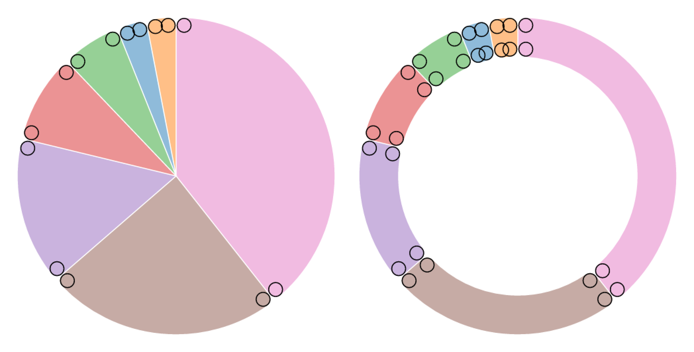
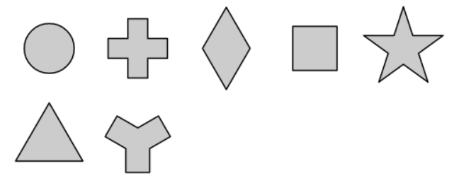

# 形状

参考：

* [Learn D3: Shapes](https://observablehq.com/@d3/learn-d3-shapes?collection=@d3/learn-d3)
* [Shapes (d3-shape)](https://github.com/d3/d3/blob/main/API.md#shapes-d3-shape)
* [d3-shape](https://github.com/d3/d3-shape)（非官方[中译版](https://github.com/xswei/d3-shape)）

本文主要介绍 ==[Shapes](https://observablehq.com/@d3/learn-d3-shapes?collection=@d3/learn-d3) 模块==。

一个完整的可视化作品是由多种**基本的图形符号**构成的，例如饼图由多个扇形 arcs 构成，折线图由多段线 lines 构成，面积图由一个或多个面积 areas 构成，而且图中还可能使用符号 symbols（如星形、三角形、圆形等）作注释等。

SVG 提供了了不同的元素构建基本的图形符号，例如 `<rect>` 元素可以绘制出矩形（或圆角矩形），`<path>` 元素可以绘制出复杂的图形。但是「手动」设置这些元素的参数以绘制出期望的形状（例如 `<path>` 元素需要设置属性 `d`，该属性值是由一系列 `M`、`L` 等命令和 `x y` 坐标点数据组成的字符串）是十分繁琐的。

在 [d3-shape](https://github.com/d3/d3-shape) 模块中包含各种基本图形生成器，可以方便地基于抽象数据生成所需的图形。

可以直接用于生成图形的生成器，一般会生成可用于 `<path>` 元素属性 `d` 的值：

* **Arcs 扇形/环形生成器**：基于内外半径和开角，绘制出扇形

* **Lines 线段生成器**：基于坐标点，直接将一系列的坐标点相连绘制出折线
* **Areas 面积生成器**：和线段生成器类似，不过它需要基于上下两条边界线，用以绘制出面积

* **Links 连线生成器**：基于两个坐标点，绘制出平滑的三次贝塞尔曲线作为两点之间的连线

* **Symbols 符号生成器**：提供了一系列常用的符号，一般用于散点图中以表示数据的类别

不可直接用于生成图形的生成器，需要配合上方的生成器使用：

* **Pie 饼图角度生成器**：返回一个关于角度的数组，然后将这些角度数据用于 Arcs 扇形/环形生成器
* **Curves 曲线插值生成器**：配合 Lines 线段生成器使用，设置坐标点之间的插值方式（D3 内置了多种方式），以绘制出更平滑的线段
* **Custom Curves 自定义曲线插值生成器**：自定义坐标点之间的插值函数，配合 Lines 线段生成器使用

* **Custom Symbol Types 自定义符号类型生成器**：通过 `symbol.type` 将自定义的图形符号设置为符号的类型
* **Stacks 堆叠生成器**：是基于数据计算出堆叠的方式，需要将这些数据传递给 Areas 面积生成器


## 扇形生成器 Arcs

扇形生成器 Arcs 用以生成一个个扇形或环形，然后将多个扇形或环形拼起来就构成了饼图或圆环图。

==使用方法 `d3.arc()` 创建一个扇形生成器（以下称为 `arc`）。==

它既是一个方法，可以直接调用，**传递**一个包含多个设置参数的**对象**作为入参（实际这些参数在内部被相应的方法调用），来创建一个扇形；它也是一个对象，具有多种方法设置不同的参数，一般通过**链式调用**的方式来使用。

:bulb: 调用扇形生成器时返回的结果，基于扇形生成器是否设置了**父容器 context** 而不同。如果扇形生成器设置了父容器（一般是选择集，如 `<g>` 元素），则生成 `<path>` 元素，并添加到父容器中；如果没有入参，则生成可用于作为 `<path>` 元素的属性 `d` 的属性值的字符串。

```js
// 创建一个默认的扇形生成器
const arc = d3.arc();

// 在调用生成器时需要传递相关的设置参数（半径和角度）
// 适用于动态生成各种形状的扇形
arc({
  innerRadius: 0,
  outerRadius: 100,
  startAngle: 0,
  endAngle: Math.PI / 2
}); // "M0,-100A100,100,0,0,1,100,0L0,0Z"
```

```js
// 创建一个扇形生成器，并设置了相应的参数
const arc = d3.arc()
    .innerRadius(0)
    .outerRadius(100)
    .startAngle(0)
    .endAngle(Math.PI / 2);

// 当扇形生成器已经设置了半径和角度，可以直接调用，生成路径
arc(); // "M0,-100A100,100,0,0,1,100,0L0,0Z"
```

:bulb: 这两种创建和调用方式可混合使用，例如需要创建一系列半径相同，但角度不同的扇形，可以创建一个扇形生成器并预设了半径，然后在调用生成器时才传递角度信息

```js
// 包含一系列扇形角度（开始和结束的角度，单位是弧度）的数组
const angleArr = [
    {
        start: 0 * 2 * Math.PI,
        end: 1/4 * 2 * Math.PI
    },
    {
        // ...
    },
    // ...
]

// 创建一个预设了半径的扇形生成器，开始角度和结束角度以参数的形式传入
arc = d3.arc()
    .innerRadius(210)
    .outerRadius(310)
    .startAngle(([startAngle, endAngle]) => startAngle)
    .endAngle(([startAngle, endAngle]) => endAngle)

const pathArr = []
angleArr.forEach(angle => {
    pathArr.push(arc([angleArr.start, angleArr.end]))
})
```

:bulb: 生成的扇形的中心坐标默认是 `(0, 0)`，可以为扇形的父容器（一般是元素 `<g>`）设置 `transform` 属性，移动到目标位置

:bulb: 在官方[样例](https://observablehq.com/collection/@d3/d3-shape)和[文档](https://github.com/d3/d3-shape)中，常常见到 $\tau$ 符号，它表示 $2\pi$

扇形生成器具有的方法，这些方法一般都返回扇形生成器本身，便于进行**链式调用**：

* `arc.centroid()` 计算扇形的「中点」，即位于弧度是 $(startAngle + endAngle) / 2$ 半径是 $(innerRadius + outerRadius) / 2$ 的点，一般将扇形的文本注释添加到此 :warning: 该点可能不在扇形/环形内部
* `arc.innerRadius([radius])` 设置内半径，入参可以是一个数值，或是返回数值的函数；如果没有入参，则返回当前的内半径。如果 `radius=0` 则生成扇形，如果 `radius` 不为零则生成环形
* `arc.outerRadius([radius])` 设置外半径

	:bulb: 如果内半径大于外半径，则 D3 会见两者调换；如果入参是负值则会被当作 $0$

* `arc.cornerRadius([radius])` 设置圆角的半径，对于扇形则设置外侧的两个角；对于环形则设置内外侧的四个角。但是圆角的半径不会大于 $(outerRadius - innerRadius)/2$ 而且当两个相邻的圆角靠得太近时，[圆角半径会减小](https://bl.ocks.org/mbostock/b7671cb38efdfa5da3af)，一般出现在环形的弧长小于 $\pi$ 的内侧圆角。

  

* `arc.startAngle([angle])` 设置扇形的一边的起始角度，作为起始角，单位是弧度。其中在 12 点方向（即 SVG 坐标系统的 -y 方向）为 $0$。如果入参的是负值表示起始角度在逆时针方向上。

* `arc.endAngle([angle])` 设置扇形的另一边的起始角度，作为结束角。

	:bulb: 如果 $|endAngle - startAngle|\ge\tau$ 则生成一个完整的圆或圆环

* `arc.padAngle([angle])` 设置扇形的间隔角度
* `arc.padRadius([radius])` 设置扇形的间隔半径

	:bulb: 间隔角度结合间隔半径算出**间隔弧长** $padAngle \times padRadius$ 对于环形的内外侧都会减去**相同的间隔弧长**，这样就会得到如下方右侧图的效果（两个环形的相邻的边是平行的）；对于扇形或内半径较小的环形和开角较小的环形，只会在外侧减去间隔弧长，这样就得到如下方左侧图的效果（扇形或环形的内侧相连到一点）。但是如果扇形或环形的开角 $|endAngle - startAngle|\ge\tau$（生成一个完整的圆或圆环）则会忽略间隔弧长

	

* `arc.context(parentDOM)` 用于设置父容器。如果扇形生成器设置了父容器（一般是选择集，如 `<g>` 元素），则生成 `<path>` 元素，并添加到父容器中；如果没有入参，则生成可用于作为 `<path>` 元素的属性 `d` 的属性值的字符串

:bulb: 关于饼图或圆环图的**角度**的数据，一般不会「手动」设置，而是通过 **Pies 饼图角度生成器**产生一系列的角度，再将数据用于扇形生成器。

### Pies 饼图角度生成器

==使用方法 `d3.pie()` 创建一个 Pie 饼图角度生成器（以下称为 `pie`）。==

调用 Pie 饼图角度生成器时，将需要可视化的数据（一个数组）作为入参

```js
const data = [1, 1, 2, 3, 5, 8, 13, 21];
const pie = d3.pie();
const pieArcData = pie(data)

// 结果
// [
//  {"data":  1, "value":  1, "index": 6, "startAngle": 6.050474740247008, "endAngle": 6.166830023713296, "padAngle": 0},
//  {"data":  1, "value":  1, "index": 7, "startAngle": 6.166830023713296, "endAngle": 6.283185307179584, "padAngle": 0},
//  {"data":  2, "value":  2, "index": 5, "startAngle": 5.817764173314431, "endAngle": 6.050474740247008, "padAngle": 0},
//  {"data":  3, "value":  3, "index": 4, "startAngle": 5.468698322915565, "endAngle": 5.817764173314431, "padAngle": 0},
//  {"data":  5, "value":  5, "index": 3, "startAngle": 4.886921905584122, "endAngle": 5.468698322915565, "padAngle": 0},
//  {"data":  8, "value":  8, "index": 2, "startAngle": 3.956079637853813, "endAngle": 4.886921905584122, "padAngle": 0},
//  {"data": 13, "value": 13, "index": 1, "startAngle": 2.443460952792061, "endAngle": 3.956079637853813, "padAngle": 0},
//  {"data": 21, "value": 21, "index": 0, "startAngle": 0.000000000000000, "endAngle": 2.443460952792061, "padAngle": 0}
// ]
```

然后返回一个数组，它的长度和入参的数组长度一致，元素的次序也一样，**其中每个元素（是一个对象）依次对应一个数据项，并包含以下属性**：

* `data` 数据项的值
* `value` 一个数值，基于该值 Pie 饼图生成器计算该数据项在扇形或环形中应占角度的大小
* `index` 数据项的索引，从 `0` 开始
* `starAngle` 该数据项在扇形或环形中所对应的起始角
* `endAngle` 该数据项在扇形或环形中所对应的结束角
* `padAngle` 扇形或环形的间隔角度

==然后这些元素就可以作为 Arc 扇形生成器（一般预设了 `innerRadius` 和 `outerRadius`，有时候还会预设父容器 `context`）的入参，然后基于每个元素的 `starAngle`、`endAngle` 和 `padAngle` 生成相应的扇形==

```js
pieArcData.forEach((d) => {
  arc(d); // arc 是扇形生成器
})
```

Pie 饼图角度生成器（以下的 `pie`）既是一个方法（可以接受数据作为入参），也是一个对象，具有多种方法设置不同的参数，一般这些方法都返回饼图角度生成器本身，便于进行**链式调用**：

* `pie.value([valueMapFunction])` 设置每个数据项传递给 Pie 饼图角度生成器的值，默认直接传递整个数据项（因为 D3 假设每一个数据项都是一个数值），即默认的 `valueMapFunction` 如下

  ```js
  function value(d) {
    return d;
  }
  ```

  `valueMapFunction` 接受（每一行）数据项的数据 `d`、索引 `i`、整个数据表 `data` 作为入参，然后可以根据这些数据进行变换，返回代表该数据项的数值，传递给 Pie 饼图角度生成器。

  ```js
  const data = [
    {"number":  4, "name": "Locke"},
    {"number":  8, "name": "Reyes"},
    {"number": 15, "name": "Ford"},
    {"number": 16, "name": "Jarrah"},
    {"number": 23, "name": "Shephard"},
    {"number": 42, "name": "Kwon"}
  ];
  
  const arcs = d3.pie()
      		  .value(d => d.number) // 只需要接受数据项作为入参，将数据项的 number 属性值，作为该数据项传递给 Pie 饼图角度生成器的值
  ```

  :bulb: `valueMapFunction` 函数最后返回的值，相当于 Pie 饼图角度生成器所返回的数组中，每个元素的 `value` 属性。而每个数据项的值，相当于 Pie 饼图角度生成器所返回的数组中，每个元素的 `data` 属性。

  这里直接将整个数据表传递给 Pie 饼图角度生成器，而不是先进行预处理，是为了在后续的绑定操作中，每个数据项的所有信息都可以绑定到相应的元素上，保留更大的拓展性。但是入参的数据表中（每一行）数据项可能有多个属性（例如以上示例中，每一个数据项都包含 `number` 和 `name` 两个属性），而不是单纯的数值，对于这种情况就需要设置 `pie.value()`，类似于 JS 数组的原始方法 `map`。

* `pie.sort([compareFunction])` 设置数据项所对应的角度的优先次序，其中排序方程 `compareFunction` 和 JS 数组的原始方法 `sort` 类似，入参是表示**两个需要对比的数据项** `a` 和 `b`，如果函数返回一个负值，则 `a` 排在在 `b` 前，则；如果函数返回一个正值，则 `a` 在 `b` 后。

  :bulb: 实际上 Pie 饼图角度生成器只是对数据项的角度进行「排序」，而不会改变数组中的元素的次序（经过排序后返回的数组的元素次序，和数据表中数据项的顺序是相同的）

  :bulb: 如果设置了 `pie.sort()` 则隐式地将 ` pie.sortValues(null)` 对比函数设置为 `null` 忽略按值排序

  ```js
  const data = [10, 50, 22, 80, 11, 30, 130];
  
  d3.pie()(data);
  // [
  //  0: Object {data: 10, index: 6, value: 10, startAngle: 6.094501063720739, endAngle: 6.283185307179585, padAngle: 0}
  //  1: Object {data: 50, index: 2, value: 50, startAngle: 3.9623691126357747, endAngle: 4.9057903299300065, padAngle: 0}
  //  2: Object {data: 22, index: 4, value: 22, startAngle: 5.471843060306545, endAngle: 5.886948395916008, padAngle: 0}
  //  3: Object {data: 80, index: 1, value: 80, startAngle: 2.4528951649650033, endAngle: 3.9623691126357747, padAngle: 0}
  //  4: Object {data: 11, index: 5, value: 11, startAngle: 5.886948395916008, endAngle: 6.094501063720739, padAngle: 0}
  //  5: Object {data: 30, index: 3, value: 30, startAngle: 4.9057903299300065, endAngle: 5.471843060306545, padAngle: 0}
  //  6: Object {data: 130, index: 0, value: 130, startAngle: 0, endAngle: 2.4528951649650033, padAngle: 0}
  // ]
  
  d3.pie().sort((a,b) => a-b )(data);
  // [
  //  0: Object {data: 10, index: 0, value: 10, startAngle: 0, endAngle: 0.18868424345884643, padAngle: 0}
  //  1: Object {data: 50, index: 4, value: 50, startAngle: 1.3773949772495788, endAngle: 2.320816194543811, padAngle: 0}
  //  2: Object {data: 22, index: 2, value: 22, startAngle: 0.3962369112635775, endAngle: 0.8113422468730396, padAngle: 0}
  //  3: Object {data: 80, index: 5, value: 80, startAngle: 2.320816194543811, endAngle: 3.8302901422145825, padAngle: 0}
  // 4: Object {data: 11, index: 1, value: 11, startAngle: 0.18868424345884643, endAngle: 0.3962369112635775, padAngle: 0}
  //  5: Object {data: 30, index: 3, value: 30, startAngle: 0.8113422468730396, endAngle: 1.3773949772495788, padAngle: 0}
  //  6: Object {data: 130, index: 6, value: 130, startAngle: 3.8302901422145825, endAngle: 6.283185307179586, padAngle: 0}
  // ]
  ```

* `pie.sortValues([compareFunction])` 设置数据项所对应的角度的优先次序，其中排序方程 `compareFunction` 的入参是表示**两个需要对比的数据项所传递给 Pie 饼图角度生成器的值** `valueA` 和 `valueB`

  :bulb: 如果设置了 `pie.sortValues()` 则隐式地将 ` pie.sort(null)` 对比函数设置为 `null` 忽略按数据项排序

* `pie.startAngle([angle])` 设置 Pie 饼图角度生成器的起始角度（默认值是 `0`），它会被调用一次，用于设置第一个扇区的开始角度

  :bulb: 入参 `angle` 虽然可以是任意单位，但是如果打算将 Pie 饼图角度生成器的结果应用于 Arc 扇形生成器中，应该使用弧度作为单位，例如 `angle=Math.PI/2`

* `pie.endAngle([angle])` 置 Pie 饼图角度生成器的起始角度（默认值是 `2*Math.PI`），它会被调用一次，用于设置最后一个扇区的结束角度

* `pie.padAngle([angle])` 设置相邻扇形之间的间隔角度，则在生成扇形时会预留出相应的角度空间（间隔角度与数据项的数量的乘积，最大值是 `|endAngle-startAngle|`）用于间隔，余下的角度空间再按比例分配给各个数据项。

## 线段生成器 Lines

线段生成器 Lines 基于给定的坐标点生成线段（或曲线），常用于构成一些可视化图形，如折线图 line chart 或分层的边缘捆绑图 hierarchical edge bundling。

==使用方法 `d3.line([xFunc], [yFunc])` 创建一个线段生成器（以下称为 `line`）。==

它既是一个方法，可以直接调用，**传递**需要可视化的数据（一个数组）作为入参（实际这些参数在内部被相应的方法调用，例如在创建线段生成器时，传递横坐标和纵坐标的读取函数 `xFunc` 和 `yFunc` 作为入参，然后数组每一个元素都会调用这两个函数，来获取相应的坐标值），来创建线段。

```js
// 创建一个默认的线段生成器
const line = d3.line();

line([[10, 60], [40, 90]]); // "M10,60L40,90"

// 创建一个线段生成器，并设置了相应的参数
cosnt line = d3.line(
    (d)=> d.xValue,
    (d)=> d.yValue
);

const lineData = line([
  {
    xValue: 10, 
    yValue: 60
  },
  {
    xValue: 40, 
    yValue: 90
  },
]); // "M10,60L40,90"
```

:bulb: 调用线段生成器时返回的结果，同样会基于生成器是否设置了**父容器 context** 而不同。如果设置了父容器，则生成 `<path>` 元素，并添加到父容器中；如果没有则生成字符串。

:bulb: 如果数据点较多，在绘制折线图时，可以将元素 `<path>` **属性 `stroke-miterlimit` 设置为 `1`**，以避免折线「锋利」交接处过渡延伸，导致该点的数据偏移

它也是一个对象，具有多种方法设置不同的参数，一般通过**链式调用**的方式来使用。例如使用默认参数创建一个线段生成器 `const line = d3.line()`，然后在之后再调用相应的方法进行设置：

* `line.x(xFunc)` 设置横坐标读取函数，该函数会在调用线段生成器时，**为数组中的每一个元素都执行一次**，以返回该数据所对应的横坐标。

  该函数有三个入参（线段生成器的其他方法的入参函数一般都是有这三个入参）：当前的元素 `d`，该元素在数组中的索引 `i`，整个数组 `data`。通过这些入参数据，一般利用**比例尺**进行映射，返回相应的横坐标的值。

  D3 默认在使用线段生成器时，传递进来的数组的格式如 `[[10, 60], [40, 90]]`，即每个元素都是由两个数值构成的数组，因此它的默认横坐标读取函数如下

  ```js
  function x(d) {
    return d[0];
  }
  ```

  :bulb: 如果数组中的元素并不是上述的默认结构，而是其他更复杂的结构，或者数据并不是坐标值，都需要配置 `linx.x(xFunc)` 横坐标读取函数

* `line.y(xFunc)` 设置纵坐标读取函数，设置方式和横坐标读取函数一样。

* `line.defined(definedState)` 设置数据完整性检验函数，该函数会在调用线段生成器时，**为数组中的每一个元素都执行一次**，返回布尔值，以判断该元素的数据是否完整。

  该函数也是有三个入参，当函数返回 `true` 时，线段线段生成器就会执行下一步（调用坐标读取函数），最后生成该元素相应的坐标数据；当函数返回 `false` 时，该元素就会就会跳过，当前线段就会截至，并在下一个有定义的元素再开始绘制，反映在图上就是一段段[分离的线段](http://bl.ocks.org/mbostock/0533f44f2cfabecc5e3a)。

  :bulb: 如果两侧的元素完整性欠缺，导致产生「孤立」的点，一般这些点在页面上不会显示出来，除非元素 `<path>` 的属性 `stroke-linecap` 路径两端的形状设置为 `round` 或 `square`（默认值是 `butt`）

* `line.curve(curveInterpolator)` 设置两点之间的曲线插值器
* `line.context(parentDOM)` 用于设置父容器。在使用线段生成器时，如果设置了父容器，就会生成 `<path>` 元素，并添加到父容器中；如果没有设置父容器，则生成可用于作为 `<path>` 元素的属性 `d` 的属性值的字符串

### 径向线段生成器

径向线段生成器和上述的线段生成器类似，也是用来生成线段或曲线，不同的是它的笛卡尔坐标系的横坐标换成角度（弧度为单位），纵坐标换成距离圆心的长度。

==使用方法 `d3.lineRadial()` 创建一个线段生成器（以下称为 `lineRadial`）。==

:bulb: 调用径向线段生成器时，它生成的线段的中心坐标默认是 `(0, 0)`，可以为其父容器（一般是元素 `<g>`）设置 `transform` 属性，移动到目标位置

它也具有多种方法设置不同的参数：

* `lineRadial.angle(angleFunc)` 类似于 `line.x(xFunc)`，设置角度读取函数，返回的角度单位是弧度。

* `lineRadial.radius(radiusFunc)` 类似于 `line.y(xFunc)`，设置径向距离读取函数
* `lineRadial.defined(definedState)`
* `lineRadial.curve(curveInterpolator)` 其中 [curveMonotoneX](https://github.com/d3/d3-shape#curveMonotoneX) 和 [curveMonotoneY](https://github.com/d3/d3-shape#curveMonotoneY) 单调性曲线插值器不适用
* `lineRadial.context(parentDOM)`


## 面积生成器 Areas

面积生成器 Areas 和线段生成器类似，也是基于给定的坐标点生成线段（或曲线），不同的是它生成**两条边界线**：

* 上边界线 topline `y1`
* 下边界线 baseline `y0` 一般下边界线设置为常量 `y0=0`

一般两条线段的横坐标相同 `x0=x1`，而纵坐标不同，两条边界线之间区域就是目标面积

==使用方法 `d3.area([xFunc], [y0Func], [y1Func])` 创建一个面积生成器（以下称为 `area`）。==

它既是一个方法，可以直接调用，**传递**需要可视化的数据（一个数组）作为入参（实际这些参数在内部被相应的方法调用，例如在创建面积生成器时，传递横坐标读取函数 `xFunc` 和上边界线和下边界线纵坐标的读取函数 `y0Func` 和 `y1Func` 作为入参；然后在调用面积生成器时，数组每一个元素都会调用这三个函数，来获取相应的坐标值），来创建面积。

它也是一个对象，具有多种方法设置不同的参数，一般通过**链式调用**的方式来使用：

* `area.x(xFunc)` 和 `area.x0(xFunc)` 一样，用于设置下边界线横坐标读取函数

* `area.x0(xFunc)` 设置下边界线横坐标读取函数，该函数会在调用线段生成器时，**为数组中的每一个元素都执行一次**，以返回该数据所对应的横坐标。

  该函数也是有三个入参（面积生成器的其他方法的入参函数一般都是有这三个入参）：当前的元素 `d`，该元素在数组中的索引 `i`，整个数组 `data`。通过这些入参数据，一般利用**比例尺**进行映射，返回相应的横坐标的值。

  D3 默认在使用线段生成器时，传递进来的数组的格式如 `[[10, 60], [40, 90]]`，即每个元素都是**由两个数值**构成的数组，因此它的默认横坐标读取函数如下

    ```js
    function x(d) {
      return d[0];
    }
    ```

	:bulb: 如果数组中的元素并不是上述的默认结构，而是其他更复杂的结构，或者数据并不是坐标值，都需要配置横坐标读取函数
	
* `area.x1(xFunc)` 设置上边界线横坐标读取函数。默认复用相应的 `x0` 值作为 `x1` 的值，一般都不需要进行配置。

* `area.y(yFunc)` 和 `area.y0(yFunc)` 一样，用于设置下边界线纵坐标读取函数

* `area.y0(yFunc)` 设置下边界线纵坐标读取函数，它的默认值是 `0`，即页面上默认的下边界线是横坐标，这也是常见的面积图设定，可以不进行设置而使用默认值；但如果下边界线也是折线，则需要配置下边界线纵坐标读取函数

  ```js
  function y() {
    return 0;
  }
  ```

* `area.y1(yFunc)` 设置上边界线纵坐标读取函数，

  D3 默认在使用线段生成器时，传递进来的数组的格式如 `[[10, 60], [40, 90]]`，即每个元素都是**由两个数值**构成的数组，下边界线纵坐标读取函数的默认纵坐标读取函数如下

    ```js
  function x(d) {
    return d[1];
  }
    ```

* `area.defined(definedState)` 设置数据完整性检验函数，其作用和线段生成器的相应方法一样，如果存在不完整的数据，也是会生成[分离的多块面积](https://bl.ocks.org/mbostock/3035090)。

* `area.curve(curveInterpolator)` 设置两点之间的曲线插值器

* `area.context(parentDOM)` 用于设置父容器

* `area.lineX0()` 和 `area.lineY0()` 都是返回下边界线生成器，一般用于在页面生成面积的下边界线，进行强调显示

* `area.lineX1()` 返回上边界线的生成器

* `area.lineY1()` 返回一个线段生成器，它的横坐标读取函数返回的是 `x0`，而纵坐标读取函数返回的是 `y1`

### 径向面积生成器

径向面积生成器和上述的面积生成器类似，不同的是它的笛卡尔坐标系的横坐标换成角度（弧度为单位），纵坐标换成距离圆心的长度，上边界线对应于外径 outerRadius，下边界线对应于内径 innerRadius。

==使用方法 `d3.areaRadial()` 创建一个线段生成器（以下称为 `areaRadial`）。==

:bulb: 调用径向面积生成器时，它生成的线段的中心坐标默认是 `(0, 0)`，可以为其父容器（一般是元素 `<g>`）设置 `transform` 属性，移动到目标位置

它也具有多种方法设置不同的参数：

* `areaRadial.angle(angleFunc)` 类似于 `area.x(xFunc)`，设置角度读取函数，返回的角度单位是弧度。

  :bulb: 也有分别设置内径角度读取函数  `areaRadial.startAngle(angleFunc)` 和外径角度读取函数 `areaRadial.endAngle(angleFunc)` 的方法，**不过一般都不需要分开设置**。

* `areaRadial.radius(radiusFunc)` 类似于 `area.y(xFunc)`，设置内径距离读取函数

  :bulb: 相应地有分别设置内径距离读取函数 `areaRadial.innerRadius(radiusFunc)` 和外径距离读取函数 `areaRadial.outerRadius(radiusFunc)`

* `areaRadial.defined(definedState)`

* `areaRadial.curve(curveInterpolator)` 其中 [curveMonotoneX](https://github.com/d3/d3-shape#curveMonotoneX) 和 [curveMonotoneY](https://github.com/d3/d3-shape#curveMonotoneY) 单调性曲线插值器不适用

* `areaRadial.context(parentDOM)`

* `areaRadial.lineStartAngle()` 和 `areaRadial.lineInnerRadius()` 返回内径线段生成器

* `areaRadial.lineEndAngle()` 返回外径线段生成器

* `areaRadial.lineOuterRadius()` 返回一个线段生成器，它的角度读取函数返回的是内径角度 startAngle，径向距离读取函数返回的是外径距离 outerRadius


## 曲线插值生成器 Curves

**曲线插值生成器并不能直接生成形状，而是定义了两个离散点之间的连线如何生成**，D3 提供了多种不同的[曲线插值生成器](https://github.com/d3/d3-shape#curves)，对应于不同的连线方式，它们的作用一般都是基于离散的数据点模拟出顺滑的曲线。

**它要与线段生成器或面积生成器配合使用**，一般是作为线段生成器的方法 `line.curve()` 或面积生成器的方法 `area.curve()` 的入参。

```js
const line = d3.line(d => d.date, d => d.value)
    .curve(d3.curveCatmullRom.alpha(0.5));
```

:bulb: 默认使用 `d3.curveLinear` 曲线插值生成器，即两个相邻的离散点之间以直连的方式生成线段。

D3 提供了多种不同的曲线插值生成器，它们可进行的参数配置也不同，具体的效果可以参考[官方文档](https://github.com/d3/d3-shape#curves)：

* `d3.curveBasis(context)`

* `d3.curveBasisClosed(context)`

* `d3.curveBasisOpen(context)`

* `d3.curveBasisOpen(context)`

* `d3.curveBumpX(context)`

* `d3.curveBumpY(context)`

* `d3.curveBundle(context)` 常用于分层的边缘捆绑图 hierarchical edge bundling，只与线段生成器配合使用。该曲线插值生成器 `bundle` 可以设置 `beta` 系数 `bundle.beta(bataValue)`，默认值是 `0.85`

* `d3.curveCardinal(context)`

* `d3.curveCardinalClosed(context)`

* `d3.curveCardinalOpen(context)`

  以上三种曲线插值生成器 `cardinal` 可以设置张力 `tension` 系数 `cardinal.tension(tensionValue)`，范围是 `[1, 0]`

* `d3.curveCatmullRom(context)`

* `d3.curveCatmullRomClosed(context)`

* `d3.curveCatmullRomOpen(context)` 

  以上三种曲线插值生成器 `catmullRom` 可以设置 `alpha` 系数 `catmullRom.alpha(alpha)`，范围是 `[1, 0]`

* `d3.curveLinear(context)`

* `d3.curveLinearClosed(context)`

* `d3.curveMonotoneX(context)`

* `d3.curveMonotoneY(context)`

* `d3.curveNatural(context)`

* `d3.curveStep(context)`

* `d3.curveStepAfter(context)`

* `d3.curveStepBefore(context)`

:bulb: 可以使用 D3 提供的相关接口，[自定义曲线插值生成器](https://github.com/d3/d3-shape#custom-curves)。


## 连线生成器 Links

连线生成器 Links 基于两个坐标点，绘制出平滑的三次贝塞尔曲线作为两点之间（从起源点 source point 到目标点 target point）的连线，一般用于树形图 tree diagram 中。

所绘制的连线在起点和终点的处的**切线可以有三种形式**，分别通过三种不同的方法创建三种不同的连线生成器（以下称为 `link`），适用于不同方向的树形图中

* ==使用方法 `d3.linkVertical()` 创建（生成垂直切线的）连线生成器（以下称为 `linkVertical`）==，一般用于父节点和子节点是上下相对位置的树形图中
* ==使用方法 `d3.linkHorizontal()` 创建（生成[水平切线](https://observablehq.com/@d3/tree)的）连线生成器（以下称为 `linkHorizontal`）==，一般用于父节点和子节点是水平左右相对位置的树形图中
* ==使用方法 `d3.linkRadial()` 创建（生成[径向切线](https://observablehq.com/@d3/radial-tidy-tree)的）连线生成器（以下称为 `linkRadial`）==，一般用于根节点在内部，后代节点在外部的环形树形图中

它既是一个方法，可以直接调用，**传递**需要可视化的数据，连线生成器会根据数据构建出连线。一般是以一个对象作为入参，它最基本的形式是包含 `source` 和 `target` 这两个属性，分别表示连线的起点和终点，这两个属性的属性值最基本的形式就是一个数组，分别表示起点或终点的 `x` 和 `y` 值

```js
// D3 默认支持的连线生成器入参数据形式
link({
  source: [100, 100],
  target: [300, 300]
});
```

:bulb: 调用连线生成器时返回的结果，也会基于生成器是否设置了**父容器 context** 而不同。如果设置了父容器，则生成 `<path>` 元素，并添加到父容器中；如果没有设置父容器，则生成字符串。

它也是一个对象，具有多种方法设置不同的参数，一般通过**链式调用**的方式来使用：

对于 `linkVertical` 和 `linkHorizontal` 连线生成器有以下方法

* `link.source(sourceFunc)` 设置起始点读取函数。该函数的入参是调用连线生成器时传递的数据 `d`，D3 默认该数据是一个对象，且具有 `source` 属性表示起始点，因此默认读取函数如下

  ```js
  function source(d) {
    return d.source;
  }
  ```

  :bulb: 如果入参的数据形式和 D3 的默认形式不同，需要手动设置起始点读取函数，返回起始点

* `link.target(targetFunc)` 设置起始点读取函数。默认读取函数如下

  ```js
  function target(d) {
    return d.target;
  }
  ```

* `link.x(xFunc)` 设置横坐标读取函数。D3 默认起点和终点都是一个含有两个元素的数组，第一个元素表示这些点的横坐标，第二个元素表示这些点的纵坐标，因此默认读取函数如下

  ```js
  function x(d) {
    return d[0];
  }
  ```

  :bulb: 如果入参的数据形式和 D3 的默认形式不同，需要手动设置点读取函数，返回横坐标

* `link.y(yFunc)` 设置纵坐标读取函数。默认读取函数如下

  ```js
  function y(d) {
    return d[1];
  }
  ```

* `link.context(parentDOM)` 用于设置父容器

对于 `linkRadial` 连线生成器有类似的方法，不过它的横坐标变成角度（单位是弧度），纵坐标变成了径向距离

* `linkRadial.angle(angleFunc)` 类似于 `link.x(xFunc)`，设置角度读取函数，返回的角度单位是弧度

* `linkRadial.radius(radiusFunc)` 类似于 `link.y(yFunc)`，设置径向距离读取函数

  :bulb: 调用径向连线生成器时，它生成的连线的中心坐标默认是 `(0, 0)`，可以为其父容器（一般是元素 `<g>`）设置 `transform` 属性，移动到目标位置

:bulb: 如果希望从抽象的数据开始以构建树形图，可以使用 [d3-hierarchy](https://github.com/d3/d3-hierarchy) 模块。该模块基于抽象的数据和页面大小自动计算布局，即将抽象的数据映射到页面的可视化图形元素，生成各连线的起点 `source` 和终点 `target` 坐标数据。再将这些数据分别传递给相应的连线生成器即可分别生成连线。


## 符号生成器 Symbols

符号生成器 Symbols 提供了一系列常用的符号，一般在散点图中表示数据点，以区分不同的数据类别。



D3 内置了 7 种符号：

* `d3.symbolCircle` 圆形
* `d3.symbolCross` 十字形
* `d3.symbolDiamond` 菱形
* `d3.symbolSquare` 正方形
* `d3.symbolStar` 星形
* `d3.symbolTriangle`（向上的）三角形
* `d3.symbolWye` Y 形

:bulb: 可以通过 `d3.symbols` 获取**具有这 7 种内置符号类型的数组**，可用于创建排序比例尺 Ordinal Scales。

==使用方法 `d3.symbol([type][, size])` 创建符号生成器（以下称为 `symbol`）==

创建符号生成器时，第一个（可选）参数设置符号的类型，可以是 7 种内置符号类型之一，也可以是自定义的符号类型；第二个（可选）参数设置符号的尺寸（单位是像素）；如果没有入参，则调用符号生成器时就会默认创建宽和高都为 64 px 的圆形符号。

它既是一个方法，可以直接调用，生成相应的符号。

它也是一个对象，具有多种方法设置不同的参数，一般通过**链式调用**的方式来使用：

* `symbol.type([type])` 设置符号类型，可以是 7 种内置符号类型之一，也可以是自定义的符号类型。默认值是圆形，其入参是函数如下：

  ```js
  function type() {
    return circle;
  }
  ```

* `symbol.size([size])` 设置符号的尺寸（宽和高都一样），单位是像素，这对于同时希望使用符号类型和符号大小两个视觉通道变量来编码数据是十分有用的。默认值是如下

  ```js
  function size() {
    return 64;
  }
  ```

* `symbol.context(parentDOM)` 设置父容器。在使用符号生成器时，如果设置了父容器，就会生成 `<path>` 元素，并添加到父容器中；如果没有设置父容器，则生成可用于作为 `<path>` 元素的属性 `d` 的属性值的字符串

:bulb: 可以使用 D3 提供的相关接口，[自定义符号类型](https://github.com/d3/d3-shape#custom-symbol-types)。它是一个具有方法 `draw` 的对象，而该方法接收两个入参 `context` 和 `size`，其中 `context` 是一个可以调用 canvas API 中与 [path 相关方法](https://developer.mozilla.org/en-US/docs/Web/API/CanvasRenderingContext2D#paths)的对象；而 `size` 则用于设置符号的大小。可以参考 7 种 D3 内置符号的[源码](https://github.com/d3/d3-shape/tree/main/src/symbol)来了解如何创建符号类型。
