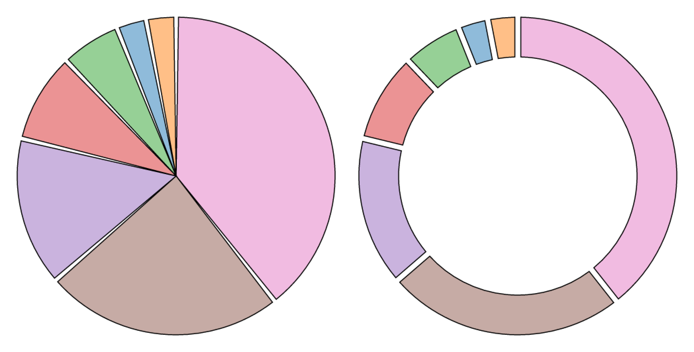

# 形状

参考：

* [Learn D3: Shapes](https://observablehq.com/@d3/learn-d3-shapes?collection=@d3/learn-d3)
* [Shapes (d3-shape)](https://github.com/d3/d3/blob/main/API.md#shapes-d3-shape)
* [d3-shape](https://github.com/d3/d3-shape)（非官方[中译版](https://github.com/xswei/d3-shape)）

本文主要介绍 ==[Shapes](https://observablehq.com/@d3/learn-d3-shapes?collection=@d3/learn-d3) 模块==。

一个完整的可视化作品是由多种**基本的图形符号**构成的，例如饼图由多个扇形 arcs 构成，折线图由多段线 lines 构成，面积图由一个或多个面积 areas 构成，而且图中还可能使用符号 symbols（如星形、三角形、圆形等）作注释等。

SVG 提供了了不同的元素构建基本的图形符号，例如 `<rect>` 元素可以绘制出矩形（或圆角矩形），`<path>` 元素可以绘制出复杂的图形。但是「手动」设置这些元素的参数以绘制出期望的形状（例如 `<path>` 元素需要设置属性 `d`，该属性值是由一系列 `M`、`L` 等命令和 `x y` 坐标点数据组成的字符串）是十分繁琐的。

在 [d3-shape](https://github.com/d3/d3-shape) 模块中包含各种基本图形生成器，可以方便地基于抽象数据生成所需的图形。

可以直接用于生成图形的生成器，一般会生成可用于 `<path>` 元素属性 `d` 的值：

* **Arcs 扇形/环形生成器**：基于内外半径和开角，绘制出扇形

* **Lines 线段生成器**：基于坐标点，直接将一系列的坐标点相连绘制出折线
* **Areas 面积生成器**：和线段生成器类似，不过它需要基于上下两条边界线，用以绘制出面积

* **Links 连线生成器**：基于两个坐标点，绘制出平滑的三次贝塞尔曲线作为两点之间的连线

* **Symbols 符号生成器**：提供了一系列常用的符号，一般用于散点图中以表示数据的类别

不可直接用于生成图形的生成器，需要配合上方的生成器使用：

* **Pie 饼图角度生成器**：返回一个关于角度的数组，然后将这些角度数据用于 Arcs 扇形/环形生成器
* **Curves 曲线生成器**：配合 Lines 线段生成器使用，设置坐标点之间的插值方式（D3 内置了多种方式），以绘制出更平滑的线段
* **Custom Curves 自定义曲线生成器**：自定义坐标点之间的插值函数，配合 Lines 线段生成器使用

* **Custom Symbol Types 自定义符号类型生成器**：通过 `symbol.type` 将自定义的图形符号设置为符号的类型
* **Stacks 堆叠生成器**：是基于数据计算出堆叠的方式，需要将这些数据传递给 Areas 面积生成器


## 扇形生成器 Arcs

扇形生成器 Arcs 用以生成一个个扇形或环形，然后将多个扇形或环形拼起来就构成了饼图或圆环图。

==使用方法 `d3.arc()` 创建一个扇形生成器。==

它既是一个方法，可以直接调用，**传递**一个包含多个设置参数的**对象**作为入参（实际这些参数在内部被相应的方法调用），来创建一个扇形；它也是一个对象，具有多种方法设置不同的参数，一般通过**链式调用**的方式来使用。

:bulb: 调用扇形生成器时返回的结果，基于扇形生成器是否设置了**父容器 context** 而不同。如果扇形生成器设置了父容器（一般是选择集，如 `<g>` 元素），则生成 `<path>` 元素，并添加到父容器中；如果没有入参，则生成可用于作为 `<path>` 元素的属性 `d` 的属性值的字符串。

```js
// 创建一个默认的扇形生成器
const arc = d3.arc();

// 在调用生成器时需要传递相关的设置参数（半径和角度）
// 适用于动态生成各种形状的扇形
arc({
  innerRadius: 0,
  outerRadius: 100,
  startAngle: 0,
  endAngle: Math.PI / 2
}); // "M0,-100A100,100,0,0,1,100,0L0,0Z"
```

```js
// 创建一个扇形生成器，并设置了相应的参数
const arc = d3.arc()
    .innerRadius(0)
    .outerRadius(100)
    .startAngle(0)
    .endAngle(Math.PI / 2);

// 当扇形生成器已经设置了半径和角度，可以直接调用，生成路径
arc(); // "M0,-100A100,100,0,0,1,100,0L0,0Z"
```

:bulb: 这两种创建和调用方式可混合使用，例如需要创建一系列半径相同，但角度不同的扇形，可以创建一个扇形生成器并预设了半径，然后在调用生成器时才传递角度信息

```js
// 包含一系列扇形角度（开始和结束的角度，单位是弧度）的数组
const angleArr = [
    {
        start: 0 * 2 * Math.PI,
        end: 1/4 * 2 * Math.PI
    },
    {
        // ...
    },
    // ...
]

// 创建一个预设了半径的扇形生成器，开始角度和结束角度以参数的形式传入
arc = d3.arc()
    .innerRadius(210)
    .outerRadius(310)
    .startAngle(([startAngle, endAngle]) => startAngle)
    .endAngle(([startAngle, endAngle]) => endAngle)

const pathArr = []
angleArr.forEach(angle => {
    pathArr.push(arc([angleArr.start, angleArr.end]))
})
```

:bulb: 生成的扇形的中心坐标默认是 `(0, 0)`，可以为扇形的父容器（一般是元素 `<g>`）设置 `transform` 属性，移动到目标位置

:bulb: 在官方[样例](https://observablehq.com/collection/@d3/d3-shape)和[文档](https://github.com/d3/d3-shape)中，常常见到 $\tau$ 符号，它表示 $2\pi$

扇形生成器（以下的 `arc`）具有的方法，这些方法一般都返回扇形生成器本身，便于进行**链式调用**：

* `arc.centroid()` 计算扇形的「中点」，即位于弧度是 $(startAngle + endAngle) / 2$ 半径是 $(innerRadius + outerRadius) / 2$ 的点，一般将扇形的文本注释添加到此 :warning: 该点可能不在扇形/环形内部
* `arc.innerRadius([radius])` 设置内半径，入参可以是一个数值，或是返回数值的函数；如果没有入参，则返回当前的内半径。如果 `radius=0` 则生成扇形，如果 `radius` 不为零则生成环形
* `arc.outerRadius([radius])` 设置外半径

	:bulb: 如果内半径大于外半径，则 D3 会见两者调换；如果入参是负值则会被当作 $0$

* `arc.cornerRadius([radius])` 设置圆角的半径，对于扇形则设置外侧的两个角；对于环形则设置内外侧的四个角。但是圆角的半径不会大于 $(outerRadius - innerRadius)/2$ 而且当两个相邻的圆角靠得太近时，[圆角半径会减小](https://bl.ocks.org/mbostock/b7671cb38efdfa5da3af)，一般出现在环形的弧长小于 $\pi$ 的内侧圆角。

  

* `arc.startAngle([angle])` 设置扇形的一边的起始角度，作为起始角，单位是弧度。其中在 12 点方向（即 SVG 坐标系统的 -y 方向）为 $0$。如果入参的是负值表示起始角度在逆时针方向上。

* `arc.endAngle([angle])` 设置扇形的另一边的起始角度，作为结束角。

	:bulb: 如果 $|endAngle - startAngle|\ge\tau$ 则生成一个完整的圆或圆环

* `arc.padAngle([angle])` 设置扇形的间隔角度
* `arc.padRadius([radius])` 设置扇形的间隔半径

	:bulb: 间隔角度结合间隔半径算出**间隔弧长** $padAngle \times padRadius$ 对于环形的内外侧都会减去**相同的间隔弧长**，这样就会得到如下方右侧图的效果（两个环形的相邻的边是平行的）；对于扇形或内半径较小的环形和开角较小的环形，只会在外侧减去间隔弧长，这样就得到如下方左侧图的效果（扇形或环形的内侧相连到一点）。但是如果扇形或环形的开角 $|endAngle - startAngle|\ge\tau$（生成一个完整的圆或圆环）则会忽略间隔弧长

	

* `arc.context([context])` 用于设置父容器。如果扇形生成器设置了父容器（一般是选择集，如 `<g>` 元素），则生成 `<path>` 元素，并添加到父容器中；如果没有入参，则生成可用于作为 `<path>` 元素的属性 `d` 的属性值的字符串

:bulb: 关于饼图或圆环图的**角度**的数据，一般不会「手动」设置，而是通过 **Pies 饼图角度生成器**产生一系列的角度，再将数据用于扇形生成器。

==使用方法 `d3.pie()` 创建一个 Pie 饼图角度生成器。==

调用 Pie 饼图角度生成器（以下的 `pie`）时，将需要可视化的数据（一个数组）作为入参

```js
const data = [1, 1, 2, 3, 5, 8, 13, 21];
const pie = d3.pie();
const pieArcData = pie(data)

// 结果
// [
//  {"data":  1, "value":  1, "index": 6, "startAngle": 6.050474740247008, "endAngle": 6.166830023713296, "padAngle": 0},
//  {"data":  1, "value":  1, "index": 7, "startAngle": 6.166830023713296, "endAngle": 6.283185307179584, "padAngle": 0},
//  {"data":  2, "value":  2, "index": 5, "startAngle": 5.817764173314431, "endAngle": 6.050474740247008, "padAngle": 0},
//  {"data":  3, "value":  3, "index": 4, "startAngle": 5.468698322915565, "endAngle": 5.817764173314431, "padAngle": 0},
//  {"data":  5, "value":  5, "index": 3, "startAngle": 4.886921905584122, "endAngle": 5.468698322915565, "padAngle": 0},
//  {"data":  8, "value":  8, "index": 2, "startAngle": 3.956079637853813, "endAngle": 4.886921905584122, "padAngle": 0},
//  {"data": 13, "value": 13, "index": 1, "startAngle": 2.443460952792061, "endAngle": 3.956079637853813, "padAngle": 0},
//  {"data": 21, "value": 21, "index": 0, "startAngle": 0.000000000000000, "endAngle": 2.443460952792061, "padAngle": 0}
// ]
```

然后返回一个数组，它的长度和入参的数组长度一致，元素的次序也一样，**其中每个元素（是一个对象）依次对应一个数据项，并包含以下属性**：

* `data` 数据项的值
* `value` 一个数值，基于该值 Pie 饼图生成器计算该数据项在扇形或环形中应占角度的大小
* `index` 数据项的索引，从 `0` 开始
* `starAngle` 该数据项在扇形或环形中所对应的起始角
* `endAngle` 该数据项在扇形或环形中所对应的结束角
* `padAngle` 扇形或环形的间隔角度

==然后这些元素就可以作为 Arc 扇形生成器（一般预设了 `innerRadius` 和 `outerRadius`，有时候还会预设父容器 `context`）的入参，然后基于每个元素的 `starAngle`、`endAngle` 和 `padAngle` 生成相应的扇形==

```js
pieArcData.forEach((d) => {
  arc(d); // arc 是扇形生成器
})
```

Pie 饼图角度生成器（以下的 `pie`）既是一个方法（可以接受数据作为入参），也是一个对象，具有多种方法设置不同的参数，一般这些方法都返回饼图角度生成器本身，便于进行**链式调用**：

* `pie.value([valueMapFunction])` 设置每个数据项传递给 Pie 饼图角度生成器的值，默认直接传递整个数据项（因为 D3 假设每一个数据项都是一个数值），即默认的 `valueMapFunction` 如下

  ```js
  function value(d) {
    return d;
  }
  ```

  `valueMapFunction` 接受（每一行）数据项的数据 `d`、索引 `i`、整个数据表 `data` 作为入参，然后可以根据这些数据进行变换，返回代表该数据项的数值，传递给 Pie 饼图角度生成器。

  ```js
  const data = [
    {"number":  4, "name": "Locke"},
    {"number":  8, "name": "Reyes"},
    {"number": 15, "name": "Ford"},
    {"number": 16, "name": "Jarrah"},
    {"number": 23, "name": "Shephard"},
    {"number": 42, "name": "Kwon"}
  ];
  
  const arcs = d3.pie()
      		  .value(d => d.number) // 只需要接受数据项作为入参，将数据项的 number 属性值，作为该数据项传递给 Pie 饼图角度生成器的值
  ```

  :bulb: `valueMapFunction` 函数最后返回的值，相当于 Pie 饼图角度生成器所返回的数组中，每个元素的 `value` 属性。而每个数据项的值，相当于 Pie 饼图角度生成器所返回的数组中，每个元素的 `data` 属性。

  这里直接将整个数据表传递给 Pie 饼图角度生成器，而不是先进行预处理，是为了在后续的绑定操作中，每个数据项的所有信息都可以绑定到相应的元素上，保留更大的拓展性。但是入参的数据表中（每一行）数据项可能有多个属性（例如以上示例中，每一个数据项都包含 `number` 和 `name` 两个属性），而不是单纯的数值，对于这种情况就需要设置 `pie.value()`，类似于 JS 数组的原始方法 `map`。

* `pie.sort([compareFunction])` 设置数据项所对应的角度的优先次序，其中排序方程 `compareFunction` 和 JS 数组的原始方法 `sort` 类似，入参是表示**两个需要对比的数据项** `a` 和 `b`，如果函数返回一个负值，则 `a` 排在在 `b` 前，则；如果函数返回一个正值，则 `a` 在 `b` 后。

  :bulb: 实际上 Pie 饼图角度生成器只是对数据项的角度进行「排序」，而不会改变数组中的元素的次序（经过排序后返回的数组的元素次序，和数据表中数据项的顺序是相同的）

  :bulb: 如果设置了 `pie.sort()` 则隐式地将 ` pie.sortValues(null)` 对比函数设置为 `null` 忽略按值排序

  ```js
  const data = [10, 50, 22, 80, 11, 30, 130];
  
  d3.pie()(data);
  // [
  //  0: Object {data: 10, index: 6, value: 10, startAngle: 6.094501063720739, endAngle: 6.283185307179585, padAngle: 0}
  //  1: Object {data: 50, index: 2, value: 50, startAngle: 3.9623691126357747, endAngle: 4.9057903299300065, padAngle: 0}
  //  2: Object {data: 22, index: 4, value: 22, startAngle: 5.471843060306545, endAngle: 5.886948395916008, padAngle: 0}
  //  3: Object {data: 80, index: 1, value: 80, startAngle: 2.4528951649650033, endAngle: 3.9623691126357747, padAngle: 0}
  //  4: Object {data: 11, index: 5, value: 11, startAngle: 5.886948395916008, endAngle: 6.094501063720739, padAngle: 0}
  //  5: Object {data: 30, index: 3, value: 30, startAngle: 4.9057903299300065, endAngle: 5.471843060306545, padAngle: 0}
  //  6: Object {data: 130, index: 0, value: 130, startAngle: 0, endAngle: 2.4528951649650033, padAngle: 0}
  // ]
  
  d3.pie().sort((a,b) => a-b )(data);
  // [
  //  0: Object {data: 10, index: 0, value: 10, startAngle: 0, endAngle: 0.18868424345884643, padAngle: 0}
  //  1: Object {data: 50, index: 4, value: 50, startAngle: 1.3773949772495788, endAngle: 2.320816194543811, padAngle: 0}
  //  2: Object {data: 22, index: 2, value: 22, startAngle: 0.3962369112635775, endAngle: 0.8113422468730396, padAngle: 0}
  //  3: Object {data: 80, index: 5, value: 80, startAngle: 2.320816194543811, endAngle: 3.8302901422145825, padAngle: 0}
  // 4: Object {data: 11, index: 1, value: 11, startAngle: 0.18868424345884643, endAngle: 0.3962369112635775, padAngle: 0}
  //  5: Object {data: 30, index: 3, value: 30, startAngle: 0.8113422468730396, endAngle: 1.3773949772495788, padAngle: 0}
  //  6: Object {data: 130, index: 6, value: 130, startAngle: 3.8302901422145825, endAngle: 6.283185307179586, padAngle: 0}
  // ]
  ```

* `pie.sortValues([compareFunction])` 设置数据项所对应的角度的优先次序，其中排序方程 `compareFunction` 的入参是表示**两个需要对比的数据项所传递给 Pie 饼图角度生成器的值** `valueA` 和 `valueB`

  :bulb: 如果设置了 `pie.sortValues()` 则隐式地将 ` pie.sort(null)` 对比函数设置为 `null` 忽略按数据项排序

* `pie.startAngle([angle])` 设置 Pie 饼图角度生成器的起始角度（默认值是 `0`），它会被调用一次，用于设置第一个扇区的开始角度

  :bulb: 入参 `angle` 虽然可以是任意单位，但是如果打算将 Pie 饼图角度生成器的结果应用于 Arc 扇形生成器中，应该使用弧度作为单位，例如 `angle=Math.PI/2`

* `pie.endAngle([angle])` 置 Pie 饼图角度生成器的起始角度（默认值是 `2*Math.PI`），它会被调用一次，用于设置最后一个扇区的结束角度

* `pie.padAngle([angle])` 设置相邻扇形之间的间隔角度，则在生成扇形时会预留出相应的角度空间（间隔角度与数据项的数量的乘积，最大值是 `|endAngle-startAngle|`）用于间隔，余下的角度空间再按比例分配给各个数据项。

## 线段生成器 Lines

线段生成器 Lines 基于给定的坐标点生成曲线或线段，构成折线图或分层的边缘捆绑图。
