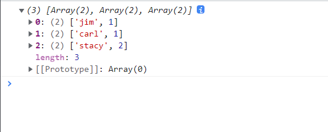

# 数据处理与分析
参考：

* [Arrays (d3-array)](https://github.com/d3/d3/blob/main/API.md#arrays-d3-array)
* [d3-array](https://github.com/d3/d3-array)（非官方[中译版](https://github.com/xswei/d3-array)）
 * [d3-time](https://github.com/d3/d3-time)（非官方[中译版](https://github.com/xswei/d3-time)）
 * [d3-time-format](https://github.com/d3/d3-time-format)（非官方[中译版](https://github.com/xswei/d3-time-format)）

本文主要介绍 ==Arrays、Time Intervals、Time Formats 模块==

在前端数据可视化中，数据集一般以 JavaScript 的可迭代对象 iterable 的形式存储，如[数组 array](https://developer.mozilla.org/zh-CN/docs/Web/JavaScript/Reference/Global_Objects/Array)、[集合 set](https://developer.mozilla.org/zh-CN/docs/Web/JavaScript/Reference/Global_Objects/Set)、[映射 map](https://developer.mozilla.org/zh-CN/docs/Web/JavaScript/Reference/Global_Objects/Map)、[generator](https://developer.mozilla.org/zh-CN/docs/Web/JavaScript/Reference/Global_Objects/Generator) 等，所以 D3 提供了 d3-array 模块有丰富的方法用于处理这些可迭代对象，可以在 JavaScript 中进行初步的数据分析。

:bulb: 在使用该模块前，应该熟悉 JavaScript 中与数组 Array 相关的的[内置方法](https://developer.mozilla.org/zh-CN/docs/Web/JavaScript/Reference/Global_Objects/Array)，因为 d3-array 模块的一些方法是借鉴了数组的内置方法并进行扩展的。

## 统计分析
以下方法可以计算关于数据集的一些基本统计量

* `d3.min(iterable[, accessor])` 获取数据集中的最小值。如果可迭代对象中包含不可比较的元素，则该方法返回 `undefined`

  :bulb: 与 JavaScript 内置的 `Math.min()` 方法不同，该方法忽略值为 `undefined`、`null`、`NaN` 的元素。

  第一个参数 `iterable` 是可迭代对象，即数据集。

  第二个参数是访问器，它是一个函数。可迭代对象在进行对比寻找最小值前，**每个元素都会调用一次访问器，并以该元素作为入参，最后将返回代表该元素，再用返回值进行对比**。它类似于 `arr.map()` 或 `Array.from()`。

  ```js
  // 先将字符串转换为数值，再求最小值
  d3.min(["2", "3", "10"], s => +s)
  ```

  :bulb: `d3.min()` 对比两个元素所采用的顺序是 natural order，因此如果数据集的元素是字符串，会依次对字符串中的字符进行[对比](https://zh.javascript.info/string#bi-jiao-zi-fu-chuan)，对比采用的是数字代码（所有的字符串都使用 UTF-16 编码，可以通过方法 `str.codePointAt(0)` 获取字符串第 `0` 位置上的字符的字符代码）

  ```js
  console.log("20".codePointAt(0)); // 50
  console.log("3".codePointAt(0)); //51

  const stringArr = ["20", "3"];
  d3.min(stringArr); // "20"

  const numberArr = [20, 3];
  d3.min(numberArr); // 3
  ```

  :bulb: 如果希望**获取最小值在可迭代对象中的位置，即索引**，可以使用方法 `d3.minIndex(iterable[, accessor])`，如果可迭代对象中包含不可比较的元素，则该方法返回 `-1`。

* `d3.max(iterable[, accessor])` 和 `d3.maxIndex(iterable[, accessor])` 分别用于获取可迭代对象中的最大值和相应的索引

* `d3.extent(iterable[, accessor])` 获取可迭代对象的范围，即返回一个由最小值和最大值构成的数组 `[min, max]`，如果可迭代对象中包含不可比较的元素，则该方法返回 `[undefined, undefined]`

* `d3.mean(iterable[, accessor])` 获取可迭代对象的平均值。如果可迭代对象中没有数值类型的元素，则返回 `undefined`

* `d3.mode(iterable[, accessor])` 获取可迭代对象的众数。如果有多个出现频率相同的元素，返回索引较前的那一个。

* `d3.sum(iterable[, accessor])` 获取可迭代对象所有元素之和。如果可迭代对象中没有数值类型的元素（如果字符串仅由数字构成也算作数值，因为在运算时可以隐式转换为数值），则返回 `0`

* `d3.cumsum(iterable[, accessor])` 获取可迭代对象的累计求和 cumulative sum 数组，其中返回的数组的元素是 64 位精度的浮点数值 Float64Array。如果可迭代对象中包含非数值元素，则该元素看作是 `0`。数组的长度与可迭代对象的长度一致。

  ```js
  d3.cumsum([1, 2, 3, 4]); // Float64Array(4) [1, 3, 6, 10]

  d3.cumsum([1, "2", "c", undefined]); // Float64Array(4) [1, 3, 3, 3]
  ```

* `d3.fsum([values][, accessor])` 获取可迭代对象所有元素之和。和 `d3.sum()` 作用相同，但是结果更精准（虽然运算时间比较慢），因为其内部不是使用 JavaScript 的 `+` 操作符，而是使用 D3 的**加法器**，它使得结果精度符合 [IEEE 754 浮点数算术标准](https://en.wikipedia.org/wiki/IEEE_754)。

  ```js
  d3.fsum([.1, .1, .1, .1, .1, .1, .1, .1, .1, .1]); // 1
  d3.sum([.1, .1, .1, .1, .1, .1, .1, .1, .1, .1]); // 0.9999999999999999
  ```

  :bulb: D3 提供了一个加法器，通过 `new d3.Adder()` 创建一个加法器（以下称为 `add`），其初始值是 `0`，通过该加法器执行数值运算，可以让结果精度符合 [IEEE 754 浮点数算术标准](https://en.wikipedia.org/wiki/IEEE_754)。

  * `adder.add(number)` 将数值 `number` 与加法器当前的值相加

  * `adder.valueOf()` 返回加法器当前的值，也可以使用 `+adder` 获取

* `d3.fcumsum([values][, accessor])` 获取可迭代对象的累计求和。和 `d3.cumsum()` 作用相同，但是结果更精准。

  ```js
  d3.fcumsum([1, 1e-14, -1]); // [1, 1.00000000000001, 1e-14]

  d3.cumsum([1, 1e-14, -1]); // [1, 1.00000000000001, 9.992e-15]
  ```

* `d3.median(iterable[, accessor])` 获取可迭代对象的中位数。如果可迭代对象中没有数值类型的元素，则返回 `undefined`

* `d3.quantile(iterable, p[, accessor])` 获取可迭代对象的分位数。

  第一个参数 `iterable` 是可迭代对象，即数据集。

  第二个参数 `p` 是需要获取的分位数，范围在 $[0, 1]$ 之间。例如需要获取中位数（即第 2 个四分位数 Q2），则 `p=0.5`；需要获取第 1 个四分位数 Q1 ，则 `p=0.25`；需要获取第 3 个四分位数 Q3，则 `p=0.75`；如果 `p=0` 或 `p=1` 则分别获取可迭代对象中第一个元素和最后一个元素。

  第三个参数是访问器。

  :bulb: 以上方法传入的可迭代对象并不要求是有序的，因为每次都会对可迭代对象进行排序并求出范围；如果**原始数据已经是有序**的，则可以调用性能更佳的方法 `d3.quantileSorted(array, p[, accessor])`，它不会再进行排序操作，执行速度更快。具体区别可以查看[源码](https://github.com/d3/d3-array/blob/main/src/quantile.js)。

* `d3.variance(iterable[, accessor])` 获取可迭代对象的[方差](http://mathworld.wolfram.com/SampleVariance.html)。如果可迭代对象中数值类型的元素少于 2 个，则返回 `undefined`

* `d3.deviation(iterable[, accessor])` 获取可迭代对象的标准差。如果可迭代对象中数值类型的元素少于 2 个，则返回 `undefined`

## 排序与检索
以下方法可以对数据集进行排序或检索特定条件的元素

* `d3.rank(iterable[, comparator])` 或 `d3.rank(iterable[, accessor])` 对可迭代对象的元素进行排序，**返回一个表示排序值的数组**。默认采用**升序排列 ascending**，所以返回的数组中的每一个元素（一个索引值）就表示该位置所对应的元素在排序中的序号。

  第一个参数 `iterable` 是可迭代对象，即数据集。

  第二个（可选）参数可以是 `accessor` 访问器或 `comparator` 对比器，它们都是函数，但是作用不同：

  * **访问器 `accessor` 接收一个参数** `d`，即当前遍历的可迭代对象的元素，其返回值代表该元素，用于进行对比

  * **对比器 `comparator` 接收两个参数** `a, b`，即当前遍历的可迭代对象的元素，以及下一个需要和它进行对比的元素。在函数内设置这两个元素的对比规则。
  **返回的值可以是 `-1`（或负数）、`0`、`1`（或正数），分别表示这两个元素的排序的不同先后关系**，如果返回值是 `-1` 就将 `a` 元素置于 `b` 元素前；如果返回值是 `1` 就将 `a` 元素置于 `b` 元素后；如果返回是 `0` 则保持 `a` 元素与 `b` 元素的相对位置不变。

  :bulb: 对于 Nullish 空值类型的元素，会被排到最后，并统一分配一个非数值序号 `NaN`

  :bulb: 如果希望采用降序排列 descending，可以传递内置的对比函数 `d3.descending`

  ```js
  // 返回的数组 [1, NaN, 2, 0] 表示在升序排列中各元素的应该位于哪个位置：
  // 元素 {x: 1} 所对应的索引值是 1，应该位于第 2 位
  // 元素 {} 所对应的索引值是 NaN，应该位于最后
  // 元素 {x: 2} 所对应的索引值是 2，应该位于第 3 位
  // 元素 {x: 0} 所对应的索引值是 0，应该位于第 1 位
  d3.rank([{x: 1}, {}, {x: 2}, {x: 0}], d => d.x); // [1, NaN, 2, 0]

  // 对于字符串也可以进行排序
  // 依次对比字符串的字符，对比时采用的是字符的数字代码（所有的字符串都使用 UTF-16 编码）
  d3.rank(["b", "c", "b", "a"]); // [1, 3, 1, 0]

  // 采用降序排列
  d3.rank([1, 2, 3], d3.descending); // [2, 1, 0]
  ```

* `d3.least(iterable[, comparator])` 或 `d3.least(iterable[, accessor])` 获取可迭代对象的最小值。

  它和 `d3.min()` 作用相同，区别在于该方法可以设置对比器 `comparator` 自定义元素的对比方式，默认以升序排序，并取第一个元素。

  ```js
  const array = [{foo: 42}, {foo: 91}];
  // 设置对比器
  // 升序（默认）
  d3.least(array, (a, b) => a.foo - b.foo); // {foo: 42}
  // 降序
  d3.least(array, (a, b) => b.foo - a.foo); // {foo: 91}

  // 设置访问器
  d3.least(array, a => a.foo); // {foo: 42}
  ```

  如果可迭代对象中没有数值类型的元素，则返回 `undefined`

  :bulb: 如果希望**获取最小值的索引**，可以使用方法 `d3.leastIndex(iterable[, comparator])` 或 `d3.leastIndex(iterable[, accessor])`，它和 `d3.minIndex()` 作用相同，区别在于该方法可以设置对比器 `comparator`。如果可迭代对象中包含不可比较的元素，则该方法返回 `-1`。

* `d3.greatest(iterable[, comparator])` 或 `d3.greatest(iterable[, accessor])` 获取可迭代对象的最大值。

  :bulb: 如果希望**获取最大值的索引**，可以使用方法 `d3.greatestIndex(iterable[, comparator])` 或 `d3.greatestIndex(iterable[, accessor])`

* `d3.ascending(a, b)` 对比两个参数 `a` 和 `b` 的大小，基于大小关系返回不同的值。

  它的源码如下

  ```js
  function ascending(a, b) {
    return a == null || b == null ? NaN : a < b ? -1 : a > b ? 1 : a >= b ? 0 : NaN;
  }
  ```

  * 如果 `a` 小于 `b` 则返回 `-1`
  * 如果 `a` 大于 `b` 则返回 `1`
  * 如果 `a` 等于 `b` 则返回 `0`

  **一般该方法会作为默认的对比器 comparator**，用于排序操作中。由于**返回的值的正负是用来决定元素 `a` 和 `b` 最终排列顺序**，如果返回值为负值，则元素 `a` 位于元素 `b` 前面；如果返回值为正值，则元素 `a` 位于元素 `b` 后面；如果返回值是 `0`，则元素 `a` 和元素 `b` 的相对位置不变。所以以上规则，最后会将较小值排在前面，较大值排在后面，即**升序排列**

* `d3.descending(a, b)` 也是基于参数 `a` 和 `b` 的大小关系返回不同的值，和方法 `d3.ascending(a, b)` 规则正好相反，所以将它作为对比器 comparator 时，获得的是**降序排序**。

* `d3.quickselect(array, k[, left[, right[, compare]]])` 快速选择出数组中最小的 `k+1` 个元素（由于数组元素的索引值从 `0` 开始），并**在原数组里 in place** 对部分元素调整了位置，使得返回的数组中，左侧元素是最小的 `k+1` 个元素。

  :warning: 最后返回的数组并**不是**整个都有序。

  第一个参数 `array` 是数组，即数据集

  第二个参数 `k` 称为间隔索引 middle index 或指针索引 pivot index。返回的数组中，在该索引左侧的元素都小于（或等于）右侧的元素

  第三、四个（可选）参数用以设置数组的分片（包括左右索引所指的元素），仅对该分片的元素进行操作

  第五个（可选）参数用于设置对比器 comparator

  ```js
  const numbers = [16, 15, 18, 10, 17, 14, 13, 19, 11, 12];
  // 返回的数组并不是整个都有序
  // 只是确保前两个元素是最小的
  d3.quickselect(numbers.slice(), 2);// [11, 10, 12, 15, 13, 14, 16, 17, 18, 19]

  const input = [0, 4, 1, 6, 7, 5, 8, 2, 9, 3];
  // 从数组的第 5 个（索引为 4）元素到第 9 个（索引为 8）元素进行查询
  // （针对整个数组而言）间隔索引是 6
  // 即对于索引值为 [4, 8] 范围内的元素进行查询，选出两个较小的值
  // 可以查看网页 https://observablehq.com/@d3/d3-quickselect#cell-405 所提供的可视化演示
  d3.quickselect(input.slice(), 6, 4, 8); // [0, 4, 1, 6, 2, 5, 7, 8, 9, 3]
  ```

  :bulb: 该方法比数组的 `arr.sort()` 方法性能更佳，执行速度更快，一般用于获取分位数，而不需要返回一个有序的数组。具体的原理可以查看[这里](https://github.com/mourner/quickselect/blob/master/README.md)。

## 二元分割
有时候需要基于特定值，**将（有序）的数组里的元素一分为二**，D3 提供了以下方法实现该需求：

* `d3.bisectLeft(array, x[, lo[, hi]])` 返回索引值 index，如果将 `x` 插入到该位置（可以使用数组的 `arr.splice()` 方法），依然保持数组有序。

  第一个参数 `array` 是（有序）数组，即数据集

  第二个参数 `x` 待插入到数组的值

  第三、第四（可选）参数用于指定数组的片段，待插入值 `x` 只会与该片段的元素进行对比。其中 `lo` 表示 lower 即下限，`hi` 表示 high 即上限

  如果数组中已经存在与 `x` 相同的元素，则将 `x` 插入到该元素的**左侧**，因此**保证了在索引左侧的元素都小于 `x`**，即 $v < x$（其中 $v$ 是表示在数组 $[lo, i]$ 范围中的元素）；在索引右侧的元素都大于或等于 `x`，即 $v \ge x$（其中 $v$ 是表示在数组 $[i, hi]$ 范围中的元素）

* `d3.bisect(array, x[, lo[, hi]])` 或 `d3.bisectRight(array, x[, lo[, hi]])` 也是返回索引值 index，以插入 `x` 到数组中。不过在数组中已经存在与 `x` 相同的元素时，将 `x` 插入到该元素的**右侧**，因此**保证了在索引右侧的元素都大于 `x`**

* `d3.bisectCenter(array, x[, lo[, hi]])` 返回索引值 index，索引所指的元素与 `x` 的「距离」最近。

除了以上方法 D3 提供了方法 `d3.bisector(accessor)` 或 `d3.bisector(comparator)` 创建**通用**的分割器（以下称为 bisector），将数组按照一定条件一分为二。

分割器有相应的「左分割」、「右分割」、「临近分割」等方法：

* `bisector.left(array, x[, lo[, hi]])` 左分割，和 `d3.bisectLeft()` 作用相同，区别在于该方法可以设置访问器 `accessor` 或对比器 `comparator`，这样分割器可以适用于数组的元素数据类型为较复杂（例如对象）的情况

* `bisector.right(array, x[, lo[, hi]])` 右分割，和 `d3.bisect()` 或 `d3.bisectRight()` 作用相同

* `bisector.center(array, x[, lo[, hi]])` 临近分割，和 `d3.bisectCenter()` 作用相同

```js
// 数组的元素是复杂的数据类型（对象）
const data = [
  {date: new Date(2011, 1, 1), value: 0.5},
  {date: new Date(2011, 2, 1), value: 0.6},
  {date: new Date(2011, 3, 1), value: 0.7},
  {date: new Date(2011, 4, 1), value: 0.8}
];

// 创建一个分割器，并设置 accessor 访问器，返回元素的属性 date 作为对比值
const bisector = d3.bisector(function(d) { return d.date; })

// 采用右分割
const bisectDate = bisector.right(data, new Date(2011, 3, 15));

// 也可以设置 comparator 对比器
// const bisector = d3.bisector(function(d, x) { return d.date - x; });
```

## 转换
以下方法可以对数据集进行转换，如进行分组归类等

* `d3.group(iterable, ...keys)` 基于指定的属性（键），将可迭代对象的元素进行分组，并返回一个 InterMap 对象。

  :bulb: InternMap 是以 **key-value 键值对**的形式存储数据，这是 D3 对于 JavaScript 内置的数据类型 [Map 映射](https://developer.mozilla.org/zh-CN/docs/Web/JavaScript/Reference/Global_Objects/Map)的一种拓展，其形式和 Map 相同，但是支持 Dates 日期或 non-primitive 非基本数据类型作为键名，因此支持基于时间对数据集进行分组。可以通过 `new d3.InternMap([iterable][, key])` 创建一个 InternMap 对象，一般用在 `d3.group()`、`d3.rollup()`、`d3.index()` 方法中。

  第一个参数 `iterable` 是可迭代对象，即数据集

  余下的参数 `...keys` 是一系列返回分组依据（字符串等基本数据类型或对象等复杂数据类型都可以）的函数，数据集中的每个元素都会调用该函数，入参就是当前遍历的元素 `d`

  ```js
  const data = [
    {name: "jim",   amount: "34.0",   date: "11/12/2015"},
    {name: "carl",  amount: "120.11", date: "11/12/2015"},
    {name: "stacy", amount: "12.01",  date: "01/04/2016"},
    {name: "stacy", amount: "34.05",  date: "01/04/2016"}
  ]

  // 以元素的属性 name 作为分组依据
  console.log(d3.group(data, d => d.name));
  ```

  以下是控制台的输出结果

  

  如果依次指定多个分组依据，则返回一个**嵌套**的 InternMap 对象

  ```js
  // 先基于元素的 name 人名进行分组，然后对各分组再基于 date 日期进行分组
  console.log(d3.group(data, d => d.name, d => d.date));
  ```

  以下是控制台的输出结果

  

  :bulb: 原来数据集中具体的各个元素会散落归类到各「叶子」分组（嵌套得最深的各个分组）中，如果希望将 InternMap 转换为普通的数组，可以使用数组的 `Array.from(internMap)` 方法。

  ```js
  Array.from(d3.group(data, d => d.name))
  // [
  //   ["jim", Array(1)],
  //   ["carl", Array(1)],
  //   ["stacy", Array(2)]
  // ]

  Array.from(d3.group(data, d => d.name), ([key, value]) => ({key, value}))
  // [
  //   {key: "jim", value: Array(1)},
  //   {key: "carl", value: Array(1)},
  //   {key: "stacy", value: Array(2)}
  // ]
  ```

  :bulb: 如果希望将 InterMap 的数据绑定到页面的元素，可以直接使用而不经过转换，因为执行数据绑定的 `selection.data()` 方法支持入参是 Map 等可迭代对象。

* `d3.groups(iterable, ...keys)` 基于指定的属性（键），将可迭代对象的元素进行分组，并返回一个数组（而不是 InternMap 对象）。

  ```js
  const data = [
    {name: "jim",   amount: "34.0",   date: "11/12/2015"},
    {name: "carl",  amount: "120.11", date: "11/12/2015"},
    {name: "stacy", amount: "12.01",  date: "01/04/2016"},
    {name: "stacy", amount: "34.05",  date: "01/04/2016"}
  ]

  console.log(d3.groups(data, d => d.name));
  ```

  以下是控制台的输出结果

  

  返回的数组有一些特性：

  * 基于特定的属性 `key` 对数据集进行分组，将每一个分组作为一个元素，因此 `d3.groups()` 方法返回的数组的长度就是可以分得多少个组
  * 而且每一个元素都是二元数组（只有两个元素）
  * 在二元数组中，第一个元素就是该分组所属的 `key` 属性值；第二元素则是一个数组，其中包含了属于该分组的数据集中的元素

  如果依次指定多个分组依据，则返回一个**嵌套**的数组

  ```js
  // 先基于元素的 name 人名进行分组，然后对各分组再基于 date 日期进行分组
  console.log(d3.groups(data, d => d.name, d => d.date));
  ```

  以下是控制台的输出结果

  

* `d3.flatGroup(iterable, ...keys)` 基于指定的属性（键），将可迭代对象的元素进行分组。但是对于指定多个 `key` 时，不是依次先后考虑分组依据（这样会返回嵌套结构的数据），而是**同时考虑这些属性的不同属性值组合，返回一个「扁平」的数据**。

  返回是一个数组，每一个元素都是一个分组。这些元素也是数组 `[key0, key1, …, values]`，它的前面部分的元素表示不同 `key` 的值的组合；而最后一个则是一个数组，它是由该分组所包含的数据集中的元素构成的

  ```js
  const data = [
    {name: "jim",   amount: "34.0",   date: "11/12/2015"},
    {name: "carl",  amount: "120.11", date: "11/12/2015"},
    {name: "stacy", amount: "12.01",  date: "01/04/2016"},
    {name: "stacy", amount: "34.05",  date: "01/05/2016"}
  ]

  console.log(d3.flatGroup(data, d => d.name));
  ```

  以下是控制台的输出结果

  

* `d3.groupSort(iterable, accessor, key)` 或 `d3.groupSort(iterable, comparator, key)` 基于指定的属性进行分组，最后返回排序好的数组。

  第一个参数 `iterable` 是可迭代对象，即数据集

  第二个参数可以是访问器 `accessor` 或对比器 `comparator`，用以设置分组的排序

  * 如果是访问器 `accessor` 则每个分组依次调用，并将当前分组 `g` 作为参数，然后将函数的返回值作为排序对比的依据，默认按照升序排列

    ```js
    const data = [
      {name: "jim",   amount: "34.0",   date: "11/12/2015"},
      {name: "carl",  amount: "120.11", date: "11/12/2015"},
      {name: "stacy", amount: "12.01",  date: "01/04/2016"}
    ]

    // 基于 name 属性进行分组，对于每个分组基于所有元素的 amount 属性的总和进行排序
    console.log(d3.groupSort(data, g => d3.sum(g, d => d.amount), d => d.name));

    // 默认是按照访问器的返回值的升序排列，如果希望降序排列，可以仅仅在返回值前面添加负号 - 即可实现
    // d3.groupSort(data, g => -d3.sum(g, d => d.amount), d => d.name)
    ```

    以下是控制台的输出结果

    

  * 如果是对比器 `comparator` 则当前分组 `a` 和下一个需要对比的分组 `b`，和对比器的一般规则一样，根据返回值的正负来决定两个分组的先后顺序

    ```js
    const data = [
      {name: "jim",   amount: "34.0",   date: "11/12/2015"},
      {name: "carl",  amount: "120.11", date: "11/12/2015"},
      {name: "stacy", amount: "12.01",  date: "01/04/2016"}
    ]

    // 和以上访问器 accessor 获得一样的结果
    console.log(d3.groupSort(data, (a, b) => {
      return d3.sum(a, d => d.amount) - d3.sum(b, d => d.amount)
    }, d => d.name));
    ```

  第三个参数 `key` 是分组依据

* `d3.index(iterable, ...keys)` 基于指定的属性（键），将可迭代对象的元素进行分组。

  和 `d3.group()` 类似，也开始返回一个 InternMap 对象，以 key-value 键值对的形式存储分组信息，**不同的是需要分组依据对于每个元素都是唯一的，即 `key` 需要是元素的标识符**。因此每个键值对中，键 key 是每个元素的唯一标识符，值 value 就是该元素，由于不同的标识符匹配的元素是唯一的，所以值 value 并不再需要是一个数组，而直接是匹配到的元素本身即可。

  ```js
  const data = [
    {name: "jim",   amount: "34.0",   date: "11/12/2015"},
    {name: "carl",  amount: "120.11", date: "11/12/2015"},
    {name: "stacy", amount: "12.01",  date: "01/04/2016"}
  ]

  console.log(d3.index(data, d => d.name));
  ```

  以下是控制台的输出结果

  

  :warning: 如果一个键匹配到多个元素，则该方法会抛出错误 `Error: duplicate key`

* `d3.rollup(iterable, reduce, ...keys)` 基于指定的属性进行分组，并对各分组进行「压缩降维」，返回一个 InternMap 对象。

  :bulb: 该方法和 `d3.group()` 类似，但是不同的是使用了 `reduce` 函数对分组进行「压缩降维」，得到各分组的概要性的描述，所以在各分组的键值对中的「值」是 `reduce` 函数的返回值，而不是一个包含了（属于该分组的）数据集中的元素的数组。

  第一个参数 `iterable` 是可迭代对象，即数据集

  第二个参数 `reduce` 是对分组进行压缩的函数，每个分组会依次调用该函数（入参就是包含各个分组元素的数组），返回值会作为 InternMap 对象中（各分组的）键值对中的值

  余下的参数 `...keys` 是一系列返回分组依据

  ```js
  data = [
    {name: "jim",   amount: "34.0",   date: "11/12/2015"},
    {name: "carl",  amount: "120.11", date: "11/12/2015"},
    {name: "stacy", amount: "12.01",  date: "01/04/2016"},
    {name: "stacy", amount: "34.05",  date: "01/04/2016"}
  ];

  // 基于元素的 name 人名进行分组，然后对各分组进行「压缩降维」，以分组中所包含的元素的数量来表示描述分组
  console.log(d3.rollup(data, v => v.length, d => d.name));
  ```

  以下是控制台的输出结果

  

  如果依次指定多个分组依据，则返回一个**嵌套**的 InternMap 对象，**而 `reduce` 函数只会被「叶子」分组（嵌套得最深的各个分组）调用**，因为这些分组才直接包含原数据集中的元素

  ```js
  // 先基于元素的 name 人名进行分组，然后对各分组再基于 date 日期进行分组
  // 然后对各分组进行「压缩降维」，以分组中所包含的元素的数量来表示描述分组
  console.log(d3.rollup(data, d => d.name, d => d.date));
  ```

  以下是控制台的输出结果

  

* `d3.rollups(iterable, reduce, ...keys)` 基于指定的属性进行分组，也是对各分组进行「压缩降维」，并返回一个数组（而不是 InternMap 对象）。就像 `d3.groups()` 之于 `d3.group()` 的关系。

  ```js
  data = [
    {name: "jim",   amount: "34.0",   date: "11/12/2015"},
    {name: "carl",  amount: "120.11", date: "11/12/2015"},
    {name: "stacy", amount: "12.01",  date: "01/04/2016"},
    {name: "stacy", amount: "34.05",  date: "01/04/2016"}
  ];

  console.log(d3.rollups(data, v => v.length, d => d.name));
  ```

  以下是控制台的输出结果

  

  如果依次指定多个分组依据，则返回一个**嵌套**的数组

  ```js
  data = [
    {name: "jim",   amount: "34.0",   date: "11/12/2015"},
    {name: "carl",  amount: "120.11", date: "11/12/2015"},
    {name: "stacy", amount: "12.01",  date: "01/04/2016"},
    {name: "stacy", amount: "34.05",  date: "01/04/2016"}
  ];

  console.log(d3.rollups(data, v => v.length, d => d.name, d => d.date));
  ```

  以下是控制台的输出结果

  

* `d3.flatRollup(iterable, reduce, ...keys)` 基于指定的属性进行分组，但是对于指定多个 `key` 时，不是依次先后考虑分组依据（这样会返回嵌套结构的数据），而是**同时考虑这些属性的不同属性值组合，返回一个「扁平」的数据**，然后对各分组进行「压缩降维」。

  返回是一个数组，每一个元素都是一个分组。这些元素也是数组 `[key0, key1, …, values]`，它的前面部分的元素表示不同 `key` 的值的组合；而最后一个元素则是 `reduce` 函数的返回值，是该分组的概要性的描述

  ```js
  const data = [
    {name: "jim",   amount: "34.0",   date: "11/12/2015"},
    {name: "carl",  amount: "120.11", date: "11/12/2015"},
    {name: "stacy", amount: "12.01",  date: "01/04/2016"},
    {name: "stacy", amount: "34.05",  date: "01/05/2016"}
  ]

  console.log(d3.flatRollup(data, v => v.length, d => d.name, d => d.date));
  ```

  以下是控制台的输出结果

  

* `d3.count(iterable[, accessor])` 统计可迭代对象中，满足条件的元素的个数。

  第一个参数 `iterable` 是可迭代对象，即数据集

  第二个（可选）参数是访问器 `accessor`，数据集中的元素会依次调用该函数，只有返回值是数值时（包含仅以数值构成的字符串），才会纳入统计中。因此默认将数值类型的元素纳入统计中，而忽略 `null`、`NaN`、`undefined`。

  ```js
  const flights = [
    {airline: "Icelandair", price: 1621, stops: 3},
    {airline: "Air France", price: 1948, stops: 0},
    {airline: "WestJet", price: undefined, stops: 1},
    {airline: "French Bee", price: 'abc', stops: 1}
  ];

  // 由于元素是对象，所以未指定访问器时，d3.count(flights) 的结果是 0
  d3.count(flights); // 0

  // 指定元素的 price 属性作为统计的依据
  d3.count(flights, d => d.price); // 2

  // 使用统计分析相关方法时，如 d3.mean()，其内部对于有效元素个数的统计正是使用 d3.count() 方法，可以有效忽略非数值类型的元素
  d3.mean(flights, d => d.price); // 1784.5
  // 以上方法和以下代码作用相同
  // d3.sum(flights, d => d.price) / d3.count(flights, d => d.price)
  ```

* `d3.pairs(iterable[, reducer])` 将相邻元素两两配对，生成一个新的数组。

  :warning: 如果可迭代对象的元素少于两个，则该方法返回一个空数组

  第一个参数 `iterable` 是可迭代对象，即数据集

  第二个（可选）参数 `reducer` 是一个函数，它的入参是当前遍历的两个相邻的元素，然后将返回的值作为新数组的相应位置的元素，实现对原数组的「压缩」。

  :bulb: `reducer` 函数默认值如下，它直接将两个入参构成一个二维数组返回

  ```js
  function pair(a, b) {
    return [a, b];
  }
  ```

  ```js
  d3.pairs([1, 2, 3, 4]); // returns [[1, 2], [2, 3], [3, 4]]
  d3.pairs([1, 2, 3, 4], (a, b) => b - a); // returns [1, 1, 1];
  ```

* `d3.cross(...iterables[, reducer])` 将多个可迭代对象进行**交叉组合**，返回一个[笛卡儿积 Cartesian product](https://en.wikipedia.org/wiki/Cartesian_product)，最后返回的数组中，其元素默认形式是一个由各可迭代对象的相应元素构成的数组

  ```js
  d3.cross([1, 2], ["x", "y"]); // returns [[1, "x"], [1, "y"], [2, "x"], [2, "y"]]
  ```

  前面的一系列参数 `...iterables` 都是可迭代对象

  最后一个（可选）参数 `reducer` 是一个函数，它的入参是各可迭代对象的相应元素，然后将返回的值作为该位置的笛卡儿积，实现对数据的「压缩」。

  ```js
  d3.cross([1, 2], ["x", "y"], (a, b) => a + b); // returns ["1x", "1y", "2x", "2y"]
  ```

* `d3.merge(iterables)` 用于将嵌套数据「拍平」，它可以将二次嵌套的数据，即数组内的元素也是数组，变成扁平化的数据。

  ```js
  d3.merge([[1], [2, 3]]); // [1, 2, 3]

  // 和 JavaScript 的数组方法 arr.concat() 类似，
  [1].concat([2, 3]); // [1, 2, 3]
  ```

* `d3.permute(source, keys)` 用于从数据源中提取信息，并构成一个新数组。

  第一个参数 `source` 是数据源， 可以是一个对象或一个数组

  第二个参数 `keys` 是一个数组，指明需要从数据源中提取哪些信息。如果 `source` 是对象，数据以 key-value 键值对的形式存储，则 `keys` 就是一个包含一系列的属性/键名的数组，然后依次提取对应的属性值，作为新数组的元素；如果 `source` 是数组，数据是作为各个元素有序存储，则 `keys` 就是一个元素表示索引的数组，然后依次提取 `source` 原数组的元素，作为新数组的元素。

  ```js
  d3.permute(["a", "b", "c"], [1, 2, 0]); // ["b", "c", "a"]

  let object = {yield: 27, variety: "Manchuria", year: 1931, site: "University Farm"};
  let fields = ["site", "variety", "yield"];

  d3.permute(object, fields); // ["University Farm", "Manchuria", 27]
  ```

  :bulb: 允许重复提取数据源的某个信息多次，也允许忽略/不提取某个信息

  ```js
  d3.permute("abcdefghijklmnopqrstuvwxyz", [3, 4, 0, 3, 1, 4, 4, 5]); // ["d", "e", "a", "d", "b", "e", "e", "f"]
  ```

* `d3.shuffle(array[, start[, stop]])` 在原数组 in-place 对元素进行随机重新排序。

  第一个参数 `array` 是需要「洗牌」的原数组

  第二、三个（可选）参数 `start`（所指向的元素包括在内）和 `stop`（所指向的元素不包括在内）是索引值，用于约束可以重新排序的元素范围，默认是整个数组都可以重排，即 `start` 默认值为 `0`，`stop` 默认值为 `arr.length`

  :bulb: D3 使用 [Fisher–Yates shuffle 算法](https://en.wikipedia.org/wiki/Fisher%E2%80%93Yates_shuffle)进行洗牌。如果希望对洗牌方法进行配置，可以使用 `d3.shuffler(random)` 方法创建一个洗牌器，其中通过参数 `random` 定制随机生成的方法，然后就可以使用该洗牌器对数组的元素进行重新排序。

  ```js
  // 设置随机数的生成方法
  const random = d3.randomLcg(0.9051667019185816);
  const shuffle = d3.shuffler(random);

  shuffle([0, 1, 2, 3, 4, 5, 6, 7, 8, 9]); // returns [7, 4, 5, 3, 9, 0, 6, 1, 2, 8]
  ```
以下两个方法都是用于将数组进行[转置](https://en.wikipedia.org/wiki/Transpose)

* `d3.zip(arrays…)` 输入一系列的数组，然后依次提取各数组的第 `i` 个元素，构成新数组（一个嵌套数组）相应索引的元素，实现类似**矩阵转置**的功能

  ```js
  const names = ["joe", "sally", "norbert", "ann", "rafael"];
  const ages = [32, 13, 14, 22, 76];

  d3.zip(names, ages); // [['joe', 32], ['sally', 13], ['norbert', 14], ['ann', 22], ['rafael', 76]]
  ```

  以下是控制台的输出结果

  

  :bulb: 如果输入的数组**长度不一致**，则基于最短的数组来构建新数组

  ```js
  const names = ["joe", "sally", "norbert", "ann", "rafael"];
  const ages = [32, 13, 14, 22, 76];

  const preferences = ["ice cream", "juice", "cake"];

  d3.zip(names, preferences, ages); // [["joe", "ice cream", 32], ["sally", "juice", 13], ["norbert", "cake", 14]]
  ```

  以下是控制台的输出结果

  

* `d3.transpose(matrix)` 作用和 `d3-zip()` 一样，但是入参形式不一样，是一个矩阵（即嵌套数组）。

  ```js
  // 和 d3.zip(names, preferences, ages) 作用一样
  d3.transpose([names, preferences, ages])
  ```

对于键值对分别单独存储在不同数组的数据集，它们需要进一步借助数组的索引才能进行匹配。而借助以上方法，可以将数组转换为 key-value 的映射形式，便于数据的查询获取。

```js
const names = ["joe", "sally", "norbert", "ann", "rafael"];
const ages = [32, 13, 14, 22, 76];

const mapData = new Map(d3.zip(names, ages));
console.log(mapData);

mapData.get('joe'); // 32
```

以下是控制台的输出结果


## 刻度生成
* `d3.ticks(start, stop, count)` 根据 `count` 数量对特定范围（由 `start` 和 `stop` 指定）进行**均分**，并返回一个包含一系列分隔值的数组。

  第一、二个参数 `start` 和 `stop` 分别指定范围的起始和结束值

  第三个参数 `count` 作为分割数量的参考值

  :warning: 要确保生成的分割值是 nicely-rounded（内部会进行修约/四舍五入操作）有较好的可读性的形式，**所以视情况而定调整真正的范围和分割的数量**：

    * 如果起始值 `start` 和结束值 `stop` 本身可读性较好，则可以包含在返回的数组中，作为第一个或最后一个分割值；否则从原范围内部取一个起始值和结束值可读形式较好的小范围进行分割，如原范围是 `[6.2, 11]` 则实际进行分割的范围应该是 `[6.5, 10]`。

      :bulb: 可以使用 `d3.nice(start, stop, count)` 对范围进行调整，返回一个起始值和结束值可读形式更好的范围 `[niceStart, niceStop]`，让它们可以作为分割值，新返回的范围 `[niceStart, niceStop]` 将原范围 `[start, stop]` 包含在内

      ```js
      d3.nice(0.2, 10.2, 10); // [0, 11]
      ```

    * 如果使用 `count` 进行分割出现「除不尽」的情况时，应该进行调整，让相邻刻度之间的间距（即步长）满足是 $1$ 或 $2$ 或 $5$ 乘以 $10^{n}$ 的形式。

  ```js
  // 实际最后返回的数组中包含 11 个元素
  // 相邻分割值之间的距离（步长）是 1 * 10^0
  d3.ticks(0, 10, 10); // [0, 1, 2, 3, 4, 5, 6, 7, 8, 9, 10]

  // 相邻分割值之间的距离（步长）是 1 * 10^-1
  d3.ticks(0, 1, 10); // [0, 0.1, 0.2, 0.3, 0.4, 0.5, 0.6, 0.7, 0.8, 0.9, 1]

  // 实际分割范围是 [1, 10]
  // 相邻分割值之间的距离（步长）是 1 * 10^0
  d3.ticks(0.2, 10, 10);
  ```

  可以查看该方法的具体的[源码](https://github.com/d3/d3-array/blob/main/src/ticks.js)，了解这些约束具体实现方式，这些限制是为了最后可以获得可读性较好的分隔值，然后可以用该方法为定义域、值域范围生成一系列坐标轴的刻度值。

  :bulb: 在 `d3.ticks()` 内部使用 `d3.tickIncrement(start, stop, count)` 或 `d3.tickStep(start, stop, count)` 计算步长：

    * `d3.tickStep(start, stop, count)` 其精度受到 [IEEE 754 浮点数算术标准](https://en.wikipedia.org/wiki/IEEE_754)约束，入参 `start` 和 `stop` 大小任意

    * `d3.tickIncrement(start, stop, count)` 入参 `start` 需要小于 `stop`，**如果步长小于 `1` 时，返回的是步长的倒数的相反数**，所以该方法返回值都是整数，以保证精度（而不受 IEEE 754 浮点值精度的约束）

    ```js
    d3.tickIncrement(0, 10, 10); // 1

    d3.tickIncrement(0, 10, 100000); // -10000

    d3.tickStep(0, 10, 100000); // 0.00009999999999999999
    ```

* `d3.range([start, ]stop[, step])` 该方法可以快速生成一个等差数列，并用数量各项作为元素构成一个数组返回

  第一个（可选）参数 `start` 设置起始值，默认值为 `0`

  第二个参数 `stop` 设置结束值（该值不包含 exclusive 在返回的数组中）

  第三个（可选）参数 `step` 设置步长（即等差数列的公差），默认值为 `1`

  :warning: 如果等差数列中包含一个大小为 `infinite` 无限的项，最后返回一个 `[]` 空数组

  ```js
  d3.range(0, 1, 0.2) // [0, 0.2, 0.4, 0.6000000000000001, 0.8]
  ```

  :bulb: 以上示例中元素采用了浮点值，受到 [IEEE 754 浮点数算术标准](https://en.wikipedia.org/wiki/IEEE_754)约束，其运算结果可能「并不好看」，可以采用 d3-format 模块的方法对元素值进行修约。也可使用 `d3.ticks()` 方法生成一系列分割值。

## 迭代
以下方法和数组的遍历元素一些方法类似，不同的是 D3 的方法既可以操作数组，也可以操作 Map 映射、Set 集合等可迭代对象

* `d3.every(iterable, test)` 可迭代对象中的每个元素均调用验证函数 `test`，该函数返回一个布尔值。只有所有元素都通过验证（即验证函数返回值均为 truly）时，该方法才会返回 `true`；只要其中一个验证函数返回 falsy 时，该方法马上返回 `false`

  ```js
  d3.every(new Set([1, 3, 5, 7]), x => x & 1) // true
  ```

* `d3.some(iterable, test)` 可迭代对象中的元素均调用验证函数 `test`，该函数返回一个布尔值。只要其中一个验证函数返回 truly 时，该方法就会马上返回 `true`；否则要等到所有元素执行完验证函数，并且返回都是 falsy 时，该方法才会返回 `false`

  ```js
  d3.some(new Set([0, 2, 3, 4]), x => x & 1) // true
  ```

* `d3.filter(iterable, test)` 可迭代对象中的元素均调用筛选函数 `test`，该函数返回一个布尔值。将使得筛选函数返回 truly 的元素构成一个新数组并返回。

  ```js
  d3.filter(new Set([0, 2, 3, 4]), x => x & 1) // [3]
  ```

* `d3.map(iterable, mapper)` 可迭代对象中的元素均调用筛选函数 `test`，该函数返回一个值，作为该元素在新数组的「替代值」。该方法一般用于对可迭代对象中（所有元素）进行转换。

  ```js
  d3.map(new Set([0, 2, 3, 4]), x => x & 1) // [0, 0, 1, 0]
  ```

* `d3.reduce(iterable, reducer[, initialValue])` 用于对可迭代对象进行「压缩」

  第一个参数 `iterable` 表示可迭代对象

  第二个参数 `reduce` 是一个函数，可迭代对象中的元素依次调用，会返回一个值表示当前元素和之前元素的「压缩」结果。

  压缩函数接收两个参数 `reducer(p, v)`：

    * 第一个参数 `p` 是表示上一个元素调用压缩函数是返回的值 previousValue
    * 第二个参数 `v` 表示当前所遍历的元素

  因此当前压缩函数的返回值会作为下一个元素调用压缩函数的 `p` 参数的值

  第三个（可选）参数 `initialValue` 是初始值，即第一个元素调用压缩函数时 `p` 参数的值，默认为 `0`

  ```js
  d3.reduce(new Set([0, 2, 3, 4]), (p, v) => p + v, 0) // 9
  ```

* `d3.reverse(iterable)` 返回一个元素位置顺序前后翻转的可迭代对象

  ```js
  d3.reverse(new Set([0, 2, 3, 1])) // [1, 3, 2, 0]
  ```

  :bulb: 和 `arr.reverse()` 方法作用相同，但是该方法并不会对原可迭代对象造成影响

* `d3.sort(iterable, comparator = d3.ascending)` 或 `d3.sort(iterable, ...accessors)` 对可迭代对象中的元素进行重新排序，默认是升序排列。

  第一个参数 `iterable` 是可迭代对象，即数据集

  第二个参数可以是对比器 comparator 或访问器 accessors。

  * 如果是对比器 comparator 它接收两个参数，表示当前遍历的元素 `a`，以及下一个需要对比的元素 `b`，基于该函数的返回值的正负，决定元素的先后顺序

  * 如果是访问器 accessor 它接收一个参数，表示当前遍历的元素 `d`，然后函数的返回值用于对比排序。

  :bulb: 如果不知道数据集中的元素有哪些属性，**可以设置多个访问器作为后备**，但最后只有一个合适的会被调用

  ```js
  d3.sort(points, ({x}) => x, ({y}) => y);

  // 以上方法相当于以下代码
  d3.sort(data, (a, b) => d3.ascending(a.x, b.x) || d3.ascending(a.y, b.y));
  ```

## 集合
D3 还提供了一些方法用于操作多个可迭代对象，实现基本的集合运算，如交集、并集等。

:bulb: 这些方法返回的是 **InternSet 对象**，是 D3 基于 JavaScript 的内置数据类型**集合 Set** 进行拓展的一种数据类型，可以使用 `new d3.InternSet([iterable][, key])` 方法来创建一个 InternSet 对象

* `d3.difference(iterable, ...others)` 获取可迭代对象 `iterable` 与其他一些可迭代对象 `...others` 的差集，即元素在 `iterable` 中，但是不在其他 `...others` 可迭代对象中

  ```js
  d3.difference([0, 1, 2, 0], [1]) // Set {0, 2}
  ```

* `d3.union(...iterables)` 获取一系列可迭代对象 `...iterables` 的并集

  ```js
  d3.union([0, 2, 1, 0], [1, 3]) // Set {0, 2, 1, 3}
  ```

* `d3.intersection(...iterables)` 获取一系列可迭代对象 `...iterables` 的交集

  ```js
  d3.intersection([0, 2, 1, 0], [1, 3]) // Set {1}
  ```

* `d3.superset(a, b)` 判断可迭代对象 `a` 是否为另一个可迭代对象 `b` 的父集，即所有在 `b` 内的元素也都在 `a` 中

  ```js
  d3.superset([0, 2, 1, 3, 0], [1, 3]) // true
  ```

* `d3.subset(a, b)` 判断可迭代对象 `a` 是否为另一个可迭代对象 `b` 的子集，即所有在 `a` 内的元素也都在 `b` 中与数组。和方法 `d3.superset()` 相反

  ```js
  d3.subset([1, 3], [0, 2, 1, 3, 0]) // true
  ```

* `d3.disjoint(a, b)` 判断可迭代对象 `a` 和 `b` 是否**无交集**

  ```js
  d3.disjoint([1, 3], [2, 4]) // true
  ```

## 分组
直方图可以呈现样本的分布状态，绘制时需要将离散的样本数据分组统计。因此第一步先要对一个范围进行划分，得到一系列范围更小、非重叠的区间/级别/档次，它们称为 bin（将这些区间依次叠加可以得到原来的完整范围）。

使用方法 `d3.bin()` 创建一个分档器，即 bin 生成器（以下称为 `bin`）。

分档器是一个函数，它被调用时 `bin(data)` 接收数据集作为入参，然后就会对样本数据继续分组。返回一个数组，数组的每个元素就是一个 bin（区间），它包含了属于该档次的样本数据，因此元素也是一个数组，所以该元素（嵌套数组）的长度就是该档次的样本的数量。每个 bin 还有两个特殊的属性（数组是对象特殊的对象，可以添加属性）：

* `x0` 表示该 bin 的下限（包含）
* `x1` 表示该 bin 的上限（不包含，除非它是最后一个区间，则包含上限）

```js
const data = [
  17.183683395385742,
  16.896495819091797,
  7.694344997406006,
  7.116129398345947,
  5.88179349899292,
  14.245878219604492,
  16.827415466308594,
  17.579294204711914,
  17.654016494750977,
  1.1367906332015991,
];

const bin = d3.bin();

const buckets = bin(values1);

// [
//   [1.1367906332015991, x0: 0, x1: 5],
//   [7.694344997406006, 7.116129398345947, 5.88179349899292, x0: 5, x1: 10],
//   [14.245878219604492, x0: 10, x1: 15],
//   [17.183683395385742, 16.896495819091797, 16.827415466308594, 17.579294204711914, 17.654016494750977, x0: 15, x1: 20],
// ]
```

分档器也是一个对象，有一些对其进行配置的方法：

* `bin.value([value])` 用于设置样本数据的分档依据值。可以设置为一个常量，则所有的样本都会采用同一个值作为分档依据；也可以设置为访问器 accessor，则在分档前，样本均会调用该函数，并依次传入 3 个参数：

  * `d` 当前所遍历的样本
  * `i` 当前所遍历的样本在数据集中的次序 index
  * `data` 数据集

  访问器的默认值是返回当前样本 `d`，对于简单的数据集是适用的；但是对于数据结构复杂的样本，如样本是一个包含多个属性的对象，则需要设置访问器，返回一个数值代表该样本，以它作为分档的依据

* `bin.domain([domain])` 设置定义域（即分组的总体范围），入参可以是一个数组 `[min, max]`；也可以是一个返回数组的函数，该函数会接收经过 `bin.value()` 处理后的数组作为入参，而不是原始的数据集。

  :bulb: 默认的定义域是 `d3.extent(data)`，其中 `data` 是原数据集由 `bin.value()` 处理后的数组，它的最小值和最大值决定默认的定义域。

:warning: 数据集中任何样本经过 `bin.value()` 处理后返回的值如果是 `null`或不可比较大小的值，或者超出定义域范围的值都会被忽略

* `bin.thresholds([count])` 或 `bin.thresholds([thresholds])` 用于设置区间的生成方法。

  入参可以是多种类型：

  * 一个数组 `[x0, x1, …]`，直接指定各区间的界限，例如值第一个区间是 `[x0, x1)`,第二个区间是 `[x1, x2)`，依此类推

  * 一个数值 `count`，直接指定定义域需要分成多少个区间

    :warning: 但是最后生成的区间数量并不一定和 `count` 一致，这是在对定义域进行分组时，使用了 `d3.ticks()` 方法，它会以传入的参数 `count` 作为基准，自动调整了分组数量，以提高**区间的分割值（刻度值）的可读性**。

  * 一个函数，区间生成器（用于生成区间的方法），D3 内置了多种算法：

    * `d3.thresholdFreedmanDiaconis` 基于 [Freedman–Diaconis rule](https://en.wikipedia.org/wiki/Histogram#Mathematical_definition)
    * `d3.thresholdScott` 基于 [Scott’s normal reference rule](https://en.wikipedia.org/wiki/Histogram#Mathematical_definition)
    * `d3.thresholdSturges` 默认值，基于 [Sturges’ formula](https://en.wikipedia.org/wiki/Histogram#Mathematical_definition)

    :bulb: 算法的具体效果和区别可以查看[这里](https://observablehq.com/@d3/d3-bin#cell-1496)的例子

    也支持自定义区间生成器，它是一个依次接收 3 个参数的函数：

    * `arr` 经过 `bin.value()` 处理后的数据集
    * `min` 定义域的下界
    * `max` 定义域的上界

    该函数最后可以返回一个数组或一个数值。如果是数组则表示一系列具体区间；如果是一个数值，则表示要将定义域分成多少个区间。

    例如[基于时间进行分组](https://observablehq.com/@d3/d3-bin-time-thresholds)

## 时间
D3 提供了 d3-time 和 d3-time-format 两个模块用于处理时间相关的数据。这些模块都是基于 JavaScript 原生的日期系统的，所以模块中的方法只能读取和构建地方时 local time zone 和世界协调时间 UTC。建议在使用这两个模块前，对 [Date](https://developer.mozilla.org/zh-CN/docs/Web/JavaScript/Reference/Global_Objects/Date) 对象和它的方法了解熟悉。

:bulb: 在 JavaScript 中时间有两种「形式」：

* **[协调世界时/世界协调时间](https://en.wikipedia.org/wiki/Coordinated_Universal_Time) Universal Time Coordinated 简称为 UTC**，是最主要的世界时间标准，其以原子时秒长为基础，在时刻上尽量接近于格林威治标准时间（Greenwich Mean Time，简称为 GMT，它是 UTC+0 地方时）。如果以字符串表示协调世界时，会在其中加一个后缀 `Z` 标识
* **地方时 Locale Time**，是由 UTC 加上该地所属[时区](https://en.wikipedia.org/wiki/Time_zone)的偏移量构成的，例如北京时间（地方时）就是比世界协调时**快 8 小时**（即 UTC+8）

```js
const event = new Date();

// 地方时
// 本文的地方时采用北京时间，即 UTC+8
console.log(event.toString());
// Fri Feb 04 2022 15:38:53 GMT+0800 (中国标准时间)

// 协调世界时
console.log(event.toISOString());
// T 字符表示日期和时间的分隔
// z 表示协调世界时间，即 UTC+0
// 2022-02-04T07:38:53.993Z
```

### 时间边距计算器
在 d3-time 模块中有丰富的方法，其中最重要的是可以用于生成**特定间距的时间**，例如按日、周、月、年来生成时间（这些时间一般在间距的「边缘」，例如每天的凌晨零点、每个月的第一天的凌晨零点、每年的第一天的凌晨零点等），这在生成时间轴很有帮助。

:warning: 时距器生成的时间点请留意采用的是哪一种时间类型，如果是采用的是地方时，例如北京时间，则当天的凌晨零点转换为 UTC 则是前一天的 `16:00`

时间有不同的尺度，如年、月、日、时、分、秒、毫秒（毫秒是 d3-time 模块支持的最小的时间精度），因此有相应的不同时间边距计算器（用于生成特定间距的时间，**简称为时距器，以下称为 `interval`**），而且针对不同的时间格式（UTC 或 Local Time Zone）提供两种不同的时距器：

* `d3.timeMillisecond` 与 `d3.utcMillisecond` 创建一个间距为毫秒的 interval
* `d3.timeSecond` 与 `d3.utcSecond` 创建一个以秒为间距的 interval
* `d3.timeMinute` 与 `d3.utcMinute` 创建一个以分钟为间距的 interval（一分钟就是 60 秒，忽略闰秒的存在）
* `d3.timeHour` 与 `d3.utcHour` 创建一个以小时为间距的 interval（对于地方时，可能采用了夏令时，使得一天的小时范围校正为 23 或 25）
* `d3.timeDay` 与 `d3.utcDay` 创建一个以天为间距的 interval（对于地方时，可能采用了夏令时，使得一天校正为有 23 小时或有 25 小时）
* `d3.timeWeek` 与 `d3.utcWeek` 创建一个以周为间距的 interval（一周一般有 168 小时，但是对于地方时，可能采用了夏令时，使得一周校正为有 167 小时或有 169 小时）。一周的起始点为星期日，所以该方法和 `d3.timeSunday` 与 `de.utcSunday` 相同。

  对于按周计算间距的情况，D3 还提供了 7 个 interval，以**不同起点**来计算新的一周：
  * `d3.timeSunday` 与 `d3.utcSunday` 创建一个以周为间距的 interval，以星期日作为新一周的起点
  * `d3.timeMonday` 与 `d3.utcMonday` 创建一个以周为间距的 interval，以星期一作为新一周的起点
  * `d3.timeTuesday` 与 `d3.utcTuesday` 创建一个以周为间距的 interval，以星期二作为新一周的起点
  * `d3.timeWednesday` 与 `d3.utcWednesday` 创建一个以周为间距的 interval，以星期三作为新一周的起点
  * `d3.timeThursday` 与 `d3.utcThursday` 创建一个以周为间距的 interval，以星期四作为新一周的起点
  * `d3.timeFriday` 与 `d3.utcFriday` 创建一个以周为间距的 interval，以星期五作为新一周的起点
  * `d3.timeSaturday` 与 `d3.utcSaturday` 创建一个以周为间距的 interval，以星期六作为新一周的起点
* `d3.timeMonth` 与 `d3.utcMonth` 创建一个以月为间距的 interval（一个月的天数范围从 28 到 31）
* `d3.timeYear` 与 `d3.utcYear` 创建一个以年为间距的 interval（一年的天数范围从 365 到 366）

#### 时间修约
时间边距计算器 `interval` 是一个方法，可以直接调用 `interval([date])` 以计算出给定时间 `date` 所属的时间间距的==下界==，即一个 Date 对象。

```js
// 基于字符串创建一个 Date 对象
// 最后添加 Z 后缀采用 UTC 协调世界时
const utcDateObj = new Date("2022-02-02T06:40:10.123Z");
console.log(utcDateObj); // "2022-02-04T20:40:10.123Z"

// 创建不同间距的 interval，然后直接调用，并指定入参为 utcDateObj
// 由于入参时间是 UTC 格式，所以采用相应的方法创建时距器 interval
const year = d3.utcYear(utcDateObj);
const month = d3.utcMonth(utcDateObj);
const hour = d3.utcHour(utcDateObj);
const minute = d3.utcMinute(utcDateObj);
const second = d3.utcSecond(utcDateObj);
const millisecond = d3.utcMillisecond(utcDateObj);

// 打印不同 interval 调用的结果
// 返回给定时间所属的时间间距的下界，它是一个以该时间创建的 Date 对象，打印出时会自动转变为字符串形式
console.log("utcYear Lower Boundary: ", year);
console.log("utcMonth Lower Boundary: ", month);
console.log("utcHour Lower Boundary: ", hour);
console.log("utcMinute Lower Boundary: ", minute);
console.log("utcSecond Lower Boundary: ", second);
console.log("utcMillisecond Lower Boundary: ", millisecond);
```

控制台输出结果如下，具体代码演示可以查看这个 [Codepen](https://codepen.io/benbinbin/pen/eYedEeN)


以上示例先基于字符串 `2022-02-02T06:40:10.123Z` 创建的 Date 对象 `utcDateObj`（它采用 UTC 时间）。创建一系列相应的 interval，然后直接调用，并指定入参为创建的 Date 对象 `utcDateObj`。这些 interval 分别返回一个新的 Date 对象，它们分别表示 `utcDateObj` 在相应时间尺度下的下边界时间。可以将这些**时距器看作是对当前时间的转换**，从入参的 Date 对象**提取特定的时间字段**，如所在的月份，然后以这个月的第一天的凌晨零点创建一个新的 Date 对象，这个新的 Date 对象表示这个月。这在**创建时间轴刻度很实用**，如下图是以天为间距、以月为间距、以年为间距的三种 intervals 的示意图：


:bulb: 如果可选参数 `date` 省略，则采用当前时间 `new Date()` 作为默认入参。直接调用 `interval(date)` 相当于使用该时距器的方法 `interval.floor(date)`，两者不同在于后者 `interval.floor()` 必须传入参数。

时间边距计算器 `interval` 也是一个对象，有多种方法用于获取满足不同需求的 Date 对象：

* `interval.floor(date)` 用于计算出给定时间 `date` 所属的时间间距的**下界**。

  对于时间尺度大于小时的 interval，返回的 Date 对象最后的时间点都是 `12:00 AM` 即凌晨零点，例如 `d3.timeDay.floor(date)` 返回的是以 `date` 日期当天的凌晨零点（当地时）为时间点的一个 Date 对象

  :bulb: 由于返回的 Date 对象是 interval 时间尺度的下界，所以 `interval.floor(interval.floor(date) - 1)` 返回的是上一个间隔的下界，例如 `d3.timeDay.floor(d3.timeDay.floor(date) - 1)` 返回的是 `date` 日期前一天的凌晨零点（当地时）

  

  :warning: 比较日期是否相等时，应该**先转变为数值**

  ```js
  // 如果入参 date 已经是边距上的日期，即当天的凌晨零点，则函数返回 true
  function isDay(date) {
    return +d3.timeDay.floor(date) === +date;
  }
  ```

* `interval.ceil(date)` 用于计算出给定时间 `date` 所属的时间间距的**上界**。

  例如 `d3.timeDay.ceil(date)` 返回的是以 `date` 日期后一天的凌晨零点（当地时）为时间点的一个 Date 对象

  

* `interval.round(date)` 类似于对时间 `date` 进行「四舍五入」操作，根据入参 `date` 与所属的时间间距的**中点**的距离，决定返回时间间距的**上界**还是**下界**。

  例如 `d3.timeDay.round(date)` 如果给定时间 `date` 在中午或之前 12:00 PM，则返回**上界**，即返回的是以 `date` 日期当天的凌晨零点（当地时）为时间点的一个 Date 对象；如果给定时间 `date` 在中午之后 12:00 PM，则返回**下界**，即返回 `date` 日期后一天的凌晨零点（当地时）为时间点的一个 Date 对象

  

  

interval 除了可以对时间进行修约，获取在特定时间尺度里的上界和下界，还可以对时间进行更多的操作：

* `interval.offset(date[, step])` 对入参的时间 `date` 进行偏移处理，然后返回一个基于偏移后的时间点所创建的 Date 对象，**不必是边界值**。

  第一个参数 `date` 是一个 Date 对象，作为参照时间，偏移的起始点

  第二个（可选）参数 `step` 是一个整数（如果入参 `step` 不是整数，在内部会先对其进行向下修约），用以设置偏移量（其单位是因 interval 的时间尺度而异的）。默认值是 `1`，可以是负值。

  例如 `date` 的时间点是 5:30 PM，则 `d3.timeDay.offset(date, 1)` 返回一个 Date 对象，其时间点是明天的 5:30 PM

  :bulb: 如果 `step` 为 `0` 则该方法返回一个时间点与 `date` 相同的新的 Date 对象

* `interval.range(start, stop[, step])` 返回一个包含一系列 Date 对象的数组，这些 Date 对象在特定的时间范围内，且间隔都是相同的，而且这些 Date 对象是 interval 时间尺度下的**边界值**。

  第一个、第二个参数 `start`（包含） 和 `stop`（不包括）用于设置时间范围

  第三个（可选）参数 `step` 是一个整数（如果入参 `step` 不是整数，在内部会先对其进行向下修约），用于设置步长，即每距离多长的时间（其单位是因 interval 的时间尺度而异的）采集一个时间点，生成一个 Date 对象。`step` 默认值为 `1`

  例如 `d3.timeDay.range(start, stop)` 返回数组的第一个 Date 对象，其时间点是大于 `start` 时间点（如果 `start` 时间点正好是凌晨零点，则第一个时间点可以是 `start`），且是 interval 时间尺度下的下边界；而最后一个 Date 对象，其时间点是小于 `stop` 时间点，也是 interval 时间尺度下的下边界

  

  

* `interval.count(start, end)` 返回在 `start`（不包含）和 `end`（包含）时间范围内，在 interval 所在的时间尺度下，间距的个数

  ```js
  const start = '2021-04-08T15:20:05.123Z';
  const end = '2021-04-15T15:20:05.123Z';
  daysBetween = d3.timeDay.count(start, end); // 7
  ```

  :bulb: 开始和结束时间点是否包含在内，这一点与 `interval.range()` 有所不同，因为 `interval.count()` 统计得到的是基于 `0` 为索引的间距的数量

#### 定制时距器
有时候需要基于 D3 所提供的各种类型的 interval 进行简单的定制，可以使用 `interval.filter(test)` 方法，该方法==返回（定制过的）interval==

`interval.filter(test)` 方法的入参是一个测试函数，该函数会接收 Date 对象作为参数，最后只有该测试函数的返回值为 truthy 时，该 Date 对象才可以作为定制后的 interval 的「潜在的可采集的时间点」，类似于数组的 `arr.filter()` 方法，对元素进行筛选。

例如使用 `d3.timeDay.range(start, end)` 在时间范围中每隔 1 天进行时间点采集，最后生成包含一系列 Date 对象的数组。如果先对 `d3.timeDay` 这个 interval 进行定制，使其只能采集以 1 为结尾的日期

```js
// 只能采集以 1 结尾的日期，如每个月的 1st、11th、21th、31th 才能进行采集
d3.timeDay.filter(d => (d.getDate() - 1) % 10 === 0)
```


:warning: `interval.filter()` 返回的定制过的 interval 没有 `interval.count()` 方法

:bulb: 对于需要按照特定间隔/步长来采集时间的需求，D3 提供了一个更简单的方法 `interval.every(step)`，它相当于 `interval.filter()` 的**语法糖**（但不需要设置复杂的 `test` 测试函数，直接指定步长 `step` 即可），最后返回的是一个（定制过的）interval

```js
d3.timeDay.every(2).range(new Date(2015, 0, 1), new Date(2015, 0, 7));
// [2015-01-01T00:00, 2015-01-03T00:00, 2015-01-05T00:00]
```

虽然 `interval.every()` 和 `interval.range()` 类似，但是两者的作用和适用场景是不同的。

* `interval.every()` 返回的是一个定制过的 interval，需要进一步调用 interval 的其他方法（对时间进行修约的方法）才会返回 Date 对象；而 `interval.range()` 返回的是一个包含一系列 Date 对象的数组
* `interval.every(step)` 其步长是针对 interval **所在时间尺度的父级**而言的，例如对于 `d3.timeMinute.every(15)` 由于步长是 `15`，即每 15 分钟采集一次时间点，所以最后返回的 interval 其「潜在的可采集的时间点」是 `:00`、`:15`、`:30` 依次类推，这个采集的起始点是固定的，由于时间尺度是**分钟**，则其父级为小时，所以从父级时间尺度的下界，即 0 分 0 秒开始；而 `interval.range(start, end, step)` 其步长是针对 interval **所在的时间尺度本身**而言的，即采集的起始点有 `start` 控制，从大于（或等于） `start` 时间点，且是 interval 所在时间尺度的下界开始，每隔特定的步长 `step` 进行采集。

  ```js
  console.log("--- within month ---");
  const startDateWithinMonth = new Date("2022-05-02T10:12:12Z");
  const endDateWithinMonth = new Date("2022-05-10T14:12:12Z");

  // 使用未经修改的 interval
  // 以天为间隔时间尺度
  // 采集时间点的步长为 2，即每隔一天采集一次
  const rangeArrWithinMonth = d3.utcDay.range(
    startDateWithinMonth,
    endDateWithinMonth,
    2
  );

  // 先对 interval 进行定制
  // 以天为间隔时间尺度，则父级时间尺度为月
  // 设置步长为 2
  // 也是将采集时间点步长设置为 2，即每隔一天采集一次
  const filterInterval = d3.utcDay.every(2);
  // 然后使用定制过的 interval 进行时间采集
  const filterArrWithinMonth = filterInterval.range(
    startDateWithinMonth,
    endDateWithinMonth
  );

  // 当时间范围的起始点和结束点在一个月内，两者的结果有时候是一样的（可以看以下关于 interval.every() 的工作原理的解释）
  console.log("within month range: ", rangeArrWithinMonth);
  console.log("within month filter range: ", filterArrWithinMonth);

  /*
  * --- outside month ---
  */

  console.log("--- outside month ---");
  // 对于时间范围跨越月份，情况就不一样
  // 由于 interval.every(step) 设置的步长是先对父级的时间尺度而言的
  // 可以将 d3.timeDay.every(2) 理解为从每个月（父级时间尺度）的 1 号开始，每隔一天进行时间采集，即每个月份的 1号、3号、5号……27号、29号、31号（如果该月份有 31号）这些采样的日子都已经是固定的
  // 而 d3.timeDay.range(start, end, 2) 采样是由 start 参数决定的从哪一天开始采集
  const startDateOutsideMonth = new Date("2022-05-28T10:12:12Z");
  const endDateOutsideMonth = new Date("2022-06-06T14:12:12Z");

  const rangeArrOutsideMonth = d3.utcDay.range(
    startDateOutsideMonth,
    endDateOutsideMonth,
    2
  );

  const filterArrOutsideMonth = filterInterval.range(
    startDateOutsideMonth,
    endDateOutsideMonth
  );

  console.log("outside month range: ", rangeArrOutsideMonth);
  console.log("outside month filter range: ", filterArrOutsideMonth);
  ```

  以下是控制台输出的结果，具体的代码演示可以查看这个 [Codepen](https://codepen.io/benbinbin/pen/gOXLbPG)

  

  所以通过 `interval.every(step)` 设置采集的间距，再使用定制过的时距器 `interval.range()` 获得的一系列 Date 对象，它们之间时间间距可能会**不均匀**

  :bulb: 可以使用 `interval.every(step)` 从父级时间尺度设置采集时间的间距，同时也可以在调用 `interval.range(start, end, step)` 时从 interval 所属的时间尺度，再设置采集时间的步长。可以理解为先在父级时间尺度约束固定的采集时间点，这样 interval 就成为一个具有离散的时间点的数组，然后在 `interval.range(start, end, step)` 里设置的步长就是在这个数组里再挑选元素

  ```js
  const start = new Date("2022-05-02T10:12:12Z");
  const end = new Date("2022-05-10T14:12:12Z");

  const filterInterval = d3.utcDay.every(2);

  const rangeArr = filterInterval.range(start, end);

  const rangeArrWithStep = filterInterval.range(start, end, 2);

  console.log('range array: ', rangeArr);
  console.log('range array with step: ', rangeArrWithStep)
  ```

  控制台输出的结果如下

  

  :warning: 和 `interval.filter()` 方法一样，`interval.every()` 返回的定制过的 interval 没有 `interval.count()` 方法

### 时间格式器
