# 数据绑定

参考：

* [Learn D3: Joins](https://observablehq.com/@d3/learn-d3-joins?collection=@d3/learn-d3)
* [Shapes (d3-shape)](https://github.com/d3/d3/blob/main/API.md#selections-d3-selection)
* [d3-selection](https://github.com/d3/d3-selection)（非官方[中译版](https://github.com/xswei/d3-selection)）
* [How Selections Work](https://bost.ocks.org/mike/selection/)（演示代码使用 d3.js [版本是 v3](https://github.com/d3/d3/releases/tag/v3.0.0)）
* [Nested Selections](https://bost.ocks.org/mike/nest/)（演示代码使用 d3.js [版本是 v2](https://github.com/d3/d3/releases/tag/v2.0.0)）
* [Thinking with Joins](https://bost.ocks.org/mike/join/)（演示代码使用 d3.js [版本是 v4](https://github.com/d3/d3/releases/tag/v4.0.0)）
* [selection.join](https://observablehq.com/@d3/selection-join)（演示代码使用 d3.js [版本是 v6.7.0](https://github.com/d3/d3/releases/tag/v6.7.0)）

本文主要介绍 ==Selections 模块==

D3 框架的核心是**使用数据驱动 DOM 元素**，所以在项目中经常需要将数据与视觉元素（一般是SVG 元素）进行**绑定 join**，主要使用 [d3-selection 模块](https://github.com/d3/d3-selection)提供的各种方法实现，然后数据会添加到 DOM 元素的 `__data__` 属性中，这样特定的数据就和特定的元素「结合」在一起了（即使清空了选择集，再次重新选择元素，也可以读取到原来绑定的数据）。

## 选择元素
要将数据绑定到 DOM 元素上，第一步是要选中需要操作的 DOM 元素，D3 的 d3-selection 模块提供了多种方法来**选择**元素，它们一般都会返回一个**选择集（以下称为 `selection`）**

* `d3.selection()` 选中**页面的根元素**，选择集中只有一个元素 `document.documentElement`，即 `<html>` 元素。

  :bulb: 该方法还可以用来判断一个变量是否为选择集（类型 class） `varName instanceof d3.selection`

  :bulb: 也可以用于为选择集的原型 prototype 上方法，实现功能的增强，这样在之后的所有选择集上都可以调用新增的方法

  ```js
  // 为选择集添加一个 checked 的方法
  // 它接收一个可选参数，用于为选择集中的元素（复选框）设置选中状态；如果没有传入参数，则返回当前的选中状态
  d3.selection.prototype.checked = function(value) {
  return arguments.length < 1
      ? this.property("checked")
      : this.property("checked", !!value);
  };
  ```

  ```js
  // 调用选择集的 checked 方法
  d3.selectAll("input[type=checkbox]").checked(true);
  ```

* `d3.select(selector)` 在整个网页中选中**第一个匹配的元素**（匹配顺序基于 DOM 文档结构顺序），参数 `selector` 是表示 CSS 选择器的字符串，返回只有一个或空元素（如果没有匹配的元素，则为空）的选择集

  :bulb: 如果**参数直接就是一个 DOM 元素 node，则直接选中该元素**，这一般用于 D3 的一些方法的回调函数中，因为这些回调函数的 `this` 一般都是指向当前遍历的 DOM 元素

  ```js
  // 为所有段落设置点击事件监听器
  d3.selectAll("p").on("click", function(event) {
    // 将当前被点击的段落字体颜色设置为红色
    d3.select(this).style("color", "red");
  });
  ```

* `d3.selectAll(selector)` 在整个网页中选中**所有匹配的元素**，如果 `selector` 参数是 `null` 或 `undefined` 或没有匹配的元素，则返回一个空选择集

  :bulb: 如果**参数直接就是一个包含 DOM 元素 nodes 的数组，则直接选中这些元素**，例如 `elemName.childNodes` 选中某个元素的所有子元素，`document.links` 选中页面的所有锚标签元素

  ```js
  d3.selectAll(document.links).style("color", "red");
  ```

* `selection.select(selector)` 针对一个选择集 `selection` 的每一个元素，分别在它的**后代元素**中选中第一个匹配的元素，并返回由这些选中元素所构成的新选择集。如果原来选择集中的各个元素都绑定了相应的数据，则这些数据会**传递给新选择集中相应的元素**。

  :bulb: 入参 `selector` 可以是一个返回元素或 `null` 的函数，则原选择集中的每个元素都会调用一次该函数，且依次传入三个参数，这样的选择器有更大的自由度：
  * 当前元素所绑定的数据 datum `d`
  * 当前元素在组中的索引 index `i`
  * 所在组的元素 `nodes`（原选择集可能是由多个组 group 构成的）

  该函数内部的 `this` 就是当前的元素 `nodes[i]`

  :bulb: 如果入参 `selector` 是 `null`，则返回的新选择集中，每个元素都会是 `null`，即一个空选择集

  :warning: 该方法更新选择集的元素，但是并**不会**影响选择集的分组情况，包括元素在选择集的分组中的索引次序，各分组的父节点，新选择集中各元素「继承」了相应的绑定数据

  :bulb: 如果在当前元素的后代元素中没有找到匹配的元素时，那么就会以 `null` 来表示（相当于占位符）

  ```js
  const divSelection = d3.selectAll("div").data([1, 2, 3]);

  console.log("divSelection：", divSelection);

  // 基于选择集 divSelection 进行「二次选择」
  // 从选择集 divSelection 的每个 <div> 元素的后代元素中，选中第一个 <p> 元素，并将它的字体颜色设置为红色
  const subSelection = divSelection.select("p").style("color", "red");

  console.log("subSelection：", subSelection);
  ```

  :hammer: 在 [CodePen](https://codepen.io/benbinbin/pen/yLzbarM) 查看代码效果，下图是控制台输出的结果

  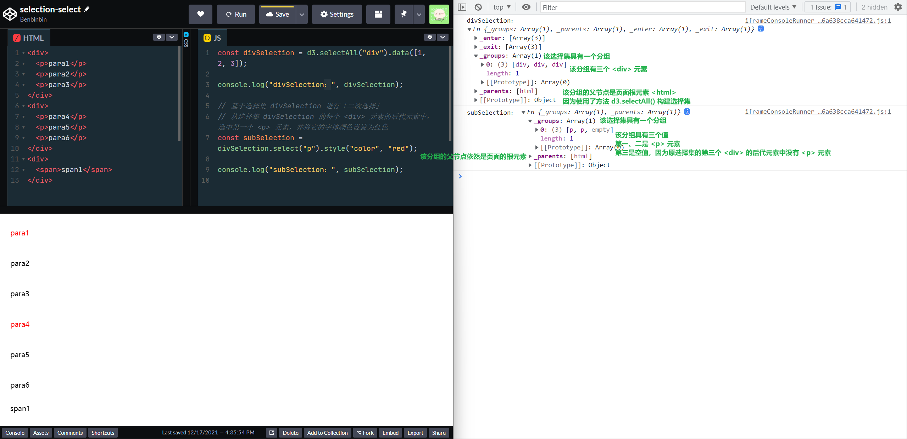

  可以查看相应元素所绑定的数据，可以知道数据从原选择集「传递」到新选择集的相应元素

  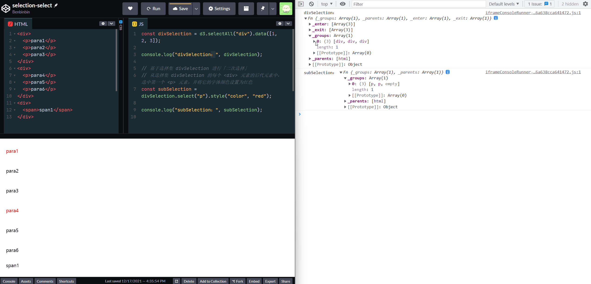

* `selection.selectAll(selector)` 也是针对一个选择集 selection 的每一个元素进行「二次选择」，但是该方法是选中**后代元素**中所有匹配的元素，并返回由这些选中元素所构成的新选择集。

  :warning: 该方法**为原选择集中各元素创建一个分组，且该元素作为该组的父节点**，然后其后代元素被选中的，就作为该组的元素（如果入参 `selector` 为 `null`，或没有匹配的元素，该分组依然被保留，只是其中元素为空）。由于后代元素中匹配条件的可能有多个，所以原来选择集中的各个元素都绑定了相应的数据，**并不会**传递给新选择集中的元素（如果希望为新选择集的元素绑定数据，可以使用方法 `selection.data()` 手动绑定新数据；原来的数据依然绑定在原来的元素上，即在父节点数组 `_parents` 中）

  :bulb: 入参 `selector` 也可以是一个返回（包含多个元素或为空的）数组的函数，可以让选择器有更大的自由度，例如返回的不是该元素的后代元素，而是可以为兄弟元素

  ```js
  // 选择页面的所有 <p> 元素
  // 然后基于该选择集，分别为各 <p> 元素创建一个分组
  // 选中各个 <p> 元素的前后兄弟元素作为各分组的元素
  const sibling = d3.selectAll("p").selectAll(function() {
    return [
      this.previousElementSibling,
      this.nextElementSibling
    ];
  });
  ```

  由于调用该方法会**更新分组**，所以得到的新选择集和原选择集的分组并不相同。

  ```js
  const divSelection = d3.selectAll("div").data([1, 2, 3]);

  console.log("divSelection：", divSelection);

  // 基于选择集 divSelection 进行「二次选择」
  // 为选择集 divSelection 的每个 <div> 元素创建一个分组
  // 选中每个 <div> 元素的所有后代元素 <p> 元素，作为相应分组的元素，并将它们的字体设置为红色
  const subSelection = divSelection.selectAll("p").style("color", "red");

  console.log("subSelection：", subSelection);
  ```

  :hammer: 在 [CodePen](https://codepen.io/benbinbin/pen/zYEwZPw?editors=1010) 查看代码效果，下图是控制台输出的结果

  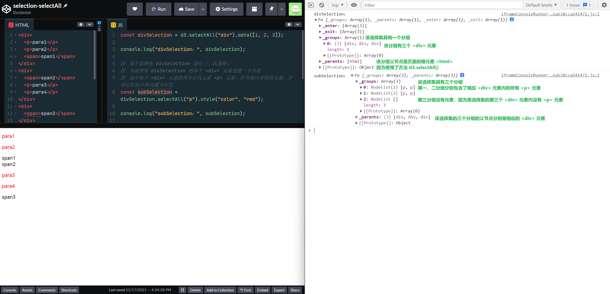

  可以查看相应元素所绑定的数据，可以知道数据从原选择集「传递」到新选择集的相应元素

  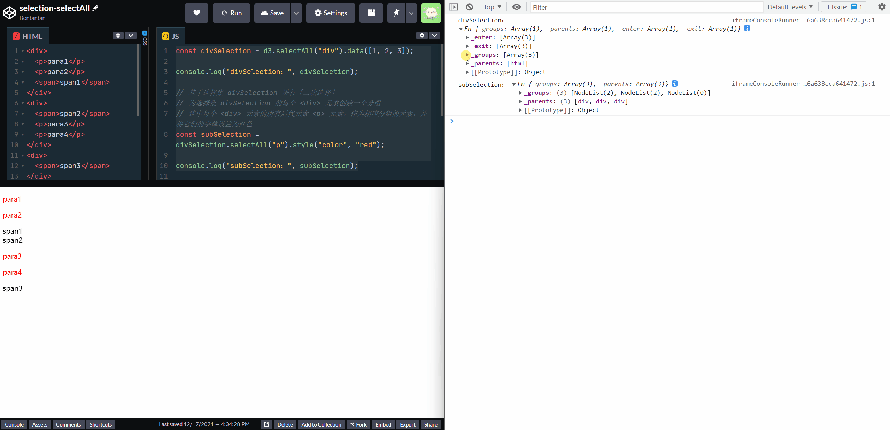

* `selection.selectChild([selector])` 也是针对一个选择集 `selection` 的每一个元素进行「二次选择」，但是该方法是选中**直接子元素**中第一个匹配的元素。如果调用该方法时省略了参数 `selector` 则选择第一个直接子元素。

  :bulb: 类似于方法 `d3.select()`

  :bulb: 入参 `selector` 也可以是一个函数，则原选择集中的（每个分组中的）每个元素的**子元素**都会调用一次该函数，且依次传入三个参数，当函数的返回值为真 truthy 的时候，则选中该子元素。可以让选择器有更大的自由度：
  * 当前遍历的子元素 `child`
  * 当前遍历的子元素在其父元素中的索引 index `i`
  * 当前遍历的子元素所在的父元素，其所有子元素 `children`

* `selection.selectChildren([selector])` 也是针对一个选择集 `selection` 的每一个元素进行「二次选择」，但是该方法是选中**直接子元素**中所有匹配的元素。如果调用该方法时省略了参数 `selector` 则选择所有子元素。

  :bulb: 类似方法 `d3.selectAll()`

  :bulb: 入参 `selector` 也可以是一个函数

D3 还有一些对选择集进行「二次操作」的方法，用以构建出新的选择集：

* `selection.filter(filter)` 对一个选择集 `selection` 进行二次筛选。

  :bulb: 该方法一般是**对选择集的元素直接进行筛选**，而方法 `selection.select()` 和 `selection.selectAll()` 一般是**对选择集元素的后代元素进行筛选**。当然也可以使用函数作为入参，构建更通用的筛选条件。

  入参 `filter` 可以是一个表示 CSS 选择器的字符串，该方法的作用和 `d3.selectAll()` 类似

  ```js
  // 选择表格的偶数行
  const even = d3.selectAll("tr").filter(":nth-child(even)");

  // 类似于以下方法
  const even = d3.selectAll("tr:nth-child(even)");
  ```

  入参 `filter` 也可以是函数，则选择集中的每个元素都会调用该函数，而且依次传入三个参数，当函数返回值为 truthy 真的时候，该元素会被选中到新选择集里：
    * 当前所遍历的元素所绑定的数据 datum `d`
    * 当前所遍历的元素在其分组中的索引次序 index `i`
    * 当前分组中的所有元素 `nodes`

    函数的 `this` 指向当前遍历的元素，即 `nodes[i]`

  :warning: 该方法不会改变选择集的分组（父节点信息得以保留），但是由于该方法和 `Array.filter()` 方法类似，**会将不符合条件的元素被筛掉了**，所以新选择集中的元素的**索引一般会改变**；如果希望新筛选得到的元素（在分组内）[索引（与原选择集索引相比）不变](https://codepen.io/benbinbin/pen/XWeRGQb)，可以使用 `selection.select()` 方法，因为当元素的后代元素匹配为空时，会使用 `null` 作为占位符

  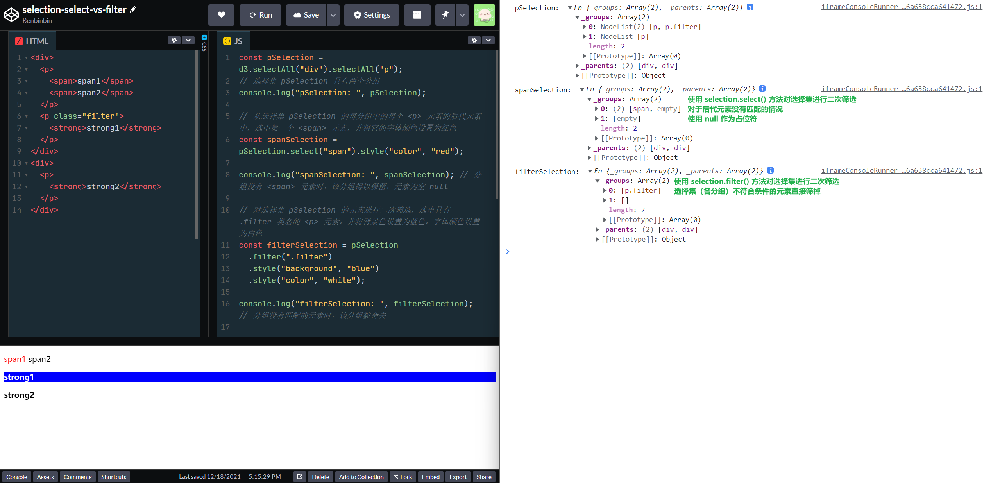

  :bulb: D3 提供了一个方法 `d3.matcher(selector)` 用以创建匹配器。调用它生成一个函数，函数内部的 `this` 指向当前的遍历的元素，如果 `this` 所指向的元素和入参 `selector`（表示 CSS 选择器的一个字符串）匹配的话，函数就返回 `true`

  它一般在以上的 `d3.filter()` 方法的内部使用

  ```js
  const div = selection.filter(d3.matcher("div"));

  // 等价于以下操作
  const div = selection.filter("div");
  ```

* `selection.merge(otherSelection)` 将两个选择集合并，返回的新选择集和原选择集 `selection` **有相同的分组 `_groups` 且分组的父节点 `_parents` 也一样**。

  :warning: 所以两个合并的选择集**一般都有相同的分组和父节点**，如果 `otherSelection` 中有其他分组和父节点，而 `selection` 不具备的，这些分组会被忽略。

  :bulb: 实际上该方法不是用于合并任意两个选择集的，而是**一般在 `selection.join()` 内部调用**，（在绑定数据后）用以合并 updating 选择集和 entering 选择集；当然也可以调用该方法，手动合并两个选择集，但是应该注意合并后元素的顺序受原选择集中元素的索引顺序影响，因此构建原选择集的操作，应该是可以保留元素索引次序，如应该使用 `selection.select()` 方法进行「二次选择」，而不应该使用 `selection.filter()` 方法。如果在 `selection` 和 `otherSelect` 选择集中的相同索引位置都具有元素，则取 `selection` 选择集的元素作为合并后新选择集该位置的元素。

  ```js
  const odd = selection.select(function(d, i) { return i & 1 ? this : null; ));
  const even = selection.select(function(d, i) { return i & 1 ? null : this; ));
  const merged = odd.merge(even);
  ```

  :bulb: 入参也可以是 `transition` 实际也是与 `transition.selection()` 返回的选择集进行合并

除了选择元素，D3 还提供了一个方法 `d3.window(node)` 用以方便地基于目标节点 `node` 获取它所在的窗口对象 `window`

```js
const node = document.getElementById("section");
console.log(node);

const win = d3.window(node);
console.log(d3.window(node));
win.alert("hello");
```

:bulb: 一般选择集的方法最后也会返回一个选择集，便于**链式**调用，但是有的方法返回的是**原选择集**，有的方法会返回一个**新的选择集**，为了方便辨识，习惯在编写代码时采用**不同的缩进**，从而在视觉上进行区分：

  * 对于选择集不变的操作采用**四个空格缩进**（深度缩进，一般是属性样式操作）
  * 如果选择集改变的操作采用**两个空格的缩进**

```js
d3.select("body")
  .append("svg")
    .attr("width", 960)
    .attr("height", 500)
  .append("g")
    .attr("transform", "translate(20,20)")
  .append("rect")
    .attr("width", 920)
    .attr("height", 460);
```

:warning: 选择集是不可变的，所以所有影响选择集中的元素（数量）的操作最后都是返回一个新的选择集，而不是修改原有的选择集。但是元素是可变的，例如样式属性是可以操作的。

选择集还提供了一些方法以获取关于它自身的一些信息：

* `selection.empty()` 返回一个布尔值，以表示选择集是否为空，即其中**不**包含元素

* `selection.nodes()` 返回一个数组，包含选择集所有元素，相当于 `Array.from(selection)`（由于选择集的有一个内置的迭代器 `selection[Symbol.iterator]` 以依次访问所有元素，因此使用 `Array.from()` 也可以获取一个有选择集元素构成的真的数组，也可以直接对选择集进行解构 `[...selection]` 其作用也一样）

* `selection.node()` 返回选择集第一个非空的元素。如果选择集为空，则返回 `null`

* `selection.size()` 返回一个数值，表示选择集中包含多少个非空的元素

### 选择器工作原理
通过调用以上 D3 提供的多种选择器，可以得到相应的选择集，它类似于数组，但并**不是**直接包含选中的元素，而是**先包含了一系列的分组 `_groups`**，再在每个分组中包含相应的一系列匹配条件而被选中的元素。

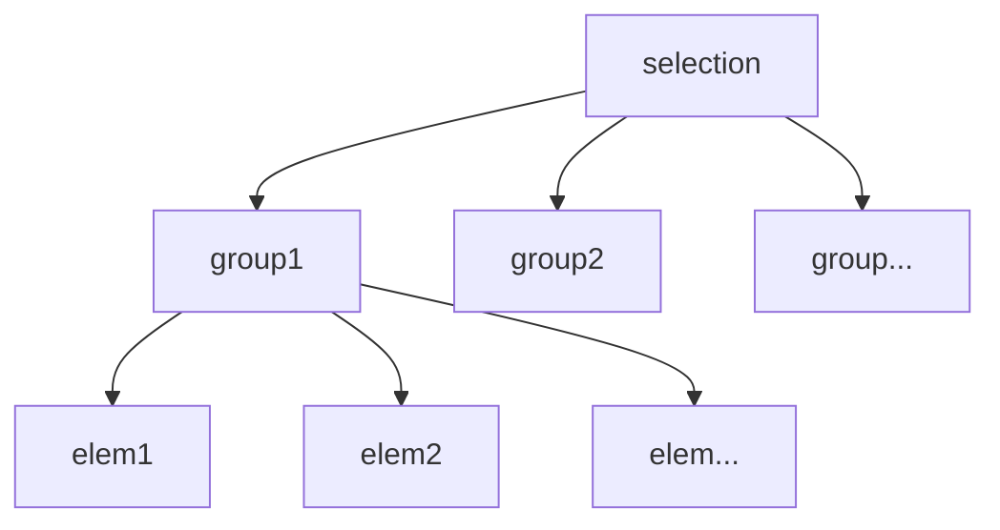

:bulb: 而且选择集还具有属性 `_parents` 用以记录各分组的父节点 parentNode 信息。

:bulb: 此外在选择集的原型 prototype 上还有一系列类似数组的方法，方便我们对选择集进行操作，例如 `selection.sort()` 对选择集的元素进行排序。

以下是 `d3.selection()` 返回的选择集的结构示意图

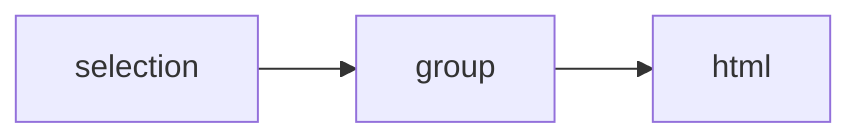

可以在控制台打印出该选择集：
* 属性 `_groups` 中具有一个分组，其中只有一个元素 `<html>` 即页面的根元素
* 属性 `_parents` 包含了各组相应的父节点，由于唯一的分组（具有一个元素是根节点 `<html>`）没有父节点，所以是空 `null`
* 原型 prototype 列出了多种选择集特有的方法，它们一般会返回所操作的选择集，便于进行**链式**调用

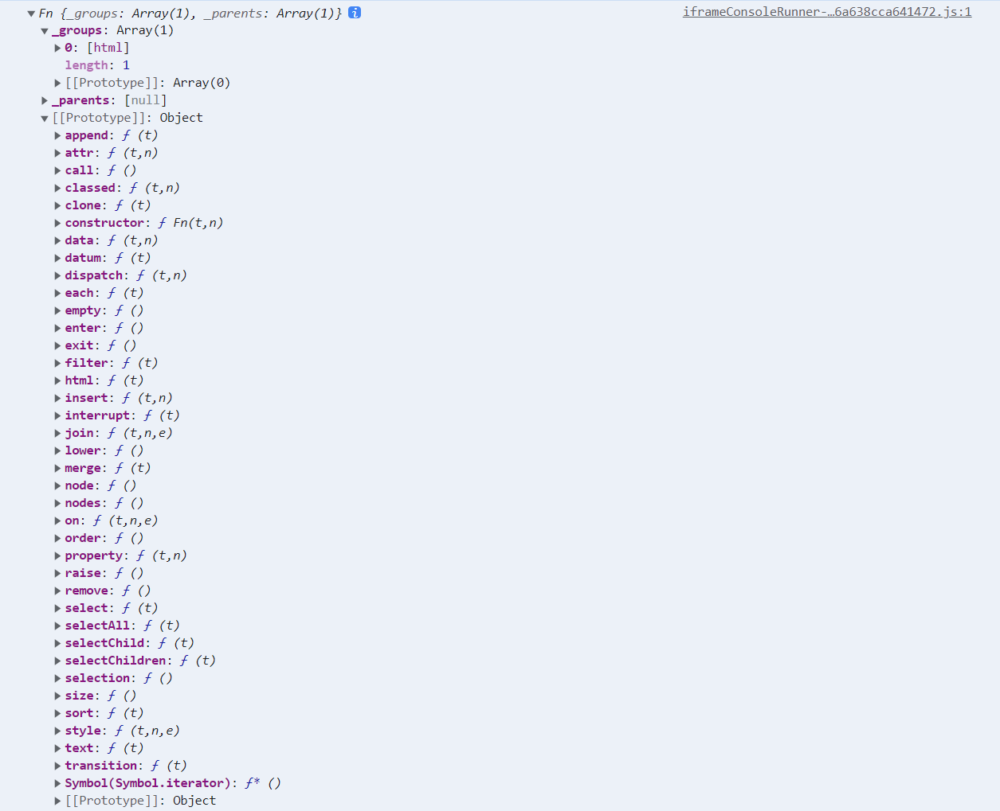

一般情况下，选择集中都只有一个分组，除非进行了[**嵌套选择** Nested Selections 操作](https://bost.ocks.org/mike/nest/)，即使用了 `selection.selectAll()` 方法生成的选择集。

例如使用 `d3.selectAll('td')` 选中页面的所有表格单元格（假设页面只有一个表格，且该表格是一个 4x4 表格），以下图示为选择集的结构，该选择集只有一个分组，由于使用方法 `d3.selectAll()` 所以该分组的父节点是页面的根元素 `<html>` 然后该分组内包含了 16 个 `<td>` 元素

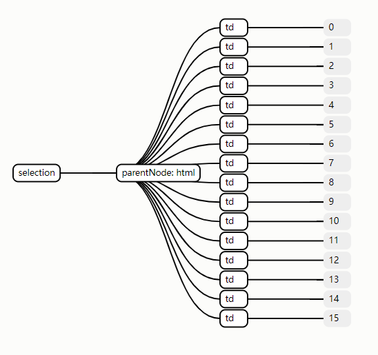

如果采用**嵌套选择**方式，先选中表格的各行，然后对选择集进行「二次选择」，再分别选中各行的单元格 `d3.selectAll('tr').selectAll('td')` 以下图示为选择集的结构，该选择集有四个分组，每个分组的父节点都是相应的行，每个分组内的元素都是相应行的单元格

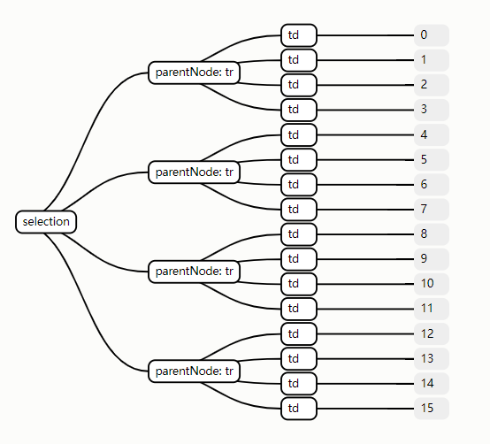

使用以 `selection.selectAll` 进行嵌套选择时，**分组**会变动。**它会为原选择集中的每个元素创建一个分组，然后将各元素被选中的后代元素作为该分组的元素**，以下[动图](https://bost.ocks.org/mike/selection/)演示了该过程

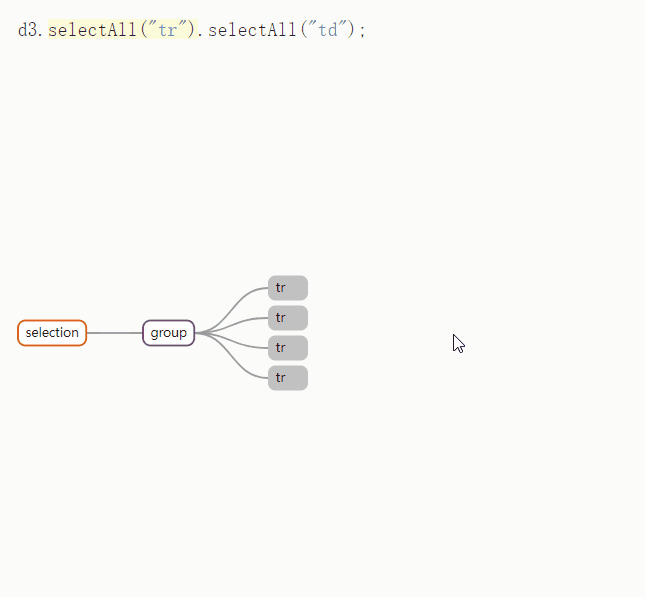

可以进行多次嵌套选择，例如再进一步选择所有单元格内的 `<span>` 元素

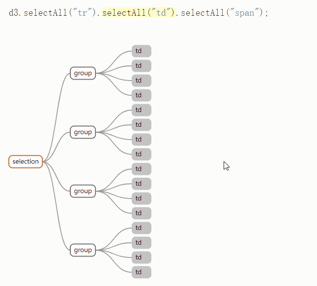

:bulb: 选择集的方法一般都适用于具有单个或多个分组的情况，而且调用选择集方法一般都相同（除了 `selection.data(data)` 当选择集只有一个分组时，入参是一个数组；当选择集具有多个分组时，需要传递的是一个返回数组的函数），D3 在这些方法内部会自动分组依次执行。

以上多种选择元素的方法，按照选择元素的数量，分为两大类：

* `select` 为后缀的方法，最多选择一个元素（按照 DOM 文档的顺序，选中第一个匹配的元素）
* `selectAll` 为后缀的方法，选择所有匹配的元素

以上多种选择元素的方法，按照适用场景不同

* 上述选择元素的方法中，以 `d3` 为前缀的方法，其返回的选择集中只有一个分组 group，且都是以页面的根元素 `<html>` 作为父节点 parentNode
* 从选择集中进行二次选择的方法 `selection.select(selector)` **分组不变**，即各组的父节点不变
* 从选择集中进行二次选择的方法 `selection.selectAll(selector)` **会更新分组**，依据原选择集的每个元素创建作为一个分组，且这些元素分别作为各自组的父节点

| 方法 | 分组（父节点） | 适用范围 |
| :--: | :--: | :--: |
| `d3.selection()` | 一个分组（`null`） | 选择页面的根节点 `<html>` |
| `d3.select(selector)` | 一个分组（`<html>`） | 选择页面第一个匹配条件 `selector` 的元素 |
| `d3.selectAll(selector)` | 一个分组（`<html>`） | 选择页面所有匹配条件 `selector` 的元素 |
| `selection.select(selector)` | 和原选择集分组一样（不变） | 基于原选择集的元素，在各元素的后代元素中进行二次选择，各元素都替换为一个匹配条件 `selector` 的后代元素 |
| `selection.selectAll(selector)` | 为原选择集的每个元素创建一个分组（原选择集的各元素作为各分组的父节点） | 基于原选择集的元素，在各元素的后代元素中进行二次选择，各分组包含所有匹配条件 `selector` 的后代元素 |
| `selection.selectChild([selector])` | 和原选择集分组一样（不变） | 基于原选择集的元素，在各元素的直接子元素中进行二次选择，各元素都替换为一个匹配条件 `selector` 的子元素 |
| `selection.selectChildren([selector])` | 为原选择集的每个元素创建一个分组（原选择集的各元素作为各分组的父节点） | 基于原选择集的元素，在各元素的直接子元素中进行二次选择，各分组包含所有匹配条件 selector 的子元素 |
| `selection.filter(filter)` | 和原选择集分组一样（不变） | 对原选择集的元素进行二次选择 |
| `selection.merge(otherSelection)` | 和原选择集分组一样（不变） | 合并两个选择集，一般在数据绑定后用于合并 updating 选择集和 entering 选择集 |

## 修改属性
选择集的原型 prototype 上有很多方法，有一部分是用来修改元素的样式 style、特性 attribute 或属性 property 以便对元素进行各种设置与变换

:bulb: 这些方法一般都还会返回当前操作的选择集，便于进行**链式**调用：

* `selection.attr(name[, value])` 为选择集中的元素添加值为 `value` 名字为 `name` 的特性。其中 `value` 参数可以是一个常量值；也可以是一个返回值的函数，该函数会被每一个元素调用，并依次传入三个参数（选择集的其他方法如果支持传入函数作为参数，一般也都是依次传入这三个参数）：
  * 当前所遍历的元素所绑定的数据 datum `d`
  * 当前所遍历的元素在其分组中的索引 index `i`
  * 当前所遍历的元素其所属分组的所有元素 `nodes`

  而函数内的 `this` 指向当前遍历的元素，即 `nodes[i]`

  :bulb: 如果 `value` 为 `null` 将移除该元素的 `name` 特定

  :bulb: 如果没有传入参数 `value` 则返回选择集中第一个具有属性 `name` 的属性值，一般是在选择集中只有一个元素时才这么用

  :bulb: 参数 `name` 可以具有命名空间前缀，例如 `xlink:href` 用以设置 `<svg>` 元素。但是所使用的命名空间需要先在 `d3.namespaces` 中进行注册，D3 内置的已注册的命名空间如下：

  ```js
  {
    svg: "http://www.w3.org/2000/svg",
    xhtml: "http://www.w3.org/1999/xhtml",
    xlink: "http://www.w3.org/1999/xlink",
    xml: "http://www.w3.org/XML/1998/namespace",
    xmlns: "http://www.w3.org/2000/xmlns/"
  }
  ```

  ```js
  // 注册一个新的命名空间
  d3.namespaces.newspace = "https://benbinbin.github.io/"
  ```

* `selection.classed(names[, value])` 为选择集中的元素设置 CSS 的类属性，其中第二个可选参数是布尔值，用以控制在 `class` 中添加还是移除 `name`

  :bulb: 参数 `name` 可以是包含多个类名，它们**用空格分隔**

  ```js
  // 在选择集的元素的类属性中添加 foo 和 bar 类名
  selection.classed("foo bar", true)
  ```

  :bulb: 参数 `value` 也可以是一个返回布尔值的函数，元素分别调用该函数，并依次传入三个参数

  :bulb: 如果调用该方法时，没有传入可选参数 `value` 则基于选择集的第一个非空元素是否具有 `name` 类名的情况，返回一个布尔值。这种用法一般适用于选择集中只有一个元素的情况，可以方便地了解特定的类名是否在相应的元素上。

* `selection.style(name[, value[, priority]])` 为选择集中的元素设置样式。其中第三个可选参数是用以设置新增的样式的**优先级**，默认值是 `null`，还可以设置为 `import`（没有感叹号 `!`）以为新增的样式赋予最高优先级

  :bulb: 参数 `value` 也可以是一个返回样式属性值的函数，元素分别调用该函数，并依次传入三个参数

  :bulb: 如果参数 `value` 的值是 `null` 则会移除元素的 `name` 样式

  :bulb: 如果调用该方法时，没有传入可选参数 `value` 则返回选择集的第一个元素的样式 `name` 的值

  :warning: CSS 的一些样式值应该带**单位**才有效，如设置宽度时 `3px`

* `selection.property(name[, value])` 为选择集中的元素添加值为 `value` 名字为 `name` 的属性。

  :bulb: 一般和 `selection.attr()` 方法通用，但是对于一个节点的属性，没有对应的标签属性，只能使用该方法，例如文本框的 `value` 属性，复选框的 `checked` 属性

  :bulb: 参数 `value` 也可以是一个返回属性值的函数，元素分别调用该函数，并依次传入三个参数

  :bulb: 如果参数 `value` 的值是 `null` 则会移除元素的 `name` 属性

  :bulb: 如果调用该方法时，没有传入可选参数 `value` 则返回选择集的第一个元素的属性 `name` 的属性值

除了设置元素的属性样式，选择集还提供了方法设置元素的内容：

* `selection.text([value])` 为选择集中的元素设置文本内容，即把元素的 innerText 设置为参数 `value`

  :bulb: 参数 `value` 也可以是一个返回文本内容的函数，元素分别调用该函数，并依次传入三个参数

  :bulb: 如果调用该方法时，没有传入可选参数 `value` 则返回选择集的第一个元素的文本内容

* `selection.html([value])` 为选择集中的元素设置 innerHTML 该方法一般仅用于为元素内部设置小片段的 HTML 内容（富文本内容）

  :bulb: 该方法只适用于选择集中的元素是 HTML 元素，而不能是 SVG 元素

  :bulb: 如果希望在元素内增添其他元素，可以使用方法 `selection.append()` 或 `selection.insert()` 这些方法还可以从父元素继承数据，实现数据驱动生成指定的内容 data-driven content

## 增删元素
选择集除了可以设置页面原有的元素，还有方法为页面增删元素：

* `selection.append(type)` 一般用于在选择集（各分组）的各元素内添加一个子元素，其中 `type` 是指 HTML 或 SVG 的标签名称，该新增的元素作为最后一个子元素。该方法最后返回的也是一个包含所有新增元素的选择集，便于后续进行**链式**调用。

  :bulb: 参数 `type` 可以是一个返回一个元素的函数，选择集的元素会分别调用该方法，并依次传入三个参数：
    * 当前所遍历的元素所绑定的数据 datum `d`
    * 当前所遍历的元素在其分组中的索引 index `i`
    * 当前所遍历的元素其所属分组的所有元素 `nodes`

    而函数内的 `this` 指向当前遍历的元素，即 `nodes[i]`

  ```js
  d3.selectAll("div").append(() => document.createElement("p"));
  ```

  函数的返回值也可以是一个已存在节点，其效果一样

  ```js
  // 和上一个代码片段作用一样
  d3.selectAll("div").select(function() {
    return this.appendChild(document.createElement("p"));
  });
  ```

  :bulb: 由于该操作是在元素内仅插入**一个子元素**，所以会类似 `selection.select()` 方法一样，[**继承**其父元素所绑定的数据](https://codepen.io/benbinbin/pen/abLwmXL)（假如父元素有绑定的数据，即元素具有属性 `__data__`）

  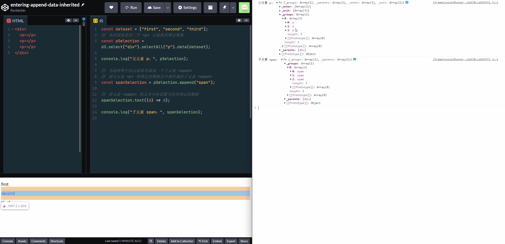

  :bulb: 如果 `selection` 是 entering 选择集，因为选择集在绑定数据时，元素和数据的数量并不一定一一对应，当一些数据多出来时，即无法在当前页面的找到元素与之匹配，所以会先使用占位符 placeholder 来表示，这些「虚拟节点」构成了 entering 选择集。然后[使用该方法将这些虚拟节点添加到页面上](https://codepen.io/benbinbin/pen/yLzXJNE)，**这些新增的元素和 updating 选择集的元素是兄弟元素的关系**，它们的顺序与所绑定的数据**在其数组中的顺序一样**。

  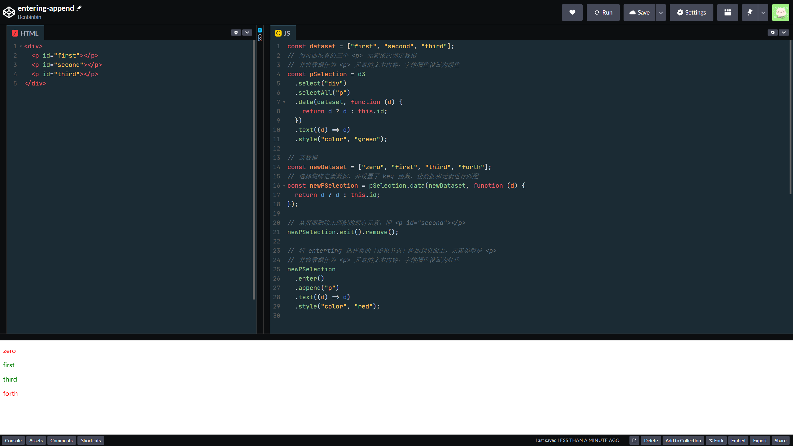

  *但是对于 updating 选择集中的元素，如果在新绑定的数组中，它们所对应的数据的索引发生了变化时，页面的相应元素的次序并不会更新，因为它们是可复用的一些元素，需要手动调用 `selection.order()` 来重排元素以刷新。*

* `selection.insert(type[, beforeSelector ])` 用于在选择集的各元素内添加一个子元素，与方法 `selection.append()` 类似，但它更通用因为第二个参数 `beforeSelector` 是一个 CSS 选择器来设定新增的子元素的放置在任意的位置，该可选参数 `beforeSelector` 的默认值是 `null` 其效果和方法 `selection.append()` 一样。该方法最后返回的也是一个包含所有新增元素的选择集，便于后续进行**链式**调用。

  ```js
  d3.selectAll("div").insert("p");
  ```

  如果设置为 `:first-child` 则新增的子元素会在原来元素的第一个子元素**之前**，即最后新增 prepend 的元素会作为第一个子元素。

  :bulb: 参数 `type` 和 `beforeSelector` 都可以是一个函数，它们分别返回一个将要插入到页面的子元素，和一个作为定位参考的子元素（新增的子元素会被添加到该元素前）

  ```js
  // 和上一个代码片段作用一样
  d3.selectAll("div").insert(() => document.createElement("p"));
  ```

  :bulb: 新增的子元素也是会继承其父元素所绑定的数据（假如父元素有绑定的数据）

* `selection.clone([deep])` 用以拷贝选择集的元素，即在页面上，在选择集的每个元素后添加它的拷贝。其中**当可选参数 `deep` 为 truthy 真时，该元素的[所有后代元素都会被拷贝](https://codepen.io/benbinbin/pen/WNZOOqa)**；否则就只会拷贝元素标签本身（不包含其子元素，甚至也不包含其文本内容）。最后该方法返回一个包含新增到页面的所有拷贝的新选择集，便于后续进行**链式**调用。

  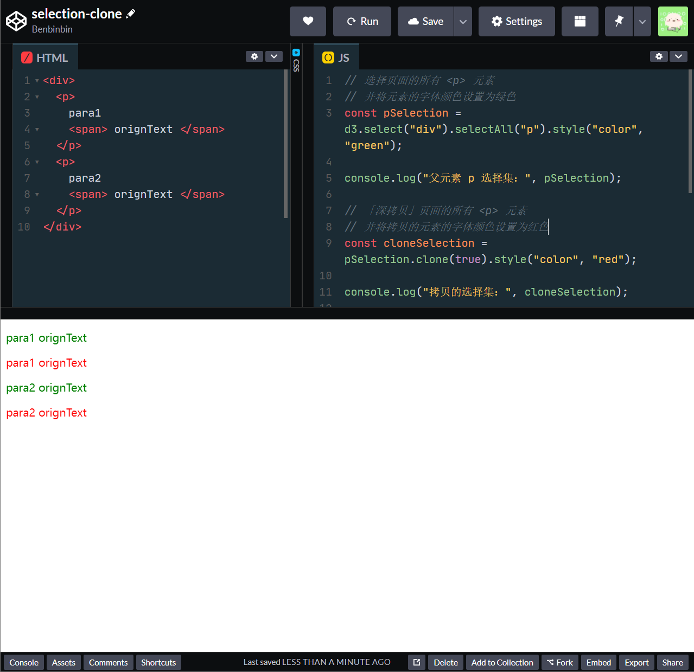

* `selection.remove()` 将选择集中的元素从页面移除，一般用在 exiting 选择集。该方法最后依然返回该选择集，其中包含的元素都已经从页面移除

  因为选择集在绑定数据时，元素和数据的数量并不一定一一对应，当选择集中的元素在新数组中没有相匹配的数据（一般使用了 key 函数来进行数据与元素的匹配），它们被划分到 exiting 选择集，然后使用方法 `selection.remove()` 将它们从页面移除

  :bulb: D3 目前还没有提供一个 API 把已移除的元素添加回页面，可以先使用变量存储 `selection.remove()` 返回的选择集，然后使用 `selection.append()` 或 `selection.insert()` 等方法将它们添加回页面中。

* `d3.create(name)` 创建一个元素，该标签的类型是 `name`，它是脱离当前页面文档流的，一般用于创建一个起始的 SVG 元素上

  ```js
  d3.create("svg")
  ```

  :bulb: 如果创建其他 SVG 元素，应该显式地指明其命名空间，例如创建一个 `<g>` 元素，应该使用 `d3.create("svg:g")`（如果使用 `d3.create("g")` 则是创建一个 HTML G 不标准的元素），如果创建 SVG 元素，可以使以上代码片段的简写方式，也可以使用显式声明命名空间的方式 `d3.create("svg:svg")`

  :bulb: D3 提供了方法 `d3.creator(name)` 以获得一个创建元素的生成器，该生成器会返回一个元素，标签类型是 `name`，它一般在方法 `selection.append()` 和 `selection.insert()` 内自动被调用。

## 元素排序
选择集还有提供了方法对其中的元素进行排序：

* `selection.sort(compareFunc)` 分别对选择集的各个分组的元素执行排序操作，最后返回一个重排后的选择集，并更新页面元素的顺序（**在内部自动调用 `selection.order()` 方法**，重新将新选择集的元素，**替代**页面上原选择集所对应的元素）。

  参数 `compareFunc` 是对比函数，它的作用和数组的排序方法 `Array.sort(compareFunc)` 的参数类似，该对比函数接收两个入参，假设是 `a` 和 `b`，分别表示将要比对的选择集中的两个元素所绑定的数据，**返回三个类型的值，分别表示这三种比对结果**：
  * 当返回正值（一般是 `1`），表示 `a` 大于 `b`（由于默认**按照[升序 ascending](https://codepen.io/benbinbin/pen/eYGRraB) 排列**，所以最后的效果是数据 `a` 对应的元素会排在后面）
  * 当返回负值（一般是 `-1`），表示 `a` 小于 `b`（所以数据 `a` 对应的元素会排在前面）
  * 当返回 `0`，表示 `a` 和 `b` 相等（最后这两个数据所对应的元素在页面的排序是随机的）

  ```js
  compareFunc((a, b) => {
    // 假设 a 和 b 数据类型就是数值
    return a - b
  })
  ```

* `selection.order()` 重新将选择集的元素插入页面（覆盖替换原来的元素），以让选择集的元素的顺序和它们所绑定的数据在数组中的索引顺序保持一致。

  :bulb: 当选择集进行数据的绑定时，**会存在 updating 选择集的元素无法更新位置，无法保持与它们所对应的数据在新数组中索引一致**的情况。这是因为 D3 会复用 updating 选择集的元素（以便提高性能），对于 updating 选择集中的元素，如果在新绑定的数组中，它们所对应的数据的索引发生了变化时，页面的相应元素的次序并不会更新，**此时就需要调用 `selection.order()` 来重排元素以刷新**。

  :bulb: [它一般在选择集绑定新数据后调用，以更新 updating 选择集在页面的元素的顺序](https://codepen.io/benbinbin/pen/GRMEBpZ)

* `selection.raise()` 和 `selection.lower()` 重新将选择集的元素插入页面（覆盖替换原来的元素），（不一定是原位替换）[作为其分组的**父节点**的子元素](https://codepen.io/benbinbin/pen/JjrJBpj)。如果使用 `raise` 则采用 append 方式，即这些元素依次作为父节点的最后一个子元素插入回页面；如果使用 `lower` 则采用 prepend 方式，即这些元素依次作为父节点的第一个子元素插入回页面

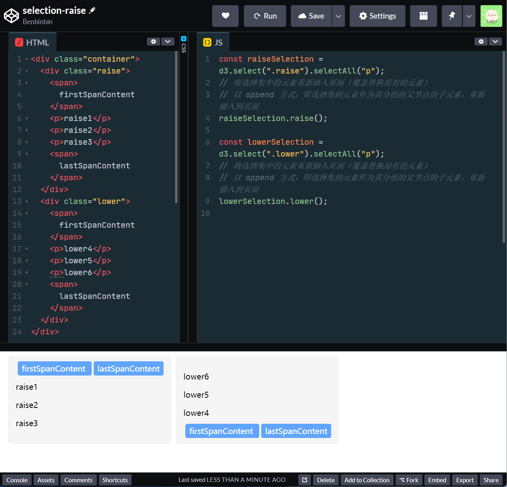

## 绑定数据
当我们获得了选择集后，下一步一般是**将元素与数据进行绑定**，这样数据就会添加到 DOM 元素的 `__data__` 属性中，即特定的数据就和特定的元素「结合」在一起了（即使清空了选择集，再次重新选择元素，D3 也可以读取到原来绑定的数据）

使用方法 `selection.data([data[, key]])` 为选择集中的元素绑定数据，根据选择集中分组 group 的数量不同，该方法的参数 `data` 要求也不同：

* 如果选择集中含有多个分组（使用方法 `selection.selectAll()` **嵌套选择**生成的选择集可能含有多个分组），则入参 `data` 应该是一个返回数组的函数，每一个分组都会调用该方法，并依次传入三个参数：

  * 当前所遍历的分组的父节点所绑定的数据 datum `d`
  * 当前所遍历的分组的索引 index `i`
  * 选择集的所有父节点 parent nodes `nodes`

  其中函数内的 `this` 指向当前所遍历的分组的父节点，即与 `nodes[i]` 相同

  最后该函数返回一个数组，然后该数组的元素就用于与该分组的元素进行绑定

  例如[为一个 4x4 的表格的各单元格绑定数据](https://codepen.io/benbinbin/pen/RwLgmRv)，其中选择集是具有多个分组，每一个分组就是一行，每一个分组内的元素就是每一个行相应的单元格

  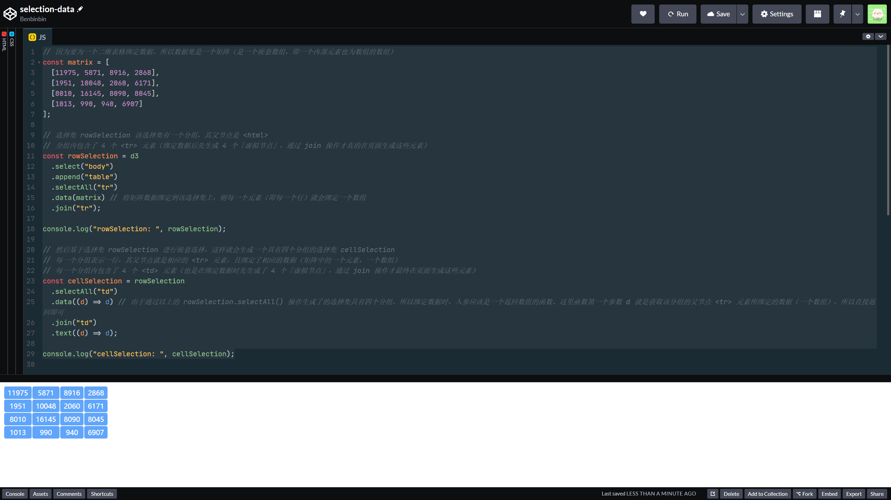

* 如果选择集中只有一个分组，则入参 `data` 应该是一个数组，该数组会与选择集中的元素进行绑定。

  :bulb: 需要绑定的数组里的元素可以是任意类型的数据，可以是一个数值，或是一个对象都行。

**默认基于索引**来对选择集中的元素和数组中的数据进行匹配 join-by-index，即选择集的第一个元素和数组的第一个数据进行绑定，并依次类推，但我们可以**通过第二个入参 `key` 来自定义匹配规则**。

第二个参数 `key` 是一个返回一个字符串作为标识符的函数，该函数会被**元素**和**数据**依次调用，以**分别计算出表示各元素的键/标识符，和表示数据的键/标识符**，如果两者的键匹配，则它们就会配对绑定。

:bulb: 如果有多个元素具有同一个键，则多出来的元素会被放到 exiting 选择集中；如果多个数据具有同一个键，则多出来的数据所对应的「虚拟节点」会被放到 entering 选择集中

当 `key` 函数被元素调用时，会依次传入三个参数：

:bulb: 此时函数内的 `this` 指向当前所遍历的元素，即与 `node[i]` 相同。

:bulb: 最后函数返回的字符串作为该元素的标识符/键

* 当前所遍历的元素（在之前）已绑定的数据 datum `d`
* 当前所遍历的元素在分组中的索引 index `i`
* 当前所遍历的元素所在的分组中所有元素 `nodes`

当 `key` 函数被数据调用时，也会依次传入三个参数：

:bulb: 此时函数内部的 `this` 指向的是该分组的父节点 parent node

:bulb: 最后函数返回的字符串作为该数据的标识符/键

* 当前所遍历的数据 datum `d`
* 当前所遍历的数据在数组中的索引 index `i`
* 整个数组 `arr`

```HTML
<!-- 页面当前已有的元素 -->
<div id="Ford"></div>
<div id="Jarrah"></div>
<div id="Kwon"></div>
<div id="Locke"></div>
<div id="Reyes"></div>
<div id="Shephard"></div>
```

```js
const data = [
  {name: "Locke", number: 4},
  {name: "Reyes", number: 8},
  {name: "Ford", number: 15},
  {name: "Jarrah", number: 16},
  {name: "Shephard", number: 23},
  {name: "Kwon", number: 42}
];

d3.selectAll("div")
  .data(data, function(d) {
    // key 函数，如果传入的 d 存在，则取其属性 name 作为键
    // 否则取元素的 id 属性（这是一个回退操作，因为在初始时，元素还没有绑定数据，所以 d 是 undefined）
    return d ? d.name : this.id;
  })
    .text(d => d.number);
```

以上示例的 key 函数会依次被元素和数据调用，共执行 10 次。

元素在绑定数据时，并不一定是一一对应的，可能会出现节点和数据元素个数不匹配的问题，针对这个问题，D3 提出三个概念：

* 如果 DOM 节点多出来，则未绑定数据的节点会进入名为 ==exiting 选择集==（准备从页面「离去」的节点，一般在后续操作中删除）
* 如果数据元素多出来了，则对应多出来的「虚拟节点」会进入名为 ==entering 选择集==（一般会在后续操作中实例化这些 DOM 节点，并插入在页面的相应位置）
* 可与数据对应上的 DOM 节点，进入名为 ==updating 选择集==，它是默认选择集，即 `selection.data()` 方法返回的对象就是 update 选择集（而 **enter 选择集和 exit 选择集需要调用该对象的 `enter()` 和 `exit()` 方法才能获得**）

:bulb: 在绑定数据后，D3 没有立即更新（增删）页面节点，而是生成 3 个选择集，这样为数据可视化提供了更大的灵活度和可定制性，例如对于 exiting 选择集的节点，可以在删除时设置一些淡出的动效；对于 entering 选择集的节点可以设置不一样的颜色，高亮出来它们是新增到页面上的

:bulb: 选择集绑定数据后，返回的[三个选择集 entering、exiting、updating 其中的**元素次序**会有所不同](https://codepen.io/benbinbin/pen/KKXvNMV)：

* 其中选择集 entering 和 updating 中元素会根据其绑定的数据在新数组中的索引顺序进行排列，而且会在相应的位置「留空」（使用 `null` 作为占位符），便于后续两者合并 merge
* 而 exiting 选择集会根据其原来绑定的数据在原来的数组中的位置来排序，也是在相应的位置「留空」，以便保持元素原有的索引值。

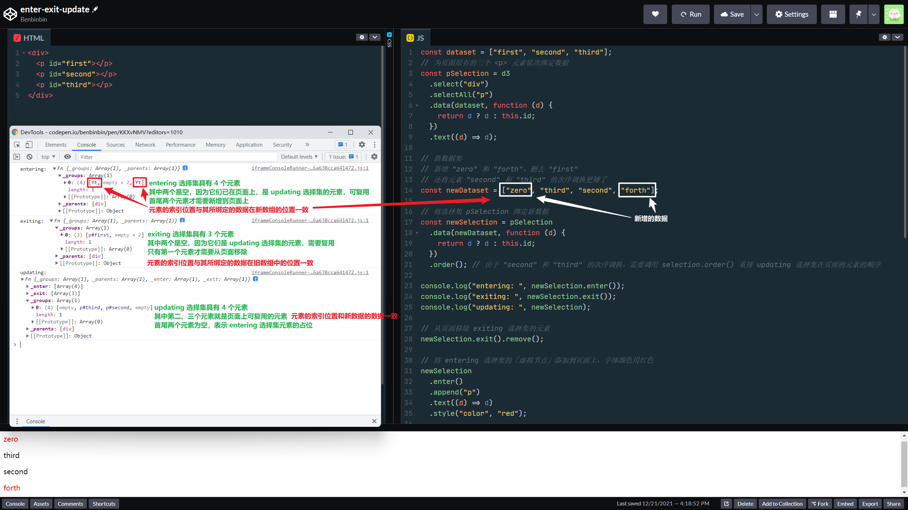

然后将 entering 选择集的「虚拟节点」添加 append 到页面时，元素会基于索引顺序「混入」页面的 updating 选择集的元素中（作为兄弟元素），这样可以确保最后**页面的元素顺序与它们所绑定的数据在数组顺序一致**。

:warning: 但是由于 D3 会复用 updating 选择集的元素（以便提高性能），对于 updating 选择集中的元素，如果在新绑定的数组中，它们所对应的数据的索引发生了变化时，页面的相应元素的次序并不会更新，如果不进行「重排」，可能造成最后页面的元素无法与它们所绑定的数据在数组顺序一致。**因此一般在选择集绑定新数据后[调用 `selection.order()` 方法](https://codepen.io/benbinbin/pen/KKXvNMV)**，以更新 updating 选择集在页面的元素的顺序

### 旧方法 enter-update-exit
然后对不同的选择集采用不同的操作，这样就可以根据数据元素动态增删 DOM 元素，流程一般如下（以下 `selection` 表示选择集）：

* 移除 exiting 选择集中对应的页面上的 DOM 节点 `selection.exit().remove()`
* 添加 entering 选择集中的虚拟节点到页面上 `enter = selection.enter().append('tagName')`
* 合并 entering 和 updating 选择集（updating 选择集就在原来的 `selection` 中）`enter.merge(selection)`，这样**返回的选择集与新数据就完全一一对应**，之后可以方便地对新数据所对应的 DOM 节点进行统一的样式设置

```js
const circle = d3.selectAll('circle').data(anotherDataset)
    .style('fill', 'blue'); // 该样式设置只会对 updating 选择集生效

circle.exit().remove(); // 移除 exiting 选择集中对应的 DOM 节点

circle = circle.enter()
    .append('circle') // 添加 entering 选择集中对应的虚拟节点到页面
    .style('fill', 'green') // 设置 entering 选择集中的节点样式
    .merge(circle)  // 合并 entering 和 updating 选择集
    .style('stroke', 'black'); // 设置合并后选择集中的节点样式
```

:bulb: 一般会在使用方法 `append()` 添加完节点之后，将 entering 选择集与 updating 选择集进行**合并 [merged](https://github.com/d3/d3-selection/#selection_merge)**，这样后续操作就可以同时应用到 entering 选择集与 updating 选择集（这是旧方法，请参照下面更简洁的新方法）

### 新方法 join
D3 新增了一种[方法 `join()`](https://github.com/d3/d3-selection/#selection_join)，它将自动对 updating 选择集的元素进行重排，对 exiting 选择集中的元素进行删除，并自动为页面添加 entering 选择集中的虚拟节点，**最后返回 entering 选择集和 updating 选择集合并在一起的选择集**

```js
d3..selectAll('circle')
    .data(newDataset)
    .join('circle')   // 返回 entering 和 updating 选择集的合并集
      // 然后可以对绑定了新数据的 DOM 节点进行整体样式设置
      .attr('r', radius)
```

:bulb: 如果希望对 exiting 选择集、entering 选择集或 updating 选择集**分别进行操作**，可以在方法 `join` 中依此传递相应的函数。

其中第一个入参的函数**必须返回一个选择集**，它表示 entering 选择集； 而第二个入参的函数也**必须返回一个选择集**，它表示 updating 选择集；然后 D3 在该方法的内部自动**将这两个选择集进行合并 merge**，并返回该合并后的选择集，便于后续**链式**调用。:bulb: 如果这两个入参函数返回的是一个 `transition` 过渡控制器，则该方法会自动提取过渡控制器所对应的选择集，再进行合并。

```js
d3.selectAll('circle')
  .data(newData, d => d)
  .join(
    // 第一个传递的函数入参是 entering 选择集
    enter => {
      //  entering selection handler
      // 最后需要返回 entering 选择集实例化的节点，以便 join 方法最后将它以 updating 选择集进行合并
      return enter.append('circle')
    },
    // 第二个传递的函数入参是 updating 选择集
    update => {
        // updating selection handler
        update.attr("fill", "blue")
    }
    exit => {
      // exiting selection handler
      exit.remove() // 将 exiting 选择集对应的节点从页面删除
    }
  )
  // 最后 join() 返回 entering 和 updating 的合并选择集
  // 可以链式调用继续进行其他操作......
```

如果仅仅想修改元素绑定的数据（包括清空绑定的数据），而不是想通过数据驱动页面元素的更新，可以使用方法 `selection.datum([value])` 来为选择集的元素设置 `__data__` 属性，该方法并不会影响 entering 和 exiting 选择集。

如果参数 `value` 是常量，则选择集的所有元素的所绑定的数据都被设成该值。

如果入参 `value` 是一个函数，则选择集的元素会分别调用该函数，并依次传入三个参数：

* 当前所遍历的元素（之前）绑定的数据 datum `d`
* 当前所遍历的元素在分组中的索引 index `i`
* 当前分组的所有节点 nodes

函数内部的 `this` 指向当前所遍历的元素，即与 `nodes[i]` 相同

然后该函数返回的值就会被用于更新当前元素所绑定的数据。

:bulb: 如果想清空元素所绑定的数据，可以将参数 `value` 设置为 `null`

:bulb: 如果调用该方法时，没有传递参数 `value`，则返回选择集第一个元素所绑定的数据。这种用法一般用于选择集只用一个元素的情况。

## 处理事件
选择集提供了一些方法为其中的元素添加事件监听器，还可以在特定的元素上分发事件。

* `selection.on(typenames[, listener[, options]])` 为选择集的元素设置事件监听器，监听相应的事件 `typenames` 并执行相应的回调操作 `listener`：

  第一个参数 `typeNames` 表示需要监听的事件，可以是任何浏览器支持的 [DOM event](https://developer.mozilla.org/en-US/docs/Web/Events#Standard_events) 之一。

  :bulb: 此外还可以为事件添加名称 `name`，以 `.` 连接作为后缀，例如 `click.foo` 和 `click.bar`，这样就**可以为同一类型的事件注册多个处理函数**

  :bulb: 如果希望**同一个回调操作响应多种事件**，可以在设置监听器的 `typeNames` 时将多种事件用空格分开，例如 `input change` 或 `click.foo click.bar`

  第二个（可选）参数 `listener` 是回调函数，当相关的事件在选择集的某个元素上被触发 dispatch，该回调函数就会被执行，而且会传入三个参数：
    * 事件对象 `event`
    * 当前元素所绑定的数据 datum `d` :bulb: 该数据是「最新」值，而不一定是绑定的原始数据，因为有时候元素绑定的是一个动态值

    而函数内的 `this` 指向该元素，即与 `event.currentTarget` 相同

  :bulb: 如果希望移除特定事件的监听器，可以将参数 `listener` 设置为 `null`，例如移除所有过渡名称为 `foo` 的过渡事件监听器 `selection.on('.foo', null)`，移除所有过渡事件监听器 `selection.on('.', null)`

  第三个（可选）参数 `options` 是[事件的配置选项](https://developer.mozilla.org/en-US/docs/Web/API/EventTarget/addEventListener)，例如希望事件在捕获阶段时触发回调函数，则可以传递 `{capture: true}` 对象作为第三个入参

  :bulb: 可以通过 `event.pageX` 和 `event.pageY` 获取事件发生时鼠标的坐标。如果需要使用相对（元素）坐标，则可以使用 `d3.pointer(event[, target])` 它返回一个具有两个元素的数组 `[x, y]` 分别表示特定事件（可以是[鼠标事件 MouseEvent](https://developer.mozilla.org/en-US/docs/Web/API/MouseEvent)、[指针事件 PointerEvent](https://developer.mozilla.org/en-US/docs/Web/API/PointerEvent)、[触摸事件 Touch](https://www.w3.org/TR/touch-events/#touch-interface) 或任何自定义的 UI 事件）触发时，鼠标的相对于目标元素 `target` （左上角）的坐标值。对于触摸事件还有一个类似的方法 `d3.pointers(event[, target])` 不过它返回的是一个包含一系列坐标点的数组 `[[x0, y0], [x1, y1]…]`

* `selection.dispatch(type[, parameters])` 依次在选择集的元素上分发特定类型 `type` 的事件。

  第二个（可选）参数是事件的配置选项，可以是包含以下属性：
  * `bubbles` 如果为 `true` 则表示事件可以冒泡（事件可以往其父元素传递）
  * `cancelable` 如果为 `true` 则可以在回调函数中取消该事件的默认行为 `event.preventDefault`
  * `detail` 为事件设置一些自定义数据

## 其他方法
选择集还有一些其他的方法，用以方便地基于其中的元素执行更通用的操作。

* `selection.each(func)` 选择集中的每个元素都调用一次函数 `func` 执行相应的操作。在调用入参函数时，会依次传递三个参数：
  * 当前所遍历的元素所绑定的数据 datum `d`
  * 当前所遍历的元素在分组中的索引 index `i`
  * 当前分组的所有节点 `nodes`

  函数内的 `this` 指向当前所遍历的元素，即相当于 `nodes[i]`

* `selection.call(func[, arguments…])` 执行一次函数 `func`，而且**将选择集作为第一个入参传递给 `func`**，而其他传入的参数 `arguments...` 同样传给 `func`，最后返回当前选择集，这样是为了便于后续进行**链式**调用。

  :bulb: 它类似 JS 的原生[方法 `call`](https://developer.mozilla.org/zh-CN/docs/Web/JavaScript/Reference/Global_Objects/Function/call)，`selection.call()` 接受多个入参，其中**第一个参数是需要执行的目标函数**，之后的参数就是需要传递给目标函数的一些参数，其[源码](https://github.com/d3/d3-selection/blob/main/src/selection/call.js)如下：

  ```js
  export default function() {
    var callback = arguments[0];
    arguments[0] = this;
    callback.apply(null, arguments);
    return this;
  }
  ```

  比较特别的是在 `selection.call(func, otherArguments)` 方法内部，替换了 `arguments` 的第一个元素，改为当前选择集，相当于将选择集和 `otherArguments` 整合为系列参数，再传递给目标函数。该方法相当于执行了给定的函数，**但是返回值的依然是当前的选择集**，这样便于之后的链式调用。

  ```js
  function name(selection, first, last) {
    selection
        .attr("first-name", first)
        .attr("last-name", last);
  }

  d3.selectAll("div").call(name, "John", "Snow");

  // 等价以下的操作
  name(d3.selectAll("div"), "John", "Snow");
  ```

## 局部变量
D3 还提供其他方法来将数据与元素进行绑定，使用方法 `d3.local()` 声明一个局部变量，**它可以基于不同的 DOM 元素设置不同的局部状态**（类似于闭包的作用）

```js
const localName = d3.local();
```

然后通过方法 `localName.set(node, value)` 为不同的 DOM 节点 `node` 设置该变量的局部状态值

```js
// 为选择集的每个元素设定变量 foo 的局部状态值
selection.each(function(d) { localName.set(this, d.value); });
```

然后就可以通过 `localName.get(node)` 来读取该局部变量在特定节点 `node` 中的局部状态了

如果希望删除该局部变量在特定节点的局部状态，可以使用方法 `localName.remove(node)` 如果之前局部变量有针对该节点的状态，则执行完删除操作后，该方法返回 `true`

实际上该局部变量是在相应的元素上设置属性 property 来存储数据，可以通过 `const propName = localName.toString()` 来获取该属性名，接着就可以使用 `node[propName] = newValue` 或 `selection.property(propName, newValue)` 来获取或设置该局部变量在特定元素上的值。


