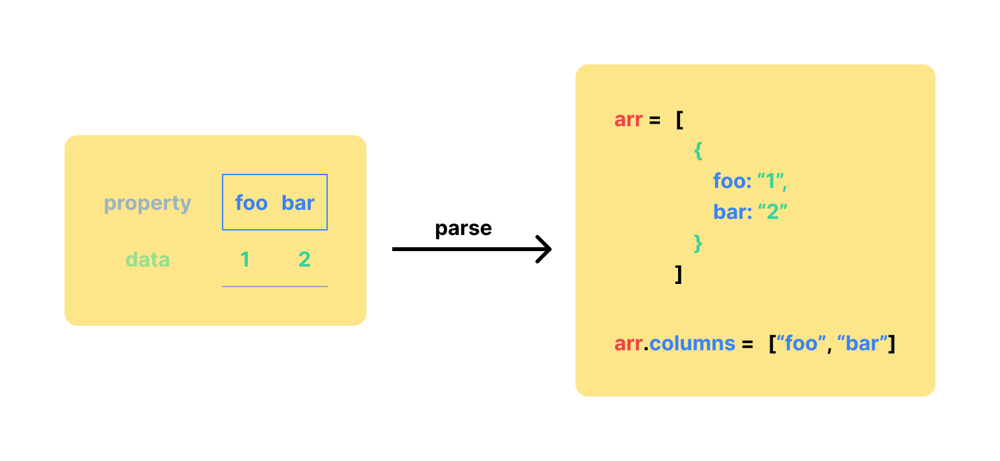
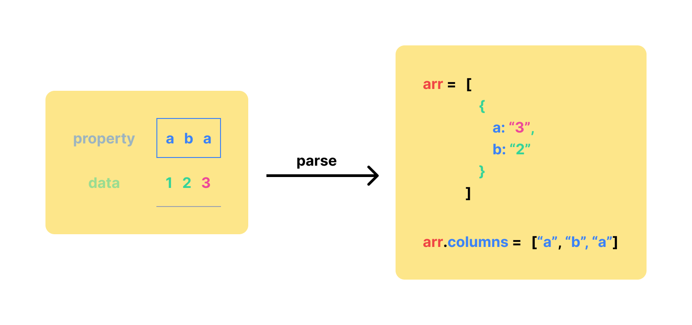
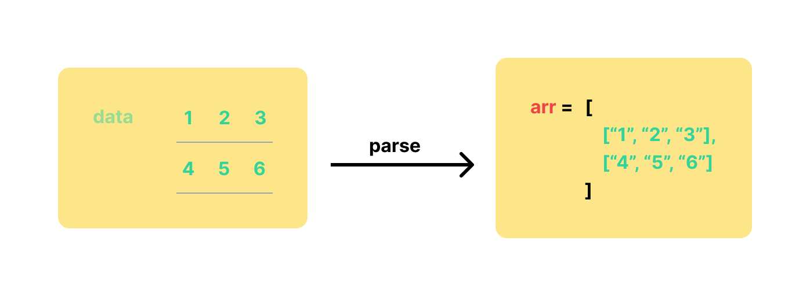

# 数据获取与解析

参考：

* [Learn D3: Data](https://observablehq.com/@d3/learn-d3-data?collection=@d3/learn-d3)
* [Fetches (d3-fetch)](https://github.com/d3/d3/blob/main/API.md#fetches-d3-fetch)
* [d3-fetch](https://github.com/d3/d3-fetch)（非官方[中译版](https://github.com/xswei/d3-fetch)）
* [d3-dsv](https://github.com/d3/d3-dsv)（非官方[中译版](https://github.com/xswei/d3-dsv)）
* [d3-time-format](https://github.com/d3/d3-time-format)
* [d3-format](https://github.com/d3/d3-format)

本文主要介绍 ==Fetches 模块==

进行数据可视化的第一步是需要获取数据，可以使用 JS 提供的 File API [读取](https://developer.mozilla.org/en-US/docs/Web/API/FileReader)用户在表单 `<input type="file">` 中主动导入的本地文件，或者通过发送[网络请求](https://developer.mozilla.org/en-US/docs/Web/HTTP)获取在线数据。

D3 的 d3-fetch 模块封装了 [Fetch API](https://developer.mozilla.org/en-US/docs/Web/API/Fetch_API)，除了可以获取在线数据以外，还针对常见的数据格式，例如 CSV、TSV、JSON、XML 等，提供强大的**解析**功能。

在 d3-fetch 模块中提供了不同的方法读取不同类型的数据

## DSV
DSV 是 Delimiter Separated Values 的简称，是一类文件格式的统称，在这些文件中存储着二维数据（相当于使用一张 Excel 存储的数据）。每一行是一个数据项，每个数据项中各值之间使用**特定的符号分隔**。常见的文件格式有：

* 以 `.csv` 为后缀的文件，全称为 [Comma-separated values](https://en.wikipedia.org/wiki/Comma-separated_values)，即数据使用逗号分隔

* 以 `.tsv` 为后缀的文件，全称为 [Tab-separated values](https://en.wikipedia.org/wiki/Tab-separated_values)，即使用 Tab 键（制表键）分隔

D3 提供了一种读取和解析 DSV 格式文件的通用方法，此外还针对常见的两种 DSV 格式的文件，CSV 和 TSV，提供了专属的方法：

* `d3.dsv(delimiter, url, requestInit, row)` 获取 DSV 文件，并将数据解析为可迭代对象（数组）

  * 第一个参数 `delimiter` 指定数据项中各值之间采用的分隔符

  * 第二个参数 `url` 是需要获取的数据的路径

  * 第三个（可选）参数 `requestInit` 是一个对象，用以设置网络请求的额外配置

  * 第四个（可选）参数 `row` 是一个函数，用于对行数据进行**转换或筛选**（就像为每一行的数据应用数组的 [`map` 函数](https://developer.mozilla.org/en-US/docs/Web/JavaScript/Reference/Global_Objects/Array/map)和 [`filter` 函数](https://developer.mozilla.org/en-US/docs/Web/JavaScript/Reference/Global_Objects/Array/filter)）

    :warning: 如果没有指定行函数 `row`，则解析得到的值的数据类型默认都是**字符串**。

    如果指定了 `row` 函数，则数据项（每一行数据，不包含第一行，即表头行）均会调用该函数，并依次传入 3 个参数：

    * `d` 当前所遍历的数据项（当前的行数据）
    * `i` 当前所遍历的数据项的索引，从 `0` 开始计算（即原表格的第二行）
    * `arr` 一个由原表格的列属性所构成的数组

    如果函数返回 `null` 或 `undefined` 则该行数据就会被忽略跳过

    推荐按照数据集的特点和需求设置 `row` 函数，这样会让获取的数据可以得到更精准的解析

    ```js
    const data = await d3.dsv(",", "test.csv", (d) => {
      //
      return {
        year: new Date(+d.Year, 0, 1), // 将数据项中 Year 的数据转换为 JS 的 Date 对象格式
        make: d.Make, // 将数据项中 Make 的数据映射到属性 make
        model: d.Model, // 将数据项中 Model 的数据映射到属性 model
        length: +d.Length // 将数据项中 Length 的数据从字符串格式转换为数值形式
      };
    });
    ```

    :bulb: 但如果数据集中**列属性较多**时，显式地声明数据类型会很繁琐（需要罗列出各列的数据类型）。有时候为了方便，也可以使用 D3 提供的[数据类型自动推断功能](https://github.com/d3/d3-dsv#autoType)，将 **D3 内置的转换函数 `d3.autotype`** 作为 `row` 函数，即 `d3.dsv(',', url, d3.autotype)`（这里 `row` 函数是第三个参数，但不会被识别为 `requestInit`，因为 D3 会根据入参的数据类型来区分用户具体指定的是哪个参数，如果第三个参数是对象，则用于配置网络请求；如果是函数，则用于转换数据项），这样 D3 就会自动将数据从字符串类型转换为推断的数据类型。:warning: 应该及时查看和验证自动转换的结果，因为自动类型推断有可能「[失灵](https://observablehq.com/@d3/d3-autotype#cell-137)」，特别是对于数据复杂的情况。

    `d3.autotype` 作为 `row` 转换函数，它会被数据项（原表格中的每一行数据）依次调用，然后该函数会先对数据值（一般是字符串）进行[前后空格的去除 trim](https://developer.mozilla.org/en-US/docs/Web/JavaScript/Reference/Global_Objects/String/Trim)，然后按照以下规则将字符串转换为相应的数据类型：
    * 如果是空字符串，则转换为 `null`
    * 如果是 `"true"` 字符串，则转换为 `true` 布尔值
    * 如果是 `"false"` 字符串，则转换为 `false` 布尔值
    * 如果是 `"NaN"` 字符串，则转换为 `NaN`
    * 如果是均有数值构成的字符串，转换为数字。但是如果以 `0` 开头的「纯」数字构成的字符串，转换为数字后会造成「零」的丢失，例如 `"0401"` 转换为数字后是 `401`
    * 如果是日期格式的字符串，转化为 `Date` 对象。日期的字符串需要符合 [ISO 8601 标准](https://en.wikipedia.org/wiki/ISO_8601)，例如 "YYYY-MM-DD"、"YYYY-MM-DDTHH:MM"
    * 如果是其他内容的字符串，保留去除前后空格的字符串

* `d3.csv(url, requestInit, row)` 获取 CSV 文件，相当于 `d3.dsv(',', url, init, row)`

  :bulb: 可以使用 `d3.autotype` 作为 `row` 函数，即 `d3.csv(url, d3.autotype)` 让 D3 自动推断数据类型

* `d3.tsv(url, requestInit, row)` 获取 TSV 文件，相当于 `d3.dsv('\t', url, init, row)`

  :bulb: 可以使用 `d3.autotype` 作为 `row` 函数，即 `d3.csvParse(d3.autotype)` 让 D3 自动推断数据类型

以上方法中其实在内部调用的是 [d3-dsv 模块](https://github.com/d3/d3-dsv)所提供的诸多方法，对 DSV 格式的数据进行解析，并返回一些可迭代对象（这是数据存储在 JavaScript 中常用的类型）。
### DSV 解析与构造
使用 `d3.dsvFormat(delimiter)` 创建一个**通用的 DSV 解析和构建器**（以下称为 `dsv`）

参数 `delimiter` 指明了所要解析或构建的数据值之间采用的分隔符，它必须是单个字符（单个 16-bit 的编码，所以可以是 ASCII 里的字符，但是不能是 emoji）

然后可以使用 DSV 解析和构建器所提供的丰富方法。

#### DSV 解析
以下两个方法分别用于解析具有表头的 DSV 数据和表头的 DSV 数据：

* `dsv.parse(string[, row])` 解析相应格式的数据，返回一个可迭代对象（数组）。

  第一个参数 `string` 是需要解析的数据，它有一些数据值和特定的分隔符构成的字符串，一般还有换行符 `\n`。传递的入参数据（字符串）**需要具有表头**，即表格的第一行是列属性

  第二个（可选）参数 `row` 是一个函数，用于对行数据进行**转换或筛选**

  最后该方法返回的是一个数组，其中的每一个元素都是一个数据项（即一行数据），**元素是一个对象，以键值对 `key: value` 的方式来存储原来的二维数据**。

  此外可迭代对象（数组也是对象）还会具有属性 `columns`，其属性值是一个数组，元素分别是原数据的列属性（即包含了原来的二维数据表的表头信息），且元素的顺序和表格的列属性顺序一致。

  ```js
  // 创建一个以 | 作为分隔符的解析器
  // psv stand for pipe separated values
  const psv = d3.dsvFormat("|");

  // 调用解析器
  // 传入的数据是 psv 格式的
  // 其中 | 表示数据项（每一行数据）各值之间的分割符
  // 其中 \n 表示换行，因此以下示例中传入的数据有两行
  // 第一行是属性名（即列属性的名称），有两个属性，分别是 foo 和 bar
  // 第二行才是具体的一个数据项
  console.log(psv.parse("foo|bar\n1|2")); // [{foo: "1", bar: "2"}, columns: ["foo", "bar"]]
  // 解析得到的是一个可迭代对象（数组）
  // 数组中的每一个元素都是一个数据项（一行数据），它是一个对象，每一个属性对应于表示的列属性
  ```

  

  :warning: 如果原表格中的列属性并不唯一，则解析时只保留最后一个值（后盖前）

  ```js
  const data = "a,b,a\n1,2,3";

  const dsv = d3.dsvFormat(",");
  dsv.parse(data); // [{a: "3", b: "2"}, columns: ["a", "b", "a"]]
  ```

  

  :bulb: 该方法需要使用[网页安全政策](https://developers.google.com/web/fundamentals/security/csp)中的 unsafe-eval（即允许将字符串当作代码执行，速度更快），如果受限无法使用，可以修改部分代码用 `dsv.parseRows()` 方法替代

* `dsv.parseRows(string[, row])` 解析相应格式的数据，返回一个可迭代对象（数组）。它和 `dsv.parse()` 方法的作用类似，不同在于该方法用于处理**无表头**的数据，即传入的数据集均是具体的数据项，没有列属性。

  第一个参数 `string` 是需要解析的数据。**不**具有表头，即表格从第一行开始就是具体的数据项

  第二个（可选）参数 `row` 是一个函数，用于对行数据进行**转换或筛选**，从第一行开始的数据项均会调用该函数，并依次传入 2 个参数：

    * `d` 当前所遍历的数据项（当前的行数据）
    * `i` 当前所遍历的数据项的索引，从 `0` 开始计算（即原表格的第一行）

    如果函数返回 `null` 或 `undefined` 则该行数据就会被忽略跳过

  最后该方法返回的是一个数组，**元素也是一个数组**，表示一个数据项（即一行数据）。和 `dsv.parse()` 结果不同，这是因为传入的数据没有表头，所以**不需要**使用对象以键值对 `key: value` 的方式来存储原来的二维数据，而且解析的数据是从原表格的第一行开始的。

  ```js
  const data = "1,2,3\n4,5,6";

  const dsv = d3.dsvFormat(",");
  dsv.parseRows(data); // [['1', '2', '3'], ['4', '5', '6']]
  ```

  

  :bulb: 该方法适用于表格的数据项「不等长」的情况（例如一些行的某些列属性对应的数据可能缺失了）

  ```js
  const data = "1997,Ford,E350,2.34\n2000,Mercury,2.38";


  const dsv = d3.dsvFormat(",");
  dsv.parseRows(data);
  // 解析得到的可迭代对象中
  // 第一个元素的长度为 4
  // 第二个元素的长度为 3
  // [
  //   ["1997", "Ford", "E350", "2.34"],
  //   ["2000", "Mercury", "2.38"]
  // ]
  ```

:warning: 有时候通过 Microsoft Excel 保存的 DSV 文档，会在开头添加[字节顺序标记 Byte-Order Marks](https://en.wikipedia.org/wiki/Byte_order_mark)，简写为 BOM，用以标记文档是采用 UTF-8 或 UTF-16 或 UTF-32 编码的。一般在浏览器环境中，通常解码器会自动去除这些标记，不会对数据解析造成影响；但在 Node.js 环境中这些标记会对数据解析造成影响。

如果 BOM 没有被移除，它会被解析为一个宽度为零的**空格**，则第一各列属性的名称会以空格开头，这个即使在打印时也很难被看见。如果在 Node.js 环境中，可以在解析数据之前，通过 [strip-bom](https://www.npmjs.com/package/strip-bom) 这个包移除 BOM。
#### DSV 构造
以下两个方法分别是基于对象数组或嵌套数组的可迭代对象构建 DSV 数据：

* `dsv.format(rows[, columns])` 基于可迭代对象构建出 DSV 数据（字符串），它是 `dsv.parse()` 方法的**逆操作**

  第一个参数 `rows` 是可迭代对象（数组），其中每个元素都是一个对象（不同的属性表示原表格中的不同列属性），表示一个数据项（原表格中的一行数据），基于该可迭代对象构建出 DSV 数据（字符串）

  第二个（可选）参数 `columns` 是一个数组，指明了 DSV 的列属性（即表头信息）。如果没有设置该参数，则在构建 DSV 时，D3 会自动提取可迭代对象（数组）中各元素的属性的并集，作为构建出的 DSV 的表头（即第一行数据）。

  :warning: 但是利用 D3 自动生成列属性的方式所构建的 DSV 数据，对于同一个可迭代对象而言，无法保证其列属性顺序每一次都相同。而且对于属性名为 `null` 或 `undefined` 的字段，会被转换为空字符串 `""`。所以推荐传递 `columns` 参数，显式指明表头的信息，可以更精准地控制表格的列属性的顺序。

  ```js
  const data = [{a: "1", b: "2", c: "3"}, {a: "4", b: "5", c: "6"}]

  const dsv = d3.dsvFormat(",");
  dsv.format(data, ["a", "b", "c"]); // "a,b,c\n1,2,3\n4,5,6"
  ```

  如果可迭代对象的属性值中，具有分隔符（如 `,`）、双引号 `"`、换行符 `\n`，则转换时使用双引号 `""` 将这些具有特殊意义的字符包裹

  ```js
  const data = [{a: '1,', b: '2\n', c: '"3"'}];

  const dsv = d3.dsvFormat(",");
  dsv.format(data, ["a", "b", "c"]); // "a,b,c\n'1,','2\n','''3'''"
  ```

  :bulb: 实际在这些构造 DSV 方法的内部使用 `dsv.formatValue(value)` 方法，用于对数据值进行转换，以保证生成的 DSV 数据（字符串）之后可以被正确地解析

  ```js
  const dsv = d3.dsvFormat(",");

  dsv.formatValue('a'); // "a"
  dsv.formatValue('a,'); // '"a,"'
  dsv.formatValue('a\n'); // "a\n"
  dsv.formatValue(null); // ""
  dsv.formatValue(undefined); // ""
  ```

* `dsv.formatRows(rows)` 基于可迭代对象构建出 DSV 数据（字符串），它是 `dsv.parseRows()` 方法的**逆操作**

  第一个参数 `rows` 是可迭代对象（数组），其中每一个元素也是一个数组（其元素则是字符串），表示一个数据项（即原表格中的一行数据），需要基于该可迭代对象构建出 DSV 数据（字符串）。

  :bulb: 由于该方法假定可迭代对象不包含表头信息，所以和 `dsv.format()` 方法不同，该方法不需要指定 `columns` 参数

  该方法实际是用换行符 `\n` 连接可迭代对象的每个元素（表示每一行数据项），然后再用分隔符，如 `,`，连接每个嵌套数组中的字符串元素

  ```js
  const data = [["1997", "Ford", "E350", "2.34"], ["2000", "Mercury", "2.38"]]

  const dsv = d3.dsvFormat(",");
  dsv.formatRows(data); // "1997,Ford,E350,2.34\n2000,Mercury,2.38"
  ```

:tada: 如果希望在构建过程中，**对可迭代对象的元素（一个个对象）的转换方式进行定制**：

  * 可以先使用 JavaScript 内置的数组方法 `arr.map()` 将可迭代对象的元素（一个对象）转换为字符串，获得新的数组 `newArr`（会丢失掉原数组的属性 `arr.columns` 即表头信息）
  * 由于丢失了表头信息，可以通过另一个 JavaScript 内置的数组方法 `[arr.columns].concat(newArr)` 来构建一个包含表头的数组
  * 最后使用 `dsv.formatRows()` 将嵌套数组的元素进行拼接，最后就可以得到 DSV 数据

```js
const arr = [{a: "1", b: "2", c: "3"}, {a: "4", b: "5", c: "6"}]

// 先将对象数组转换为嵌套数组
const newArr = arr.map((d, i) => {
  return [
    d.a,
    d.b,
    d.c,
  ];
});

// 添加上表头数组
const newArrWithHeader = [["a", "b", "c"]].concat(newArr);

// 构建 DSV
const dsv = d3.dsvFormat(",");
dsv.formatRows(newArrWithHeader); // "a,b,c\n1,2,3\n4,5,6"
```

* `dsv.formatRow(row)` 基于字符串数组（元素为字符串）建出 DSV 数据（字符串）

  它和 `dsv.formatRows()` 方法类似，不同的是 `dsv.formatRows(rows)` 入参 `rows` 需要时一个嵌套数组，每一个元素表示原表格中的一行数据；而该方法入参 `row` 是一个字符串数组（元素为字符串），该数组就表示一行数据，元素表示该行的不同列属性的值。可以理解为 `dsv.formatRows()` 是生成一个数据表；而 `dsv.formatRow()` 只生成一行数据。

  ```js
  const dataset = [[1, 2, 3]];
  const rowData = [1, 2, 3];

  dsv = d3.dsvFormat(",");

  // 生成一个数据表（不带表头）
  dsv.formatRows(dataset); // "1,2,3"
  // 生成一行数据
  dsv.formatRow(rowData); // "1,2,3"
  ```

* `d3.csvParse()` 创建一个 CSV 解析器，等价于 `dsvFormat(",").parse`

  ```js
  d3.csvParse("foo,bar\n1,2"); // [{foo: "1", bar: "2"}, columns: ["foo", "bar"]]
  ```

  如果受到网页安全政策，无法以上方法，可以使用 `d3.csvParseRows(string[, row])`，等价于 `dsvFormat(",").parseRows`

* `d3.tsvParse()` 创建一个 CSV 解析器，等价于 `d3.dsvFormat("\t").parse`

  ```js
  d3.tsvParse("foo\tbar\n1\t2"); // [{foo: "1", bar: "2"}, columns: ["foo", "bar"]]
  ```

此外 d3-dsv 模块还提供一些方法，用于将可迭代对象构建为 DSV 格式的数据：

* `d3.dsvFormat(delimiter)` 创建一个通用的 DSV 构建器（以下称为 `dsvFormat`），其中参数 `delimiter` 指明了所要解析的数据值之间采用的分隔符

* `d3.csvFormat()` 创建一个 CSV 构建器，等价于 `d3.dsvFormat(",")`

  ```js
  d3.csvFormat([{foo: "1", bar: "2"}]); // "foo,bar\n1,2"
  ```

* `d3.tsvFormat()` 创建一个 TSV 构建起，等价于 `d3.dsvFormat('\t')`

  ```js
  d3.tsvFormat([{foo: "1", bar: "2"}]); // "foo\tbar\n1\t2"
  ```

## JSON
`d3.json(url, requestInit)` 获取 JSON 文件

如果返回的响应状态码是 `204` [No Content](https://developer.mozilla.org/docs/Web/HTTP/Status/204) 或 `205` [Reset Content](https://developer.mozilla.org/docs/Web/HTTP/Status/205) 则 Promise 会 resolve `undefined`

## 二进制数据
* `d3.blob(url, requestInit)` 获取二进制文件，并解析为 Blob

  * 第一个入参是数据文件的路径
  * 第二个（可选）参数是[网络请求的额外配置](https://developer.mozilla.org/en-US/docs/Web/API/Request/Request)

  ```js
  const data = await d3.blob("/path/to/file");
  ```

* `d3.buffer(url, requestInit) ` 获取二进制文件，并解析为 ArrayBuffer

## 其他
* `d3.html(url, requestInit)` 获取文本文件，并解析为 HTML

* `d3.xml(url, requestInit)` 获取文本文件，并解析为 XML

* `d3.text(url, requestInit)` 获取文本文件

* `d3.image(url, requestInit)` 获取图片文件

  :bulb: 如果希望实现**匿名跨源请求**可以进行如下配置

  ```js
  const img = await d3.image("https://example.com/test.png", {
      crossOrigin: "anonymous"
  });
  ```

* `d3.svg(url, requestInit)` 获取文本文件，并解析为 SVG


D3 还专门提供了一个模块 [d3-time-format](https://github.com/d3/d3-time-format) 用于解析和构建时间数据。

为了将时间对象格式化为特定的模式，需要使用 `d3.timeFormat(specifier)` 构建一个时间格式器，入参 `specifier` 是一个字符串，它由一系列[以 `%` 为前缀的指令](https://github.com/d3/d3-time-format#locale_format)构成。然后使用该时间格式器格式化时间对象

```js
const formatTime = d3.timeFormat("%B %d, %Y"); // %B 表示月份（全称），%d 是以数值表示的日，%Y 表示年
formatTime(new Date("2021/11/4")); // "November 04, 2021"
```

为了解析特定模式的时间数据，需要使用 `d3.timeParse(specifier)` 构建一个时间解析器，入参也是一个 `specifier` 字符串

```js
const parseTime = d3.timeParse("%B %d, %Y");
parseTime("November 04, 2021"); // Thu Nov 04 2021 00:00:00 GMT+0800 (中国标准时间)
```

