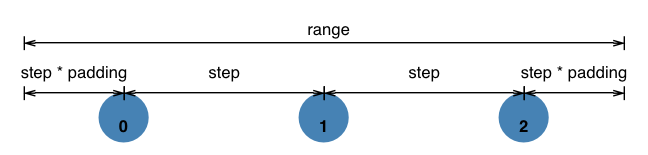

# 比例尺

参考：

* [Learn D3: Scales](https://observablehq.com/@d3/learn-d3-scales?collection=@d3/learn-d3)
* [Scales (d3-scale)](https://github.com/d3/d3/blob/main/API.md#scales-d3-scale)
* [d3-scale](https://github.com/d3/d3-scale)（非官方[中译版](https://github.com/xswei/d3-scale)）
* [Axes (d3-axis)](https://github.com/d3/d3/blob/main/API.md#axes-d3-axis)
* [d3-axis](https://github.com/d3/d3-axis)（非官方[中译版](https://github.com/xswei/d3-axis)）
* [Interpolators (d3-interpolate)](https://github.com/d3/d3/blob/main/API.md#interpolators-d3-interpolate)
* [d3-interpolate](https://github.com/d3/d3-interpolate)（非官方[中译版](https://github.com/xswei/d3-interpolate)）
* [Color Schemes (d3-scale-chromatic)](https://github.com/d3/d3/blob/main/API.md#color-schemes-d3-scale-chromatic)
* [d3-scale-chromatic](https://github.com/d3/d3-scale-chromatic)（非官方[中译版](https://github.com/xswei/d3-scale-chromatic)）
* [Introducing d3-scale](https://medium.com/@mbostock/introducing-d3-scale-61980c51545f)
* [Scales](https://alignedleft.com/tutorials/d3/scales)（[中译版](http://pkuwwt.github.io/d3-tutorial-cn/scales.html)）:warning: 文章基于 D3.js v3.x 版本
* [Introducing d3-scale](https://medium.com/@mbostock/introducing-d3-scale-61980c51545f)
* [d3: scales, and color.](https://jckr.github.io/blog/2011/08/11/d3-scales-and-color/)


本文主要介绍 ==[Scales](https://github.com/d3/d3/blob/main/API.md#scales-d3-scale) 模块==。

Jacques Bertin 在《Semiology of Graphics》中描述了**图形符号的不同属性**（例如位置、尺寸、颜色等）在展示**数据**时的适用性。而将两者联系起来的关键是**比例尺**，它将数据（某个维度）按照一定的规则映射到图形符号的（某个特定）属性上，这样就可以使用具体可视的图形符号表示抽象的数据了。

比例尺实际是将一个类型的数据**转换**为另一个数据的**规则方法**，例如通过**线性比例尺**，将将一年的每月的收益转换为条形图在 Y 坐标轴的高度值。D3 在模块 [d3-scale](https://github.com/d3/d3-scale) 中提供了多种类型的比例尺，适用于将不同类型的抽象数据转换为图形符号的不同属性：

:bulb: 在 D3 说明文档中，将输入数据的范围称为**定义域 `domain`**，转换后输出数据的范围称为**值域 `range`**

:bulb: 通过以下介绍的各方法创建相应的比例尺，然后可以使用各种比例尺所提供的方法对比例尺进行定制，一般比例尺的方法还是**返回比例尺本身，可以进行链式调用**

---

以下比例尺适用于定义域为连续型

## 连续型比例尺  Continuous Scales

连续型比例尺  Continuous Scales 用于==将连续型的定义域映射到连续型的值域==

该类型的比例尺（以下的 `continuous`）的常用方法：

* `continuous.domain(domainArr)` 设置或返回定义域。如果没有传递参数，则返回当前比例尺的定义域；如果传递数组，则将定义域范围设置为该数组。

  :bulb: 一般传递的数组必须包含两个元素，**而且元素的类型是数值**。如果数组的元素有多个（元素依此是递增或递减的），则可以创建映射关系更复杂的比例尺。:warning: 如果定义域 domain 数组长度 `M` （元素个数）和值域 range 数组长度 `N`（元素个数） **不同**，则映射的关系按照 `min(N, M)` 构建，超出范围的无法进行转换

  ```js
  // 创建一个线性比例尺
  const color = d3.scaleLinear()
      .domain([-1, 0, 1]) // 定义域是 -1 到 1，其中 -1 到 0 是一部分（负值），0 到 1 是另一部分（正值） 
      .range(["red", "white", "green"]); // 负值映射的值域是从红色渐变到白色的 rgb 值；正值映射的值域是从白色渐变到绿色的 rgb 值
  
  color(-0.5); // "rgb(255, 128, 128)"
  color(+0.5); // "rgb(128, 192, 128)"
  ```

* `continuous.range(rangeArr)` 设置或返回值域。在传递数组设置值域时，数组的元素不必是数值，只要是**插值器**[支持的类型](https://github.com/d3/d3-interpolate#interpolate)就可以，例如颜色值。:warning: 如果希望比例尺支持 `continuous.invert(value)` 则值域的类型需要是数值。

  :bulb: 如果希望同时设置值域和插值方法为 `d3.interpolateRound`（通过四舍五入插入整数），可以使用 `continuous.rangeRound(rangeArr)`，那么此时传递的数组的元素类型只能是数值

* `continuous(value)` 向比例尺传递一个定义域 domain 的值，返回相应的值域 range 的值

* `continuous.invert(value)` 向比例尺传递一个值域的 range 的值，**反过来得到定义域 domain 的值**。这对于交互很有用，例如根据鼠标在图表的位置，反向求出并显式对应的数据。:warning: 该方法只支持值域为数值类型的比例尺，否则返回 `NaN`

* `continuous.clamp(clampState)` 当 `continuous(value)` 或 `continuous.invert(value)`  入参值**超出定义域（或值域）的范围**时，比例尺的行为会根据 `clamp` 而定。

  * 如果开启 clamping 夹具功能 `clampState=true`，比例尺返回的值会限制在相应范围内
  * 如果不开启 clamping 夹具功能 `clampState=false`，比例尺会**进行推断**得出超出范围的值

  ```js
  const x = d3.scaleLinear()
      .domain([10, 130])
      .range([0, 960]);
  
  // 默认不开启 clamping 夹具功能
  x(-10); // -160 超出值域范围
  x.invert(-160); // -10 超出定义域范围
  
  // 开启 clamping 夹具功能
  x.clamp(true);
  x(-10); // 0 结果被限制在值域中
  x.invert(-160); // 10 结果被限制在定义域中
  ```

* `continuous.unknown(value)` 设置当比例尺接受的入参为 `undefined` 或 `NaN` 时，应该返回的值。这对于数据集中存在部分缺失时很有用（当然最好是在数据清洗中进行处理），可以将数据项映射到一个特定的可视化属性值
* `continuous.nice()` 编辑定义域的范围，通过四舍五入使其两端的值更「整齐」nice，例如对于定义域的原本范围是 `[0.201479…, 0.996679…]` 可以扩展为 `[0.2, 1.0]`

* `continuous.interpolate(interpolate)` 自定义值域的插值函数

### 线性比例尺 Linear Scales

线性比例尺 Linear Scales 值域中的值 $y$ 与定义域中的值 $x$ 通过==表达式 $y=mx+b$ 联系起来==，这种映射方式可以在视觉元素的变量中保留数据的原始差异比例

使用方法 `d3.scaleLinear(domain, range)` 构建一个线性比例尺，入参是可选的，如果忽略则定义域和值域范围默认是 `[0, 1]`，也可以在之后通过 `continuous.domain(value)` 和 `continuous.range(value)` 设置定义域和值域。

```js
const x = d3.scaleLinear([10, 130], [0, 960]);
const color = d3.scaleLinear([10, 100], ["brown", "steelblue"]);

<!-- 等价的方法 -->

const x = d3.scaleLinear()
    .domain([10, 130])
    .range([0, 960]);

x(20); // 80
x(50); // 320

const color = d3.scaleLinear()
    .domain([10, 100])
    .range(["brown", "steelblue"]);

color(20); // "#9a3439"
color(50); // "#7b5167"
```

:bulb: 恒等比例尺 Identity Scales 是线性比例尺的一种特例，其定义域和值域相同，使用方法 `d3.scaleIdentity(range)` 构建

### 幂比例尺 Power Scales

幂比例尺 Power Scales 会对定义域的值 $x$ 进行幂运算，再==与值域中的值 $y$ 联系起来 $y=mx^{k}+b$==，其中 $k$ 是幂

使用方法 `const pow = d3.scalePow(domain, range)` 构建一个幂比例尺，默认的幂为 $1$（此时是线性比例尺）

使用比例尺方法 `pow.exponent(k)` 用来设置幂

:bulb: 幂比例尺 `pow(value)` 可以接受负值的输入，此时入参的值和转换后得到的值都会乘以 $-1$

:bulb: D3 还提供了一个方法 `d3.scaleSqrt(domain, range)` 方便地生成幂为 $k=0.5$ 的幂比例尺，等价于以下生成的幂比例尺

```js
d3.scalePow()
  .exponent(0.5)
```

### 对数比例尺 Log Scales

对数比例尺 Log Scales 会对定义域的值 $x$ 进行对数运算，再==与值域中的值 $y$ 联系起来 $y=mlog(x)+b$==

:warning: 由于对数的限制 $log(0)=-\infty$，对数比例尺的定义限范围是正值。如果需要支持负值，则需要对该比例尺进行封装，**显式**地对入参值和输出值都乘以 $-1$ 进行预转换

使用方法 `const log = d3.scaleLog(domain, range)` 构建一个对数比例尺，默认以 $10$ 作为底数

使用比例尺方法 `log.base(N)` 用来设置底数

:bulb: 类似地，D3 还提供[双对称的对数比例尺 Symlog Scale](https://github.com/d3/d3-scale#symlog-scales)s `d3.scaleSymlog(domain, range)`

### 径向比例尺 Radial Scales

径向比例尺 Radial Scales 是线性比例尺的一种变体，它==将定义域的值与值域的值的**平方**构成线性关系==，例如在径向条形图将数据映射为半径，而页面展示的图形元素则是面积

使用方法 `d3.scaleRadial(domain, range)` 构建一个径向比例尺

### 时间比例尺 Time Scales

时间比例尺 Time Scales 是线性比例尺的一种变体，==它以时间对象 Date 作为定义域==

使用方法 `d3.scaleTime(domain, range)` 构建一个时间比例尺，如果省略 `domain` 则默认定义域为 `[2000-01-01, 2000-01-02]`

```js
const x = d3.scaleTime()
    .domain([new Date(2000, 0, 1), new Date(2000, 0, 2)])
    .range([0, 960]);

x(new Date(2000, 0, 1,  5)); // 200
x(new Date(2000, 0, 1, 16)); // 640
x.invert(200); // Sat Jan 01 2000 05:00:00 GMT-0800 (PST)
x.invert(640); // Sat Jan 01 2000 16:00:00 GMT-0800 (PST)
```


## 顺序比例尺 Sequential Scales

它和连续型比例尺类似，也是将连续型的定义域映射到连续型的值域，但该比例尺的==值域一般是指定一个插值器==

使用方法 `const sequential = d3.scaleSequential(domain, interpolator)` 构建一个顺序比例尺，如果值域的插值器省略，则默认使用**恒等函数 identity function**

```js
const rainbow = d3.scaleSequential(d3.interpolateRainbow);
```

:bulb: 如果值域/插值器是两个元素构成的数组，表示插值的范围，D3 会调用[方法 `d3.interpolate()`](https://github.com/d3/d3-interpolate) 将它转换为一个插值器

该比例尺（以下的 `sequential`）除了有连续型比例尺的常用方法以外，还有一些不同的方法：

* `sequential.interpolator(interpolator)` 设置比例尺的插值器
* `sequential.range(rangeArr)` 设置插值的范围，D3 会将它转换为一个插值器

:bulb: 和连续型比例尺类似，顺序比例尺有一些衍生的比例尺，可以先对定义域的值进行幂、对数等运算，进行转换后再传递给插值器处理

* `d3.scaleSequentialLog(domain, interpolator)` 和 `d3.scaleSequentialSqrt(domain, interpolator)`
* `d3.scaleSequentialPow(domain, interpolator)` 和 `d3.scaleSequentialSymlog(domain, interpolator)`
* `d3.scaleSequentialQuantile(domain, interpolator)` 和分位数型比例尺类似


## 发散比例尺 Diverging Scales

它和连续型比例尺类似，也是将连续型的定义域映射到连续型的值域，但该比例尺的==定义域一般是由三个元素组成的数组，值域一般是指定一个插值器==

使用方法 `const diverging= d3.scaleDiverging(domain, interpolator)` 构建一个发散比例尺，如果没有设置定义域，默认值为 `[0, 0.5, 1]`；如果没有设定插值器，则默认使用**恒等函数 identity function**

```js
const spectral = d3.scaleDiverging(d3.interpolateSpectral);
```


## 分层比例尺 Quantize Scale

分层比例尺 Quantize Scale 用于将连续型的定义域映射到离散型值域，一般==通过四舍五入等**修约**==的方法将数据进行分层转换映射，以便将数据进行归类区分。

**定义域的范围**会根据离散型值域中可取值的数量**划分为等距的片段**，即每一个值域中离散值 $y$，都可以代表一段定义域范围 $y=m\space round(x)+b$，例如[等值域图/分级统计地图](https://observablehq.com/@d3/choropleth)

使用方法 `d3.scaleQuantize(domain, range)` 构建一个分层比例尺，如果省略了定义域或值域，则它默认范围是 `[1, 0]`，其作用就等价于 `Math.round`

```js
const color = d3.scaleQuantize()
    .domain([0, 1])
    .range(["brown", "steelblue"]);

color(0.49); // "brown"
color(0.51); // "steelblue"
```

该类型的比例尺（以下的 `quantize`）的常用方法：

* `quantize.domain(domainArr)` 设置定义域，数组由两个元素组成一个范围，而且元素的类型是数值，**而且按升序排列**
* `quantize.range(rangeArr)` 设置值域，数组包含一些列离散的值

* `quantize(value)` 向比例尺传递一个定义域 domain 的值，返回相应的值域 range 的值

* `quantize.invertExtent(value)` 向比例尺传递一个值域的 range 的值，**反过来得到定义域 domain 对应的片段**

  ```js
  const width = d3.scaleQuantize()
      .domain([10, 100])
      .range([1, 2, 4]);
  
  width.invertExtent(2); // [40, 70]
  ```

* `quantize.nice()`


## 分位数比例尺 Quantile Scales

分位数型比例尺 Quantile Scales 将输入的数据作为总体（一堆通过采样获取的离散值），这样就**可以接受在该总体范围中的任意值输入（即定义域是连续型）**，可以计算出它在总体中的分位数，然后==基于分位数==再找出在值域中一些列**离散值**中的那个对应值。

使用方法 `d3.scaleQuantile(domain, range)` 构建一个分位数比例尺

该类型的比例尺（以下的 `quantile`）的常用方法：

* `quantile.domain(domainArr)` 设置定义域，数组由一堆通过采样获取的离散值，而且元素的类型是数值，然后 D3 会对数组进行拷贝并对元素进行排序，作为总体用于计算分位数
* `quantile.range(rangeArr)` 设置值域，数组包含一些列离散的值

* `quantile(value)` 向比例尺传递一个定义域 domain 的值，返回相应的值域 range 的值
* `quantile.invertExtent(value)` 向比例尺传递一个值域的 range 的值，**反过来得到定义域 domain 对应的片段**
* `quantile.quantiles()` 根据值域 range 的离散值数量 `n`，对分位数进行分段，再根据各段的分位数可以计算出对应的定义域的 domain 的值，该方法就是返回  `n-1` 个阈值构成的数组。


## 阈值比例尺 Threshold Scales

阈值比例尺 Threshold Scales 和分层型比例尺 Quantize Scale 类似，==不过映射规则更自由，定义域数组中各元素是**阈值**，可以更灵活地对定义域进行任意的划分==，然后 D3 将**各段定义域**分别映射到**值域各个离散值**

使用方法 `d3.scaleThreshold(domain, range)` 构建一个阈值比例尺

```js
const color = d3.scaleThreshold()
    .domain([0, 1])
    .range(["red", "white", "green"]);

color(-1);   // "red"
color(0);    // "white"
color(0.5);  // "white"
color(1);    // "green"
color(1000); // "green"
```

该类型的比例尺（以下的 `threshold`）的常用方法：

* `threshold.domain(domainArr)` 设置定义域，数组由一系列阈值组成，然后元素按升序排列
* `threshold.range(rangeArr)` 设置值域，数组包含一些列离散的值

:warning: 如果值域离散值数量是 `N+1`，则定义域数组中的阈值数量需要是 `N`。如果阈值数量少于期望的值，则相应的值域离散值会被忽略；如果阈值的数量多于期望的值，则在调用阈值比例尺时可能返回 `undefined`，因为在值域没有相应的离散值与该段定义域相对应。

* `threshold(value)` 向比例尺传递一个定义域 domain 的值，返回相应的值域 range 的值

* `threshold.invertExtent(value)` 向比例尺传递一个值域的 range 的值，**反过来得到定义域 domain 对应的片段**

  ```js
  const color = d3.scaleThreshold()
      .domain([0, 1])
      .range(["red", "white", "green"]);
  
  color.invertExtent("red"); // [undefined, 0]
  color.invertExtent("white"); // [0, 1]
  color.invertExtent("green"); // [1, undefined]
  ```

  

---

以下比例尺适用于定义域为离散型

## 排序比例尺 Ordinal Scales

排序比例尺 Ordinal Scales 用于将有序 ordinal/ordered 或无序 categorical/unordered 的==离散型的定义域映射到离散型值域==，例如将一系列类别名称，映射到不同的颜色中

使用方法 `d3.scaleOrdinal(domain, range)` 构建一个排序比例尺

```js
const ordinal = d3.scaleOrdinal([0, 1, 2], ["A", "B", "C"]);

ordinal(0); // "A"
ordinal(1); // "B"
ordinal(2); // "C"
```

该类型的比例尺（以下的 `ordinal`）的常用方法：

* `ordinal.domain(domainArr)` 设置定义域，数组的第一个元素映射到值域的第一个元素，依此类推（如果定义域数量多于值域，就进行**「循环」映射**）。D3 通过 Map 对象将各元素作为键与它们的**索引**进行匹配，再利用该索引获取值域的数组中相应的值，以此实现定义域和值域的映射。:warning: 因此定义域的数组元素需要是**[原始类型](https://developer.mozilla.org/en-US/docs/Glossary/Primitive)**，它们需要作为 Map 对象的键，而且每个元素应该是唯一的
* `ordinal.range(rangeArr)` 设置值域，数组的第一个元素映射到定义域的第一个元素，依此类推。如果值域的数组长度小于定义域的数组长度，则值域的元素会被从头重复使用进行映射，即进行**「循环」映射**。

* `ordinal(value)` 向比例尺传递一个定义域 domain 的值，返回相应的值域 range 的值。如果传入的值不在定义域中，则返回 `unknown`
  * 如果 `unknown` 的值是 `implicit`（默认值，即 `d3.scaleImplicit`，是一个 Symbol 值），则该入参会**「隐式地」自动添加到定义域 domain 数组中**，并返回值域中相应的离散值
  * 可以使用方法 `ordinal.unknown(value)` 替代 `unknow` 的默认值，则返回的值就是固定为 `value`

###  带状比例尺 Band Scales

带状比例尺 Band Scales 和排序比例尺类似，虽然定义域和离散的值域元素也是按索引依此对映的，==但是值域的各值表示一个个连续区间==。

该比例尺根据定义域数组的元素数量，将值域的范围分割为等距的各段，得到的每个值就表示相应的区间，其可视化效果就是一个个宽度相同的带状，该比例尺一般用于柱状图。


使用方法 `d3.scaleBand(domain, range)` 构建一个带状比例尺

```js
const band = d3.scaleBand()
  .domain(["one", "two", "three", "four"])
  .range([0, 100])
```

该类型的比例尺（以下的 `band`）的常用方法：

* `band.domain(domainArr)` 设置定义域，数组的第一个元素映射到值域的第一个元素，依此类推。:warning: 定义域数组的元素也需要是**[原始类型](https://developer.mozilla.org/en-US/docs/Glossary/Primitive)**

* `band.range(rangeArr)` 设置值域，它是一个数组，**有两个元素**指定整体范围（默认值是 `[0, 1]`），因此元素的类型是数值。D3 会根据定义域数值的元素数量，将值域的范围分割为等距的各段。

* `band.rangeRound(rangeArr)` 用于设定值域整体范围，并对两端进行四舍五入的**修约**，让两端的值为整数，使值域更适合可视化。该方法等价于以下操作

  ```js
  band.range(range)
      .round(true);
  ```

	:bulb: 如果值域范围不是定义域的数组元素的数量的整数倍，那么即使没有设置间隔 padding，最后生成的带状也会有外间隔，可以通过方法 `band.align(alignValue)` 来设置外间隔的分布

* `band(value)` 向比例尺传递一个定义域 domain 的值，返回相应区间的**起始值**。如果输入的值不在定义域中，则返回 `undefined`

* `band.padding(padding)` 设定值域的内外间隔，入参的值 $padding \le 1$ 表示间隔占据区间的比例大小

  :bulb: 如果希望分别设置各区间之间的间隔和值域两端的间隔，可以分别使用方法 `band.paddingInner(padding)` 和方法 `band.paddingOuter(padding)`

* `band.align(alignValue)` 入参的值 $align \le 1$ 用以设置外间隔的分布方式。如果 `align=0.5`（默认值）则两外侧的间隔相同，即这些 bands 居中，如果 `align=0` 或 `align=1` 则它们会向一侧偏移。
* `band.bandwidth()` 返回 band 的宽度，不包含 padding
* `band.step()` 返回「步长」，即 band 的宽度和 padding 的宽度之和

### 点状比例尺 Point Scales

点状比例尺 Point Scales 和带状比例尺类似，就像是将 band 的宽度设置为 $0$

该比例尺将根据==定义域数组的离散元素的数量，**将值域的范围分割为等距的各段**，各个**分隔点**与定义域中的离散元素依此映射==，该比例尺一般用于散点图。




使用方法 `d3.scalePoint(domain, range)` 构建一个点状比例尺

该类型的比例尺的常用方法和带状比例尺类似


## 坐标轴

比例尺模块只是提供了各种数据转换的规则方法，并不能生成视觉元素，一般会搭配坐标轴 [d3-axis](https://github.com/d3/d3-axis) 模块使用，该模块可以**基于比例尺 scale 在页面生成相应的坐标轴**。

:bulb: 在构建坐标轴时，推荐**为容器的四周设置一个 [margin 区域](https://observablehq.com/@d3/margin-convention)**，以便放置坐标轴等注释信息，而中间的「安全区域」才放置主要的可视化图表内容。

可以使用以下 4 种方法构建不同反向的坐标轴（其中参数 `scale` 是生成坐标轴时所使用的比例尺）

* `d3.axisTop(scale)` 生成一个朝上的坐标轴，即其刻度在水平轴线的上方
* `d3.axisBottom(sacle)` 生成一个朝下的坐标轴，即其刻度在水平轴线的下方
* `d3.axisRight(scale)` 生成一个朝右的坐标轴，即其刻度在竖直轴线的右方
* `d3.axisLeft(scale)` 生成一个朝左的坐标轴，即其刻度在竖直轴线的左方

:bulb: 虽然生成的坐标轴**方向不同**，但**「起点」相同**，即坐标轴开始的一端都是其所在的容器的原点 origin，还需要为坐标轴（或其所在的容器）设置 **`transform` 属性**，把坐标轴 `translate` 移动到合适的位置。

D3 构建出来的坐标轴是有一系列 SVG 元素构成：

* 轴线由 `<path>` 路径元素构成，它带有类名 `domain` 
* 刻度是和刻度值分别由元素 `<line>` 和 `<text>` 构成。每一刻度和相应的刻度值都包裹在一个 `<g>` 元素中，它带有类名 `tick`

```html
<!-- 渲染在页面上的坐标轴模板 -->
<!-- 一般会使用一个 g 元素包裹坐标轴的所有元素，便于对整体设置样式，例如 transform -->
<g fill="none" font-size="10" font-family="sans-serif" text-anchor="middle">
  <path class="domain" stroke="currentColor" d="M0.5,6V0.5H880.5V6"></path>
  <g class="tick" opacity="1" transform="translate(0.5,0)">
    <line stroke="currentColor" y2="6"></line>
    <text fill="currentColor" y="9" dy="0.71em">0.0</text>
  </g>
  <g class="tick" opacity="1" transform="translate(176.5,0)">
    <line stroke="currentColor" y2="6"></line>
    <text fill="currentColor" y="9" dy="0.71em">0.2</text>
  </g>
  <g class="tick" opacity="1" transform="translate(352.5,0)">
    <line stroke="currentColor" y2="6"></line>
    <text fill="currentColor" y="9" dy="0.71em">0.4</text>
  </g>
  <g class="tick" opacity="1" transform="translate(528.5,0)">
    <line stroke="currentColor" y2="6"></line>
    <text fill="currentColor" y="9" dy="0.71em">0.6</text>
  </g>
  <g class="tick" opacity="1" transform="translate(704.5,0)">
    <line stroke="currentColor" y2="6"></line>
    <text fill="currentColor" y="9" dy="0.71em">0.8</text>
  </g>
  <g class="tick" opacity="1" transform="translate(880.5,0)">
    <line stroke="currentColor" y2="6"></line>
    <text fill="currentColor" y="9" dy="0.71em">1.0</text>
  </g>
</g>
```

使用以上 4 种方法之一构建出来的坐标轴对象 `axis` ，也是一个方法，它接受一个 SVG 元素 `axis(context)`  **将坐标轴在其内部渲染出来**。

:bulb: 但是在官方样例的一些代码中，一般[使用 `selection.call(axis)` 的方式](https://observablehq.com/@d3/learn-d3-scales?collection=@d3/learn-d3#cell-3899)来调用坐标轴方法，其中 `selection` 是指选择集，一般是一个 `<g>` 元素；`axis` 是坐标轴对象。

```js
d3.select("g")
  .call(axis);
```

这里涉及一个核心方法是**选择集的[方法 `selection.call(function, otherArguments...)`](https://github.com/d3/d3-selection/tree/v3.0.0#selection_call) **，类似 JS 的原生[方法 `call`](https://developer.mozilla.org/zh-CN/docs/Web/JavaScript/Reference/Global_Objects/Function/call)，它接受多个入参其中第一个参数是需要执行目标函数，之后的参数就是需要传递给目标函数的一些参数，其[源码](https://github.com/d3/d3-selection/blob/main/src/selection/call.js)如下：

```js
export default function() {
  var callback = arguments[0];
  arguments[0] = this;
  callback.apply(null, arguments);
  return this;
}
```

比较特别的是在 `call()` 方法内部，替换了 `arguments` 的第一个元素，改为当前选择集，相对于将选择集和 `otherArguments` 整合为系列参数，再传递给目标函数。该方法相当于执行了给定的函数，**但是返回值的依然是当前的选择集**，这样便于之后的链式调用。

```js
function name(selection, first, last) {
  selection
      .attr("first-name", first)
      .attr("last-name", last);
}

d3.selectAll("div").call(name, "John", "Snow");

// 等价以下的操作
name(d3.selectAll("div"), "John", "Snow");
```

坐标轴对象（以下的 `axis`）还有一些常用方法：

* `axis.scale([scale])` 如果传递了参数，基于新的比例尺生成新的坐标轴；如果没有传递参数，返回当前的坐标轴

* `axis.ticks(arguments…)` 或 `axis.tickArguments([arguments])` 设置坐标轴的刻度间隔和刻度值的格式，不同类型的比例尺可以传递不同的参数，一般是设定刻度的数量 `count`（或对于时间比例尺是[时间间隔 `interval`](https://github.com/d3/d3-time)）和刻度值的[格式 `specifier`](https://github.com/d3/d3-format)

  :bulb: 该方法对于无法提供 `scale.ticks` 的比例尺无效，例如带状比例尺和点状比例尺

  ```js
  // 时间坐标轴上，每隔 15 分钟设定一个刻度
  axis.ticks(d3.timeMinute.every(15));
  axis.tickArguments([d3.timeMinute.every(15)]);
  ```

* `axis.tickValues([values])` 如果传递了数组，则用该数组的元素覆盖比例尺自动生成的刻度值；如果 `values=null` 则清除之前设置的刻度值，并使用比例尺自动生成的刻度值；如果没有传递参数，则返回当前的刻度值（默认值是 `null`，则使用比例尺自动生成的刻度值）

  ```js
  var xAxis = d3.axisBottom(scale)
      .tickValues([1, 2, 3, 5, 8, 13, 21]);
  ```

* `axis.tickFormat([format])` 设定刻度值的[格式](https://github.com/d3/d3-format)（[时间格式](https://github.com/d3/d3-time-format)）

* `axis.tickSize([size])` 设定内侧刻度和外侧刻度的长度，默认值是 `6`

  内侧刻度和外侧刻度不同，内侧刻度是一个个单独的 `line` 元素，而外侧刻度是坐标轴最外侧两端的刻度线，它是轴线 `path` 元素的一部分。

* `axis.tickSizeInner([size])` 和 `axis.tickSizeOuter([size])` 分别设置内侧刻度和外侧刻度的长度

* `axis.tickPadding([padding])` 设置刻度线和刻度文本之间的间距，默认值是 `3` 像素

* `axis.offset([offset])` 设置坐标轴的偏移，默认值是 `0`

---

从比例尺构建坐标轴的一般流程：

* 基于抽象数据和图形符号的属性构建合适比例尺
* 基于比例尺构建特定反向的坐标轴
* 将坐标轴添加到页面上

