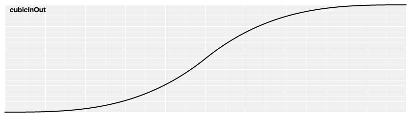

# 过渡

参考：

* [Learn D3: Animation](https://observablehq.com/@d3/learn-d3-animation?collection=@d3/learn-d3)
* [Transitions (d3-transition)](https://github.com/d3/d3/blob/main/API.md#transitions-d3-transition)
* [d3-transition](https://github.com/d3/d3-transition)（非官方[中译版](https://github.com/xswei/d3-transition)）
* [Animated Transitions in Statistical Data Graphics](http://vis.berkeley.edu/papers/animated_transitions/)

本文主要介绍 ==[transition](https://github.com/d3/d3-transition)、[interpolate](https://github.com/d3/d3-interpolate) 和 [ease](https://github.com/d3/d3-ease) 模块==。

D3 提供了 [d3-transition 模块](https://github.com/d3/d3-transition)用于实现图形元素的过渡动画。它和 [selection 模块](https://github.com/d3/d3-selection)类似，有相似的方法，例如为选中的 DOM 元素设置样式属性。但是在设置这些属性时，一般都**不**是直接设置为目标值，而是在过渡时间中多次使用**插值器**（[d3-interpolate 模块](https://github.com/d3/d3-interpolate)提供了多种内置的插值器）计算出起始值和目标值之间的过渡值，从而实现图形元素的某个可视化变量从起始值顺滑变换到目标值的效果。

## 创建过渡对象

使用==方法 `selection.transition([name])` 创建一个过渡对象（以下称为过渡管理器 `transition`），其中 `selection` 是选择集合==，然后可以通过过渡管理器为选择集合中的元素设置过渡动画。

```js
// 选择集合中含有元素 <body>
d3.select("body")
  .transition() // 创建一个过渡管理器
  .style("background-color", "red"); // 使用过渡管理器设置元素的属性
  // 这里将 <body> 的背景色目标值设置为红色，则网页就会在默认的 250ms 内，从当前颜色过渡为红色
```

该方法有一个可选参数 `name` 用以给过渡管理器设置名称，如果没有入参则将名称设置为 `null`，如果之前选择集合的元素已经设置了**同名**的过渡管理器，则旧的过渡管理器会被新的覆盖（原来的过渡也会中断）。

该方法的入参 `name` 的数据类型除了是字符串，也可以是一个**过渡管理器**对象，会基于传入的（已有）过渡管理器，创建一个同名同 `id` 的过渡管理器，这样可以方便地复用过渡动画的设置。

```js
// 在根元素上创建一个过渡管理器
const t = d3.transition()
    .duration(750) // 过渡时间是 750 ms
    .ease(d3.easeLinear); // 设置过渡动画的缓动函数

// 为元素 .apple 设置过渡，复用原有的过渡管理器 t 的相关设置
d3.selectAll(".apple").transition(t)
    .style("fill", "red");

// 为元素 .orange 设置过渡，复用原有的过渡管理器 t 的相关设置
d3.selectAll(".orange").transition(t)
    .style("fill", "orange");
```

除了上述基于选择集合创建过渡管理器 `selection.transition()`，还可以使用==方法 `d3.transition([name])` 为根元素 `document.documentElement` 即 `<html>` 创建过度管理器==

此外还可以使用==方法 `transition.transition()` 基于原有的过渡管理器所绑定的选择集合，创建一个新的过渡管理器==，而且继承了原有过渡的名称、时间、缓动函数等配置，而且新的过渡会在当前过渡结束后开始执行。一般通过该方法为同一个选择集合**设置一系列依次执行的过渡动效**

```js
d3.selectAll(".apple")
  .transition() // First fade to green.
    .style("fill", "green") // 返回 transition 便于链式调用
  .transition() // Then red.
    .style("fill", "red")
  .transition() // Wait one second. Then brown, and remove.
    .delay(1000)
    .style("fill", "brown")
    .remove();
```

:bulb: 可以使用**方法 `transition.selection()`** 获取该过渡管理器所绑定的选择集合。

:warning: 虽然 transition 模块有支持大部分 selection 模块所提供的方法，例如 `selection.attr` 和 `selection.style` 分别是用于设置元素的属性和样式（其中 `selection` 是选择集合），相应的过渡管理器提供了 `transition.attr` 和 `transition.style` 方法；但是也有不同，例如新增元素或绑定数据都只能在创建过渡（管理器）之前完成。

过渡管理器是基于选择集合创建的，但还**可以进一步对选择集合进行「筛选」**，即可以针对原有选择集的**子集**设置过渡：

* `transition.select(selector)` 基于 CSS 选择器 `selector` 对过渡管理器所绑定的选择集合进行筛选，选出**第一个匹配的后代元素**，并返回基于该元素创建的过渡管理器（便于后续进行**链式**调用），该过渡管理器和原有的过渡管理器有相同的配置参数（相同的名称、`id`、过渡时间等）
  :bulb: 其入参也可以是一个返回一个 DOM 元素（或 `null`）的函数。过渡管理器所绑定的选择集合中的元素会依次调用该函数，并传递三个参数（后续的方法中，允许函数作为入参的，函数一般也会接收这三个参数）：
    * 当前元素绑定的数据 datum `d`
    * 当前元素在选择集合中的索引 index `i`
    * 选择集合 `nodes`

    而函数内的 `this` 指向当前遍历的元素（即 `nodes[i]`）

* `transition.selectAll(selector)` 基于 CSS 选择器 `selector` 对过渡管理器所绑定的选择集合进行筛选，选出**所有匹配的后代元素**，并返回基于这些筛选得到的元素集合创建的过渡管理器。其入参也可以是一个函数。

* `transition.selectChild([selector])` 基于 CSS 选择器 `selector` 对过渡管理器所绑定的选择集合进行筛选，选出**第一个匹配的直接子代元素**，并返回基于筛选得到的元素创建的过渡管理器。。其入参也可以是一个函数。

* `transition.selectChildren([selector])` 基于 CSS 选择器 `selector` 对过渡管理器所绑定的选择集合进行筛选，选出**所有匹配的直接子代元素**，并返回基于这些筛选得到的元素创建的过渡管理器。其入参也可以是一个函数。

* `transition.filter(filter)` 一个选择集合筛选器，其入参可以是表示 CSS 选择器的字符串；也可以是函数，该函数会被选择集合中的元素会依次调用，也是传递三个参数，**但是函数的返回值是一个布尔值**，以表示当前遍历的元素是否符合筛选条件。最后该方法返回的是基于筛选得到的这些元素集合创建的一个过渡管理器。

相反操作也可以实现，使用**方法 `transition.merge(otherTransition)`** 可以将两个过渡管理器进行「合并」（实际上是将两个过渡管理器所绑定的选择集合进行合并），并返回合并后的过渡管理器。该方法接收需要合并的过渡管理器，需要**具有相同的 `id`**，这样返回的过渡管理器才具有相同的名称和 `id`，以及相同的父容器。

该方法等价于以下代码，先获取过渡管理器所绑定的选择集合，再通过选择集合的 `.merge()` 方法和其他选择集合「合并」，然后再基于原有的过渡管理器配置参数，为合并的选择集合创建一个过渡管理器：

```js
transition
  .selection()
  .merge(otherTransition.selection())
  .transition(transition)
```

## 过渡的生命周期

过渡动画一般持续一段时间，它的不同的阶段对应于过渡管理器的不同生命周期，而且 D3 会在过渡的特定阶段**分发不同的事件**（自定义事件），便于执行相应的处理。

1. 当创建了过渡管理器后（使用方法 `selection.transition()` 或 `transition.transition()`），在当前一帧的末尾或这下一帧开始，新的过渡就会添加到队列中，等待执行。此时 delay 和 `start` 事件监听器无法改变
  :bulb: 使用过渡管理器的相关的方法对过渡进行设置时，或对过渡管理器所绑定的选择集合进行样式属性设置时，有的方法会立即同步执行，有的需要等到过渡开始时才执行，例如使用方法 `transition.attrTween()` 或 `transition.styleTween()` 结合开始值和目标值进行插值。

2. 当过渡开始时，会分发 ==`interrupt` 事件==和 ==`cancel` 事件==，相关的事件监听器会被触发，用以中断或取消在相同选择集合上同名的旧的过渡（中断正在执行的 active 的同名过渡，和取消事前添加的还在等待中 pending 的同名过渡）。然后分发 ==`start` 事件==，相关的事件监听器会被触发，这个阶段也是过渡可以进行配置的「最后机会」了，例如设置过渡的时间，插值函数等。
  :warning: 由于中断旧的过渡是在新的过渡发生时才执行的，而非在创建过渡管理器的时候，所以即使新的过渡是一个**零延迟**过渡，旧的过渡也不一定会立即停止，因为创建过渡管理器后，新的过渡只是添加到队列中，等待执行。

3. 当过渡开始那一帧，插值器就会被调用，此时的标准时间是 `t=0`。然后过渡执行中的每一帧都会不断调用插值器，以计算出该时间点的相应属性值，实现补间动画，该过程标准时间是在 `t=0` 和 `t=1` 之间。

4. 在过渡结束时，此时的标准时间是 `t=1`，会分发 ==`end` 事件==，相关的事件监听器会被触发，这个阶段也是过渡可被检测到的「最后机会」了，之后过渡就会被删除。

可以使用**方法 `transition.on(typeNames[, listener])`** 监听过渡所分发的（自定义）事件，并执行相应的回调操作 `listener`：

* 第一个参数 `typeNames` 表示需要监听的过渡事件，可以是以下四种类型之一：

  * `start` 过渡开始时分发的事件
  * `end` 过渡结束时分发的事件
  * `interrupt` 过渡被中断时分发的事件
  * `cancel` 过渡被取消时分发的事件

  :bulb: 为了监听特定的过渡，可以将需要监听的过渡名称 `name` 作为以上的四种事件的后缀，以 `.` 连接，例如 `start.foo` 和 `start.bar`。

  :bulb: 如果希望同一个回调操作响应多种事件，可以在设置监听器的 `typeNames` 时将多种事件用空格分开，例如 `interrupt end` 以及 `start.foo start.bar`

* 第二个（可选）参数 `listener` 是回调函数，当相关的事件被触发后，该回调函数就会被执行，而且会传入与过渡所绑定的选择集合相关的三个参数：
    * 当前元素绑定的数据 datum `d`
    * 当前元素在选择集合中的索引 index `i`
    * 选择集合 `nodes`

    而函数内的 `this` 指向当前遍历的元素（即 `nodes[i]`）

    :bulb: 因为过渡过程中数据可能会动态变化，函数接收的数据总是元素的「最新」的数据，而不是绑定的原始数据。

  可以通过方法 `d3.active(node[, name])` 获取指定元素的指定名称的执行中的过渡管理器

:bulb: 如果希望更新事件监听器，需要先**移除原有的监听器**，使用相同的**方法 `transition.on(typeNames, null)` 但是传递 `null` 作为回调函数**。例如移除所有过渡名称为 `foo` 的过渡事件监听器 `transition.on('.foo', null)`，移除所有过渡事件监听器 `transition.on('.', null)`

:bulb: 如果只是希望在过渡结束时做出响应，执行特定的操作，可以使用 **`transition.end()` 方法**，它返回一个 Promise，仅在过渡管理器所绑定的选择集合的所有过渡完成时才 `resolve`；如果过渡被中断或取消，就会被 `reject`

:bulb: 可以通过相关的方法来「手动」**中断**过渡

* `d3.interrupt(node[, name])` 中断指定元素上指定名称的（执行中或等待中的）过渡。如果参数 `name` 没有指定，则使用 `null`

* `selection.interrupt([name])` 中断选择集合中设置的（执行中或等待中的）过渡，并返回该选择集合（便于后续**链式**调用）。
  :warning: 在选择集合中（所含的元素上）执行中断过渡操作，并**不会**对这些元素的后代元素有影响，因此对于一个包含多个独立元素的过渡动画，例如对于一个坐标轴过渡动画，它需要由多个元素（如刻度线、坐标标签、轴线等）同步执行过渡而生成的，需要分别对这些元素执行中断操作。

  ```js
  // 通配符 * 选中了选择集合中所有的后代元素
  selection.selectAll("*").interrupt();

  // 如果想同时中断这些元素的父元素，一般是 <g> 元素
  selection.interrupt().selectAll("*").interrupt();
  ```

## 过渡参数配置
过渡管理器有多种方法，对其绑定的选择集合中的元素进行属性样式设置，一般结合插值器（它会在过渡期间不断调用，以计算出不同的过渡值，实现补间动画）：

* `transition.attr(attrName, value)` 将选择集合中每个元素的属性 `attrName` 的目标值设置为 `value`，D3 会根据起始值（即过渡开始时该元素属性 `attrName` 的属性值）和目标值，**自动调用相应插值器**：
  * 当 `value` 是数值时，使用 `d3.interpolateNumber()` 插值器
  * 当 `value` 是颜色（或可以转换为颜色的字符串）时，使用 `d3.interpolateRgb()` 插值器
  * 当 `value` 是其他数据类型时，使用 `d3.interpolateString()` 插值器

  :bulb: 第二个参数也可以是一个返回目标值的函数，它会立即被选择集合中的每个元素依次调用，并传入三个参数，最后返回每个元素的属性 `attrName` 的目标值
    * 当前元素绑定的数据 datum `d`
    * 当前元素在选择集合中的索引 index `i`
    * 选择集合 `nodes`

    而函数内的 `this` 指向当前遍历的元素（即 `nodes[i]`）

  :bulb: 如果目标值是 `null` 则该元素的属性 `attrName` 会在**过渡开始时**被移除

* `transition.attrTween(attrName[, factory])` 也是用于设置元素的属性 `attrName`，但该方法可以**自定义插值器**（D3 在 [d3-interpolate 模块](https://github.com/d3/d3-interpolate)中提供了[多种插值器](#插值器)），因为第二个参数不是目标值，而是一个插值器，或返回插值器的函数（因此这个参数也称为插值器工厂函数 interpolator factory，它也是传入三个参数）。

  ```js
  // 填充的颜色从当前的颜色过渡到蓝色
  transition.attrTween("fill", function() {
    // 返回一个 D3 内置的颜色插值器
    return d3.interpolateRgb(this.getAttribute("fill"), "blue");
  });
  ```

  ```js
  transition.attrTween("fill", function() {
    // 返回一个自定义的颜色插值器
    return function(t) {
      return "hsl(" + t * 360 + ",100%,50%)";
    };
  });
  ```

  :bulb: 如果希望在过渡开始时，移除属性 `attrName` 请使用 `transition.attr(attrName, null)`；而如果希望在过渡结束时，移除属性 `attrName` 可以使用 `transition.on()` 监听过渡结束 `end` 事件，并在回调函数中执行相应的操作。

* `transition.style(styleName, value[, priority])` 用于设置元素的样式 `styleName`，其目标值是 `value`，**还可以设置样式的优先等级**（默认是空字符串，可以设置为 `important` 以使新设置的样式具有最高优先级）。D3 会根据起始值和目标值，**自动调用相应插值器**。`value` 也可以是一个返回目标值的函数（也是在调用时传入三个参数）。

  :bulb: 如果目标值是 `null` 则该元素的样式 `styleName` 会在**过渡开始时**被移除

* `transition.styleTween(styleName[, factory[, priority]])` 也是用于设置元素的样式 `styleName`，但该方法可以**自定义插值器**（D3 在 [d3-interpolate 模块](https://github.com/d3/d3-interpolate)中提供了[多种插值器](#插值器)），因为第二个参数不是目标值，而是一个插值器，或返回插值器的函数。

  ```js
  transition.styleTween("fill", function() {
    return d3.interpolateRgb(this.style.fill, "blue");
  });
  ```

* `transition.text(value)` 用于**在过渡开始时**将 `value` 设置为元素的 textContent 文本内容。参数 `value` 也可以是一个返回文本内容的函数（也是在调用时传入三个参数）。

  :bulb: 如果希望在清除元素的文本内容，可以传递 `null` 作为参数

  :bulb: 由于一般文字不适合使用插值器计算过渡值，如果希望实现动态过渡效果，可以通过元素替换和透明的设置实现淡入淡出的[效果](https://bl.ocks.org/mbostock/f7dcecb19c4af317e464)。

* `transition.textTween(factory)` 用于让**具有数字**的文本内容实现过渡[效果](https://observablehq.com/@d3/transition-texttween)，接收一个插值器作为参数，或传递一个返回插值器的函数（也是在调用时传入三个参数）

  ```js
  // 文本内容从 0 变动到 100
  transition.textTween(function() {
    return d3.interpolateRound(0, 100);
  });
  ```

  :bulb: 如果希望在清除元素的文本内容，可以传递 `null` 作为参数

* `transition.tween(name[, value])` 一个更通用的用于设置补间动画的方法，第一个参数是需要设置的元素属性，第二参数是一个返回插值器的函数（也是在选择集合的每个元素调用它时，传入三个参数），可以在 [d3-interpolate 模块](https://github.com/d3/d3-interpolate)中选择内置的[插值器](#插值器)，也可以自定义插值器

  ```js
  transition.tween("attr.fill", function() {
    const i = d3.interpolateRgb(this.getAttribute("fill"), "blue");
    // 返回一个插值器
    return function(t) {
      this.setAttribute("fill", i(t));
    };
  });
  ```

  :bulb: 如果传递 `null` 作为第二个参数，则该元素的属性 `name` 会被移除

过渡除了需要设置过渡状态（起始状态、目标状态、中间状态），还需要设置过渡的时间：

* `transition.delay([value])` 设置过渡的延迟启动时间，单位是毫秒 `ms`，默认是 `0` 即零延迟。入参也可以是一个返回时间的函数，过渡管理器绑定的选择集合中的元素会依次调用该函数，并传递三个参数：
  * 当前元素绑定的数据 datum `d`
  * 当前元素在选择集合中的索引 index `i`
  * 选择集合 `nodes`

  而函数内的 `this` 指向当前遍历的元素（即 `nodes[i]`）

  ```js
  // 对选择集合中的每个元素设置不同的过渡延迟时间，可以实现交错过渡的效果
  transition.delay(function(d, i) { return i * 10; });
  ```

  :bulb: 如果该方法没有入参，则返回选择集合中第一个元素的延迟时间，一般用于选择集合中就只有一个元素的情况，希望获取它的过渡延迟时间的配置。

* `transition.duration([value])` 设置过渡的持续时间，单位是毫秒 `ms`，默认值是 `250` 毫秒。入参也可以是一个返回时间的函数。

* `transition.ease([value])` 设置过渡的缓动函数，D3 在 [d3-ease 模块](https://github.com/d3/d3-ease)中提供了多种不同类型的[缓动函数](#缓动函数)

  ```js
  // 过渡默认使用的缓动函数是 d3.easeCubic
  transition.ease(d3.easeCubic)
  ```

* `transition.easeVarying(factory)` 用于**为每个元素设置不同的缓动函数**，入参是一个工厂函数 `factory`（因为它最终返回的是一个缓动函数），该工厂函数会接收三个参数：
  * 当前元素绑定的数据 datum `d`
  * 当前元素在选择集合中的索引 index `i`
  * 选择集合 `nodes`

  而函数内的 `this` 指向当前遍历的元素（即 `nodes[i]`）

过渡管理器还提供了一些类似 d3-selection 模块的方法，它们作用于选择集合的元素上：

* `transition.each(function)` 对过渡管理器绑定的选择集合中的**每个元素都调用传入的函数 `function`**，调用时也是传入三个参数：
  * 当前元素绑定的数据 datum `d`
  * 当前元素在选择集合中的索引 index `i`
  * 选择集合 `nodes`

  而函数内的 `this` 指向当前遍历的元素（即 `nodes[i]`）

* `transition.call(function[, arguments…])` 执行一次函数 `function`，而且将过渡管理器作为第一个入参传递给 `function`，而其他传入的参数 `arguments...` 同样传给 `function`，最后返回当前过渡管理器，这样是为了便于后续进行**链式**调用。

  :bulb: 它其实和 d3-selection 模块的[方法 `selection.call()`](https://github.com/d3/d3-selection#selection_call) 作用类似。

* `transition.remove()` 当过渡结束时（且选择集合没有其他过渡需要执行时），将选择集合中的元素**从页面移除**

还有一些获取过渡管理器所绑定的选择集合信息的方法：

* `transition.empty()` 返回一个布尔值，以判断过渡管理器所绑定的选择集合中是否有元素，如果没有元素就返回 `true`

  :bulb: 等价于 d3-selection 模块的[方法 `selection.empty()`](https://github.com/d3/d3-selection#selection_empty)

* `transition.nodes()` 返回一个数组，包含过渡管理器所绑定的选择集合中的所有元素

  :bulb: 等价于 d3-selection 模块的[方法 `selection.nodes()`](https://github.com/d3/d3-selection#selection_nodes)

* `transition.node()` 返回过渡管理器所绑定的选择集合中的第一个元素

  :bulb: 等价于 d3-selection 模块的[方法 `selection.node()`](https://github.com/d3/d3-selection#selection_node)

* `transition.size()` 返回过渡管理器所绑定的选择集合中的元素数量

  :bulb: 等价于 d3-selection 模块的[方法 `selection.size()`](https://github.com/d3/d3-selection#selection_size)

## 缓动函数
D3 将具体的过渡时间（即以毫秒为单位的时间）进行**线性映射**，约束在 `[0, 1]` 范围内，称为**标准时间**，这样的统一规范便于其他模块对接调用。

然后在过渡开始时，具体时间会映射为标准时间 `t`，即 `t` 会依次遍历 `[0, 1]` 范围的值，并作为入参传递给插值器，插值器就会计算出相应的过渡值，用以实现补间动画。如果直接使用标准时间传递给插值器，最后的效果是生成的补间动画 **进程是「线性」** 的。

为了实现更真实的补间动画（模拟物理世界的运动效果），可以借助缓动函数对标准时间进行变换（相当于改变具体的过渡时间与标准时间的**映射关系**），实现更丰富的过渡进程，例如缓进缓出等。

**缓动函数的入参是标准时间 `t`**，然后进行计算得到变换时间 `t'`，它的范围也是在 `[0, 1]` 之间，然后**使用该变换时间 `t'` 作为插值器的入参**，例如过渡默认会使用缓动函数 `d3.easeCubic`（和 `d3.easeCubicInOut` 一样）其效果是过渡开始和结尾较慢而中间较快，函数图形如下：



*可以将横坐标看作是标准时间 `t`，即定义域的范围是 `[0, 1]`，标准时间 `t` 通过缓动函数图形的映射，可以得到对应的纵坐标，变换时间 `t'` 的值。*

*根据 `d3.easeCubic` 缓动函数的图形可知，在过渡的初期（即 `t` 接近 `0` 的时间），变换得到的时间 `t'` 变化很小，所以过渡的变化不明显；但在过渡中期，变换接近线性，所以过渡较快；在过渡的后期（即 `t` 接近 `1` 的时间），变换得到时间 `t'` 变化也很小，所以该阶段过渡的变化又不明显了*

:bulb: 缓动函数一般会在端点与标准时间对齐，即当 `t=0` 时缓动函数返回的变换时间 `t'` 也是 `0` 表示过渡的开始；当 `t=1` 时缓动函数返回的变换时间 `t'` 也是 `1` 表示过渡的结束。

:bulb: 虽然缓动函数返回的值一般在 `[0, 1]` 内，但是有一些缓动函数会稍微超出该范围，例如**弹性类型 elastic** 的缓动函数，以模拟弹簧的弹动效果

D3 在 [d3-ease 模块](https://github.com/d3/d3-ease)中提供了多种不同类型的缓动函数，可以查看它们的[函数图像](https://observablehq.com/@d3/easing)和[过渡效果](https://observablehq.com/@d3/easing-animations)：

### Linear
* `d3.easeLinear`

### Polynomial
* `d3.easePolyIn`
* `d3.easePolyOut`
* `d3.easePoly` 或 `d3.easePolyInOut`

以上多项式 `poly` 缓动函数可以设置指数 `poly.exponent(e)`

```js
const linear = d3.easePoly.exponent(1);
const quad = d3.easePoly.exponent(2);
const cubic = d3.easePoly.exponent(3);
```

### Quadratic
* `d3.easeQuadIn`
* `d3.easeQuadOut`
* `d3.easeQuad` 或 `d3.easeQuadInOut`

### Cubic
* `d3.easeCubicIn`
* `d3.easeCubicOut`
* `d3.easeCubic` 或 `d3.easeCubicInOut` 过渡的默认缓动函数

### Sinusoidal
* `d3.easeSinIn`
* `d3.easeSinOut`
* `d3.easeSin` 或 `d3.easeSinInOut`

### Exponential
* `d3.easeExpIn`
* `d3.easeExpOut`
* `d3.easeExp` 或 `d3.easeExpInOut`

### Circle
* `d3.easeCircleIn`
* `d3.easeCircleOut`
* `d3.easeCircle` 或 `d3.easeCircleInOut`

### Elastic
* `d3.easeElasticIn`
* `d3.easeElastic` 或 `d3.easeElasticOut`
* `d3.easeElasticInOut`

以上弹性 `elastic` 缓动函数可以设置参数：

* `elastic.amplitude(a)` 振幅
* `elastic.period(p)` 周期

### Back
* `d3.easeBackIn`
* `d3.easeBackOut`
* `d3.easeBack` 或 `d3.easeBackInOut`

以上回力 `back` 缓动函数可以设置参数 `back.overshoot(s)`

### Bounce
* `d3.easeBounceIn`
* `d3.easeBounce` 或 `d3.easeBounceOut`
* `d3.easeBounceInOut`

缓动函数都接收标准时间 `t` 作为参数，形式如 `ease(t)`

```js
// Before the animation starts, create your easing function.
const customElastic = d3.easeElastic.period(0.4);

// During the animation, apply the easing function.
const te = customElastic(t);
```

## 插值器
插值器是用于**计算过渡值**的，以便实现补间动画。

在 D3 中创建插值器时需要指定它的起始值和目标值/结束值，即设置插值范围。然后调用插值器函数时，它接受一个标准时间 `t` 作为入参，然后结合起始值和结束值，返回**该时间点的过渡值**，例如 D3 内置插值器 `d3.interpolateNumber(a, b)` 其源码如下

```js
export default function(a, b) {
  return a = +a, b = +b, function(t) {
    return a * (1 - t) + b * t;
  };
}
```

```js
// 创建一个插值器，配置插值范围
const i = d3.interpolateNumber(10, 20);

// 调用插值器，入参是标准时间 t，范围是 [0, 1]
i(0.0); // 10
i(0.2); // 12
i(0.5); // 15
i(1.0); // 20
```

D3 在 [d3-interpolate 模块](https://github.com/d3/d3-interpolate)中提供了多种插值器，针对不同的数据类型：

:bulb: 实际上这些插值器最终都是针对数值部分进行插值，例如对颜色进行插值，是将颜色解构转换为相应的数值参数；对于 CSS 变换样式插值，是对 transform matrix 操作。

### 通用类型插值器
使用方法 `d3.interpolateNumber(a, b)` 创建一个通用类型的插值器。
实际上，它**会根据 `b` 的值类型自动调用相应的数据类型插值器**，选择算法如下：

1. 当 `b` 数据类型是 `null`、`undefined` 或布尔值，始终使用常量 `b` 作为过渡值
2. 当 `b` 数据类型是数值, 使用 `d3.interpolateNumber` 插值器
3. 当 `b` 数据类型是颜色（或可以转换为颜色的字符串），使用 `d3.interpolateRgb` 插值器
4. 当 `b` 数据类型是日期，使用 `d3.interpolateDate` 插值器
5. 当 `b` 数据类型是字符串，使用 `d3.interpolateString` 插值器
6. 当 `b` 数据类型是声明类型的数组，使用 `d3.interpolateNumberArray` 插值器
7. 当 `b` 数据类型是数组，使用 `d3.interpolateArray` 插值器
8. 当 `b` 数据类型是可以转换为数值的类型，使用 `d3.interpolateNumber` 插值器
9. 当 `b` 是其他数据类型，使用 `d3.interpolateObject` 插值器

### 特定数据类型插值器

* `d3.interpolateNumber(a, b)` 创建一个插值范围为 `[a, b]` 的数值插值器

  :bulb: 避免使用 `0` 作为范围的端点，因为当过渡值靠近 `0` 时，它们会被转换为科学计数法（以字符串表示数字），例如数值 `0.0000001` 会被转换为字符串 `1e-7`。如果插值范围的端点要使用 `0`，应该使用 `0.000001` 来代替（它是**不会被转换**为科学计数法表示的最小数值）

* `d3.interpolateRound(a, b)` 插值范围为 `[a, b]` 的数值插值器，但是过渡值**会被修约**为最近的整数

* `d3.interpolateString(a, b)` 针对字符串的插值器，它会自动分析出字符串，**以 `b` 的文本部分（保留不变）作为模板，再计算出数值部分的过渡值**，构成完整的字符串。
  ```js
  const a="300 12px sans-serif";
  const b="500 36px Comic-Sans";
  const interpolator = d3.interpolateString(a, b);

  interpolator(0.5); // "400 24px Comic-Sans"
  ```


* `d3.interpolateDate(a, b)` 创建一个日期范围是 `[a, b]` 的插值器
  :warning: 出于性能的考虑，该插值器返回的过渡值**采用非防御性拷贝 no defensive copy，即返回的过渡值其实都指向同一个日期对象**，所以该日期对象在过渡过程中一直变换，如果希望基于该日期对象进行额外的操作，请先对该对象进行拷贝。

* `d3.interpolateArray(a, b)` 对数组进行插值，实际是对两个数组的**配对元素（基于索引）分别创建插值器**，以目标数组 `b` 为模板，得出「中间状态」的数组。
  ```js
  const a=[0, 1];
  const b=[1, 10, 100];
  const interpolator = d3.interpolateArray(a, b);

  interpolator(0.5); // [0.5, 5.5, 100]
  ```
  :warning: 出于性能的考虑，该插值器返回的过渡值也是采用非防御性拷贝 no defensive copy

* `d3.interpolateNumberArray(a, b)` 对数组进行插值，数组的元素的数据类型都是数值

* `d3.interpolateObject(a, b)` 为对象的进行插值，实际上是对两个对象的**配对属性（基于属性名）分别创建插值器**，以目标对象 `b` 为模板。
  ```js
  const a={x: 0, y: 1};
  const b={x: 1, y: 10, z: 100};
  const interpolator = d3.interpolateObject(a, b);

  interpolator(0.5); // {x: 0.5, y: 5.5, z: 100}
  ```
  :warning: 出于性能的考虑，该插值器返回的过渡值也是采用非防御性拷贝 no defensive copy

* `d3.interpolateTransformCss(a, b)` 创建一个 2D CSS 变换属性 `transform` 插值器，过渡值会被解构为一个标准的变换属性（字符串），根据起始值和目标值，过渡值可能包括平移`translate`、旋转`rotate`、沿水平轴的扭曲 `x-skew`、缩放 `scale`
  :bulb: 实际上是基于 [transform matrix](https://developer.mozilla.org/zh-CN/docs/Web/CSS/transform-function/matrix()) 进行插值，因此创建插值器时也支持使用 transform matrix 设置插值范围。
  ```js
  const a = "translateY(12px) scale(2)";
  const b = "translateX(30px) rotate(5deg)";
  const interpolator = d3.interpolateTransformCss(a, b);

  interpolator(0.5); // "translate(15px, 6px) rotate(2.4999999999999996deg) scale(1.5,1.5)"

  const c = "matrix(1.0, 2.0, 3.0, 4.0, 5.0, 6.0)";
  const d = "translate(3px,90px)";
  const interpolator = d3.interpolateTransformCss(c, d);

  interpolator(0.5); // "translate(4px, 48px) rotate(-58.282525588538995deg) skewX(-39.847576765616985deg) scale(-0.6180339887498949,0.9472135954999579)"
  ```

* `d3.interpolateTransformSvg(a, b)` 创建一个 SVG 变换 `transform` 插值器

* `d3.interpolateZoom(a, b)` 创建一个[二维平面视图缩放切换](http://www.win.tue.nl/~vanwijk/zoompan.pdf)插值器。每一个视图都有三个元素构成的数组来定义 `[cx, cy, width]`，其中 `(cx, cy)` 表示视图的中点 viewport center，`width` 表示视图的尺寸。

  :bulb: 该插值器会根据两个视图的切换路径长度，计算得出**推荐的过渡时间**（单位是毫秒），可以通过属性 `interpolateZoom.duration` 获取，可以基于该时间（或乘以任何系数）来设置过渡的持续时间

  ```js
  const start = [30, 30, 40];
  const end = [135, 85, 60];
  const interpolator = d3.interpolateZoom(start, end);
  const duration = interpolator.duration * 1.5 // 33% slower than the recommendation

  // set transition duration
  transition()
    .duration(duration)
  ```

  :bulb: 可以设置插值器的曲率参数 `interpolateZoom.rho(rho)` 其中参数 `rho` 默认值是 `sqrt(2)`。当入参 `rho` 越接近 `0` 时，视图切换轨迹越接近线性。

* `d3.interpolateDiscrete(values)` 创建一个离散插值器，其入参 `values` 是一个数组，它的各个元素会被作为过渡值。当调用插值器时，标准时间会根据数组 `values` 的长度 `n=values.length` 进行**划分**，即当 `t` 在 `[0, 1/n]` 范围中时，插值器返回的过渡值是 `values[0]`；当 `t` 在 `[1/n, 2/n]` 范围中时，插值器返回的过渡值是 `values[1]`；依此类推。

  :bulb: 可以将它用作[分层比例尺 Quantize Scale](https://github.com/d3/d3-scale/blob/main/README.md#quantize-scales)，定义域范围是 `[0, 1]`

### 颜色插值器
* `d3.interpolateRgb(a, b)` 插值器可以配置 gamma 参数 `interpolate.gamma(gamma)`
* `d3.interpolateRgbBasis(colors)`
* `d3.interpolateRgbBasisClosed(colors)`
* `d3.interpolateHsl(a, b)`
* `d3.interpolateHslLong(a, b)`
* `d3.interpolateLab(a, b)`
* `d3.interpolateHcl(a, b)`
* `d3.interpolateHclLong(a, b)`
* `d3.interpolateCubehelix(a, b)` 插值器可以配置 gamma 参数 `interpolate.gamma(gamma)`
* `d3.interpolateCubehelixLong(a, b)` 插值器可以配置 gamma 参数 `interpolate.gamma(gamma)`
* `d3.interpolateHue(a, b)`

### 其他插值器

* `d3.interpolateBasis(values)`
* `d3.interpolateBasisClosed(values)`
* `d3.piecewise([interpolate, ]values)` 创建分段的插值器，它会为数组 `values` 的每个元素之间创建插值器
  ```js
  const interpolate = d3.piecewise(d3.interpolateRgb, ["red", "green", "blue"]);
  ```
  以上示例创建的分段插值器，当标准时间 `t` 在 `[0, 1/(3-1)]` 范围中的时候，会使用插值器 `d3.interpolateRgb("red", "green")`；当标准时间 `t` 在 `[1/(3-1), 2/(3-1)]`  范围中的时候，会使用插值器 `d3.interpolateRgb("green", "blue")`

### 采样
插值器一般用于过渡中，接收标准时间 `t` 作为入参，计算出相应的中间值，以实现补间动画。

D3 还提供了一种方法 `d3.quantize(interpolator, n)` 以使用插值器对其插值的范围 `[a, b]` 进行**采用**。

该方法的第二个参数 `n` 是正整数且大于 `1` 表示需要采样的数量，它实际是通过 `n` 计算出相应的标准时间 `t=k/n`（其中 `k` 依次从 `1` 取到 `n`），再传递给指定的插值器 `interpolator` 获取相应的值。

该方法可以从一个连续的范围中通过插值器获取一些离散的值，用于构建[分层比例尺 Quantize Scale](https://github.com/d3/d3-scale/blob/main/README.md#quantize-scales)（作为值域）

:warning: 对于采用非防御性拷贝 no defensive copy 方式工作的插值器，例如 `d3.interpolateArray`、`d3.interpolateDate` 和 `d3.interpolateObject`，该方法**无法正常采样**，必须先对这些插值器进行二次封装，让它们的返回的是过渡值的拷贝，而不是对象的引用。

